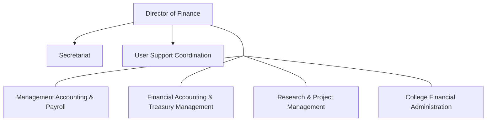
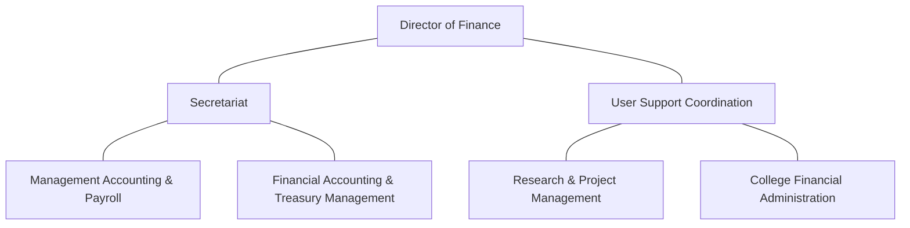
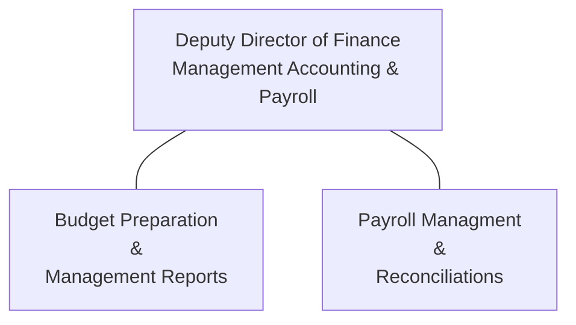
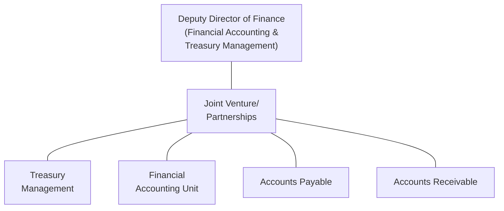
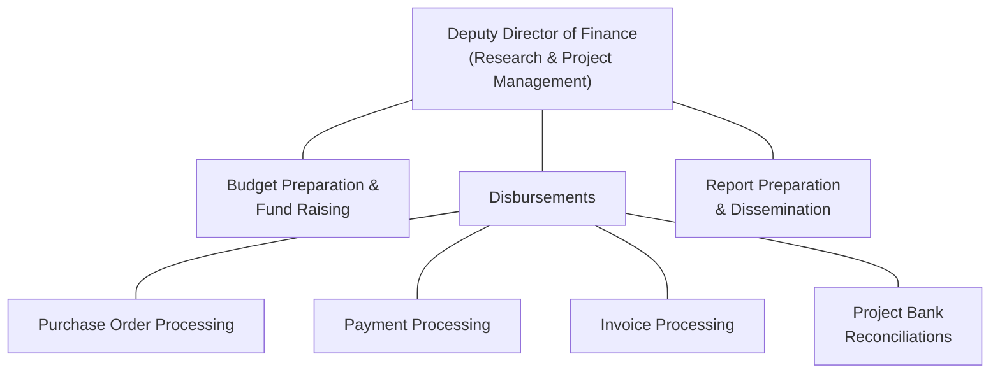
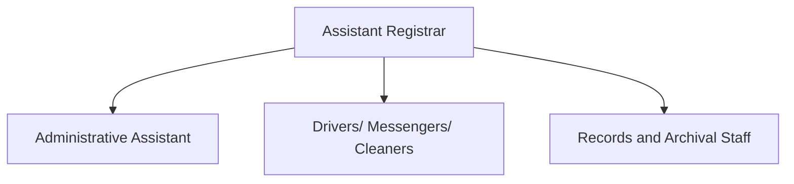

# FINANCIAL REGULATIONS AND GOVERNANCE POLICY

**DECEMBER, 2020**

FINANCIAL REGULATIONS AND GOVERNANCE POLICY
UNIVERSITY OF GHANA, LEGON

POLICY NO. 937 | Volume 58 | Number 4

# FINANCIAL REGULATIONS AND GOVERNANCE POLICY

## DECEMBER, 2020

FINANCIAL REGULATIONS AND GOVERNANCE POLICY
UNIVERSITY OF GHANA, LEGON

**POLICY NO. 937 | Volume 58 | Number 4**

# CONTENTS

**FOREWORD**	vii

**1. GENERAL PROVISIONS**
<table>
  <tbody>
    <tr>
        <td>Introduction</td>
        <td>1</td>
    </tr>
    <tr>
        <td>Status of Financial Regulations and Governance Policy</td>
        <td>2</td>
    </tr>
    <tr>
        <td>Approvals and Amendments</td>
        <td>2</td>
    </tr>
    <tr>
        <td>Commencement</td>
        <td>3</td>
    </tr>
    <tr>
        <td>Repeal &amp; Savings</td>
        <td>3</td>
    </tr>
  </tbody>
</table>

**2. FINANCIAL GOVERNANCE STRUCTURE**
<table>
  <tbody>
    <tr>
        <td>2.1 The University Council</td>
        <td>3</td>
    </tr>
    <tr>
        <td>2.2 The Vice-Chancellor</td>
        <td>4</td>
    </tr>
    <tr>
        <td>2.3 Committee Structure</td>
        <td>6</td>
    </tr>
    <tr>
        <td>2.4 Officers with Special Financial Responsibilities</td>
        <td>10</td>
    </tr>
    <tr>
        <td>2.4.A. Policy Statement</td>
        <td>13</td>
    </tr>
    <tr>
        <td>2.4.B. Guidelines</td>
        <td>13</td>
    </tr>
    <tr>
        <td>2.4.C Code of conduct</td>
        <td>15</td>
    </tr>
    <tr>
        <td>2.4.D. Receiving gifts</td>
        <td>16</td>
    </tr>
    <tr>
        <td>2.5 Organization and Functional Responsibilities of the Finance Directorate</td>
        <td>16</td>
    </tr>
  </tbody>
</table>

**3. CATEGORIES OF REGULATIONS & POLICIES**
<table>
  <tbody>
    <tr>
        <td>3.1 Organization of the Regulations &amp; Policies</td>
        <td>19</td>
    </tr>
    <tr>
        <td>3.2 Detailed Regulations &amp; Policies</td>
        <td>20</td>
    </tr>
    <tr>
        <td>1000 Budgetary Management &amp; Control</td>
        <td>20</td>
    </tr>
    <tr>
        <td>1100 Accounting Policies</td>
        <td>28</td>
    </tr>
    <tr>
        <td>1200 Reporting Requirements</td>
        <td>45</td>
    </tr>
    <tr>
        <td>1300 Treasury Management</td>
        <td>51</td>
    </tr>
    <tr>
        <td>1400 Income</td>
        <td>57</td>
    </tr>
    <tr>
        <td>1500 Procurement of Goods, Works and Services</td>
        <td>64</td>
    </tr>
    <tr>
        <td>1600 Expenditures &amp; Disbursements</td>
        <td>73</td>
    </tr>
    <tr>
        <td>1700 Management of non-current Assets</td>
        <td>85</td>
    </tr>
    <tr>
        <td>1800 Financial Reporting</td>
        <td>87</td>
    </tr>
    <tr>
        <td>1900 Audit Requirements</td>
        <td>93</td>
    </tr>
    <tr>
        <td>2000 Other Matters</td>
        <td>96</td>
    </tr>
    <tr>
        <td>2100 Anti-Corruption Policy</td>
        <td>98</td>
    </tr>
    <tr>
        <td>2200 Transaction Procedure and Signatory Mandate</td>
        <td>110</td>
    </tr>
  </tbody>
</table>

**APPENDIX**
<table>
  <tbody>
    <tr>
        <td>The Nolan Committee’s Seven Principles of Public Life</td>
        <td>130</td>
    </tr>
    <tr>
        <td>Organization of the University of Ghana Finance Directorate</td>
        <td>131</td>
    </tr>
    <tr>
        <td>Terminologies &amp; Interpretations</td>
        <td>134</td>
    </tr>
    <tr>
        <td>Formats for Management Reports</td>
        <td>138</td>
    </tr>
    <tr>
        <td>Formats for Financial Statements</td>
        <td>151</td>
    </tr>
  </tbody>
</table>

Page | **v**

# UNIVERSITY OF GHANA – LEGON

<table>
  <tbody>
    <tr>
        <td>POLICY TITLE</td>
        <td>Financial Regulations and Governance Policy</td>
    </tr>
    <tr>
        <td>APPROVING BODY</td>
        <td>Governing Council, University of Ghana</td>
    </tr>
    <tr>
        <td>APPROVAL DATE</td>
        <td>29 September 2020</td>
    </tr>
    <tr>
        <td>EFFECTIVE DATE</td>
        <td>15ᵗʰ December 2020</td>
    </tr>
    <tr>
        <td>SUPERSEDES</td>
        <td>University of Ghana Financial and Stores Regulations</td>
    </tr>
    <tr>
        <td>RELATED PROCEDURE</td>
        <td>Detailed Financial Procedures Manual</td>
    </tr>
    <tr>
        <td>ORIGINATING BODY</td>
        <td>Finance and General Purposes Committee</td>
    </tr>
    <tr>
        <td>CONTACT</td>
        <td>Director of Finance</td>
    </tr>
  </tbody>
</table>

Page | vi

# FOREWORD

The Statutes of the University of Ghana highlights in Statute 8 (1) that “the University shall be managed and administered in accordance with sound and internationally acceptable practices, benchmarks, principles and ideas on university management and administration including the principles of academic and financial integrity, confidentiality, accountability, transparency, fairness and equality of opportunity.”

Accordingly, to conduct its business effectively, the University of Ghana ensures that it has sound financial management systems in place and that they are strictly adhered to. Part of this process is the establishment of the Financial Regulations and Governance Policy which set out the University of Ghana’s policies and procedures relating to financial management, control and reporting.

These Regulations are made by Council pursuant to its powers under Statute 53 of the Statutes of the University of Ghana. The purpose of the Regulations is to provide a framework and guidelines to ensure control over the totality of the University’s resources and provide management and stakeholders with assurances that the resources are properly applied for the achievement of the University’s Vision and Mission. The basic principles to be applied are:

i. Ensuring financial viability;
ii. Achieving value for money;
iii. Fulfilling the University’s responsibility for the provision of effective financial management of public funds;
iv. Ensuring that the University complies with all relevant legislation; and
v. Safeguarding the assets of the University.

The Council of the University has approved these Financial Regulations and Governance Policy and wishes to inform all employees of its existence and application in all relevant matters.

All officers and Universities bodies shall in accordance with the policy decisions of the Council, manage and administer the affairs of the University in their various capacities in strict adherence to these Financial Regulations and Governance Policy. Thus, any employee who contravenes these Regulations will be considered to be in breach of their duties towards the University and Council and will be considered open for disciplinary action to be taken against them. This will also apply to employees who are aware of deliberate deviations from these regulations by others and become complicit by not reporting their concerns or knowledge to the relevant University Authorities or any member of Council.

[signature]
**Professor Ebenezer Oduro Owusu**
Vice-Chancellor, University of Ghana

Page | vii

Page | viii

University of Ghana | Financial Regulations & Governance Policy 

# 1.0 GENERAL PROVISIONS

## 1.1 Introduction

The University of Ghana was established under the provisions of the University of Ghana Act, 1961 (Act 79) now repealed and replaced with the University of Ghana Act, 2010 (Act 806).

The University is regulated by the University of Ghana Act, 2010 (Act 806) and the Statutes of the University of Ghana, as amended by the amendment Statutes of 2016 as well as other national laws such as are referred to in these regulations. Its financial governance structure is laid down in Act 806 as referenced in paragraph 2.0 below.

The University is obliged to have in place sound systems of financial and management control. The principles of financial and management controls are set out within the Governance Structure and the Financial Regulations and Governance Policy. The Financial Regulations and Governance Policy are supported by detailed procedures that set out the operational application of these principles.

The Financial Regulations and Governance Policy contain policies relating to the financial operations of the University of Ghana. They are published through the Office of the Director of Finance which is responsible for the financial operation, implementation of fiscal policies and control of the finances of the University of Ghana.

The Financial Regulations and Governance Policy contained herein have been assembled with reference to the following:

1. The codification of the existing Financial and Stores Regulations and current practices of the University of Ghana;
2. The University of Ghana Act, 2010 (Act 806);
3. The Statutes of the University of Ghana as amended by the amendment Statutes of 2016;
4. National Laws that relate to the Financial Administration of the University, including:
    a. The Public Financial Management Act, 2016 (Act 921)
    b. Public Financial Management Regulations, 2019 (LI 2378)
    c. Ministries, Departments and Agencies (Retention of Funds) Act, 2007 (Act 735)
    d. The Public Procurement Act, 2003 (Act 663) and the Public Procurement (Amendment) Act, 2016 (Act 914)
    e. The Internal Audit Agency Act, 2003 (Act 658)
    f. The Audit Service Act, 2000 (Act 584)
    g. Fair Wages and Salaries Commission Act, 2007 (Act 737)
    h. The National Pensions Act, 2008 (Act 766) and the National Pensions Amendment Act, 2014 (Act 883).

5. Policy statements incorporated from previously issued memoranda; and
6. Best practices in other Universities
7. International Public Sector Accounting Standards (IPSAS)

Page | 01

University of Ghana | Financial Regulations & Governance Policy

The Financial Regulations and Governance Policy apply to the University of Ghana and all its transactions, projects and undertakings, and all funds (irrespective of their source1) passing through the University’s Accounts. All members of the University are required to comply with these Financial Regulations and Governance Policy for the time-period they are in force. These include all employees, students and all associated individuals.

## 1.2 Status of the Financial Regulations and Governance Policy

i. These Regulations are made by Council pursuant to its powers under Statute 53 of the Statutes of the University of Ghana, and it is purposed to provide a framework and guidelines to ensure control over the totality of the University’s resources and provide management and stakeholders with assurances that the resources are properly applied for the achievement of the University’s Vision and Mission.

ii. It is the responsibility of the Director of Finance to ensure that all employees have access to these Financial Regulations and Governance Policy, and it is the responsibility of all employees to ensure that they comply with the provisions therein.

iii. The Finance and General Purposes Committee is responsible for maintaining a continuous review of the Financial Regulations and Governance Policy, on the advice of the Directors of Finance and Internal Audit, and the Legal Counsel, subject to the approval of the Council.

iv. Where there is any doubt or question about the interpretation of any of the provisions contained herein, an application by way of an appeal against the decision of the Council or any decision making body of the University relying on such interpretation may be brought before the Appeals Board established under section 32 of Act 806.

v. An action required by the Vice-Chancellor, the Registrar, the Director of Finance and/or Provosts/Deans/Directors, under this Policy, may be delegated, in writing, to an appropriate nominee. All relevant Officers including Pro-Vice-Chancellors, Provosts, Registrar, Director of Finance, Legal Counsel, Director of Internal Audit must be informed of such delegation in writing and must be recorded by the Registrar and Director of Finance, but such delegated authority shall not survive the retirement or expiration of the term of office of the grantor of the authority.

vi. A breach of any provision of this Financial Regulations and Governance Policy may result in disciplinary action against the individual.

## 1.3 Approvals and Amendments

i. The Council may approve the Financial Regulations and Governance Policy on the recommendation of the University’s Finance and General Purposes Committee.

ii. The Finance and General Purposes Committee shall review the Financial Regulations and Governance Policy, at least on an annual basis.

iii. The Audit Committee will be consulted on amendments to the Financial Regulations and Governance Policy

1 Where the conditions attached to the Funds are not inconsistent with the University of Ghana Act and other Regulations.
Page | 02

University of Ghana | Financial Regulations & Governance Policy 

### 1.4. Commencement

This Financial Regulation and Governance Policy referred to as the University of Ghana Financial Regulation and Governance Policy, 2020, takes effect from the 15th day of December 2020.

### 1.5 Repeal and Savings

The University of Ghana Financial Regulation and Governance, 2012 is hereby repealed. Despite the repeal of the Financial Regulation and Governance, all notices, orders, directions, appointments, transactions, contracts, policies, instructions or guidelines or any other act lawfully made or done under the repealed Financial Regulation and Governance, 2012, not being inconsistent with this Policy, shall continue in force as if made or done under this Policy and shall continue to have effect until reviewed, cancelled, or terminated.

## 2.0 FINANCIAL GOVERNANCE STRUCTURE

### 2.1. The University Council

The University Council is responsible for the governance and financial management of the University. The responsibilities of the University Council shall be to:

i. formulate in consultation with relevant bodies, the strategic vision and mission, long term academic and business plans and key performance indicators of the University;

ii. promote income generation activities for the operation of the University as part of the University's programme;

iii. establish standing and ad hoc committees for the finances of the University

iv. control the property, funds and investments of the University and may, on behalf of the University, sell, buy, exchange, lease and accept leases of such property;

v. borrow money on behalf of the University and use the property of the University as security;

vi. control the finances of the University and determine any question of finance arising out of the administration of the University or the execution of its policy or in the execution of a Trust requiring execution by the University;

vii. determine the allocation of the funds at the disposal of the University; and in so doing, the recurrent grants shall be made in the form of block grants, unless the Council otherwise determines, for expenditure by the University on those central activities of the University for which the University is wholly responsible and for the expenditure of the Units as part of their general income;

viii. determine annually, the expenditure necessary for capital and revenue investments, the maintenance of the property of the University, and the human resources for transacting the business of the University and may appropriate moneys for these purposes; provided that the University shall not enter into any agreement with financial commitment that binds the Government for more than one financial year or that results in a contingent liability except where the financial commitment or the contingent liability (a) is with the prior written

Page | 03

 University of Ghana | Financial Regulations & Governance Policy

approval of the Minister, and (b) authorised by Parliament in accordance with article 181 of the Constitution under section 33(1) of Act 921;

ix. Pursuant to Section 101(1) of Act 921, ensure that the University complies with any of the methods for the preparation, evaluation and execution of investment projects to which section 33 of Act 921 applies, including but not limited to the Expenditure ceiling provided under sections 25 of Act 921 and regulations 16-20 of the Public Financial Management Regulation, LI 2378, 2019.

x. prescribe the manner and form in which, and the times at which Units of the University shall submit accounts or estimates of income and expenditure.

xi. act as trustee for any property, legacy, endowment, bequest, device or gift made to or belonging to the University or any of its’ Units.

xii. determine student fees.

xiii. ensure the University complies with the Government’s audit code of practice.

xiv. appoint or remove, terminate, dismiss, suspend and interdict a Vice-Chancellor, Pro-Vice-Chancellor, Provost, Registrar, Dean, Director, Legal Counsel, Deputy Registrar and a Professor upon proven just cause.

xv. appoint and remove directors of subsidiary companies, joint ventures and trustees of trusts of the University.

xvi. appoint external auditors.

xvii. approve the annual financial statements.

xviii. approve and authorize the opening and closing of bank accounts; and

## 2.2 The Vice-Chancellor

The Vice-Chancellor being the Chief Executive Officer and the senior administrative head of the University is the Principal Spending Officer of the University as conferred on him or her by section 7 of the Public Financial Management Act, 2016 (Act 921) and shall be responsible as follows:

i. be responsible for driving the overall growth and development of the University under the direction of the Council and shall have overall authority over academic, financial and administrative controls.

ii. being the Chairperson of the Academic Board, shall make a report to Convocation about the Management of the University, state of the University and future plans of the University.

iii. determine the authority limits for the use of finances of the University.

iv. submit annually to the Council, a statement of the financial and human resource requirements which in his opinion are necessary for the effective conduct of the business of the University,

Page | 04

University of Ghana | Financial Regulations & Governance Policy

v. for internal approval, and the management of budgets and resources, within the estimates approved by the Council.

vi. authorizing commitments for the covered entity (the University) and managing the resources received, held, or disposed of by or on account of the University.

vii. delegate a financial function or responsibility in writing to a public officer of the University who is under the control of the Vice-Chancellor, however, the Vice-Chancellor shall not be relieved of the ultimate responsibility and liability for the performance of the delegated function or responsibility.

viii. advise the Council and Academic Board on matters affecting policy, finance, governance and administration of the University.

ix. report to the Council on the financial management of the University at its regular meetings on the progress and problems of the University.

x. ensure that the University keeps books of accounts and proper record in relation to them in the form approved by the Auditor-General, the books of accounts opened under the signature of the Vice-Chancellor and the Director of Finance.

xi. approve all accounting procedures and financial records. Such procedures are to have due regard for the need to promote probity, integrity and accountability and to any advice provided from internal and external auditors.

xii. where required, justify any of the University's financial matters to the Public Accounts Committee of Parliament.

xiii. ensure compliance with the Public Procurement Act, 2003 (Act 663) and the Public Procurement (Amendment) Act, 2016 (Act 914) and approve procurement within the levels of authority as determined in that Act.

xiv. submit annually to the Council, a statement of the financial requirements, which in the Vice-Chancellor's opinion are necessary for the effective conduct of the business of the University, for internal approval, and management of budgets and resources, within the estimates approved by the Council.

xv. responsible for financial authorization, whether or not directly approved by him or her.

xvi. responsible for any breaches and/or violations of the relevant rules and provisions regarding the proper management of the University's finances, he or she permits to happen either willfully or otherwise under Section 102 of Act 921.

xvii. as Principal Spending Officer of the University he is responsible under section 7 (1) & (2) of the Public Financial Management Act, 2016 (Act 921) to,
*   a. ensure the regularity and proper use of money appropriated in that covered entity;
*   b. authorise commitments for the covered entity within a ceiling set by the Minister under section 25; and

Page | 05

 University of Ghana | Financial Regulations & Governance Policy

c. manage the resources received, held or disposed of by or on account of the University.

d. establish an effective system of risk management, internal control and internal audit in respect of the resources and transactions of the University.

xviii. as Principal Spending Officer of the University, he is responsible under section 80 (1) of Act 921, to prepare and submit to the Auditor-General and Controller and Accountant-General, the accounts and information set out in the Schedule to Act 921.

xix. as a Principal Spending Officer of the University, he is responsible under section 85(1) of the Act 921 to submit to the Minister of finance and Auditor-General on annual basis.

a. a report on the status of implementation of recommendations made by the Auditor-General in respect of the University); and

b. a report on the status of implementation of recommendations made by Parliament in respect of the University).

xx. the Vice-Chancellor shall immediately be notified of any matter which involves, or is thought to involve, irregularities concerning, inter alia, cash or property of the University. The Vice-Chancellor shall take such steps as he or she considers necessary by way of investigation and report.

xxi. the Vice-Chancellor shall be assisted by members of Senior Management in the management and administration of the affairs of the University and shall refer matters concerning the general administration or management of the University to a meeting of Senior Management for deliberation and decision.

xxii. a meeting of Senior Management shall be chaired by the Vice-Chancellor and shall be composed of the Pro-Vice-Chancellors, Provosts, Registrar, Director of Finance Directorate, Legal Counsel, Director of Internal Audit Directorate, Director of Human Resource & Organisational Development Directorate and Chief Risk Officer. The Vice-Chancellor may invite any other officer(s) from time to time to be in attendance.

xxiii. a meeting of Senior Management shall be held at least twice a month.

## 2.3 Committee Structure

The University Council has ultimate responsibility for the University’s finances. Its principal committees dealing with financial matters are set out below. These committees are accountable to the University Council.

### 2.3.1 Finance and General Purposes Committee

To administer the finances and property of the University in accordance with its remit.

i. In so doing, the Committee will advise the Council on:
* a. the financial health and solvency of the University.
* b. the safeguarding of the University’s assets.
* c. the financial strategy.
* d. the medium-term financial forecast and the annual budget.

Page | 06

University of Ghana | Financial Regulations & Governance Policy 

e. financial issues arising from the annual financial statements.

f. the establishment and dissolution of subsidiary and joint venture companies and trusts of the University upon the advice of the Legal Counsel.

g. the business plan of, and annual block grant to, the Students’ Union.

h. receive reports from the Resource Allocation Committee for Academic Purposes on recurrent estimates of the University.

i. and the formulation of Finance and resource objectives in the operational activities of the University.

j. maintaining a continuous review of the Financial Regulations and Governance Policy, on the advice of the Directors of Finance and Internal Audit, and on advising the Council on any additions or changes necessary.

k. disposal of assets must be in accordance with procedures agreed by the Finance and General Purposes Committee and contained in the University’s detailed financial procedures under the supervision of the Board of Survey.

l. to monitor and review the financial performance of all University Subsidiary Companies and Trusts.

ii. The Committee also has delegated authority to:

a. monitor and evaluate the overall financial performance of the University.

b. ensure that the University remains within the annual financial plan approved by the Council.

c. ensure that an effective framework for financial management is in place;

d. ensure that there are effective procedures in place for procurement and the approval of contracts.

e. ensure that funds are applied in accordance with the laws of Ghana and the Universities’ regulations, or similar obligations from other funding bodies.

f. monitor and review the financial performance of the Students’ Representative Council and the University’s subsidiary companies and trusts.

iii. To serve as the Budget Committee required by regulation 26 of L.I. 2378

iv. To ensure that the University adheres to all the requirements of Act 921 and L.I. 2378.

v. To deal with any other matters referred to it by the Council.

### 2.3.2 Resource Allocation Committee for Academic Purposes

i. To receive the recurrent estimates of programmes and academic development submitted by Provosts, Deans and Directors.

ii. To consider such capital and recurrent estimates of the University and report on them to the Finance and General Purposes Committee.

iii. To carry out any other functions as may be referred to it by the Finance and General Purposes Committee.

Page | 07

University of Ghana | Financial Regulations & Governance Policy

### 2.3.3. Investment Committee

i. Is responsible for developing the investment policy of the University and shall ensure that the University’s investments are managed in accordance with the policy and the applicable laws of Ghana.

ii. All investment activities, be it short or long term, within the University will be in accordance with the investment policy established by the Committee.

### 2.3.4. Physical Development and Municipal Services

i. To formulate Development Policies.

ii. To attend to detailed planning with architects and other professionals.

iii. To oversee the progress of major capital works being conducted within the University.

iv. To supervise other non-recurrent development projects of the University.

v. To advise on and supervise the expenditure of the University’s capital and development funds.

vi. To be responsible under the Finance and General Purposes Committee for the efficient management of the Estate, Grounds and Gardens and to ensure that the policies and decisions of the Finance and General Purposes Committee are carried out.

vii. To recommend modifications of policy to the Finance and General Purposes Committee;

viii. To do any other acts and things as may be delegated to it.

ix. To recommend modifications of policy to the Finance and General Purposes Committee;

### 2.3.5. Strategy Committee

i. Provide overall strategic direction for the University in order to ensure the attainment of its core objectives.

ii. Ensure coherence in the formulation and implementation of policies and programmes by the various organs of the University, including the Council.

iii. Review the plans and programmes of the various organs of the University to ensure consistency with the aims and objectives of the University.

### 2.3.6. Procurement and Tender Committee

i. Review procurement plans in order to ensure that they support the objectives and operations of the University.

ii. Confirm the range of acceptable costs of items to be procured and match these with the available funds in the approved budget.

iii. Review the schedules for procurement and specifications and also ensure that the procurement procedures to be followed are in strict conformity with the provisions of the Public Procurement Act, 2003 (Act 663) as amended by the Public Procurement (Amendment) Act, 2016 (Act 914).

Page | 08

University of Ghana | Financial Regulations & Governance Policy 

iv. Ensure that the necessary concurrent approval is secured from the relevant Tender Review Board, in terms of the applicable threshold in the Third Schedule to the Public Procurement Act, 2003 (Act 663) as amended by the Public Procurement (Amendment) Act, 2016 (Act 914) prior to the award of contract.

v. Facilitate contract administration and ensure compliance with all reporting requirements under the Procurement Act, 2003 (Act 663) as amended by the Public Procurement (Amendment) Act, 2016 (Act 914).

vi. Ensure that stores and equipment are disposed of in compliance with the Procurement Act, 2003 (Act 663) as amended by the Public Procurement (Amendment) Act, 2016 (Act 914) and all other Acts and regulations applicable to the University.

### 2.3.7. Audit Committee

i. Receive and review the annual report of the Director of Internal Audit.

ii. Ensure that internal auditing is carried out by the Directorate of Internal Audit in accordance with the Internal Audit Agency Act, 2003 (Act 658) and all other Acts and regulations applicable to the University.

iii. Ensure that the internal financial control systems of the University are functioning efficiently and effectively and that they meet the objectives of the University.

iv. Ensure that the Vice-Chancellor pursues the implementation of matters in all audit reports (internal and external) as well as financial matters that are raised in the reports of internal monitoring units in the University.

v. Prepare annual statements showing the status of implementation of recommendation made in all audit reports. Such reports shall show remedial action taken or proposed to be taken to avoid or minimize the recurrence of undesirable features in the accounts and operations of the University and the time frame for action to be completed.

vi. Recommend to Council measures to improve the quality of the internal audit system of the University.

vii. Audit Committee shall perform its function base on the Guidelines for Effective Functioning of the Audit Committees.

### 2.3.8. Ghana University Staff Superannuation Scheme Management Committee

i. To administer and to keep under review the University’s Superannuation Scheme.

ii. To advise from time to time in what securities/investments, monies accumulated under the Superannuation Scheme should be invested on the advice of the Investment Committee.

iii. To ensure that the Superannuation Scheme funds are invested in approved securities/ investments.

iv. To ensure that at the end of each accounting year, the administrator prepares a Statement of financial performance and a Statement of Financial Position for that financial year.

v. To cause the Accounts to be audited annually; and

vi. To ensure timely distribution of individual statements, etc.

### 2.3.9. The College Advisory Boards

The financial functions of the College’s Advisory Boards are:

i. To guide the College in developing strategies.

ii. To receive proposals from the Management Committees of Schools.

Page | 09

 University of Ghana | Financial Regulations & Governance Policy

iii. Assist in fostering effective links between the College and external communities

iv. To advise on the relevance of the College in order to enhance its sustainability. In exercising its functions, the College’s Advisory board shall act within the general policy of the University. For the avoidance of doubt, all policy decisions of the College Council shall be in the form of recommendations to the University Council.

### 2.3.10. The College Finance and Development Committee

i. To advise the College Academic Committee and the College Advisory Board on the financial, academic and other aspects of the development of the College.

ii. To formulate and review policies and establish criteria with a view to recommend to the College Academic Committee the order of priorities in the College’s academic development and to keep the policies under constant review.

iii. To exercise control over the property and expenditure of the College subject to the directions of the College Advisory Board.

iv. To scrutinize the annual estimate of expenditure submitted by Schools, Institutes and the Units in the College and to moderate where necessary for presentation to the College Advisory Board.

v. To consider all requests for authorization of expenditure in excess of approved annual estimates and to make recommendations thereon to the College Advisory Board.

vi. To consider such matters of financial nature as may be referred by other committees of the College Advisory Board.

## 2.4. Officers with Special Financial Responsibilities

### 2.4.1. The Director of Finance

The day-to-day financial administration of the University is managed by the Director of Finance, who shall be responsible for the financial business of the University under the authority of the Vice-Chancellor (the Principal Spending Officer). The Director of Finance shall also undertake such other business as may prescribe by the Council. The Director of Finance shall ensure that Provosts, Deans, Directors in acting as Budget Holders, are notified of their responsibilities within these Financial Regulations and Governance Policy and shall review and propose amendments to the Regulations as appropriate.

The specific responsibilities of the Director of Finance are described throughout these Financial Regulations and Governance Policy and include the following²:

i. preparing annual capital and revenue financial plans;

ii. calling for and receiving moneys due to the University and making on behalf of the University the authorized payments;

iii. ensuring that throughout the University, accurate books of accounts and records of the property of the University are kept in a manner and form required by Council;

iv. preparing accounts and management information, monitoring and controlling of income and expenditure against financial plans and all financial operations;

² There is a need to highlight that the responsibility extends to all units within the University and that the lines of reporting of all Finance officers is through to the Director of Finance.

Page | 10

University of Ghana | Financial Regulations & Governance Policy 

v. preparing the University’s annual accounts and other financial statements and accounts which the University is required to submit to other authorities;

vi. ensuring that the University maintains satisfactory financial systems;

vii. providing professional advice on all matters relating to financial policies and procedures;

viii. liaising with internal and external auditors in order to achieve efficient processes and effective internal control.

### 2.4.2. Director of Internal Audit

i. The Director of Internal Audit shall:

ii. assure Management regarding the establishment and continuous operation of efficient, and effective financial control systems within the University;

iii. have the responsibility to ensure that Risk Management policies are complied with and to ensure that regular review of the processes are maintained by management;

iv. conduct periodic management audit and submit reports to the Vice-Chancellor and the Council;

v. liaise with External Auditors and ensure that appropriate action is taken on reported audit findings;

vi. submit periodic audit reports on the activities of the Units to the Vice-Chancellor and Council; and

vii. generally, be responsible for ensuring that the University complies with the Internal Audit Agency Act, 2003 (Act 658) and Public Financial Management Act, 2016 (Act 921) and its Regulation.

### 2.4.3. Pro-Vice-Chancellors, Provosts, Deans and Directors

Pro-Vice-Chancellors, Provosts, Deans and Directors are responsible to the Vice-Chancellor for the financial management in the areas and for the activities they administer, where applicable. They are advised by the Director of Finance through the Finance Officers appointed to their units in executing their financial duties. The Director of Finance will also supervise the implementation of the approved financial systems operating within the Units, including the form in which accounts and financial records are kept.

Pro-Vice-Chancellors, Provosts, Deans and Directors are responsible for establishing and maintaining clear lines of responsibility within their Units for all financial matters, if any. Where resources are delegated to other officers, these officers are accountable to their Pro-Vice-Chancellors, Provosts, Deans and Directors who retain overall oversight and responsibility for the results of their budget.

Pro-Vice-Chancellors, Provosts, Deans and Directors shall provide the Director of Finance with such information as may be required to enable the:

i. Implementation of financial planning and budget implementation;

ii. Compilation of the University’s financial statements;
Implementation of audit and financial reviews, recommendations, projects and value for money studies.

Page | 11

 University of Ghana | Financial Regulations & Governance Policy

## 2.4.4. The Legal Counsel

The Legal Counsel shall in accordance with the Statutes of the University be responsible for the management of all legal documentation involving financial, commercial or other matters of the University, including but not limited to contracts, agreements, deeds, leases, letters of credit, guarantees or any other legal document with financial or other implications for the University. In the management of the financial and other matters of the University, the Legal Counsel shall ensure and be responsible for the following:

i. Prepare, review and advise on all contractual agreements, cooperation agreements, partnerships, joint venture agreements, deeds, letters of credit, guarantees or any other legal document affecting or relating to the University or in respect of which any financial or other matters of the University are considered;

ii. Streamline all communication between the University and its internal and external clients to conform to legal and regulatory processes, and ultimately, help achieve an efficient internal contract management process.

iii. Advise on the legal implications of all financial, commercial, memorandum of understanding, cooperation, partnership, consultancy or other contracts or business of the University.

iv. Ensure regulatory compliance by the University of all financial or other matters

v. Draft and negotiate contracts and transactions on behalf of the University with all third parties and other partners of the University.

vi. Manage legal risk relating to financial, commercial, contractual and other transactions or projects involving, concerning or affecting the University.

vii. Review and advise on policy and other implications of this Policy and all other policies of the University.

viii. Review activities of the University to determine and ensure compliance with applicable law.

ix. Provide legal advice on all University related matters.

x. Advise and certify in writing the need for the engagement of external legal counsels to represent or assist the Legal Counsel in any matter, advise or represent the University in any transaction or dispute resolution, before any external legal counsel may be engaged by executing an engagement letter in accordance with the Signatory Mandate.

xi. Certify that all agreements, transactions and projects of the University conforms with the regulations of the University and the laws of Ghana by issuing and signing an opinion, certificate of compliance or legal risk assessment certificate before same shall be signed or executed by any University Officer in accordance with the Signatory mandate.

xii. Establish for the University, any subsidiary company or trusts or cause the dissolution of any such company or trusts in accordance with the relevant laws of Ghana and subject to the prior approval of the Finance and General Purposes Committee (Regulation 2.3 (a)(i) bullet numbered 6 of the University of Ghana Financial Regulation and Governance).

xiii. Attend all meetings of companies, commercial or other ventures or entities in which the University has an interest either by way of shares, debenture, joint venture, partnerships or affiliated companies including subsidiaries and trusts to ensure compliance with the rules of the University and act as Company Secretary in accordance with the Companies Act, 2019 (Act 992) for subsidiary companies.

Page | 12

University of Ghana | Financial Regulations & Governance Policy 

### 2.4.5. Chief Risk Officer:

i. Council shall appoint a Chief Risk Officer (CRO) who shall report administratively to the Vice-Chancellor, and functionally to the Finance and General Purposes Committee.

ii. The CRO shall report, regularly, to the Finance and General Purposes Committee on risk management and treatment.

iii. Comply with the risk management requirements of the University of Ghana Financial Regulations and Governance Policy, IPSAS and other applicable regulatory requirements.

### Risk management policy

The Council has overall responsibility for ensuring that there is, a Risk Management Strategy/ Policy and a common approach to the management of risks throughout the University. This policy will be established through the development, implementation and embedding within the University, a formal and structured risk management process.

The University acknowledges the risks inherent in its business and is committed to managing those risks. The Council has assigned accountability for this to the Vice-Chancellor.

### A. Policy Statement

There shall be a risk management policy, and its purpose is to ensure that:

“The University of Ghana provides a comprehensive Risk Management Programme that enables risk management and internal controls to be established to mitigate risks that pose significant threats to the achievement of its objectives and financial health. The programme will maximise potential opportunities and minimise the adverse effects of risk on our internal and external stakeholders and protect the University of Ghana’s brand”.

### B. Guidelines

To achieve effective risk management, the following shall be undertaken:

1. Establishment of a Risk Management Committee chaired by the Vice-Chancellor.

2. The Council shall appoint a Chief Risk Officer (CRO) who shall report administratively to the Vice-Chancellor, and functionally to the Finance and General Purposes Committee.

3. Establishment of a Risk Management Committee at the College-level, to be chaired by the Provost.

4. Adoption of common terminologies in relation to the definition of risk and risk management.

5. Identify, develop and maintain a risk register and risk action plans to ensure risks are properly managed.

6. Establishment of a University-wide criteria for the measurement of risk, linking the threat arising with their potential impact and the likelihood of their occurrence.

7. Documentation of appropriate risk management strategies that account for the requirements of operations, seeking to minimise the impact of disruptive events and activate a rapid and effective response capability.

8. Decision on an acceptable level of risk.

Page | 13

 University of Ghana | Financial Regulations & Governance Policy

9. Ensuring of an effective level of day-to-day risk management matters, as well as Vice-Chancellor and Heads of Unit’s support to, and governance over the risk management programme.

10. Setting and monitoring of key performance objectives to manage the risk management programme.

11. Conducting of detailed, regular reviews of each Unit to identify significant risk associated with the achievement of key objectives and other relevant areas.

12. Development of risk management and contingency plans for all significant risks, assigning risk owners, who will ensure the remediation of these risks.

13. Continuous improvement of the risk management programme in line with industry best practices.

14. Conducting of quarterly reviews on the implementation of risk management processes.

15. The CRO shall report regularly to the Finance and General Purposes Committee on risk management and treatment.

16. Complying with the risk management requirements of the University of Ghana Financial Regulations and Governance Policy, IPSAS and other applicable regulatory requirements.

17. Complying with ISO 31000:2018 – Risk management requirements.

18. The CRO shall submit an annual report on risk to the Audit Committee

19. Identifying and managing of legal and regulatory risks associated with the financial affairs and management of the University.

In line with this, a Risk Management Committee shall be set up to ensure that there are appropriate controls for managing the key risk areas. The risk areas covering financial management, which have been identified as requiring adequate monitoring and assessment include:

**Funding**
i. Potential future change in Government funding policy;
ii. Infrastructure funding requiring commitments and financial inputs from the Government and the University;
iii. Relationship with the National Health Insurance in respect of funding for patients at the University Hospital;
iv. Timely Parliamentary approval of fees.

**Financial/ Commercial**
i. Evolving financial strategy
ii. Evolving decentralised financial control
iii. Over-extension of resources resulting from increased activity, both teaching and research
iv. Investments
v. Monitoring of fraud issues
vi. Compliance with legal and governance requirements
vii. Compliance with debt covenants
viii. Compliance with procurement laws
ix. Fiscal Discipline

**Property and related items**
i. Crime
ii. Maintenance backlog (Including student residential facilities
iii. Service breakdown – electricity, water,
iv. Insurance adequacy

**Human resources**
i. Attract and retain employees
ii. Labour relations
iii. Health and safety
iv. Funding of ex-gratia
v. Funding of staff health cost

Page | 14

University of Ghana | Financial Regulations & Governance Policy 

**Student and related issues**
i. Collection of student fees
ii. Insufficient student housing
iii. Financial aid
iv. Electricity cost

**Information technology**
i. Disaster recovery and losses due to changes to the IT environment
ii. Overdependence on individuals, both internal and external
iii. Cyber security

Budget Holders must ensure that any agreements negotiated within their specified areas of operation with external bodies with legal, financial or commercial liabilities or implications for the University, have gone through the appropriate processes and executed in accordance with the Transaction and Signatory Matrix.

### 1. All Employees
All employees shall, in accordance with the policy decisions of the Council, manage and administer the affairs of the University in their various capacities in strict adherence to these Financial Regulations and Governance Policy. In so doing:

i. All employees have a general responsibility for the security of the University’s property, for avoiding loss and for due efficacy, efficiency and economy in the use of resources.
ii. They must ensure that they operate at all times within the scope of authority which has been delegated to them and in accordance with these Regulations.
iii. They shall make available promptly any relevant records or information to the Director of Finance, or his/her authorized representative, in connection with the implementation of the University’s financial policies, regulations and the system of financial control.
They shall provide the Director of Finance with such financial and other information as they may deem necessary, from time to time, to carry out his duties.

### C. Code of Conduct
The University is committed to the highest standards of openness, integrity and accountability. It seeks to conduct its affairs in a responsible manner, having regard to the principles established by the Committee on Standards in Public Life (formerly known as the Nolan Committee) which employees at all levels are expected to observe. (This is included as Appendix I to these Regulations).

In addition, members of the Council, Statutory Officers and those employees with the ability to commit the University to a significant level of expenditure are required by Council Standing Orders, the University’s Procurement Policy and Transaction Procedure and Signatory Mandate to disclose interests in the University’s register of interests maintained by the Registrar. They will also be responsible for ensuring that entries in the register relating to them are kept up to date regularly and promptly.

In addition, University employees with shareholdings in spin-off businesses are required to make declarations of any such holdings. In particular, no person shall be a signatory to a University contract where he/ she also have an interest in the activities of the other party.

Page | 15

 University of Ghana | Financial Regulations & Governance Policy

### D. Receiving gifts or hospitality

In accordance with sections 240 to 245 of the Criminal Offences Act, 1960 (Act 29) and section 96 (1) (e) of the Public Financial Management Act, 2016 (Act 921) it is an offence for employees to accept any gift or consideration as an inducement or reward for doing, or refraining from doing, anything in an official capacity or showing favour or disfavour to any person in an official capacity. The Vice-Chancellor shall upon the advice or recommendation of the Legal Counsel, and in consultation with the Finance Director and Internal Auditor approve the receipt or giving of any gifts or hospitality by the University. The guiding principles to be followed by all employees shall be as follows:

* i. the conduct of individuals should not create suspicion of any conflict between their official duty and their private interest;
* ii. ii. the action of individuals acting in an official capacity should not give the impression (to any member of the public, to any organisation with whom they deal or to their colleagues) that they have been (or may have been) influenced by a benefit to show favour or disfavour to any person or organisation.

Except with the written approval of the Legal Counsel under the authority of the Vice-Chancellor, employees should not accept any gifts, rewards or hospitality (or have them given to members of their families) from any organisation or individual with whom they have contact in the course of their work that would cause them to reach a position whereby they might be, or might be deemed by others to have been, influenced in making a business decision as a consequence of accepting such hospitality. Guidance on acceptable hospitality and corrupt practices in general are contained in the detailed financial procedures manual and the Anti-Corruption Policy contained in these Regulations.

### 2.5 Organization and Functional Responsibilities of the Finance Directorate

The objective of the Finance function of the University of Ghana is to maintain a fiscally sound organization that provides efficient and effective financial management services to the University. It also seeks to protect the assets of the University and to provide assurance to all stakeholders that the University’s funds are managed prudently and in accordance with the objectives for which these are raised.

#### a. Organization

The Organization of the University’s Finance Directorate is set out below with the details highlighted in Appendix II. The Directorate is headed by the Director of Finance and he is assisted by three Deputy Directors and Finance Officers for the Colleges.

The Finance Directorate shall comprise four sections, namely:
* i. Management Accounting and Payroll;
* ii. Financial Accounting and Treasury Management;
* iii. Research and Academic Project Management; and
* iv. College Financial Administration.

Page | 16

University of Ghana | Financial Regulations & Governance Policy

The Directorate will be supported by:

*   User Support Coordination: the development of training and management of the logistics within the ITS system.

*   Secretariat: personnel in charge of records & archives, secretaries, drivers, messengers and cleaners.

### i. Management Accounting and Payroll Section

This section will under the authority and with the prior approval of the Vice-Chancellor develop the co-ordination of the university-wide budget and reporting system and will ensure that the cost control mechanisms available in the University Software (ITS) system are managed. The section under the Logistics Directorate is responsible for logistics in the supply chain (i.e. stores management). The responsibilities are under the authority and with the prior approval of the Vice-Chancellor include:

**a. Budgets:** Preparation and administration of the University’s Annual Operating Budgets, for both the Recurrent and Capital Expenditure, including the implementation of Budgetary Controls. Pursuant to under Section 4 (2)b) (b) the Budget of the University shall be submitted to the Minister for onward submission to the Parliament for approvalto ensurecompliance of the University with the provisions of the Act 921 and other related enactments.

**b. Management Accounting:** Preparation of cost control mechanisms shall be undertaken throughout the University; carrying out evaluations of the activities of the University to ensure that internal controls applicable to both financial and programme areas provide reasonable assurance to management.

**c. Performance Reports:** Ensuring the preparation and submission of management reports to internal constituent units and external bodies like the Ministry of Finance, National Council for Tertiary Education, Ministry of Education, VCGs, etc. as set out in the Public Financial Management Act, 2016 (Act 921).

Page | 17

 University of Ghana | Financial Regulations & Governance Policy

d. **Stores Management:** Overseeing the administration for each location (i.e. maintenance, general, electrical, etc.) as well as the institution of regular stores verification and reconciliation with the general ledger.

e. **Payroll Management and Reconciliations:** Management of the link with Human Resources in the ITS module, management of Superannuation (including the payment of Pensions) as well as processing of Insurance payments for cars and assets.

## ii. Financial Accounting and Treasury Management Section

This section will under the authority and with the prior approval of the Vice-Chancellor oversee all matters pertaining to the recording and reporting of information and transactions through the General Ledger and ensuring the integrity of the information through robust financial accounting policies using the highest levels of internal control mechanisms. Their responsibilities under the authority and with the prior approval of the Vice-Chancellor include:

*   **a. Treasury Management:** The development of Cash flow and Cash forecast schedules; cashiering operations including receiving and disbursing funds and banking transactions; preparation and submission of cash transcripts; subvention claims and collection of state funding.

*   **b. Bank Reconciliations:** Confirmation of bank balances and preparation of monthly bank reconciliation statements;

*   **c. General Ledger Reconciliations:** reconciliation of all general ledger figures and reporting on monthly, actual figures.

*   **d. Financial Accounting:** The preparation of Annual Financial Statements (including the development of accounting policies required to comply with Generally Accepted Accounting Practice and appropriate International Accounting Standards).

*   **e. Trade and other Payables:** Reconciliation of Supplier Account statements and payment of accounts when due;

*   **f. Trade and other Receivables:**
        *   **i. Staff and Other Receivables:** Collection of money due the University and ensuring that approved policies and procedures regarding debt are followed to ensure ability to make collections.
        *   **ii. Students Accounts Receivable:** The management of the Students' Accounts.

*   **g. Provision of Oversight for all the accounting functions undertaken at all units with limited financial and operational autonomy.**

*   **h. Non-Current Assets Control:** Providing oversight for the management of expenditures on physical development and equipment.

## iii. Research and Project Management Section

The University has a new and growing emphasis on research, and to ensure proper oversight, this section is to ensure that appropriate governance and accounting is in place for all projects using funders' money throughout the University. It will also give expert advice on the methods and information

Page | 18

University of Ghana | Financial Regulations & Governance Policy

required for proposals and by being involved from the outset is able to closely monitor funders’ requirements and give assurances for compliance with conditions. In conjunction with the Office of Research, Innovation and Development (ORID) and under the authority and with the prior approval of the Vice-Chancellor , it will also ensure that correct levels of income and benefits are generated for the promotion of research throughout the University.

The section will with the authority of the Vice-Chancellor also perform the necessary training to ensure prompt reaction to researchers’ requirements through the system. The core functions will include:

a. Budget Preparation and Fund Raising
b. Disbursement of Research and Project Funds
c. Research and Project Report preparation and dissemination.

#### iv. College Financial Administration

The College financial administration encompasses the financial management of College of Basic and Applied Sciences, College of Health Sciences, College of Humanities and College of Education and is under the responsibility of the Vice-Chancellor.

The Director of Finance under the authority and with the prior approval of the Vice-Chancellor will provide oversight for all the approved accounting/finance functions undertaken at these Colleges. The Director of Finance will also be the co-ordinating point for ensuring consistency with policies and reports preparation to facilitate easy consolidation and reporting to Council and other Committees.

### 3.0 CATEGORIES OF REGULATIONS & POLICIES

#### 3.1 Organization of the Regulations & Policies

The Financial Regulations and Governance Policy and related policies are made up of eleven (11) active subject areas, each of which contains (or will in the future contain) a group of related policies. For example, all Policies related to Procurement can be found in section 1500.

Policy statements are sequenced by section and identified by a four-digit numeric code. The first two digits identify the subject area, while the third and fourth digits indicate the specific policy within the subject area, e.g., policy number 1502 identifies the second policy of subject area 15, PROCURING GOODS & SERVICES.

Each policy statement is presented in a standardized format. The first section identifies the policy number and policy title. The next section of each page indicates the subject area, responsible office, the office or group having the authority to approve changes to the policy, issue date, and revision date. This is followed by the actual policy information.

The responsible office has the responsibility to develop, promulgate, monitor and revise the applicable policy. When additional guidance or interpretation of a specific policy is required, that office should be consulted. The Office of the Director of Finance should be consulted when an issue that is not addressed by the Financial Regulations and Governance Policy and related policies arises.

Page | 19

University of Ghana | Financial Regulations & Governance Policy

## 3.2 Detailed Regulations & Policies

1000 Budgetary Management & Control
1100 Accounting Policies
1200 Reporting Requirements
1300 Treasury Management
1400 Income
1500 Procurement of Goods, Works and Services
1600 Expenditures & Disbursements
1700 Management of Non-Current Assets
1800 Financial Reporting
1900 Audit Requirements
2000 Other Matters

### 3.2.1 BUDGETARY MANAGEMENT & CONTROL

<table>
  <thead>
    <tr>
        <th>SECTION NO</th>
        <th>DESCRIPTION</th>
        <th colspan="2">PAGE</th>
    </tr>
    <tr>
        <th rowspan="5">1000</th>
        <th>POLICY NO</th>
        <th>BUDGETARY MANAGEMENT &amp; CONTROL</th>
        <th> </th>
    </tr>
    <tr>
        <th>1001</th>
        <th>Budget Preparation</th>
        <th>20</th>
    </tr>
    <tr>
        <th>1002</th>
        <th>Capital Programmes</th>
        <th>23</th>
    </tr>
    <tr>
        <th>1003</th>
        <th>Other Major Business Developments</th>
        <th>25</th>
    </tr>
    <tr>
        <th>1004</th>
        <th>Budgetary Control</th>
        <th>26</th>
    </tr>
  </thead>
</table>
<table>
  <thead>
    <tr>
        <th colspan="2">POLICY No. 1001</th>
    </tr>
    <tr>
        <th colspan="2">BUDGET PREPARATION</th>
    </tr>
  </thead>
  <tbody>
    <tr>
        <td>Subject Area</td>
        <td>Budgetary Management &amp; Control</td>
    </tr>
    <tr>
        <td>Responsible Officer</td>
        <td>Deputy Director of Finance (Management Accounting &amp; Payroll)</td>
    </tr>
    <tr>
        <td>Approval</td>
        <td>The Finance &amp; General Purposes Committee</td>
    </tr>
    <tr>
        <td>Originally Issued</td>
        <td>28ᵗʰ March 2012</td>
    </tr>
    <tr>
        <td>Revised</td>
        <td> </td>
    </tr>
  </tbody>
</table>

**PURPOSE:** To detail out the processes and procedures involved in the University’s budgetary preparation and approval.

Page | 20

University of Ghana | Financial Regulations & Governance Policy

# POLICY:

## Introduction

The University of Ghana has adopted a budgetary control framework for ensuring financial integrity and control. In basic terms, the Council approves, on the basis of a three-year rolling financial plan an annual plan of both targeted recurrent income and expenditure and potential capital expenditure, relating to development investment and other capital acquisitions. This adoption is done in conformity with and is determined with reference to the University Strategic Plan and subsequent Development and Unit plans and targets of financial results for the University over the current and subsequent years. Forecasts are made of potential income and related expenditure to ensure that the net results fall within the parameters set by the Council.

## Budget Objectives

The Council will, from time to time, set budget objectives in line with the Strategic Plan of the University and in accordance with the provisions of Act 921, and other related enactments. These will help the Director of Finance in preparing more detailed financial plans for the University.

## Resource Allocation

Resources are allocated annually by the Council on the basis of the above objectives and on the recommendations of the Resource Allocation Committee for Academic Purposes through the Finance & General Purposes Committee. Provosts, Deans and Directors are responsible for the economic, effective and efficient use of resources allocated to them.

## Budget Committees

The University’s Finance & General Purposes Committee shall be responsible for the:

* review and formulation of the strategic plans;
* review of the University’s revenue collection activities;
* co-ordination and consolidation of the budget;
* monitoring and evaluation of budget performance; and
* report to the Council on matters relating to the budget.

The relevant Boards and Committees of the Colleges shall perform the above services in the colleges. The University shall also set up Budget Committees for the Central Administration who will contribute inputs to the University’s budget preparation.

## Budget Guidelines

The various Units in the University will prepare their budgets in line with the Budget Guidelines issued by the Director of Finance. Prior to the preparation of the budgets, briefings shall be organized to discuss issues relating to the budget.

Page | 21

 University of Ghana | Financial Regulations & Governance Policy

The **budget guidelines** shall cover:

i. The form of budgetary documents and statements
ii. Classification of budgetary transactions
iii. Information to be submitted in support of budgetary proposals by heads of Units.
iv. Costing of activities
v. Procedures involved in the preparation, submission and implementation of the budget
vi. Income & Expenditure Ceilings for each Unit.
vii. Expected outputs in terms of documentation and reports that must accompany the draft estimates of each establishment.
viii. Work plans and cash flow forecasts; and
ix. Deadlines for the submission of the estimates.

### Budget Preparation

Each year, in advance of the financial year to which they refer, the Provosts, Deans and Directors will propose income and expenditure and capital budgets. The Finance and General Purposes Committee will determine the priorities for expenditure taking into account available funds and the strategic priorities of the University. The Director of Finance will prepare the budgets, both revenue and capital, on this basis for consideration by the Finance and General Purposes Committee before submission to the Council. These budgets should also include monthly cash flow forecasts for the year and a projected year-end statement of financial position.

### Budget Approval

1. Prior to the submission of the Budget of the University to the Minister of Finance, the University Council upon the recommendations of the Finance and General Purposes Committee shall pre-approve the Budget of the University.

2. The Budget of the University shall, ultimately be approved by the Parliament of Ghana upon submission, by the Minister of Finance pursuant Section 4 (2)b) (b) of Act 921.

3. The Director of Finance, must ensure that the approved budgets are communicated to Provosts, Deans and Directors, as soon as possible, following their approval by the Council.

4. The Director of Finance shall submit the approved budget to the GTEC by August 1ˢᵗ of each financial year.

### Revised Budgets

During the year, the Director of Finance is responsible for submitting revised budgets to the Finance and General Purposes Committee for consideration and submission to the Minister of Finance for approval by the Parliament of Ghana and thereafter communicating the revised budgetary position to the Provosts, Deans and Directors.

Page | 22

University of Ghana | Financial Regulations & Governance Policy 

<table>
  <thead>
    <tr>
        <th colspan="2">POLICY No. 1002</th>
    </tr>
    <tr>
        <th colspan="2">CAPITAL PROGRAMMES</th>
    </tr>
  </thead>
  <tbody>
    <tr>
        <td>Subject Area</td>
        <td>Budgetary Management &amp; Control</td>
    </tr>
    <tr>
        <td>Responsible Officer</td>
        <td>The Director of Finance/ Director – Physical Development &amp; Municipal Services</td>
    </tr>
    <tr>
        <td>Approval</td>
        <td>The Finance &amp; General Purposes Committee/ Physical Development &amp; Municipal Services Committee</td>
    </tr>
    <tr>
        <td>Originally Issued</td>
        <td>28ᵗʰ March 2012</td>
    </tr>
    <tr>
        <td>Revised</td>
        <td> </td>
    </tr>
  </tbody>
</table>

**PURPOSE:** To establish the process for obtaining approval for capital programmes, and to define project leadership roles during the project development and implementation in the University.

# POLICY:

## Introduction

1. The capital programmes include all expenditure on land, buildings, equipment, and furniture and associated costs, whether or not they are funded from capital grants, to be capitalized for inclusion in the University’s financial statements.

## Capital Programme Approval

2. The University’s capital programme will be approved by the Council, on the recommendations from the Physical Development and Municipal Services Committee (for the architectural drawings in line with the University’s Master Plan on land development) and the Finance and General Purposes Committee (for the cost and funding of the projects in terms of its sustainability).

3. Where the University’s capital programme, involves agreement or transaction with a financial commitment that binds the Government for more than one financial year or that results in a contingent liability, the University shall seek the approval of the Minister of Finance, or the financial commitment or contingent liability which is authorised by Parliament in accordance with article 181 of the Constitution under section 33(1) of Act 921.

## Capital Programme Development

4. The Directors of Finance and Physical Development and Municipal Services shall under the authority and with the prior approval of the Vice-Chancellor, propose the establishment of procedures for the inclusion of capital projects in the capital programme for approval by the Council. These will set out the information that is required for each proposed project as well as the financial criteria that they are required to meet.

5. The Director of Finance shall under and with the prior approval of the Vice-Chancellor also propose the establishment of procedures for the approval of the Council for significant variations to approved projects.

Page | 23

University of Ghana | Financial Regulations & Governance Policy

6. The Council shall conduct a formal appraisal exercise of all major capital expenditures including non-building projects, equipment etc., to conform to best practice and obtain the approval of Minister of Finance or authorised by the Parliament in accordance with article 181 of the Constitution under section 33(1) of Act 921.

In considering these major capital programmes, the University must satisfy itself that:

i. the project is consistent with the strategic objectives of the University, including, for building work, the University’s estate strategy. (It is possible to envisage the need to support a project notwithstanding its non-compliance with the institutional strategic plans. However, in such cases, a decision by Finance and General Purposes Committee would be required and recorded, as to the reasons why such a course of action was taken);

ii. the project is fully costed (including VAT and any other taxes), to enable the production of a financial evaluation of the project (including an assessment of the impact, if relevant, on revenue accounts, including the capitalization policy as recommended by the Director of Finance) concerned and its potential impact on University accounts;

iii. the project has been subject to an approved investment appraisal analysis;

iv. the project conforms to relevant planning legislation including the requirement for planning permission and listed building consent;

v. consideration has been given to any associated tax implications and the options to address such matters;

vi. any restrictions or requirements that will result from the use of external funding have been taken into account;

vii. a cash flow analysis has been produced; and

viii. the project conforms to best practice on tendering and procurement and complies with Public Procurement Act, 2003 (Act 663), The Public Procurement (Amendment) Act, 2016 (Act 914) and all other relevant legislation.

The University will:

ix. consider, where appropriate, methods by which projects might be funded; forward, with appropriate recommendations, cases to Physical Development & Municipal Services Committee and thence Finance & General Purposes Committee for approval; and monitor and report on projects previously approved.

7. Where projects are externally funded and financial investment assessments have already been undertaken, the University may be able to “fast-track” such cases nonetheless, these projects must meet the criteria with regard to the institutional plans.

8. The Vice-Chancellor, Legal Counsel, Director of Finance and the Director of Physical Development & Municipal Services must be contacted at an early stage in the process, so that the issues covered in the paragraphs above may be addressed.

Page | 24

University of Ghana | Financial Regulations & Governance Policy

# Capital Programmes Implementation

9. The University will follow Procurement Policy 1502 in the Capital Programmes procurement process.

10. Upon the completion of a capital expenditure project, a final report must be submitted to the Physical Development & Municipal Services Committee and Finance & General Purposes Committee regarding an analysis of actual expenditure against budget.

11. The Director of Finance will also establish procedures for providing regular statements concerning capital expenditure to the Physical Development & Municipal Services and Finance & General Purposes Committees for monitoring purposes.

12. Following the completion of any capital project approved as a business case, a final report should be submitted to the Finance & General Purposes Committee,. The final report shouldinclude an analysis of actual expenditure against budget and reconciling funding arrangements, where a variance, as well as other issues affecting completion of the project have occurred. Where applicable, a post-project evaluation report may also be produced (where such an evaluation has taken place) and submitted to the Physical Development & Municipal Services and Finance & General Purposes Committees.

<table>
  <thead>
    <tr>
        <th colspan="2">POLICY No. 1003</th>
    </tr>
    <tr>
        <th colspan="2">OTHER MAJOR BUSINESS DEVELOPMENTS</th>
    </tr>
  </thead>
  <tbody>
    <tr>
        <td>**Subject Area**</td>
        <td>**Budgetary Management &amp; Control**</td>
    </tr>
    <tr>
        <td>**Responsible Officer**</td>
        <td>The Director of Finance</td>
    </tr>
    <tr>
        <td>**Approval**</td>
        <td>The Finance &amp; General Purposes Committee</td>
    </tr>
    <tr>
        <td>**Originally Issued**</td>
        <td>28ᵗʰ March, 2012</td>
    </tr>
    <tr>
        <td>**Revised**</td>
        <td> </td>
    </tr>
  </tbody>
</table>

**PURPOSE:** To provide for the processes establishing other Major Business Developments in the University.

**POLICY:**

1. Any proposed establishment of a company or joint venture arrangement or any new business proposal, which will require an investment in land, buildings, resources or employees’ time beyond existing budgets, should be presented as a business case to the Finance & General Purposes Committee for approval.

2. The Director of Finance will under the authority and with the prior approval of the Vice-Chancellor propose the establishment of procedures for these major business developments to enable them to be considered for approval by the appropriate committee. These will set out the information that is required for each proposed development as well as the financial criteria that they are required to meet.

3. The proposals should be supported by a business plan for three (3) years which sets out:

* i. A demonstration of the proposal’s consistency with the Strategic Plan approved by the University Council.

* ii. Details of the market need and the assumptions of the level of business available.

Page | 25

 University of Ghana | Financial Regulations & Governance Policy

iii. Details of the business and what product or service will be delivered.

iv. An outline plan for promoting the business to the identified market and achieving planned levels of business.

v. Details of the employees required to deliver, promote and manage the business, together with any re-skilling or recruitment issues.

vi. Details of any premises and other resources required.

vii. A financial evaluation of the proposal together with its impact on revenue and profit, plus advice on the impact of possible alternative plans and sensitivity analyses in respect of key assumptions.

viii. Contingency plans for managing adverse sensitivities.

ix. Consideration of taxation and other legislative or regulatory issues.

x. A three-year financial forecast for the proposal, including a monthly cash flow forecast and details of the impact on the University cash flow forecast for the financial years in question.

<table>
  <thead>
    <tr>
        <th colspan="2">POLICY No. 1004</th>
    </tr>
    <tr>
        <th colspan="2">BUDGETARY CONTROL</th>
    </tr>
  </thead>
  <tbody>
    <tr>
        <td>Subject Area</td>
        <td>Budgetary Management &amp; Control</td>
    </tr>
    <tr>
        <td>Responsible Officer</td>
        <td>The Deputy Director of Finance (Management Accounting &amp; Payroll)</td>
    </tr>
    <tr>
        <td>Approval</td>
        <td>The Finance &amp; General Purposes Committee</td>
    </tr>
    <tr>
        <td>Originally Issued</td>
        <td>28th March 2012</td>
    </tr>
    <tr>
        <td>Revised</td>
        <td> </td>
    </tr>
  </tbody>
</table>

PURPOSE: To detail out the mechanisms for ensuring budgetary controls in the University.

**POLICY:**

1. The Director of Finance shall keep the Vice-Chancellor, Finance & General Purposes Committee and Council informed of the financial consequences of changes in policy, pay awards, and other events and trends affecting budgets and shall advise on the financial and economic aspects of future plans and projects.

2. The control of income and expenditure within an approved budget is the responsibility of the designated Provost, Dean or Director who must ensure that the day-to-day monitoring is undertaken effectively. These Provosts, Deans and Directors are responsible for managing their budgets such that income targets are achieved, and expenditure limits are not exceeded. They will be assisted in this duty by management information provided by the Director of Finance.

3. The Provosts, Deans and Directors are responsible for the overall financial management across their Units, including the control of approved income and expenditure, budgetary control and monitoring.

4. Any departures from approved budgetary targets must be reported immediately to the Director of Finance and the Finance & General Purposes Committee by the Provost, Dean or Director and, if necessary, corrective action taken.

Page | 26

University of Ghana | Financial Regulations & Governance Policy 

5. The Director of Finance, will under the authority and with prior approval of the Vice-Chancellor, propose the establishment and maintenance of a system of budgetary control, which incorporates the reporting of, and, investigation into variances from budget. All employees involved in initiating or authorizing financial transactions previously approved by Vice-Chancellor shall comply with these budgetary control procedures.

6. The Director of Finance will advise the Director of Human Resources on such training as may be required by the Provost, Dean or Director and their Officers to enable them to operate the procedures relating to budgetary control.

7. The Provosts, Deans, Directors and their Officers are assisted in their duties by management information provided under arrangements approved by the Director of Finance. The types of management information available to the different levels of management, together with the periods within which they can be expected shall be designed by the Director of Finance subject to th pre-approval of the Vice-Chancellor.

8. The Director of Finance, under the authority and with the prior approval of the Vice-Chancellor is responsible for supplying Budgetary Reports (Tables 1-4) on all aspects of the University’s finances to the Vice-Chancellor and the Finance & General Purposes Committee on a basis determined by them. The report shall outline the Income and Expenditure of the University for the financial year to date, compared with the corresponding Approved Budget and showing a forecast of anticipated year-end values, which is updated quarterly.

9. Changes proposed to the approved budget will be considered by the Finance & General Purposes Committee which will make proposals to the Council unless they fall within delegated approval arrangements.

10. Provosts, Deans and Directors may not, (in general), authorize payment to be made out of funds earmarked for specific activities for purposes other than those activities. Provosts, Deans, and Directors shall, however, have authority to re-allocate amounts between approved heads of income and expenditure in accordance with virement rules specified in the University’s budgeting procedures.

11. Virement Rules:

i. Within each Establishment, virement of up to 15% of the budget from which it is sought, is permitted with the written approval of the Vice-Chancellor.

ii. Virement between budgets held by different units in the University is permitted up to 15% of the budget from which virement is sought,with the written approval of the Vice-Chancellor.

iii. The Director of Finance is responsible for submitting requests for virement of resources above 15% to the Finance and General Purposes Committee for consideration before submission to the Vice-Chancellor in consultation with the Council.

iv. The Principal Spending Officer of the University may request the Minister to execute a virement in respect of an amount of money allocated to the University in accordance with Section 32 of the Public Financial Management Act, 2016.

v. In addition to the above, virement of funds allocated to the University should be done in accordance with the requirements as set out in Section 32 of the Public Financial Management Act, 2016 (Act 921) and Regulation 27 and 28 of L.I 2378

vi. All agreements for virement should be reviewed by the Legal Counsel and notified to the

Page | 27

University of Ghana | Financial Regulations & Governance Policy

Director of Finance or his/ her nominated representative for action in approved budgets. All reporting of variances will be by comparison of actual income or expenditure against the approved budget.

vii. No balances will be permitted to be carried forward to the next financial year unless income has been received for a specific purpose which has not yet been fulfilled (in which case an appropriate credit balance will be created).

viii. All other surplus income will be credited to the University’s statement of financial performance Reserve and will be available for expenditure only if approved as part of the budget setting or virement process. Funds specifically earmarked within the University’s Income and Expenditure Reserve may be approved for expenditure by the Vice-Chancellor if there is capacity within the approved budget to do so.

### 3.2.2 ACCOUNTING POLICIES

<table>
  <thead>
    <tr>
        <th>SECTION NO.</th>
        <th>DESCRIPTION</th>
        <th colspan="2">PAGE</th>
    </tr>
    <tr>
        <th rowspan="9">1100</th>
        <th>POLICY NO</th>
        <th>ACCOUNTING POLICIES</th>
        <th> </th>
    </tr>
    <tr>
        <th>1101</th>
        <th>General Accounting Policies</th>
        <th>28</th>
    </tr>
    <tr>
        <th>1102</th>
        <th>Basis of presentation of financial statements</th>
        <th>29</th>
    </tr>
    <tr>
        <th>1103</th>
        <th>Significant accounting judgments and estimates</th>
        <th>31</th>
    </tr>
    <tr>
        <th>1104</th>
        <th>Financial Statements – Presentation &amp; Disclosure</th>
        <th>32</th>
    </tr>
    <tr>
        <th>1105</th>
        <th>Accounting Policies: Receipts &amp; Incomes</th>
        <th>33</th>
    </tr>
    <tr>
        <th>1106</th>
        <th>Accounting Policies: Expenditure</th>
        <th>35</th>
    </tr>
    <tr>
        <th>1107</th>
        <th>Accounting Policies: Non-Current Assets</th>
        <th>37</th>
    </tr>
    <tr>
        <th>1108</th>
        <th>Accounting Policies: Investment in Subsidiaries/Associate, Leases, Inventories &amp; Provisions, Assets</th>
        <th>43</th>
    </tr>
  </thead>
</table>
<table>
  <thead>
    <tr>
        <th colspan="2">POLICY No. 1101</th>
    </tr>
    <tr>
        <th colspan="2">GENERAL ACCOUNTING POLICIES</th>
    </tr>
  </thead>
  <tbody>
    <tr>
        <td>Subject Area</td>
        <td>Accounting Policies</td>
    </tr>
    <tr>
        <td>Responsible Officer</td>
        <td>The Deputy Director of Finance (Financial Accounting &amp; Treasury Management)</td>
    </tr>
    <tr>
        <td>Approval</td>
        <td>The Finance &amp; General Purposes Committee</td>
    </tr>
    <tr>
        <td>Originally Issued</td>
        <td>28ᵗʰ March 2012</td>
    </tr>
    <tr>
        <td>Revised</td>
        <td> </td>
    </tr>
  </tbody>
</table>

**PURPOSE:** To set out and explain the policies for accounting for the funds used and for the preparation of the financial statements³ for the University of Ghana.

**POLICY:**

1. The Accounting Policies are the specific principles, bases, conventions, rules and practices adopted in preparing and presenting financial statements of the University. The Accounting Policies clarify

³ The financial statements shall cover all transactions and events of the Units that utilize budgetary allocations from the University’s Funds.

Page | 28

University of Ghana | Financial Regulations & Governance Policy 

how the relevant accounting standards apply to individual transactions and balances.

2. The Council is responsible for accounting for the University’s financial activity in accordance with the Accrual based International Public Sector Accounting Standards (IPSAS).

3. The accounting policies on which the financial statements of the University are produced should be in accordance with applicable accounting standards and consistent with the requirements to present a true and fair view.

4. The constraints that the University should take into account in judging the appropriateness of accounting policies to its particular circumstances are:
    i. the need to balance the four objectives (relevance, faithful representation, comparability and understandability); and
    ii. the need to balance the cost of providing information with the likely benefit of such information to users of the financial statements.

3. The Accounting policies shall be applied consistently over the years.

4. The University should regularly review its accounting policies to ensure that they remain the most appropriate to its particular circumstances. Where this is judged not to be the case, a new policy should be adopted giving due weight to the impact a change would have on comparability between periods.

5. No changes shall be made to the accounting policies except by the authority of the Director of Finance with approval from the Finance and General Purposes Committee and the Council.

<table>
  <thead>
    <tr>
        <th colspan="2">POLICY No. 1102</th>
    </tr>
    <tr>
        <th colspan="2">BASIS OF PRESENTATION OF FINANCIAL STATEMENTS</th>
    </tr>
  </thead>
  <tbody>
    <tr>
        <td>Subject Area</td>
        <td>Accounting Policies</td>
    </tr>
    <tr>
        <td>Responsible Officer</td>
        <td>The Deputy Director of Finance (Financial Accounting &amp; Treasury Management)</td>
    </tr>
    <tr>
        <td>Approval</td>
        <td>The Finance &amp; General Purposes Committee</td>
    </tr>
    <tr>
        <td>Originally Issued</td>
        <td>28ᵗʰ March 2012</td>
    </tr>
    <tr>
        <td>Revised</td>
        <td> </td>
    </tr>
  </tbody>
</table>

**PURPOSE:** To set out and explain the policies for accounting for the funds used and the basis for the preparation of the financial statements for the University of Ghana.

**POLICY:**

**Basis of accounting and preparation**

1. The financial statements will be prepared in accordance with accrual basis in line with International Public Sector Accounting Standards (IPSAS).

2. The financial statements will be prepared under the historical cost convention, except where stated otherwise.

Page | 29

 University of Ghana | Financial Regulations & Governance Policy

# Statement of Compliance

3. The consolidated annual financial statements of the University and its subsidiaries will be prepared in accordance with accrual basis in line with IPSAS.

## Basis of Consolidation

4. The consolidated financial statements comprise the financial statements of the University4 and its subsidiaries as at the end of the financial year. The financial statements of the subsidiaries are consolidated from the date on which the University acquires effective control, up to date that such effective control ceases. For this purpose, subsidiaries are entities that the University is exposed, or has rights, to variable benefits from its involvement with those entities (subsidiaries) and has the ability to affect the nature or amount of those benefits through its power over those entities (subsidiaries).

## Segment Information and Statement of changes in net assets/equity

5. ‘Segmental Reporting’ requires the disclosure of income, segment result and segment net assets by class of business and geographical segment where material other segments exist. A segment is a distinguishable activity or group of activities of the University for which it is appropriate to separately report financial information for the purpose of (a) evaluating the University’s past performance in achieving its objectives, and (b) making decisions about the future allocation of resources.

6. The operating businesses which are managed separately but fall under the oversight of the University of Ghana executive leadership and their treatment in the financial statements include:

*   **a. Endowment Funds Income:** Income from specific endowments, comprising investment income and realized profits arising from the sale of investments, is recognized in the Statement of financial performance as designated for specific purposes in the period when it accrues. The University may agree to utilize a portion of this income and to re-invest the un-utilized portion in the underlying endowment funds in order to grow the capital base. Funds made available to operations which cannot be utilized due to a specific event not having occurred, are also capitalized. The utilization of these funds for operational purposes, and the capitalization of all un-utilized funds are effected by transfer within the Statement of Changes in Fund Balances.

*   **b. Specifically funded activities restricted:** The Specifically funded activities restricted consist mainly of research activity. Here, decision making rights over income earned and related expenses rest with researchers. The Office of Research, Innovation and Development Board (ORID) retains an oversight role with regard to ensuring that expenditure is in accordance with the mandate received from funders and the University policies.

*   **c. Unrestricted University controlled funds:** This segment predominantly represents the teaching component of the University’s funds. Decision-making rights relating to income earned in this segment rests with the Council.

<table>
  <thead>
    <tr>
        <th colspan="2">POLICY No. 1103</th>
    </tr>
    <tr>
        <th colspan="2">SIGNIFICANT ACCOUNTING JUDGEMENTS AND ESTIMATES</th>
    </tr>
  </thead>
  <tbody>
    <tr>
        <td>Subject Area</td>
        <td>Accounting Policies</td>
    </tr>
    <tr>
        <td>Responsible Officer</td>
        <td>The Deputy Director of Finance (Financial Accounting &amp; Treasury Management)</td>
    </tr>
    <tr>
        <td>Approval</td>
        <td>The Finance &amp; General Purposes Committee</td>
    </tr>
    <tr>
        <td>Originally Issued</td>
        <td>28ᵗʰ March 2012</td>
    </tr>
  </tbody>
</table>

4 The University covers all Units for which the University Council has jurisdiction.

Page | 30

University of Ghana | Financial Regulations & Governance Policy 

# Revised

**PURPOSE:** To set out and explain the policies for accounting for the funds used and the significant accounting judgments and estimates used for the preparation of the financial statements for the University of Ghana.

## POLICY

The preparation of the University's financial statements requires management to make judgments, estimates and assumptions that affect the reported amounts of incomes, expenses, assets and liabilities, and the disclosure of contingent liabilities, at the reporting date. However, uncertainty about these assumptions and estimates could result in outcomes that could require material adjustments to the carrying amount of the asset or liability affected in the future.

### Judgments

In the process of applying the University's accounting policies, management will make the following judgments, apart from those involving estimations, which have the most significant effect on the amounts recognized in the financial statements.

All investments, with the exception of specific investments which are held-to-maturity, are considered to be available-for-sale investments as the intention is to grow the value of the investment portfolios over a long-term horizon.

### Estimations

Where estimation techniques are required to enable the accounting policies adopted to be applied, the University should select the estimation techniques that enable its financial statements to give a true and fair view which are consistent with the requirements of the accounting standards adopted, i.e. Accrual basis IPSAS.

The key assumptions concerning the future and other key sources of estimation uncertainty at the Statement of Financial Position date that have a significant risk of causing a material adjustment to the carrying amounts of assets and liabilities within the next financial year are set out below:

<u>i. Impairment:</u> The University assesses whether there are any indications of impairment for all assets at each reporting date. Where an asset is impaired, an impairment loss shall be recognized in the statement of financial performance. An asset is impaired when its carrying amount exceeds its recoverable amount.

<u>ii. Depreciation/ Amortisation:</u> At the end of each financial year, management reviews the assets to assess whether the estimated useful lives and estimated residual values applied to each asset are appropriate.

<u>iii. Gratuity provision for employees:</u> The University pays a gratuity on retirement, retrenchment or death under special circumstances. In order to estimate the probability of incurring this liability, management makes assumptions in respect of the number of employees who will reach the age of retirement within the year at the University. In addition, to arrive at a fair value for the liability, the University needs to make assumptions regarding both expected future salary increases and a suitable discount rate.

<u>iv. Student fees receivables:</u> At the end of the year, management makes an estimation of the amount of total outstanding student fee debt. In addition, management estimates the amounts that it expects to recover from the outstanding balances. A provision for impairment is raised based on these estimates.
v. Where other balances require estimation, management of the University will apply estimation techniques that are consistent with accrual basis IPSAS.

Page | 31

 University of Ghana | Financial Regulations & Governance Policy

<table>
  <thead>
    <tr>
        <th colspan="2">POLICY No. 1104</th>
    </tr>
    <tr>
        <th colspan="2">FINANCIAL STATEMENTS PRESENTATION &amp; DISCLOSURE</th>
    </tr>
  </thead>
  <tbody>
    <tr>
        <td>**Subject Area**</td>
        <td>Accounting Policies</td>
    </tr>
    <tr>
        <td>**Responsible Officer**</td>
        <td>The Deputy Director of Finance (Financial Accounting &amp; Treasury Management)</td>
    </tr>
    <tr>
        <td>**Approval**</td>
        <td>The Finance &amp; General Purposes Committee</td>
    </tr>
    <tr>
        <td>**Originally Issued**</td>
        <td>28ᵗʰ March 2012</td>
    </tr>
    <tr>
        <td>**Revised**</td>
        <td> </td>
    </tr>
  </tbody>
</table>

**PURPOSE:** To set out and explain the policies for accounting for the financial statements presentation, and disclosure for the University of Ghana.

# POLICY

## Financial Statements

1. The financial statements should show a true and fair view or present fairly the financial position of the University and its financial performance for each reporting period. This is achieved by the application of the appropriate accounting standards. The University may depart from these standards under rare circumstances in which it concludes that compliance with those standards would be so misleading and will conflict with the objective of the financial statements. The nature, reason and financial impact of the departure should be explained in the financial statements.

2. The financial statements shall be prepared in accordance with accrual based IPSAS. The Accounts submitted by the University shall be in accordance with the policies stated in these Regulations.

3. The Financial Statements for the University of Ghana for each reporting period shall include:

* **Consolidated Statement of Financial Position;**
* **Consolidated Statement of Financial Performance;**
* **Consolidated Statement of Changes in Net Assets;**
* **Consolidated Statement of Cash Flows;**
* **Notes to the financial statements comprising the summary of significant accounting policies and other explanatory notes.**
* **Appropriation Account**
* **Statement of Performance (Actual versus Forecast)**

## Prior Period Errors

4. The correction of errors that relate to prior periods requires the restatement of the comparative amount for prior period(s) presented during which the error occurred; or if the error occurred before the earliest prior period presented, a restatement of the opening balances of assets, liabilities and net assets/equity for the earliest prior period presented. Prior period errors are omissions from and misstatement in the University’s financial statements for one or more prior periods arising from a failure to use, or misuse of, reliable information that; was available when financial statements for those periods were authorized for issue; and could reasonably be expected to have been obtained and taken into account in the preparation and presentation of those financial statements.

Page | 32

University of Ghana | Financial Regulations & Governance Policy 

# Reporting Currency

5. The consolidated financial statements are presented in **Ghana Cedi**, which is the University’s functional and presentation currency. Transactions in foreign currencies are recorded at the currency exchange rate ruling at the date of the transaction.

## Foreign Currency translation

6. Monetary assets and liabilities denominated in foreign currencies are translated at the currency exchange rate ruling at the statement of financial position date. All differences are taken to the statement of financial performance in the year in which they arise.

7. Any gain or loss on a non-monetary asset item will be treated in the financial statement in accordance with the applicable accrual based IPSAS.

8. When a gain or loss on a non-monetary item is recognized directly in other income, any exchange component of that gain or loss shall be recognized directly in other income. Conversely, when a gain or loss on a non-monetary item is recognized directly in the statement of financial performance, any exchange component of that gain or loss shall be recognized directly in the income and expenditure statement.

## Non-Financial Reporting

9. Non-Financial Reporting is reporting wholly or partly on information not contained in the financial statements. The University may report on such information.

<table>
  <thead>
    <tr>
        <th colspan="2">POLICY No. 1105</th>
    </tr>
    <tr>
        <th colspan="2">ACCOUNTING POLICIES: RECEIPTS AND INCOMES</th>
    </tr>
  </thead>
  <tbody>
    <tr>
        <td>Subject Area</td>
        <td>Accounting Policies</td>
    </tr>
    <tr>
        <td>Responsible Officer</td>
        <td>The Deputy Director of Finance (Financial Accounting &amp; Treasury Management)</td>
    </tr>
    <tr>
        <td>Approval</td>
        <td>The Finance &amp; General Purposes Committee</td>
    </tr>
    <tr>
        <td>Originally Issued</td>
        <td>28ᵗʰ March 2012</td>
    </tr>
    <tr>
        <td>Revised</td>
        <td> </td>
    </tr>
  </tbody>
</table>

**PURPOSE**: To set out and explain the policies for accounting for the receipts and related incomes in the preparation of the financial statements for the University of Ghana.

# POLICY

## Recognition of Revenue

1. Revenue is recognized to the extent that it is probable that the economic benefits associated with the item of revenue will flow to the University, and the amount of revenue can be reliably measured. Revenue is measured at the fair value of the consideration received or receivable, excluding discounts, rebates, and value added taxes or duty.

2. The university shall classify its revenues as **Revenue from Exchange transactions** in accordance with **IPSAS 9** or **Revenue from Non-exchange transactions** in accordance with **IPSAS 23**.

a. **Revenue from exchange transactions** are transactions in which the University receives assets or services or has liabilities extinguished and give approximately equal value to another entity in

Page | 33

 University of Ghana | Financial Regulations & Governance Policy

exchange. The University’s revenue from exchange transactions mainly comprise:
i. Academic and Residential Facility user fees;
ii. Government appropriations (Emolument Subvention));
iii. Interest, dividends and other income;
iv. Sale of goods;
v. Royalties; and
vi. Other revenues from exchange transactions.

**b. Revenue from non-exchange transactions** are transactions in which the University receives assets or services or has liabilities extinguished and provides no equal value or consideration directly in return. The university’s revenue from non-exchange transactions mainly comprise:
i. Government appropriations
ii. Research grants;
iii. Bursaries and financial aid; and
iv. Other revenues from non-exchange transactions.

The following specific recognition criteria must also be met before revenue is recognized:

**Revenue from exchange transactions**

3. Revenue received from exchange transactions are recognized in the Statement of Financial Performance in the financial period in which it accrues to the University.

4. **Rendering of services:** Revenue from rendering of services is recognized to the extent the service has been provided (i.e. in accordance with the stage of completion at the reporting date), and the amount of revenue can be reliably measured. Where the outcome of the transaction cannot be estimated reliably, revenue is recognized only to the extent that expenses incurred are eligible to be recovered.

5. **Academic and Residential Facility User fees** charged are applicable to one academic year and are recognized when teaching and learning services are rendered by reference to the stage of completion.

**Government appropriations: subsidies and grants**

6. **Government appropriations and grants** for general purposes are recognized as revenue from exchange or non-exchange transactions depending on the nature in the financial year in which they accrue to the University. Government subvention and grant may include;

i. Emolument subvention;
ii. administrative subvention;
iii. investment subvention;
iv. book and research allowance; and
v. GETFund

Government subsidies and grants for specific research purposes are recognized as revenue from non-exchange transaction in the financial period in which they accrue to the University and in accordance with the relevant grants and agreements. Such subsidies and grants are presented separately as revenue on the face of the Statement of financial performance.

Government subsidies and grants relating to specific expenses are not offset against the expense but are included in the disclosure for Government appropriations – subsidies and grants.

Page | 34

University of Ghana | Financial Regulations & Governance Policy 

7. **Sale of goods:** Revenue from sale of goods are recognized when goods are sold and delivered to the customer.

8. **Interest Income** is recognized on a time proportion basis using the effective rate of interest. Thus, interest income is recognized as interest accrues using the effective interest method.

9. **Royalties** are recognized when earned in accordance with the substance of the relevant agreements or contracts.

10. **Dividends** are recognized when the right to receive payment is established.

**Revenue from non-exchange transactions**

Revenue from non-exchange transactions is recognized in the Statement of Financial Performance when an inflow of resources from a non-exchange transaction is recognized as an asset or a reduction in liability.

Research grants; Award and Memorial funds; Bursaries and financial Aid relate to amounts received from individuals and organizations purposely to support the University’s research, scholarship schemes and awards and for specific purposes mandated by the University.

Research Grant is recognized as revenue to the extent of related eligible expenditure incurred during the financial reporting period.

Bursaries and Financial Aid is recognized as revenue to the extent of related eligible expenditure incurred during the financial reporting period.

<table>
  <thead>
    <tr>
        <th colspan="2">POLICY No. 1106</th>
    </tr>
    <tr>
        <th colspan="2">ACCOUNTING POLICIES: EXPENDITURE</th>
    </tr>
  </thead>
  <tbody>
    <tr>
        <td>Subject Area</td>
        <td>Accounting Policies</td>
    </tr>
    <tr>
        <td>Responsible Officer</td>
        <td>The Deputy Director of Finance (Financial Accounting &amp; Treasury Management)</td>
    </tr>
    <tr>
        <td>Approval</td>
        <td>The Finance &amp; General Purposes Committee</td>
    </tr>
    <tr>
        <td>Originally Issued</td>
        <td>28ᵗʰ March 2012</td>
    </tr>
    <tr>
        <td>Revised</td>
        <td> </td>
    </tr>
  </tbody>
</table>

**PURPOSE:** To set out and explain the policies for accounting for expenditure in the preparation of the financial statements for the University of Ghana.

**POLICY**

**Recognition of Expenditure**

Expenditures are decreased in economic benefits or service potential during the reporting period in the form of outflows or consumption of assets or incurrences of liabilities that result in decreases in net assets/equity, other than those relating to distribution to owners. Expenditure is recognized when incurred.

The University recognizes expenditure when goods or services from suppliers are delivered to the University and its Units. Expenditure is also recognized when an obligation or the impairment of an asset has occurred.

Page | 35

 University of Ghana | Financial Regulations & Governance Policy

The following specific recognition criteria must also be met before expenditure is recognized:
**Employer contribution to retirement plan:** Employer contributions to the University Superannuation (Retirement) Fund are recognized Statement of financial performance in the year in which they are incurred.

**Borrowing costs** that are directly attributable to the acquisition, construction or production of a qualifying asset form part of the cost of that asset. Other borrowing costs are recognized as an expense.

**Research costs** are expensed as incurred.

Development costs – Development costs are capitalized to the extent that they meet the requirement of IPSAS 31 – Intangible Assets.

**Depreciation/ Amortisation** is recognized as an expense in the statement of financial performance as the systematic allocation of the depreciable amount of assets over their useful life. Depreciation of tangible and amortization of intangible assets are charged based on when the asset was made available for use, i.e. assets are depreciated on a pro-rata basis based on the number of days it has been in use in each financial year.

**Impairment loss** is recognized as an expense in the Statement of financial performance as the loss in the future economic benefits or service potential of an asset beyond its depreciation charges.

An asset is impaired when its carrying amount exceeds its recoverable amount, which is the higher of an asset’s fair value less cost to sell and its value in use. University of Ghana shall assess at each reporting date whether there are any indications that its assets are impaired

**Library books** are written off in the year in which they are acquired.

<table>
  <thead>
    <tr>
        <th colspan="2">POLICY No. 1107</th>
    </tr>
    <tr>
        <th colspan="2">ACCOUNTING POLICIES: NON-CURRENT ASSETS</th>
    </tr>
  </thead>
  <tbody>
    <tr>
        <td>Subject Area</td>
        <td>Accounting Policies</td>
    </tr>
    <tr>
        <td>Responsible Officer</td>
        <td>The Deputy Director of Finance (Financial Accounting &amp; Treasury Management)</td>
    </tr>
    <tr>
        <td>Approval</td>
        <td>The Finance &amp; General Purposes Committee</td>
    </tr>
    <tr>
        <td>Originally Issued</td>
        <td>28ᵗʰ March 2012</td>
    </tr>
    <tr>
        <td>Revised</td>
        <td> </td>
    </tr>
  </tbody>
</table>

**PURPOSE:** To establish guidelines for the control of assets owned by the University and to set out and explain the policies for accounting for Non- current Assets in the preparation of the financial statements for the University of Ghana.

# POLICY

1. The University’s non-current assets can be classified into;

* a. Property, plant and equipment

* b. Heritage assets

* c. Investment property

Page | 36

University of Ghana | Financial Regulations & Governance Policy 

d. Service concession assets
e. Biological assets
f. Intangible assets
g. Financial assets
h. Investment in associates

This policy applies to:
**Property, Plant and Equipment** - Land, buildings, furniture and equipment used in the operations of the University (Section 1107.1).

**Investment Property** - Land, buildings, and equipment of the University not used in the operations but held to earn rentals or for capital appreciation is classified as an Investment Property (Section 1107.2).

**Service Concession Arrangements** – They are those assets that are acquired by the University under service concession arrangements (Section 1107.3).

**Biological Assets** - Biological assets are living plants or animals.

**Intangible assets** – They are the University’s identifiable non-monetary asset with physical substance (Section 1107.5).

### 1107.1 Property, Plant and Equipment

2. Property, Plant and Equipment are initially recognized at cost. The cost of an item of property, plant and equipment comprises the purchase price (including taxes and excluding discounts and rebates) and any costs directly attributable to bringing the asset to the location and condition necessary for it to operate as intended by management.
For items of property, plant and equipment **acquired through non-exchange transactions** (e,g. donations), the cost shall be their fair value at the date of the acquisition.

3. Consistent with the definition of assets, the following policies have been proposed for asset capitalization.

<table>
  <thead>
    <tr>
        <th>Asset</th>
        <th>Capitalization Policy</th>
    </tr>
  </thead>
  <tbody>
    <tr>
        <td>Land</td>
        <td>Cost to be capitalized includes all costs connected with acquisition and costs incurred in preparing the land for its ultimate use. These include but are not limited to the cost of purchase, appraisals, professional services, and title insurance.</td>
    </tr>
    <tr>
        <td>Land Improvements</td>
        <td>Improvements to be capitalized include the cost of landscape, surface parking lots, and outdoor public recreational fields having a cost of GHC50,000 and above. All costs of land improvements associated with newly constructed buildings will be capitalized.</td>
    </tr>
    <tr>
        <td>Buildings</td>
        <td>Cost to be capitalized includes all costs related to acquisition or construction of GHC 50,000 and above. Acquisition cost includes but is not limited to the cost of purchase, professional services, appraisals and title insurance. Construction cost includes but is not limited to the cost of professional services, materials, labour, and site preparation.</td>
    </tr>
  </tbody>
</table>

Page | 37

 University of Ghana | Financial Regulations & Governance Policy

<table>
  <tbody>
    <tr>
        <td>Infrastructure</td>
        <td>Cost to be capitalized includes underground utility and tunnels or any other external, stationary asset that is not part of a building’s construction costs or the costs of land improvements. The costs should be GHC50,000 and above and have an expected life beyond the year it is placed in service. Examples of Infrastructure are – sewage tunnels, electrical vaults, campus lighting, sports grounds, entertainment parks, etc.</td>
    </tr>
    <tr>
        <th>Asset</th>
        <th>Capitalization Policy</th>
    </tr>
    <tr>
        <td>Building Renovations</td>
        <td>Building renovations to be capitalized are significant alterations or structural changes that: cost GHC50,000 and above meet one or more of the following conditions: i. The project extends the useful life of the building beyond what was originally scheduled. ii. The project substantially changes the use or purpose of the original space.  iii.. The project expands the total square footage of the building. Renovation costs which do not meet either of these criteria is treated as maintenance expenditure and charged to the statement of financial performance. The book value of a renovated building will be reduced by the cost of the components being replaced, if such costs can be easily ascertained. If the book value of the asset being renovated is unknown, there will be no cost reduction of the fixed asset.</td>
    </tr>
    <tr>
        <td>Planning Costs</td>
        <td>Capital project planning costs associated with the planned construction, renovation, or purchase of a specific building will be capitalized in advance of the capital project being approved to the extent that the cost is GHC50,000 and above Planning costs include but are not limited to feasibility studies, preliminary drawings, and initial cost estimates. Previously capitalized planning costs will be written off to expense in the period it is clear the specific project will not move forward in the approval process.</td>
    </tr>
    <tr>
        <td>Demolition of Buildings</td>
        <td>The book value of the building will be written off when a building is demolished. If the land is maintained, it will be measured at the fair value at the date of demolition.</td>
    </tr>
    <tr>
        <td>Purchased Equipment or item</td>
        <td>Purchased equipment or item to be capitalized is an article of non-expendable tangible property with a useful life of more than one year and at a cost of GHC5,000 or more per unit.</td>
    </tr>
    <tr>
        <td>Constructed Equipment</td>
        <td>For equipment constructed at the University, the acquisition cost includes costs similar to those for purchased equipment as well as the costs incurred for materials and recharge centre services used in the course of construction. University labour expense, other than that embodied in a recharge centre charge, is not included in the acquisition cost.</td>
    </tr>
    <tr>
        <td>Software</td>
        <td>Operating software included in the price of the hardware will be capitalized. When purchased separately, software will be capitalized if the cost is GHC10,000 and above. Internally developed software with material and labour costs in excess of GHC10,000 will also be capitalized.</td>
    </tr>
    <tr>
        <td>Donated Assets</td>
        <td>Land and buildings received as a gift will be capitalized at the fair market or appraised value at the date of the gift. Equipment received as a gift having a fair market or appraised value of GHC50,000 or more will be capitalized.</td>
    </tr>
    <tr>
        <td>Sales or Disposals of Capitalized Assets</td>
        <td>The book value of land, buildings, and equipment will be removed from the accounting system when sold or disposed of.</td>
    </tr>
  </tbody>
</table>

4. Subsequent to initial recognition, property, plant and equipment shall be stated at cost less accumulated depreciation and any provision for impairment except for land and buildings which shall

Page | 38

University of Ghana | Financial Regulations & Governance Policy 

be carried at their fair value

**Subsequent costs** are included in the asset’s carrying amount or are recognized as a separate asset, as appropriate, only when it is probable that future economic benefits will flow to the University and the cost of the item can be measured reliably.

**Maintenance and repairs** costs of items of property, plant and equipment, which do not meet the recognition criteria, are charged to the statement of financial performance as expenses.

5. Freehold Land is not depreciated as it is deemed to have an indefinite life. Non-current Assets are depreciated on a straight - line basis estimated to write each asset down to its estimated residual value over the estimated useful lives of the assets:

a. The following table displays the rates of depreciation to be applied to each category of assets.

<table>
  <thead>
    <tr>
        <th>Asset</th>
        <th>Rate of Depreciation (%)</th>
    </tr>
  </thead>
  <tbody>
    <tr>
        <td>Land (leasehold)</td>
        <td>Over the terms of the lease</td>
    </tr>
    <tr>
        <td>Buildings</td>
        <td>2</td>
    </tr>
    <tr>
        <td>Other landed properties</td>
        <td>2–10</td>
    </tr>
    <tr>
        <td>Furniture &amp; Fittings</td>
        <td>25</td>
    </tr>
    <tr>
        <td>Machinery &amp; Equipment</td>
        <td>25</td>
    </tr>
    <tr>
        <td>ICT Equipment</td>
        <td>33.3</td>
    </tr>
    <tr>
        <td>Vehicles</td>
        <td>20</td>
    </tr>
    <tr>
        <td>Intangible assets</td>
        <td>33.3</td>
    </tr>
  </tbody>
</table>

b. Assets in the course of construction (Work in progress) are accounted for at cost, based on the value of architect’s certificates and other direct costs incurred to the end of the year. They are not depreciated until they are brought into use.

c. Depreciation of property, plant and equipment are charged based on when the asset is available for use, i.e. assets are depreciated on a pro-rata basis based on the number of days it has been in use in each financial year.

6. The asset’s residual value and useful lives are reviewed, and adjusted if appropriate, at each Statement of Financial Position date. An item of asset is de-recognized upon disposal or when no future economic benefits are expected from its use or disposal. Any gain or loss arising on de-recognition of the asset (calculated as the difference between the net disposal proceeds and the carrying amount of the asset) is charged to the Statement of financial performance in the year the asset is de-recognized.

### 1107.2 Investment Property

7. Investment Property shall include land or a building – or part of a building – or both held to earn rentals or for capital appreciation, or both, rather than for:

Page | 39

 University of Ghana | Financial Regulations & Governance Policy

a. Use in the production or supply of goods or services, or for administrative purposes; or
b. Sale in the ordinary course of the University’s operations.

8. Investment property is measured initially at its cost. For investment property acquired through a non-exchange transaction, its cost shall be measured at its fair value as at the date of acquisition.

9. Investment property is subsequently measured at fair value. The fair value of an investment property should reflect market conditions as at the reporting date. Gains or loss arising from the change in the fair value of an investment property shall be recognized in the statement of financial performance in the year it arises.

10. **Disposals:** An investment property is derecognized when disposed of or when the investment property is permanently withdrawn from use, and no future economic benefit or service potential are expected from its disposal. Gains or loss arising from disposal or retirement of an investment property (the difference between the net disposal proceeds and the carrying amount) is recognized in the statement of financial performance in the period of the disposal or retirement of the asset.

11. **Transfers:** Investment property may be transferred to or from property, plant and equipment and inventory based on the change in the use of the investment property.

### 1107.3 Service Concession Arrangements

#### Service Concession Assets

1. Service Concession arrangement is a binding arrangement between a grantor and an operator (concessionaire) in which:

    a. The operator uses service concession asset to provide public service on behalf of the grantor for a specified period of time; and

    b. The operator is compensated for its services over the period of the service concession arrangement.

2. This policy applies where the University is the grantor under the service concession arrangement.

**Service Concession Assets** are asset(s) used by the operator (concessionaire) to provide public services in a service concession arrangement. The asset(s) could either be provided by the operator (concessionaire) or the University (grantor), and it could be an existing asset of the University (grantor).

3. The University (grantor) recognizes an asset provided by the operator (concessionaire) or an upgrade to the University’s (grantor) existing asset(s) if;

    i. The University (grantor) controls or regulates what services the operator (concessionaire) must provide with the asset, to whom it must provide the service and at what price; and

    ii. The University (grantor) controls any significant residual interest in the asset at the end of the term of the service concession arrangement, either through ownership or any beneficial entitlement.

Page | 40

University of Ghana | Financial Regulations & Governance Policy

4. The University (grantor) measures its service concession assets initially at its fair value except when reclassified from its existing assets.

5. Where existing asset(s) of the University (grantor) meets the recognition criteria above, the University (grantor) reclassifies its existing assets as a service concession asset(s) and account for it as Property, Plant and Equipment or as Intangible Assets as appropriate.

6. Subsequent to initial recognition or reclassification, the University accounts for its service concession assets as a separate class of assets as either Property, Plant and Equipment (PPE) or as Intangible Assets as appropriate.

### Service Concession Liabilities

7. Where the University (grantor) recognizes a service concession asset, it also recognizes a liability. The University measures the service concession liability at the same amount as the service concession asset and adjusted by any other consideration from the University (grantor) or the operator (concessionaire).

8. University (grantor) does not recognize a liability when its existing asset(s) is reclassified as a service concession asset(s) except where the operator (concessionaire) provides additional consideration.

9. The settlement of liabilities by the University (grantor) may either be by:

* a. The Financial Liability Model: or
* b. Grant of a right to the operator Model

**The Financial Liability Model** is a service concession arrangement where the University has an unconditional obligation to pay cash or other financial assets to the operator (concessionaire) for the construction, development, acquisition or upgrade of a service concession asset. Under this model, The University accounts for the liability in accordance with sections 7 and 8 above.

Under the financial liability model, the University accounts and allocates the payments to the operator (concessionaire), and accounts for the payment as a reduction in the liability recognized as a finance charge for services provided by the operator (concessionaire).

**Grant of a right to the Operator Model** – The University classifies its liability under this model where it does not have an unconditional obligation to pay cash or another financial asset to the operator (concessionaire) for the construction, development, acquisition or upgrade of a service concession asset and grants the operator (concessionaire) the right to earn revenue from third party users or another revenue generating asset.

Under this model, the University accounts for the liability recognized as the unearned portion of the revenue from the exchange of the assets between the University and the operator (concessionaire) and recognizes revenue each year to reduce the liability recognized.

### 1107.4 Biological Assets and Agricultural Produce

Biological assets are living plants or animals. Biological assets of the University are used mainly for research and educational purposes and are accounted for as property, plant and equipment or as inventory depending on whether they are bearer or consumable assets. Bearer biological assets are those assets that are used continuously for more than one year. Consumable biological assets are those

Page | 41

 University of Ghana | Financial Regulations & Governance Policy

assets that are held for harvest as agricultural produce.

**Bearer biological assets** are initially measured at their accumulated cost until maturity. Upon maturity, bearer biological assets are subsequently measured at cost less accumulated depreciation and any provision for impairment. Bearer biological assets are depreciated over their productive or economic lives.

**Consumable biological assets** are held as inventory and measured at the lower of cost and net realizable value. The cost of consumable biological assets comprise the total cost incurred on the asset until maturity. Agricultural produce from biological assets are also classified and treated as inventory.

### 1107.5 Intangible assets

The University recognizes an asset as an intangible asset when it is identifiable (i.e. separable or arises from a binding agreement); the University has control over the asset and when the asset is expected to generate future economic benefit or service potential to the university.

Intangible assets arising from research are not recognized as an asset but expensed in the period that they relate to. Research expenditure is recognized as an expense.

Intangible assets arising from development are recognized as assets only if all the following can be demonstrated:

i. There is a technical feasibility of completing the intangible asset so the asset will be available for use or sale;
ii. The intention to complete the intangible asset and use or sell it;
iii. The ability to use or sell the intangible asset;
iv. How the intangible asset will generate probable future economic benefits or service potential;
v. The availability of adequate technical, financial and other resources to complete the development to use or sell the intangible asset; and
vi. The ability to reliably measure the expenditure attributable to the intangible asset during its development.

Intangible assets are initially measured at cost. The cost of a separately acquired intangible asset comprise the purchase price including import duties and non-refundable purchase taxes excluding trade discounts and rebates.

Intangible assets are subsequently measured at fair value less accumulated amortization and accumulated impairment losses.

### Impairment of non-financial assets

12. The University assesses at each reporting date whether there is an indication that its assets (Cash-Generating Assets and Non-Cash Generating Assets) may be impaired. If any such indication exists the University shall make an estimate of the asset’s recoverable amount.

The University shall test its intangible assets with indefinite useful life for impairment annually by comparing the carrying amounts with their recoverable amount.

13. An asset’s recoverable amount is the higher of an asset’s fair value less costs to sell and its value in use. Where the carrying amount of an asset exceeds its recoverable amount, the asset is considered impaired, and it is written down to its recoverable amount.

14. **Reversal of an impairment loss:** An assessment is made at each reporting date as to whether there is any indication that previously recognized impairment losses may no longer exist or may have

Page | 42

University of Ghana | Financial Regulations & Governance Policy

decreased. If such indication exists, the recoverable amount is estimated. A previously recognized impairment loss is reversed only if there has been a change in the estimates used to determine the asset’s recoverable amount since the last impairment loss was recognized. Where this is the case, the carrying amount of the asset is increased to its recoverable amount.

15. The increased amount cannot exceed the carrying amount that would have been determined, net of depreciation, had no impairment loss been recognized for the asset in prior years. Such reversal is recognized in the Statement of financial performance unless the asset is carried at the revalued amount, in which case the reversal is treated as a revaluation increase.

16. After such a reversal, the depreciation charge is adjusted in future periods to allocate the asset’s revised carrying amount, less any residual value, on a systematic basis over its remaining useful life.

<table>
  <thead>
    <tr>
        <th colspan="2">POLICY No. 1108</th>
    </tr>
    <tr>
        <th colspan="2">ACCOUNTING POLICIES: INVESTMENT IN SUBSIDIARIES/ASSOCIATE, LEASES, INVENTORY &amp; PROVISIONS ASSETS</th>
    </tr>
  </thead>
  <tbody>
    <tr>
        <td>**Subject Area**</td>
        <td>Accounting Policies</td>
    </tr>
    <tr>
        <td>**Responsible Officer**</td>
        <td>The Deputy Director of Finance (Financial Accounting &amp; Treasury Management)</td>
    </tr>
    <tr>
        <td>**Approval**</td>
        <td>The Finance &amp; General Purposes Committee</td>
    </tr>
    <tr>
        <td>**Originally Issued**</td>
        <td>28ᵗʰ March 2012</td>
    </tr>
    <tr>
        <td>**Revised**</td>
        <td> </td>
    </tr>
  </tbody>
</table>

**PURPOSE:** To set out and explain the policies on accounting for Investments in Subsidiaries/ Associates, Leases, Inventory and Provisions in the preparation of the financial statements for the University of Ghana.

# POLICY

## Investment in Subsidiaries/Associates

The University’s investment in subsidiaries are accounted using consolidation method in accordance with the applicable IPSAS.

For this purpose, subsidiaries are entities that the University is exposed, or has rights, to variable benefits from its involvement with those entities (subsidiaries) and has the ability to affect the nature or amount of those benefits through its power over those entities (subsidiaries). Thus, those entities over which the University, directly or indirectly, has the power to govern the financial and operating policies of the entity so as to obtain the benefits from its activities.

The consolidated financial statements shall comprise the financial statements of the University and its subsidiaries as at the end of the financial year.

The financial statements of the subsidiaries are consolidated from the date on which the University acquires effective control, up to date that such effective control ceases.

The University shall prepare consolidated financial statements using uniform accounting policies for similar transactions and events of its subsidiaries. The financial statements of the University and its subsidiaries used in preparing the consolidated financial statements shall be prepared as at the same reporting date. Where the reporting date of the University and its subsidiaries differ, the financial

Page | 43

 University of Ghana | Financial Regulations & Governance Policy

statements of the subsidiaries shall be adjusted to the reporting date of the University.

1. The University of Ghana’s investment in its associate companies or joint venture is accounted for using the equity method of accounting. The investment in an associate company or joint venture is classified as a non- current asset.

    a. Under the equity method, the investment in the associate is initially recognized at cost and the carrying amount is increased or decreased to recognize the University’s share of the surplus or deficit of the associate after the date of acquisition. The University’s share of the surplus or deficit is recognized in the Statement of financial performance.

    b. If the University’s share of deficit of an associate equal or exceeds its interest in the associate, the University will discontinue recognizing its share of further deficits.

    c. After the University’s interest is reduced to zero, additional losses will be provided for, and a liability recognized only to the extent that the University has incurred legal or constructive obligations or made payments on behalf of the associate.

    d. After application of the equity method, including recognizing the associate’s losses, the University will determine whether it is necessary to recognize any additional impairment loss with respect to the University’s net investment in the associate.

    e. Where there has been a change recognized directly in the equity of the associate, the University will recognize its share of any changes and disclose this, when applicable.

    f. The University will indicate if the reporting dates of the associates and the University are identical and the associate’s accounting policies conform to those used by the University for like - transactions and events in similar circumstances.

### Investment of endowment fund

Endowment asset investments are included in the Statement of Financial Position at market value.

### Inventories

2. Inventories are valued at the lower of cost and net realizable value.

3. Cost includes all direct expenses incurred in bringing the inventories to their current state under normal operating conditions. The cost of inventories (that are similar or interchangeable in nature) are calculated using the weighted average cost formula.

4. Net realizable value is the estimated selling price in the ordinary course of business, less estimated costs of completion and the estimated costs necessary to make the sale.

5. Damaged and obsolete inventories are written off. Provision for inventory losses during the year is charged to the Statement of financial performance.

### Provisions

6. Provisions are recognized when the University has a present obligation (legal or constructive) as a result of a past event, and it is probable that an outflow of resources embodying economic benefits will be required to settle the obligation and a reliable estimate can be made of the amount of the obligation.

7. The amount recognized as provision should be the best estimate of the expenditure required to settle the obligation at the Statement of Financial Position date. The best estimate should be determined by the judgment of the University’s management and should take account of:

* Past experience of similar transactions;

* Opinions of independent experts (where appropriate);

Page | 44

University of Ghana | Financial Regulations & Governance Policy 

*   Uncertainties caused by weighting all possible outcomes (i.e. expected value);
*   Appropriate policies.

8. Where the University expects some or all of a provision to be reimbursed, for example under an insurance contract, the reimbursement is recognized as a separate asset but only when the reimbursement is virtually certain. The expense relating to any provision is presented in the Statement of financial performance net of any reimbursement.

## Leases

9. The determination of whether an arrangement is, or contains, a lease as defined in these Regulations is based on the relationship created between the parties and the substance of the arrangement at inception date. A re-assessment is made after theinception of the lease only if one of the following applies:

a. There is a change in contractual terms, other than a renewal or extension of the arrangement;
b. A renewal option is exercised, or extension granted, unless the term of the renewal or extension was initially included in the lease term;
c. There is a change in the determination of whether fulfillment is dependent on a specified asset; or
d. There is a substantial change to the asset.

10. Where a reassessment is made, lease accounting shall commence or cease from the date when the change in circumstances gave rise to the reassessment for scenarios (a) (c) or (d) and at the date of renewal or extension period for scenario (b).

## University as a lessee

11. Finance Leases (*which transfer to the University substantially all the risks and benefits incidental to ownership of the leased item*) are capitalized at the inception of the lease at the fair value of the leased property or, if lower, at the present value of the minimum lease payments. Lease payments are apportioned between the finance charges and reduction of the lease liability so as to achieve a constant rate of interest on the remaining balance of the liability. Finance charges are charged to the Statement of financial performance.

12. Capitalized leased assets are depreciated over the shorter of the estimated useful life of the asset and the lease term, if there is no reasonable certainty that the University will obtain ownership by the end of the lease term.

13. Operating lease payments are recognized as an expense in the Statement of financial performance on a straight-line basis over the lease term.

## University as a lessor

Where the University does not transfer substantially all the risks and benefits of ownership of the asset as the lease is classified as Operating Leases. Initial direct costs incurred in negotiating an Operating Lease are added to the carrying amount of the leased asset and recognized over the lease term on the same basis as rental income. Rents are recognized as income in the period in which they are earned.

### 3.2.3 REPORTING REQUIREMENTS

<table>
  <thead>
    <tr>
        <th rowspan="2">SECTION NO</th>
        <th colspan="2">DESCRIPTION</th>
        <th rowspan="2">PAGE</th>
    </tr>
    <tr>
        <th>POLICY NO</th>
        <th>REPORTING REQUIREMENTS</th>
    </tr>
  </thead>
  <tbody>
    <tr>
        <td>1200</td>
        <td>1201</td>
        <td>General Reporting Requirements</td>
        <td>46</td>
    </tr>
  </tbody>
</table>

Page | 45

 University of Ghana | Financial Regulations & Governance Policy

<table>
  <tbody>
    <tr>
        <td>1202</td>
        <td>Statement of Financial Position</td>
        <td>48</td>
    </tr>
    <tr>
        <td>1203</td>
        <td>Statement of Financial Performance</td>
        <td>51</td>
    </tr>
  </tbody>
</table>
<table>
  <thead>
    <tr>
        <th colspan="2">POLICY No. 1201</th>
    </tr>
    <tr>
        <th colspan="2">GENERAL REPORTING REQUIREMENTS</th>
    </tr>
    <tr>
        <th>Subject Area</th>
        <th>Reporting Requirements</th>
    </tr>
  </thead>
  <tbody>
    <tr>
        <td>Responsible Officer</td>
        <td>The Deputy Director of Finance (Financial Accounting &amp; Treasury Management)</td>
    </tr>
    <tr>
        <td>Approval</td>
        <td>The Finance &amp; General Purposes Committee</td>
    </tr>
    <tr>
        <td>Originally Issued</td>
        <td>28ᵗʰ March 2012</td>
    </tr>
    <tr>
        <td>Revised</td>
        <td> </td>
    </tr>
  </tbody>
</table>

**PURPOSE:** To summarise the main reporting requirements prescribed by the Statutes and Laws of the University of Ghana.

# POLICY

## Responsibilities

1. It is the responsibility of the Director of Finance to prepare the financial statements of the University. The financial statements shall cover all transactions and events of the University that utilize budgetary allocations from the University's Funds.

## Reporting Period

2. The financial year of the University shall extend from the first day of January until the thirty-first day of December. The annual financial statements shall be prepared and submitted within two months after the end of the financial year to the Auditor-General and the Controller and Accountant-General. Where any recommendation has be made on the financial affairs of the University, a report on the status of implementation of the recommendations made by the Auditor-General and a report on the status of implementation of recommendations made by Parliament shall be submitted to the Minister of Finance and the Auditor-General on an annual basis.

## Reporting Currency

3. The consolidated financial statements are presented in **Ghana Cedi**, which is the University's functional and presentation currency.

## Disclosure of Accounting Policies

4. The policies used in the preparation of the accounts should be IPSAS and in accordance with the Public Financial Management Act, 2016 (Act 921) and L.I 2378. The policies used for the preparation of the accounts shall be disclosed in the notes to the accounts as well as any significant departures from the policies and the reasons thereof.

## General Presentation and Disclosure

5. The financial statements shall be prepared in accordance with accrual basis International Public Sector Accounting Standards (IPSAS) and in compliance with policies stated in these Regulations. The Director of Finance shall also identify any significant departures and the reasons for the

Page | 46

University of Ghana | Financial Regulations & Governance Policy 

departures from provisions in the Regulations.

# Financial Statements

6. The financial statements for the University shall include:

i. a **Statement of Financial Position** showing the assets and liabilities at the end of the year;

ii. a **Statement of Financial Performance** for the year;

iii. **Statement of Changes in Net Assets/ Equity** at the end of the year;

iv. a **Cash Flow Statement** for the year;

v. **Accounting Policies and Explanatory Notes** that form part of the accounts which shall include particulars of the extent to which the performance criteria specified in the budget estimate in relation to the provision of the University’s output were satisfied;

vi. **Statement of appropriation;**

<table>
  <thead>
    <tr>
        <th colspan="2">POLICY No. 1202</th>
    </tr>
    <tr>
        <th colspan="2">STATEMENT OF FINANCIAL POSITION</th>
    </tr>
  </thead>
  <tbody>
    <tr>
        <td>Subject Area</td>
        <td>Reporting Requirements</td>
    </tr>
    <tr>
        <td>Responsible Officer</td>
        <td>The Deputy Director of Finance (Financial Accounting &amp; Treasury Management)</td>
    </tr>
    <tr>
        <td>Approval</td>
        <td>The Finance &amp; General Purposes Committee</td>
    </tr>
    <tr>
        <td>Originally Issued</td>
        <td>28ᵗʰ March 2012</td>
    </tr>
    <tr>
        <td>Revised</td>
        <td> </td>
    </tr>
  </tbody>
</table>

**PURPOSE:** To summarize the main reporting requirements prescribed by the Statutes and Regulations of the University of Ghana.

# POLICY

1. The Statement of Financial Position presents the University’s financial position at a specific point in time. The adopted format provides how detailed sub-classifications are to be presented and what information is to be disclosed on the face of the Statement of Financial Position or in the notes in addition to the minimum requirements.

2. The following broad items, as a minimum, have to be presented on the face of the Statement of Financial Position:

1. Assets

ii. Liabilities

iii. Net Assets

iv. Financing which is made up of:

* a. Accumulated Fund

* b. Deferred Capital Grants

* c. General Reserve Fund

* d. Endowment Funds

* e. Restricted funds designated for specific activities

- 1. Special Research Funds

- 2. Research and Awards Fund

* f. Other Funds

Page | 47

 University of Ghana | Financial Regulations & Governance Policy

# Assets

3. **Assets** are resources controlled by the University as a result of past events and from which future economic benefits or service potential are expected to flow to the University.

4. Assets are recognized when they are procured instead of when payment is made except for cash transactions where the two may occur at the same time. Therefore, the transactions and events are recorded in the accounting records and recognized in the financial statements of the periods to which they relate.

## Current/non-current distinction

5. Current and non-current assets should be presented as separate classifications on the face of the Statement of Financial Position, unless presentation based on liquidity provides information that is reliable and more relevant.

6. An asset is classified as current if it is expected to be:

* a. realized, sold or consumed in the University’s normal operating cycle;
* b. primarily held for the purpose of being traded;
* c. realized within 12 months after the end of the reporting period;
* d. or cash and cash equivalent (unless restrictions apply).

## 7. Classification of Assets

The following classifications shall be adopted under Assets:

### Non-current Assets

1. Property, plant and equipment
2. Investment property
3. Non-current deposit
4. Intangible assets
5. Quoted securities
6. Investment in Subsidiary
7. Due from related parties
8. Investment in associates

### Current Assets

* Inventories
* Receivables from exchange transactions
* Receivables from non-exchange transactions
* Investments
* Cash and cash equivalent

## Liabilities

8. **Liabilities** are present obligations of the University arising from past events, the settlement of which is expected to result in an outflow from the university resources embodying economic benefits or service potential.

In some cases, it is not clear whether there is a present obligation. In these cases, a past event is deemed to give rise to a present obligation if, taking account of all available evidence, it is more likely than not, that a present obligation exists at the reporting date.

Page | 48

University of Ghana | Financial Regulations & Governance Policy 

9. The amount of work required to recognize liabilities depends on the extent to which the University already has information available on those liabilities. General steps in the recognition of liabilities include:

* compiling a list of all types of liabilities incurred by the University;
* determining the categories of liabilities that will be used in the chart of accounts and the financial statements;
* preparing accounting policies for each category;
* assessing the accuracy and completeness of existing information on each category;
* compiling accurate opening balances for each category (identification, application of the definition of a liability, and measurement); and
* establishing systems to support the ongoing requirements of accrual accounting.

## Current/non-current distinction

10. Current and non-current liabilities should be presented as separate classifications on the face of the Statement of Financial Position, unless presentation based on liquidity provides information that is reliable and more relevant.

### A liability is classified as current if:

i. it is expected to be settled in the University’s normal operating cycle;
ii. it is primarily held for the purpose of being traded;
iii. it is expected to be settled within 12 months after the end of the reporting date5;

## Classifications of liabilities

11. The following classifications shall be adopted under Liabilities:

**Non-current liabilities**
i. Borrowings
ii. Restricted funds
a. Special Research Funds
b. Bursaries and financial aid
c. Awards and memorial funds
iii. Deferred Income Liability
iv. Employee benefit obligation

**Current liabilities**
i. Bank overdraft
ii. Accounts payable and accrued liabilities
iii. Borrowings
iv. Employee benefit obligation

## Equity

12. Equity is the difference between the total value of all assets and the total value of all liabilities. The Composition of equity is:

i. Accumulated Fund (Surplus/Deficit)
ii. Deferred Capital Grants
iii. General Reserve Fund
iv. Endowment Funds
a. Permanent

5 The university does not have an unconditional right to defer settlement of the liability for at least 12 months after the statement of financial position date (even if the original term was for a period of longer than 12 months and an agreement to refinance is completed after the statement of financial position date).

Page | 49

 University of Ghana | Financial Regulations & Governance Policy

### b. Expendable

v. Other Funds

### Accumulated Surplus/ (Deficit)

13. A surplus/ (deficit) is the residual amount that remains after expenses arising from ordinary activities have been deducted from income arising from ordinary activities. This net surplus/ (deficit) is accumulated over subsequent reporting periods. All items of income and expense recognized in a period should be included in the determination of the net surplus or deficit for the period.

### Other Funds or Reserves

14. **Other Funds or Reserves** relate to the University Capital Reserve which arises from the Revaluation of Non-Current Assets and Other Reserves.

### Events after Reporting Date

15. These are those events, both favourable and unfavourable, that occur between the reporting date and the date when the financial statements are authorized for issue. Two types of events can be identified; Adjustable and Non-Adjustable

* i. Adjustable Events: Those that provide evidence of conditions that existed at the reporting date. These are adjusting events after the reporting date. The adjustment shall be made in the Accumulated Fund after the balance brought forward.

* ii. Non-Adjustable Events: Those that are indicative of conditions that arose after the reporting date and do not require any adjustment.

### Comparatives

16. The Statement of Financial Position, the Statement of financial performance and the Statement of Cash Flows shall have the comparative figures for the previous period. Comparative information should be included in narrative and descriptive information when it is relevant to an understanding of the current period’s financial statements.

17. In some cases, narrative information provided in the financial statements for the previous period(s) continues to be relevant in the current period. For example, details of a legal dispute, the outcome of which was uncertain at the last reporting date and is yet to be resolved, are disclosed in the current period. Users benefit from knowing that the uncertainty existed at the last reporting date, and the steps that have been taken during the period to resolve the uncertainty.

<table>
  <thead>
    <tr>
        <th colspan="2">POLICY No. 1203</th>
    </tr>
    <tr>
        <th colspan="2">STATEMENT OF FINANCIAL PERFORMANCE</th>
    </tr>
  </thead>
  <tbody>
    <tr>
        <td>Subject Area</td>
        <td>Reporting Requirements</td>
    </tr>
    <tr>
        <td>Responsible Officer</td>
        <td>The Deputy Director of Finance (Financial Accounting &amp; Treasury Management)</td>
    </tr>
    <tr>
        <td>Approval</td>
        <td>The Finance &amp; General Purposes Committee</td>
    </tr>
    <tr>
        <td>Originally Issued</td>
        <td>28ᵗʰ March 2012</td>
    </tr>
    <tr>
        <td>Revised</td>
        <td> </td>
    </tr>
  </tbody>
</table>

**PURPOSE:** To summarize the main reporting requirements prescribed by the Statutes and Regulations of the University of Ghana.

Page | 50

University of Ghana | Financial Regulations & Governance Policy 

# POLICY

1. The Statement of financial performance presents the University’s financial performance over a specific period of time. The adopted format provides how detailed sub-classifications are to be presented and what information is to be disclosed on the face of the Statement of financial performance or in the notes, in addition to the minimum requirements.

2. The Statement of financial performance should present the following amounts for the reporting period:

i. total income of the University showing separately a sub-classification using a classification basis appropriate to the University’s operations as required by IPSAS; and

ii. total expenditure of the University showing separately a sub-classification using a classification basis appropriate to the University’s operations.

3. The Income and Expenditure for each Unit and sub-classification shall be reported gross in the University’s Statement of financial performance.

4. The Income and Expenditure may be reported only when they arise from transactions which the University administers on behalf of other parties and which are recognized in the Statement of financial performance.

### 3.2.4 TREASURY MANAGEMENT

<table>
  <thead>
    <tr>
        <th>SECTION NO</th>
        <th>DESCRIPTION</th>
        <th colspan="2">PAGE</th>
    </tr>
  </thead>
  <tbody>
    <tr>
        <td rowspan="6">1300</td>
        <td>POLICY NO</td>
        <td>TREASURY MANAGEMENT</td>
        <td> </td>
    </tr>
    <tr>
        <td>1301</td>
        <td>General Treasury Policies</td>
        <td>52</td>
    </tr>
    <tr>
        <td>1302</td>
        <td>Signatories to Bank Accounts</td>
        <td>54</td>
    </tr>
    <tr>
        <td>1303</td>
        <td>Separately Administered Bank Accounts</td>
        <td>55</td>
    </tr>
    <tr>
        <td>1304</td>
        <td>Cash Management</td>
        <td>56</td>
    </tr>
    <tr>
        <td>1305</td>
        <td>Cash Collection and Deposit</td>
        <td>57</td>
    </tr>
  </tbody>
</table>
<table>
  <thead>
    <tr>
        <th colspan="2">POLICY No. 1301</th>
    </tr>
    <tr>
        <th colspan="2">GENERAL TREASURY POLICIES</th>
    </tr>
  </thead>
  <tbody>
    <tr>
        <td>Subject Area</td>
        <td>Treasury Measurement</td>
    </tr>
    <tr>
        <td>Responsible Officer</td>
        <td>The Deputy Director of Finance (Financial Accounting &amp; Treasury Management)</td>
    </tr>
    <tr>
        <td>Approval</td>
        <td>The Finance &amp; General Purposes Committee</td>
    </tr>
    <tr>
        <td>Originally Issued</td>
        <td>28ᵗʰ March 2012</td>
    </tr>
    <tr>
        <td>Revised</td>
        <td> </td>
    </tr>
  </tbody>
</table>

**PURPOSE**: To establish responsibility for the efficient operations of the University’s Treasury relationships.

Page | 51

 University of Ghana | Financial Regulations & Governance Policy

# Policy

1. Pursuant to section 33(1) of the Public Financial Management Act, 2016 (Act 921), the University shall not enter into any agreement with a financial commitment that binds the Government for more than one financial year or that results in a contingent liability except where the financial commitment or the contingent liability

    1. is with the prior written approval of the Minister, and

    2. authorised by Parliament in accordance with article 181 of the Constitution of Ghana, 1992.

2. The Council is responsible for approving a Treasury Policy Statement setting out a strategy and policies for cash management, investments and borrowings. The Finance and General Purposes Committee has a responsibility to ensure implementation, monitoring and review of such policies.

3. All executive decisions concerning borrowing, investment or financing (within policy parameters) shall be the responsibility of the Vice-Chancellor and shall be delegated to the Director of Finance who will prepare procedures including an appropriate reporting system. All borrowing shall be undertaken in the name of the University. In addition to the above, all investments and borrowings will be conducted as set out in the Public Financial Management Act, 2016 (Act 921).

4. The Vice-Chancellor may propose or commit to invest in a project only after expert assessment has been completed and the justification for the investment project and efficiency is established in accordance with Section 33(5) of the Public Financial Management Act, 2016 (Act 921). The method for the preparation, evaluation and execution of investment projects under section 33 of the Public Financial Management Act, 2016 (Act 921), shall made in accordance with the financial regulation set by the Minister.

5. Pursuant to Regulation 16 of the Public Financial Management Regulation, 2019, L.I.2378, (L.I.2378), the Multi-year expenditure ceiling of the University to be issued shall cover recurrent and capital expenditures of the University regardless of the funding source for medium-term and the multi-year ceiling shall take into account the baseline of forecast for the compensation of employees and the forecast for the payments of arrears under Regulation 17 and 18 of the L.I.2378.

    1. The Director of Finance will report to the Finance and General Purposes Committee on the activities of the Treasury operations and on the exercise of treasury powers delegated to him/her.

    2. The Vice-Chancellor is responsible for approving the appointment of the University’s bankers and other professional advisors on the recommendation of the Finance and General Purposes Committee after all the due diligence have been performed.

    3. The Vice-Chancellor of the University shall before the closure of a bank account under his or her control, in writing, obtain the approval of the Controller and Accountant General for the closure of the bank account in accordance with section 51(8) of the Public Financial Management Act, 2016 (Act 921).

    4. The Director of Finance with the written authorization of the Vice-Chancellor and the written approval of the Controller and Accountant General may open or close bank accounts with the University’s bankers. All requests to the University’s bankers to open or close a bank account shall be in writing and signed by both the Director of Finance and one other individual authorized to sign cheques. All such requests must be supported with the written approvals of the Vice-Chancellor and the Controller and Accountant General.

Page | 52

University of Ghana | Financial Regulations & Governance Policy 

5. The Director of Finance shall inform the Finance and General Purposes Committee whenever an account has been opened or closed.

6. All bank accounts shall be in the name of the University or one of its subsidiaries.

7. In the case of a subsidiary company, the Regulations of the company shall prescribe responsibility for the company’s bank accounts.

8. A summary of all bank accounts and trust arrangements with banks must be reported annually to the Director of Finance by the Treasury Office for review.

9. The Director of Finance is responsible for ensuring that University bank accounts are regularly reconciled (at the least monthly), and that there are adequate procedures to ensure security over cheques and any other means of transferring funds.

10. All approval and/or delegation of duties relating to any financial matter by the Vice-Chancellor shall be done in writing to the designated delegate.

<table>
  <thead>
    <tr>
        <th colspan="2">POLICY No. 1302</th>
    </tr>
    <tr>
        <th colspan="2">SIGNATORIES TO BANK ACCOUNTS</th>
    </tr>
  </thead>
  <tbody>
    <tr>
        <td>Subject Area</td>
        <td>Treasury Management</td>
    </tr>
    <tr>
        <td>Responsible Officer</td>
        <td>The Deputy Director of Finance (Financial Accounting &amp; Treasury Management)</td>
    </tr>
    <tr>
        <td>Approval</td>
        <td>The Finance &amp; General Purposes Committee</td>
    </tr>
    <tr>
        <td>Originally Issued</td>
        <td>28th March 2012</td>
    </tr>
    <tr>
        <td>Revised</td>
        <td> </td>
    </tr>
  </tbody>
</table>

**PURPOSE:** To define and outline University policy with respect to the establishment and management of bank accounts.

# POLICY

10.1 Details of bank mandates and authorized signatories and limits shall be provided for in the procedures which are available internally to the Finance Directorate, a copy of which shall at all times be deposited with the Vice-Chancellor. Details of bank mandates and authorized signatories shall be approved by the Finance & General Purposes Committee and the Council.

10.2 Officers responsible for committing, certifying, or authorizing the receipt/ disbursement of funds shall judiciously and honestly carry out their duties in the best interest of the University. For this and other control reasons, two signatures are required on all cheques drawn on the University of Ghana-controlled bank accounts.

10.3 All cheques drawn on behalf of the University must be signed in the form approved by the Finance & General Purposes Committee. The number of authorized signatories that exist in the University must be kept to a minimum. Provosts, Deans and Directors must conduct a regular review of the number of signatories that are required to permit the optimal financial management in their Departments. A review must be undertaken at least once a year by the Director of Finance to ensure that only current members of the University are included.

10.4 Provosts, Deans and Directors must inform the Director of Finance whenever an authorized signatory ceases to be a member of the University.

Page | 53

 University of Ghana | Financial Regulations & Governance Policy

10.5 All requests for the creation of authorized signatories must be in the prescribed format. A copy of the relevant form may be obtained from the Finance Directorate.

10.6 In accepting the role of an authorized signatory the individuals concerned must familiarize themselves with the Financial Regulations and Governance Policy and ensure compliance thereto.

10.7 The use in the Financial Regulations and Governance Policy of the term “authorized signatory” shall encompass electronic as well as written signatures. The term “electronic signature” means data in electronic form which are attached to or logically associated with other electronic data and which serve as a method of authentication. Electronic signatures must only be used in such circumstances and for such transactions as have been approved in advance by the Director of Finance.

10.8 All such electronic signatures shall take such form and technical specification as required by the Director of Finance. In all cases, electronic signatures must be:

i. uniquely linked to the signatory,
ii. capable of identifying the signatory,
iii. applied using means that the signatory can maintain under his or her sole control,
iv. linked to the data to which it relates in such a manner that any subsequent change of the data is detectable;

1. Employees are reminded that the misuse of electronic signatures, including using the signature of another person, is forbidden with regard to electronic signatures as it is for written signatures. In both cases, misuse shall lead to disciplinary action and a report to the Police.

2. It is forbidden for a member of staff to apply another person’s signature, whether written or electronic, even if this is done at their request. In such cases, both persons are at fault and may face disciplinary and / or criminal sanctions.

3. Details of authorized persons and their limits shall be provided for in the University’s detailed financial procedures manual.

<table>
  <thead>
    <tr>
        <th colspan="2">POLICY No. 1303</th>
    </tr>
    <tr>
        <th colspan="2">SEPARATELY ADMINISTERED BANK ACCOUNTS</th>
    </tr>
  </thead>
  <tbody>
    <tr>
        <td>Subject Area</td>
        <td>Treasury Management</td>
    </tr>
    <tr>
        <td>Responsible Officer</td>
        <td>The Deputy Director of Finance (Financial Accounting &amp; Treasury Management)</td>
    </tr>
    <tr>
        <td>Approval</td>
        <td>The Finance &amp; General Purposes Committee</td>
    </tr>
    <tr>
        <td>Originally Issued</td>
        <td>28ᵗʰ March 2012</td>
    </tr>
    <tr>
        <td>Revised</td>
        <td> </td>
    </tr>
  </tbody>
</table>

**PURPOSE:** The purpose of this policy is to define and outline University policy with respect to the establishment and management of separately administered bank accounts.

# POLICY

1. As a matter of efficiency and control it is the practice of the Finance Directorate to maintain as few bank accounts as possible. There may, however, be circumstances which require the establishment

Page | 54

University of Ghana | Financial Regulations & Governance Policy 

of separate bank accounts for a Unit’s use. An example would be an off-campus facility that does not have convenient access to the University Accounts Payable Department.

2. Separately administered bank accounts must be established through the Finance Directorate.

3. All accounts and authorized signatories must be authorized by the Finance and General Purposes Committee. On an annual basis, a report of accounts and signatories should be presented by the Director of Finance to the Finance and General Purposes Committee.

4. All accounts must have authorized signatories including representatives from the Finance Directorate.

5. Separately administered bank accounts are to be used only for their intended purpose.

6. The custodian of the fund is responsible for (a) the fund’s safeguarding and security, and (b) performance of reconciliations as frequently as possible (the frequency should not exceed one month) which must be submitted to the Deputy Director of Finance (FATM) for review and approval.

7. The Director of Finance will report to the Finance & General Purposes Committee quarterly on the activities of the Treasury management operation and the exercise of Treasury management

8. powers delegated to him/ her. The Director of Finance will also submit an annual report to the Finance & General Purposes Committee.

<table>
  <thead>
    <tr>
        <th colspan="2">POLICY No. 1304</th>
    </tr>
    <tr>
        <th colspan="2">CASH MANAGEMENT</th>
    </tr>
  </thead>
  <tbody>
    <tr>
        <td>Subject Area</td>
        <td>Treasury Management</td>
    </tr>
    <tr>
        <td>Responsible Officer</td>
        <td>The Deputy Director of Finance (Financial Accounting &amp; Treasury Management)</td>
    </tr>
    <tr>
        <td>Approval</td>
        <td>Investment Committee</td>
    </tr>
    <tr>
        <td>Originally Issued</td>
        <td>28ᵗʰ March 2012</td>
    </tr>
    <tr>
        <td>Revised</td>
        <td> </td>
    </tr>
  </tbody>
</table>

**PURPOSE:** To establish policy guidelines which address the management and investment of University of Ghana funds.

# POLICY

1. The Council may through the Director of Finance, acting under the authority of the Vice-Chancellor invest the funds of the University that are not required for immediate use as it considers appropriate.

2. The Director of Finance shall prepare and submit to the Finance and General Purposes Committee, monthly cash flow forecasts of the University for the ensuing three months.

3. No investment shall be done in a government security and shall mature within a fiscal year.

4. The Investment Committee is responsible for developing policies, guidelines and monitoring the University’s cash management system.

5. The Director of Finance shall under the authority of the Vice-Chancellor be responsible for the University’s investment activities carried out in accordance with the policy established by the

Page | 55

University of Ghana | Financial Regulations & Governance Policy

### Investment Committee.

6. The Budget Officer will be responsible for providing input on long term strategic cash needs and the effect on the operating budget.

7. After receiving the approved budget, the Budget Officer prepares quarterly cash forecast (plans) indicating the timing of the cash requirements. These cash plans are approved by the Vice-Chancellor. Any excess funds would then be invested in approved investments.

8. Cash needed to meet daily working capital requirements will be invested in Call Accounts whereas cash not needed for daily working capital requirements will be invested in Short Term Securities.

9. The Investment Office will report on the performance of the Investments at each meeting of the Investment Committee.

<table>
  <thead>
    <tr>
        <th colspan="2">POLICY No. 1305</th>
    </tr>
    <tr>
        <th colspan="2">CASH COLLECTION AND DEPOSIT</th>
    </tr>
  </thead>
  <tbody>
    <tr>
        <td>Subject Area</td>
        <td>Treasury Management</td>
    </tr>
    <tr>
        <td>Responsible Officer</td>
        <td>The Deputy Director of Finance (Financial Accounting &amp; Treasury Management)</td>
    </tr>
    <tr>
        <td>Approval</td>
        <td>The Finance &amp; General Purposes Committee</td>
    </tr>
    <tr>
        <td>Originally Issued</td>
        <td>28ᵗʰ March 2012</td>
    </tr>
    <tr>
        <td>Revised</td>
        <td> </td>
    </tr>
  </tbody>
</table>

**PURPOSE:** To establish sound internal control practices to safeguard cash receipts and deposits against theft or loss.

### POLICY

#### Cash

1. The term cash includes currency, cheques and money orders and direct deposit to the bank.

2. All monies received within Units from whatever source must be recorded on a daily basis together with the form in which they were received. Receipts must be given where money is paid using official receipt stationery.

#### Endorsement

3. All cheques must be strictly endorsed by the University immediately upon receipt. The endorsement must include “For Deposit Only to University of Ghana”.

#### Frequency of Deposit

4. To safeguard cash and to ensure the timely and proper posting of accounts, cash receipts from the Units must be deposited intact on the day of receipt at the bank or for deposit in the University Cash Office. If this is not possible (e.g., the cash receipts were received after the Cashier’s Office has closed for the day), the cash receipts from the Units must be safely secured overnight and deposited on the next business day, or deposited in the after hours depository available in the Bank.

Page | 56

University of Ghana | Financial Regulations & Governance Policy 

**Place of Deposit**

5. Cash must be deposited with the University Cash Office or at designated Banks within the time specified in (4) above.

**Safekeeping of Cash**

6. Cash must be physically protected through the use of vaults, locked cash drawers, cash registers, locked metal boxes, etc. Each establishment is responsible for making whatever provisions are necessary to properly safeguard cash receipts prior to deposit with the University Cash Office/ Bank.

**Separation of Duties**

7. Accountability for the handling of cash must be assigned to a specific individual(s), and there must be a clear separation of duties between the individual(s) receiving cash and the individual(s) responsible for maintaining the accounting records.

**Reconciliation**

8. The Cash Office must acknowledge each deposit with a written receipt and each Unit must reconcile cash received and deposited to the University Financial Accounting System on a monthly basis.

**Compliance**

9. Each Provost, Dean or Director is responsible for complying with this policy and for developing detailed written operating procedures. The Cash Office is available for consultation and review of departmental procedures.

**Private Use of Balances**

10. All sums received must be paid in and accounted for in full, and must not be used to meet miscellaneous expenses or be paid into the petty cash float. Personal or other cheques must not be cashed out of money received on behalf of the University.

### 3.2.5 INCOME

<table>
  <thead>
    <tr>
        <th>SECTION NO</th>
        <th>DESCRIPTION</th>
        <th>PAGE</th>
    </tr>
  </thead>
  <tbody>
    <tr>
        <td rowspan="5">1400</td>
        <td colspan="2">POLICY NO INCOME</td>
    </tr>
    <tr>
        <td>1401</td>
        <td>General Provisions</td>
        <td>58</td>
    </tr>
    <tr>
        <td>1402</td>
        <td>Student Fees &amp; Other Charges</td>
        <td>60</td>
    </tr>
    <tr>
        <td>1403</td>
        <td>Research Grants &amp; Contracts</td>
        <td>62</td>
    </tr>
    <tr>
        <td>1404</td>
        <td>Other Income – Generating Activities</td>
        <td>63</td>
    </tr>
  </tbody>
</table>
<table>
  <thead>
    <tr>
        <th colspan="2">POLICY No. 1401</th>
    </tr>
    <tr>
        <th colspan="2">INCOME - GENERAL PROVISIONS</th>
    </tr>
  </thead>
  <tbody>
    <tr>
        <td>Subject Area</td>
        <td>Income</td>
    </tr>
    <tr>
        <td>Responsible Officer</td>
        <td>The Director of Finance</td>
    </tr>
    <tr>
        <td>Approval</td>
        <td>The Finance &amp; General Purposes Committee</td>
    </tr>
    <tr>
        <td>Originally Issued</td>
        <td>28th March 2012</td>
    </tr>
    <tr>
        <td>Revised</td>
        <td> </td>
    </tr>
  </tbody>
</table>

Page | 57

University of Ghana | Financial Regulations & Governance Policy

**PURPOSE:** To provide a general guide on the procedures to be followed in income mobilization and generation and the revenue accounting roles and responsibilities in the University.

# POLICY

1. The Income or Funds of the University includes:

    a. subventions from the Government of Ghana;
    b. monies that accrue to the University in the performance of its functions consisting of:
        i. fees paid by students duly registered by the University;
        ii. fees, charges and dues in respect of services by or through the University;
        iii. proceeds from the sale of publications of the University;
        iv. grants, subscriptions, rents and royalties;
    c. interest from investments;
    d. endowments, donations and gifts; and
    e. monies from any other source approved by the Council.

## Maximization of Income

2. The Director of Finance under the authority of the Vice-Chancellor is responsible for ensuring that appropriate procedures are in operation to enable the University to receive all income to which it is entitled. All receipt forms, invoices or other official documents in use and electronic collection systems must have the prior approval of the Director of Finance.

3. Levels of charges for contract research, services rendered, goods supplied, and rents and lettings are approved by the Finance & General Purposes Committee. Proposals to amend charges relating to leases, share of income in joint arrangements and similar related transactions should be sent through the Director of Finance to the Finance and General Purposes Committee for approval by the Council taking into account the University’s academic policies and needs. The approval of fees and charges shall include any installment and credit arrangements.

4. The Director of Finance is responsible for the prompt collection, security and banking of all income received.

5. The Director of Finance is responsible for ensuring that all grants approved as part of the National Budget through the Ghana Tertiary Education Commission are received and appropriately recorded in the University’s accounts. He/ she is also responsible for ensuring that all claims for funds are made by the due date.

## Receipt of Cash, cheques and other negotiable instruments

6. It is the responsibility of all employees to ensure that income due to the University is maximized by the efficient application of agreed procedures for the identification, collection and banking of such income. In particular, this requires the prompt notification to the Director of Finance of sums due so that collection can be initiated.

7. All monies (cash, cheques and other negotiable instruments) received within each establishment from whatever source must be recorded by them on a daily basis together with the form in which they were received, .

8. All monies received must be paid to the appropriate Cash Office promptly, and in accordance with a timetable prescribed by the Director of Finance.

Page | 58

University of Ghana | Financial Regulations & Governance Policy 

9. All sums received must be paid in and accounted for in full and must not be used to meet miscellaneous expenses or be paid into the petty cash float. Personal or other cheques must not be cashed out of money received on behalf of the University.

**Collection of Debts**

10. The Director of Finance is responsible for ensuring that appropriate procedures are in operation so that:

* i. debtors invoices are raised promptly on official invoice stationery, in respect of all income due to the University;
* ii. invoices are prepared with care, recorded in the ledger, show the correct amount due and are credited to the appropriate income account;
* iii. any credits granted are valid, properly authorized and fully recorded;
* iv. VAT is correctly charged where appropriate, and accounted for;
* v. monies received are posted to the correct debtors account;
* vi. swift and effective action is taken in collecting overdue debts, in accordance with the protocols noted in the Financial Procedures; and
* vii. outstanding debts are monitored and reports prepared for management.

11. The Finance and General Purposes Committee shall subject to the pre-approval of the Vice-Chancellor develop a credit policy for the University with the Director of Finance implementing the credit arrangements. Any subsequent changes to standard credit terms must be submitted to the Finance & General Purposes Committee for approval.

12. Requests to write off debts must be referred in writing to the Director of Finance for submission to the Finance & General Purposes Committee for the consideration and approval of the Council. The University shall not waive any debt without the prior approval of Parliament.

<table>
  <thead>
    <tr>
        <th colspan="2">POLICY No. 1402</th>
    </tr>
    <tr>
        <th colspan="2">STUDENT FEES &amp; OTHER CHARGES</th>
    </tr>
  </thead>
  <tbody>
    <tr>
        <td>Subject Area</td>
        <td>Income</td>
    </tr>
    <tr>
        <td>Responsible Officer</td>
        <td>The Director of Finance</td>
    </tr>
    <tr>
        <td>Approval</td>
        <td>The Finance &amp; General Purposes Committee</td>
    </tr>
    <tr>
        <td>Originally Issued</td>
        <td>28ᵗʰ March 2012</td>
    </tr>
    <tr>
        <td>Revised</td>
        <td> </td>
    </tr>
  </tbody>
</table>

**PURPOSE:** To provide a general guide on the procedures to be followed in the collection and accounting for student fees and other charges in the University.

**POLICY**

1. The University should recognize fees and charges when the rights to consideration exist and contractual performance has taken place.

2. The University shall have a policy of full cost recovery in the determination of fees and charges including charges due for admission, registration, accommodation, programmes of study, examinations, and conferment of degrees and otherwise with Parliamentary approval

Page | 59

 University of Ghana | Financial Regulations & Governance Policy

3. The Director of Finance is responsible for ensuring that all student fees due to the University are received. University Statutes require that Students shall pay such fees representing charges due for admission, registration, tuition, accommodation, programmes of study, examinations, conferment of degrees and otherwise, including payment of money owed to the University in respect of loans, books or other equipment or materials at such times, and in such manner, as may be fixed from time to time by the Council.

4. No person shall be registered as a student of the University until:

* i. Fees have been paid in full, or arrangements have been made which are acceptable to the University for the payment of such fees for the current academic year by instalments. Unless otherwise sanctioned by the Council, a student shall cease to be a registered student if arrangements for payment by instalments are not fulfilled;
* ii. If applicable, all other fees and sums due to the University incurred in the previous academic year have been discharged in full.

5. No student may be admitted to any assessment unless he or she has paid such fees as may have been prescribed by the Council for the purposes of assessment. The Vice-Chancellor shall have the power to direct that the assessment result for any student who has not paid in full all fees, loans, charges or other sums due to the University shall not be published, nor submitted to the Council for confirmation, until all such debts have been paid in full.

6. The procedures for collecting academic and residential facility fees and other charges must be approved by the Finance and General Purposes Committee on the advice of the Director of Finance. The Director of Finance is responsible for ensuring that all student fees due to the University are received.

7. Any student who has a course related debt owing to the University shall not receive the certificate for any degree, diploma or other qualification awarded by the University until the outstanding debt has been cleared in full. Such student shall be prevented from re-enrolling at the University and from using any of the University’s facilities unless appropriate arrangements have been made to repay their outstanding debts. Any exceptions shall be subject to the approval by the Vice Chancellor.

**Accounting for bursaries and scholarships**

8. A bursary or scholarship is a payment made to a student from the University’s funds. These payments are made to students dependent on certain criteria, such as the financial position of the student. Such criteria are determined through the University’s internal policies or may be determined by regulatory bodies.

9. It is expected that bursaries and scholarships will be accounted for gross as expenditure. This reflects the nature of the transactions, which will be a payment of funds by the University.

10. Where bursaries or scholarships are paid from endowment funds, reference should be made to the accounting and disclosure requirements set out in policy no. 2001.

11. Bursaries paid from funds of third parties, where the University is acting in an Agency capacity, should be accounted in accordance with the guidance provided under ‘Agency Arrangements/ Other Funds’.

12. Enrolled students who leave before matriculation shall suffer retention of 30% of the academic year’s fee.

Page | 60

University of Ghana | Financial Regulations & Governance Policy 

<table>
  <thead>
    <tr>
        <th colspan="2">POLICY No. 1403</th>
    </tr>
    <tr>
        <th colspan="2">RESEARCH GRANTS AND CONTRACTS</th>
    </tr>
  </thead>
  <tbody>
    <tr>
        <td>**Subject Area**</td>
        <td>Income</td>
    </tr>
    <tr>
        <td>**Responsible Officer**</td>
        <td>The Deputy Director of Finance (Research &amp; Projects Management)</td>
    </tr>
    <tr>
        <td>**Approval**</td>
        <td>The Finance &amp; General Purposes Committee</td>
    </tr>
    <tr>
        <td>**Originally Issued**</td>
        <td>28ᵗʰ March 2012</td>
    </tr>
    <tr>
        <td>**Revised**</td>
        <td> </td>
    </tr>
  </tbody>
</table>

**PURPOSE:** To define the responsibilities for the fiscal management of grants and contracts awarded to the University.

# POLICY

1. Research can be defined as an original investigation, undertaken to gain new knowledge and understanding, which may be directed towards a specific aim or objective. It can use existing knowledge in experimental development to produce new or substantially improved materials, devices, products and processes including design and construction. It excludes routine testing and analysis of materials, components and processes.

2. Where approaches are made to outside bodies for support for research projects or where contracts are to be undertaken on behalf of such bodies, it is the responsibility of Provosts, Deans and Directors to:

    i. ensure that a financial appraisal is conducted before any agreement or other transaction to be undertaken is agreed upon; and

    ii. obtain a set of grant terms and conditions from each organization providing funding to enable the appropriate monitoring of compliance.

    iii. ensure that all agreements and transaction documents are reviewed and managed by the Legal Counsel for purposes of identifying any legal risk or potential liability.

3. The Office of Research, Innovation and Development (ORID) is responsible for ensuring that every formal application for a grant is examined and shall also ensure that there is adequate provision of resources to meet all commitments.

4. The Director of Finance should ensure that the full cost of research contracts is established. The research agreement must be in line with the University’s policy with regard to indirect costs and other expenses and should also take account of different procedures for the pricing of research projects depending on the nature of the funding body. Where there is a conflict between University policy and the procedures of the funding body, the agreement must be approved by the Vice-Chancellor prior to the execution of the agreement.

5. Research grants and contracts shall be accepted on behalf of the University by the Chair of the University’s Research, Innovation and Development Management Board.

6. Full costs, both direct and indirect, will be charged to research activity whether or not the funding arrangements permit full recovery. The Director of Finance shall develop the basis for charging rates for all utilities, space and other indirect costs to research activities. (*The budget for every research project must have an overhead charge*).

Page | 61

 University of Ghana | Financial Regulations & Governance Policy

7. Actual recovery of research overheads compared to a full cost basis will be reported to the ORID.

8. Each grant or contract shall have a named supervisor or grant holder and shall be assigned to a specific Unit. The named supervisor shall sign an indemnity agreement with the University where all benefits under the grant or contract are personal to the supervisor and the University is not in the position to control or prevent any potential liability to be incurred by the supervisor which is likely to have financial implications.

9. The Director of Finance shall maintain all financial records relating to research grants and contracts.

10. Common to the regulations of all agencies is the fundamental requirement that a particular grant or contract may only be charged for costs related to that project. Co-mingling of charges for research contracts or other restricted sources is not allowed.

11. If a Unit’s research activities are entirely funded by a single grant or contract, there are no cost allocation issues. It is often the case, however, that a research laboratory is funded by multiple sources. Accordingly, it is necessary to ensure that expenditures, whether they are related to personnel, equipment, supplies or other categories, are properly allocated to the various grants and contracts.

12. Many grant awarding bodies and contracting organizations stipulate conditions under which their funding is given. In addition, there are often procedures to be followed regarding the submission of interim or final reports or the provision of other relevant information. Failure to respond to these conditions often means that the University will suffer a significant financial penalty. It is the responsibility of the named supervisor or grant holder to ensure that conditions of funding are met. Any loss to the University resulting from a failure to meet the conditions of funding is the responsibility of the designated Provost, Dean or Director and will be charged against the Unit.

13. Control of salary and non-salary expenditure will be contained within the Unit. The Provost, Dean or Director may delegate day to day control of the account to a supervisor or a grant holder, but any overspend or under recovery of overheads is to be their clear responsibility with any loss being a charge on the Unit’s funds.

14. Any proposal which involves additional payments to employees should be supported by a schedule of names and values and must be approved by the appropriate Provost, Dean or Director. In the case of a Provost, Dean or Director, such payments should be approved by the Vice-Chancellor or his/her nominee.

<table>
  <thead>
    <tr>
        <th colspan="2">POLICY No. 1404</th>
    </tr>
    <tr>
        <th colspan="2">OTHER INCOME-GENERATING ACTIVITY</th>
    </tr>
  </thead>
  <tbody>
    <tr>
        <td>Subject Area</td>
        <td>Income</td>
    </tr>
    <tr>
        <td>Responsible Officer</td>
        <td>The Director of Finance</td>
    </tr>
    <tr>
        <td>Approval</td>
        <td>The Finance &amp; General Purposes Committee</td>
    </tr>
    <tr>
        <td>Originally Issued</td>
        <td>28ᵗʰ March 2012</td>
    </tr>
    <tr>
        <td>Revised</td>
        <td> </td>
    </tr>
  </tbody>
</table>

**PURPOSE:** To provide a general guide on the procedures to be followed in the collection and accounting for other income generating activities in the University.

Page | 62

University of Ghana | Financial Regulations & Governance Policy 

# POLICY:

## Private Consultancies and Other Paid Work

1. Unless otherwise stated in an employee’s contract, outside consultancies or other paid work may not be accepted without the prior approval of the Vice-Chancellor in writing.

2. Applications for permission to undertake work as a purely private activity must be submitted to the Vice-Chancellor, and will include the following information:
    i. the name of the employee(s) concerned,
    ii. the title of the project and a brief description of the work involved,
    iii. the proposed start date and duration of the work,
    iv. full details of any University resources required (for the calculation of the full economic cost), and
    v. an undertaking that the work will not interfere with the teaching and normal University duties of the employees concerned.

3. Individual consultancy work not undertaken privately should be supported and administered by the Office of Research, Innovation and Development following procedures which will be approved by the Vice-Chancellor.

## Short courses, Sandwich programmes and other services rendered

4. In this context, a short course is any course, which does not form part of the award bearing teaching load of the Unit. A Sandwich programme is a programme that is spread over two (2) long-vacation periods, representing two (2) modules.

5. Any employee wishing to run a short course must have the permission of their Provost, Dean or Director. The course organizer will be responsible to the Provost, Dean or Director for the day-to-day management of the course.

6. The term *other services rendered* includes testing and analysis of materials, components, processes and other laboratory services or the use of existing facilities in order to gain additional information.

7. Short courses, sandwich programmes and services rendered should normally be priced to recover full economic costs.

8. Allowances and other costs associated with short courses and sandwich programmes shall be based on the approved schedule of fees and allowances.

## Profitability and recovery of overheads

9. All other income generating activities must at least break even, when analyzed on a full economic costing basis, unless it is intended that a new course is to be launched as a loss leader. If that is the case, the reason for it must be specified and agreed to by the Provost, Dean or Director and the Director of Finance.

10. Other income generating activities organized by employees must be costed and agreed with the Provost, Dean or Director before any commitments are made. Provision must be made for charging both direct and indirect costs in accordance with the University’s costing and pricing policy, in particular for the recovery of overheads.

11. Any unplanned deficits incurred on the other income-generating activities will be charged to the Unit’s funds.

Page | 63

 University of Ghana | Financial Regulations & Governance Policy

12. Distribution of profits on other income-generating activity between central funds of the University and individual Units will be in accordance with the policy approved by the Business and Executive Committee of the Academic Board.

**Partnership activities**

13. All partnership activities shall be initiated, developed and monitored in line with the partnership framework approved by the Council. The recommended criteria for what constitutes a University partnership include:

*   positive impact on the student experience for significant numbers of students;
*   contribution to the achievement of University level strategy;
*   University-wide impact;
*   designated lead contact for partnership; and
*   value for money.

14. A partnership analysis shall be maintained for all existing and new partnerships by the partnership manager, with support from a central partnerships officer or business development manager.

15. A list of all University partnerships shall be maintained by the Registrar's Office.

**Self-Financing Units**

All employee support services (educational and health support units) shall be self- financing.

### 3.2.6 PROCUREMENT OF GOODS, WORKS & SERVICES

<table>
  <thead>
    <tr>
        <th>SECTION No.</th>
        <th>DESCRIPTION</th>
        <th>PAGE</th>
    </tr>
  </thead>
  <tbody>
    <tr>
        <td rowspan="6">1500</td>
        <td>POLICY NO</td>
        <td> </td>
    </tr>
    <tr>
        <td>PROCUREMENT OF GOODS, WORKS &amp; SERVICES</td>
        <td> </td>
    </tr>
    <tr>
        <td>1501</td>
        <td>Requisition for Goods, Works &amp; Services</td>
        <td>65</td>
    </tr>
    <tr>
        <td>1502</td>
        <td>Procuring Goods, Works &amp; Services</td>
        <td>67</td>
    </tr>
    <tr>
        <td>1503</td>
        <td>Receiving Goods, Works &amp; Services</td>
        <td>72</td>
    </tr>
    <tr>
        <td>1504</td>
        <td>Inventory Management</td>
        <td>73</td>
    </tr>
  </tbody>
</table>
<table>
  <thead>
    <tr>
        <th colspan="2">POLICY No. 1501</th>
    </tr>
    <tr>
        <th colspan="2">REQUISITION FOR GOODS, WORKS &amp; SERVICES</th>
    </tr>
  </thead>
  <tbody>
    <tr>
        <td>Subject Area</td>
        <td>Procurement of Goods, Works &amp; Services</td>
    </tr>
    <tr>
        <td>Responsible Officer</td>
        <td>The Central Materials Officer</td>
    </tr>
    <tr>
        <td>Approval</td>
        <td>The Finance &amp; General Purposes Committee</td>
    </tr>
    <tr>
        <td>Originally Issued</td>
        <td>28ᵗʰ March 2012</td>
    </tr>
    <tr>
        <td>Revised</td>
        <td> </td>
    </tr>
  </tbody>
</table>

**PURPOSE:** To provide a general guide on the procedures to be followed in achieving economy, efficiency, transparency, accountability and value for money in the procurement of goods, services and works in the University.

Page | 64

University of Ghana | Financial Regulations & Governance Policy 

# POLICY

## Requisition for Goods

1. The requisitioning of goods and services shall be in accordance with the University’s Procurement Manual and Public Procurement Act, 2016 and regulations. There are two categories of goods recognized within the University of Ghana:

    i. **Category ‘A’ Goods:** Covering goods which are usually stocked by the Stores, e.g. Stationery which have high rate of usage within the University.
    ii. **Category ‘B’ Goods:** Covering those that are seldom stocked by the Stores due to low rate of usage or those that do not have repetitive usage within the University.
    iii. **Category ‘C’ Goods:** Covering goods which by their nature cannot be stocked by the Stores but have repetitive usage within the University and may be obtained from limited sources eg. certain drugs or laboratory supplies like enzymes.

2. The Requisition for Category ‘A’ goods are prepared by the Central Materials Officer anytime inventory reaches a predetermined re-order level. The Requests are forwarded to the Director of Logistics for review and recommendation for approval. The Director of Logistics Director of Logistics recommends the requisition for approval after ensuring that:
    i. there is proper justification for the request from the user Unit;
    ii. there are not sufficient goods already in store to meet the request;
    iii. the acquisition of the requested quantity of such goods shall not lead to over-inventorying;
    iv. the goods requested are included in the Unit’s Annual Procurement Plan.

3. The Requisition shall be scrutinized by the Director of Finance to ensure that it is within the available balance (net of the commitments already made) for the relevant budget item. The Logistics Directorate shall proceed to use the appropriate procedure in compliance with the Public Procurement Act, 2003 (Act 663) as amended by Act 914.

4. The Requisitions for Category ‘B’ and ‘C’ goods are prepared and submitted by Heads of the User Unit (example: Head of Estates Department or Director). Each of these requests shall have a strategic plan. The Requests are forwarded to the Director of Logistics through the appropriate Material Officer for Review and Recommendation for Approval. The Director of Logistics recommends the requisition for approval after ensuring that:
    i. there is proper justification for the request from the user department;
    ii. the acquisition of the requested quantity of such goods shall not lead to over-inventorying;
    iii. the goods requested are included in the Unit’s Annual Procurement Plan.

5. The Requisition shall be scrutinized by the Director of Finance to ensure that it is within the available balance (net of the commitments already made) for the relevant budget item. The Logistics Directorate shall proceed to use the appropriate procedure in compliance with the Public Procurement Act, 2003 (Act 663) as amended by Act 914 to procure the goods. Further with Category ‘C’ goods, the Logistics Directorate must adopt a Framework form of Contract to ensure that goods are delivered as and when required and within the shortest possible time as may be agreed with the user unit.

## Requisition for Services

6. The Requisitions for Services are prepared and submitted by Heads of the Units.

7. The Requests shall be forwarded to the Director of Logistics for review and recommendation for approval. The Director of Logistics recommends the requisition for approval after ensuring that:
    i. there is proper justification for the request from the user Unit;

Page | 65

 University of Ghana | Financial Regulations & Governance Policy

ii. the services requested are included in the Unit’s Annual Procurement Plan.

8. The Requisition shall be scrutinized by the Director of Finance to ensure that it is within the available balance (net of the commitments already made) for the relevant budget item. The Logistics Directorate shall proceed to use the appropriate procedure in compliance with the Public Procurement Act, 2003 (Act 663) as amended by Act 914 to procure the service.

### Requisition for Works or Construction

9. Works (Construction) form part of the University’s Investment Expenditure category. Requisition for Works is activity-based as per the approved budget. Each Works requisition shall be linked to its strategic plan.

10. The Director of Physical Development and Municipal Services for whom these activities were budgeted prepares and submit the requisition for works. The Requests are forwarded to the Director of Logistics for Review and Recommendation for Approval. The Director of Logistics recommends the requisition for approval after ensuring that:

i. there is proper justification for the request from the user division;

ii. the works requested are included in the Unit’s Annual Procurement Plan

11. The Requisition shall be scrutinized by the Director of Finance to ensure that it is within the available balance (net of the commitments already made) for the relevant budget item. The Logistics Directorate shall proceed to use the appropriate procedure in compliance with the Public Procurement Act, 2003 (Act 663) as amended by Act 914.

<table>
  <thead>
    <tr>
        <th colspan="2">POLICY No. 1502</th>
    </tr>
    <tr>
        <th colspan="2">PROCURING GOODS &amp; SERVICES</th>
    </tr>
  </thead>
  <tbody>
    <tr>
        <td>Subject Area</td>
        <td>Procurement of Goods, Works &amp; Services</td>
    </tr>
    <tr>
        <td>Responsible Officer</td>
        <td>The Director of Logistics</td>
    </tr>
    <tr>
        <td>Approval</td>
        <td>The Finance &amp; General Purposes Committee</td>
    </tr>
    <tr>
        <td>Originally Issued</td>
        <td>28ᵗʰ March 2012</td>
    </tr>
    <tr>
        <td>Revised</td>
        <td> </td>
    </tr>
  </tbody>
</table>

PURPOSE: To provide a general guide on the procedures to be followed in achieving economy, efficiency, transparency, accountability and value for money in the procurement of goods, services and works in the University.

### POLICY

#### Procurement Process

All orders must comply with the University policies on purchasing and tendering and in addition to Public Procurement Act 2003 (Act 663) as amended by Act 914 and the regulation.

#### Goods and Services

1. Orders produced from the University’s finance system (electronic ordering) must be used for the purchase of all goods and services, except those made using petty cash.

2. Potential new suppliers must be registered with the University before they can be accepted as approved suppliers.

3. Issuance and receipt of tenders is by the Logistics Directorate, who will also be involved in the

Page | 66

University of Ghana | Financial Regulations & Governance Policy

evaluation of bids and formal contracts award.

### Works and Construction Contracts

4. Works and Construction Contracts shall be administered by the Physical Development and Municipal Services.

5. Proposals will normally be initiated by the Director of Physical Development and Municipal Services in respect of planned replacements, general improvement schemes, space planning or in response to requests from a Unit.

6. Adherence to cost limits approved by the Director of Physical Development and Municipal Services Committee will be monitored and reported by the Director who will report any actual or anticipated variances, together with the reasons, to Finance and General Purposes Committee.

7. Consultants may be appointed if the project is too large or too specialized for Physical Development and Municipal Services. Consultants will normally be selected from amongst those listed in the University’s framework agreement and appointed subject to tendering procedures.

8. Proposals for capital projects shall be presented in the form of a Business Case including an investment appraisal where appropriate.

9. The achievement of value for money will be an objective in the letting of all contracts. No contract will be placed for a period beyond which a budget has been approved unless it is specifically approved in writing by the Director of Finance.

### 10. Thresholds for Procurement Methods

As shall be approved by the Vice-Chancellor, below is the threshold for procurement methods.

<table>
  <thead>
    <tr>
        <th colspan="2">Procurement Method/ Advertisement</th>
        <th>Contract Value Threshold</th>
    </tr>
  </thead>
  <tbody>
    <tr>
        <td>1</td>
        <td colspan="2">International Competitive Tender</td>
    </tr>
    <tr>
        <td> </td>
        <td>a. Goods</td>
        <td>Above GHC10,000,000.00</td>
    </tr>
    <tr>
        <td> </td>
        <td>b. Works</td>
        <td>Above GHC15,000,000.00</td>
    </tr>
    <tr>
        <td> </td>
        <td>c. Technical Services</td>
        <td>Above GHC5 000,000.00</td>
    </tr>
    <tr>
        <td>2</td>
        <td colspan="2">National Competitive Tender</td>
    </tr>
    <tr>
        <td> </td>
        <td>a. Goods</td>
        <td>More than GH¢100,000.00 up to GH¢10,000,000.00</td>
    </tr>
    <tr>
        <td> </td>
        <td>b. Works</td>
        <td>More than GH¢200,000.00 up to GH¢15,000,000.00</td>
    </tr>
    <tr>
        <td> </td>
        <td>c. Technical Services</td>
        <td>More than GH¢50,000.00 up to GH¢5,000,000.00</td>
    </tr>
    <tr>
        <td>3</td>
        <td colspan="2">Price Quotation</td>
    </tr>
    <tr>
        <td> </td>
        <td>Goods</td>
        <td>Up to GHC100,000.00</td>
    </tr>
    <tr>
        <td> </td>
        <td>Works</td>
        <td>Up to GHC200,000.00</td>
    </tr>
    <tr>
        <td> </td>
        <td>Technical Services</td>
        <td>Up to GHC50,000.00</td>
    </tr>
    <tr>
        <td>4</td>
        <td>Restricted Tendering</td>
        <td>Subject to Approval by the Board</td>
    </tr>
    <tr>
        <td>5</td>
        <td>Single source procurement and selection</td>
        <td>Subject to Approval by the Board</td>
    </tr>
  </tbody>
</table>

Page | 67

 University of Ghana | Financial Regulations & Governance Policy

<table>
  <thead>
    <tr>
        <th colspan="4">6</th>
        <th>CONSULTANCY SERVICES-NO THRESHOLD LIMITS</th>
    </tr>
  </thead>
  <tbody>
    <tr>
        <td> </td>
        <td colspan="2">Quality Based Selection</td>
        <td>Refer to Public Procurement Authority Manual for procedures</td>
        <td></td>
    </tr>
    <tr>
        <td> </td>
        <td colspan="2">Quality and Cost Based Selection</td>
        <td>Refer to Public Procurement Authority Manual for procedures</td>
        <td></td>
    </tr>
    <tr>
        <td> </td>
        <td colspan="2">Consultant’s Qualification</td>
        <td>Refer to Public Procurement Authority Manual for procedures</td>
        <td></td>
    </tr>
    <tr>
        <td> </td>
        <td colspan="2">Fixed Budget Selection</td>
        <td>Refer to Public Procurement Authority Manual for procedures</td>
        <td></td>
    </tr>
    <tr>
        <td> </td>
        <td colspan="2">Least Cost Selection</td>
        <td>Refer to Public Procurement Authority Manual for procedures</td>
        <td></td>
    </tr>
    <tr>
        <td> </td>
        <td colspan="2">Individual Consultant</td>
        <td>Refer to Public Procurement Authority Manual for procedures</td>
        <td></td>
    </tr>
    <tr>
        <td> </td>
        <td colspan="2">Single Source</td>
        <td>Subject to Public Procurement Authority Approval</td>
        <td></td>
    </tr>
    <tr>
        <td colspan="4">NB: Mandatory expression of interest for all except single source Entities may advertise internationally if the required skills may not be available locally</td>
        <td></td>
    </tr>
    <tr>
        <td>15</td>
        <td colspan="2">Mandatory Prequalification</td>
        <td> </td>
        <td></td>
    </tr>
    <tr>
        <td>16</td>
        <td>A</td>
        <td>Goods</td>
        <td>Above GHC10,000,000.00</td>
        <td></td>
    </tr>
    <tr>
        <td> </td>
        <td>B</td>
        <td>Works</td>
        <td>Above GHC15,000,000.00</td>
        <td></td>
    </tr>
    <tr>
        <td> </td>
        <td>C</td>
        <td>Technical Services</td>
        <td>Above GHC5 million</td>
        <td></td>
    </tr>
  </tbody>
</table>

**Roles and Responsibilities in the Procurement process shall be as follows:**

<table>
  <thead>
    <tr>
        <th>No.</th>
        <th>OFFICIAL</th>
        <th>ROLES AND RESPONSIBILITIES</th>
    </tr>
  </thead>
  <tbody>
    <tr>
        <td>1</td>
        <td>The Vice-Chancellor</td>
        <td>i. Ensures that the Logistics Directorate uses the laid down procedures to achieve effectiveness, transparency and value for money in all procurement of goods, services and works in the University.</td>
    </tr>
    <tr>
        <td>2</td>
        <td>Logistics Directorate</td>
        <td>ii. Plan, control and implement procurement in order to assist in the management of the University’s funds by preparing procurement plans and by comparing actual performances against budget and presenting the results to the Procurement Committee. iii. Ensure that the procedures stipulated in the Public Procurement Act, 2003 (Act 663), Public Procurement (Amendment) Act, 2016 (Act 914) and in these regulations are adhered to and that the University gets full value for money in all procurements. iv. Control the methods of purchases within the University in order to ensure that purchases are made at the most economical prices. v. Keep an up –to –date library of suppliers’ technical and price catalogues and ensure that market intelligence is maintained and passed on to management.</td>
    </tr>
    <tr>
        <td>3</td>
        <td>Director of Logistics</td>
        <td>i. Shall be responsible for all procurement activities of the University in accordance with the provisions of the Public Procurement Act, 2003 (Act 663), Public Procurement (Amendment) Act, 2016 (Act 914).</td>
    </tr>
  </tbody>
</table>

Page | 68

University of Ghana | Financial Regulations & Governance Policy 

<table>
  <tbody>
    <tr>
        <td>4</td>
        <td>Tender Committee</td>
        <td>i. Ensure that at every stage of the procurement activity, procedures in the Public Procurement Act, 2003 (Act 663), Public Procurement (Amendment) Act, 2016 (Act 914) have been followed; ii. Exercise sound judgment in making procurement decisions; and iii. Refer to the appropriate Tender Review Board for approval, any procurement above its approval threshold, taking into consideration the fact that approval above the University Committee is a one-stop only approval; iv. Review procurement plans in order to ensure that they support the objectives and operations of the University. v. Confirm the range of acceptable costs of items to be procured and match these with available funds in the approved budget. vi. Review the schedules of procurement and specifications and also ensure that the procurement procedures to be followed are in strict conformity with the provisions of the Public Procurement Act, 2003 (Act 663), Public Procurement (Amendment) Act, 2016 (Act 914) ; vii. Facilitate contract administration and ensure compliance with all reporting requirements under the Public Procurement Act, 2003 (Act 663), Public Procurement (Amendment) Act, 2016 (Act 914);and viii. Ensure that stores and equipment are disposed of in compliance with the Public Procurement Act, 2003 (Act 663), Public Procurement (Amendment) Act, 2016 (Act 914) .</td>
    </tr>
    <tr>
        <td>5</td>
        <td>Tender Evaluation Panel</td>
        <td>i. Evaluates tenders in accordance with predetermined and published evaluation criteria, and assists the Tender Committee in its work.</td>
    </tr>
  </tbody>
</table>
<table>
  <tbody>
    <tr>
        <td>6</td>
        <td>Tender Review Boards  (Ministerial Tender Review Board/ Central Tender Review Committee)</td>
        <td>ii. In particular to any procurement under consideration, review the activities at each step of the procurement cycle leading to the selection of the lowest evaluated bid, best offer, by the University in order to ensure compliance with the Public Procurement Act, 2003 (Act 663), Public Procurement (Amendment) Act, 2016 (Act 914) and its operating instructions and guidelines; iii. Give concurrent approval or otherwise to enable the University to continue with the procurement process; iv. Furnish the Public Procurement Authority with reports in the prescribed format; v. Participate in public procurement fora; and vi. Review decisions of University Tender Committee in respect of a complaint</td>
    </tr>
  </tbody>
</table>

**Composition of the Entity Tender Committee under the Public Procurement (Amendment) Act, 2016 (Act 914)**

<table>
  <thead>
    <tr>
        <th>Item</th>
        <th>Head of Subvented⁶ Agencies and Government Departments</th>
        <th>Teaching Hospitals</th>
        <th>Tertiary Institutions</th>
    </tr>
  </thead>
  <tbody>
    <tr>
        <td>Chairperson</td>
        <td>Chief Executive/Head of Agency or Department</td>
        <td>Chief Executive</td>
        <td>Vice-Chancellor/Dean/ Principal/Rector or Equivalent</td>
    </tr>
    <tr>
        <td>Members</td>
        <td>Head of Finance</td>
        <td>Head of Finance</td>
        <td>Registrar</td>
    </tr>
    <tr>
        <td> </td>
        <td>Attorney from the Attorney General’s Office</td>
        <td>Attorney from the Attorney General’s Office</td>
        <td>Head of Finance</td>
    </tr>
  </tbody>
</table>

Page | 69

 University of Ghana | Financial Regulations & Governance Policy

<table>
  <thead>
    <tr>
        <th> </th>
        <th>3 Heads of Department or Division, including user departments</th>
        <th>3 Heads of Department or Division, including user department</th>
        <th>Lawyer appointed by Council</th>
    </tr>
  </thead>
  <tbody>
    <tr>
        <td> </td>
        <td> </td>
        <td> </td>
        <td>3 Heads of Departments including user departments</td>
    </tr>
    <tr>
        <td> </td>
        <td>2 members of Professional Bodies</td>
        <td>A representative from the private sector</td>
        <td>1 member of a Professional Body</td>
    </tr>
    <tr>
        <td> </td>
        <td>A representative of sector Ministry</td>
        <td> </td>
        <td> </td>
    </tr>
    <tr>
        <td> </td>
        <td> </td>
        <td>2 members of Professional Bodies</td>
        <td>1 member appointed by National Council for Tertiary Education</td>
    </tr>
    <tr>
        <td>**Total Membership**</td>
        <td>**9**</td>
        <td>**9**</td>
        <td>**9**</td>
    </tr>
    <tr>
        <td>Secretary</td>
        <td>Director of Logistics Directorate</td>
        <td>Director of Logistics Directorate</td>
        <td>Director of Logistics Directorate</td>
    </tr>
    <tr>
        <td>**Quorum**</td>
        <td>**Chairperson and 4 others**</td>
        <td>**Chairperson and 4 others**</td>
        <td>**Chairperson and 4 others**</td>
    </tr>
    <tr>
        <td> </td>
        <td> </td>
        <td> </td>
        <td> </td>
    </tr>
  </tbody>
</table>

6 Subvented Agencies and Government Departments include Ghana Education Service, Ghana Health Services, Ghana Police Service, Ghana Prisons Service, Ghana Immigration Service, Ghana National Fire Service, Ghana Revenue Authority and Local Government Service.

# Tenders and Quotations Approval Thresholds

Provosts, Deans and Directors and delegated designated managers must comply with the University’s tendering procedures which are applicable as below. Threshold under Tenders and Quotations shall be with the approval of the Vice-Chancellor.

<table>
  <thead>
    <tr>
        <th>Authority</th>
        <th>Goods</th>
        <th>Works</th>
        <th>Services</th>
    </tr>
    <tr>
        <th> </th>
        <th>GHC</th>
        <th>GHC</th>
        <th>GHC</th>
    </tr>
  </thead>
  <tbody>
    <tr>
        <td>Head of Entity</td>
        <td>Up to 100,000</td>
        <td>Up to 150,000</td>
        <td>Up to 100,000</td>
    </tr>
    <tr>
        <td>Entity Tender Committee</td>
        <td>100,000 – 800,000</td>
        <td>150,000 – 1,500,000</td>
        <td>100,000 – 800,000</td>
    </tr>
    <tr>
        <td>Central Tender Review Board</td>
        <td>Above 800,000</td>
        <td>Above 1,500,000</td>
        <td>Above 800,000</td>
    </tr>
  </tbody>
</table>
<table>
  <thead>
    <tr>
        <th colspan="2">POLICY No. 1503</th>
    </tr>
    <tr>
        <th colspan="2">RECEIVING OF GOODS &amp; SERVICES</th>
    </tr>
  </thead>
  <tbody>
    <tr>
        <td>Subject Area</td>
        <td>Procurement of Goods, Works &amp; Services</td>
    </tr>
    <tr>
        <td>Responsible Officer</td>
        <td>The Central Materials Officer</td>
    </tr>
    <tr>
        <td>Approval</td>
        <td>The Finance &amp; General Purposes Committee</td>
    </tr>
    <tr>
        <td>Originally Issued</td>
        <td>28ᵗʰ March 2012</td>
    </tr>
    <tr>
        <td>Revised</td>
        <td> </td>
    </tr>
  </tbody>
</table>

Page | 70

University of Ghana | Financial Regulations & Governance Policy

**PURPOSE:** To provide a general guide on the procedures to be followed in achieving economy, efficiency, transparency, accountability and value for money in the procurement of goods, services and works in the University.

# POLICY

## Receipt of Goods

1. Goods supplied shall be delivered to the University’s designated Stores. The store where the goods are to be delivered must be clearly specified on the Purchase Order or Contract. The supplier’s Waybill or Delivery Note and VAT Invoice shall accompany all goods delivered.

2. On arrival of goods at the stores, goods are verified against the specifications on the Purchase Order to ensure that the correct items have been delivered in the required quantities. The Director of Logistics shall constitute the Inspection Team, which shall include Storekeeper, Internal Auditor, User Department Representative or External Expert and Security Officer. The size of the team will depend on the complexity and value of the items supplied.

3. When the goods are found to be satisfactory, the Waybill or Delivery Note and Invoice is stamped and signed by the Leader of the Inspection Team and the Storekeeper to confirm that:
    i. Goods actually received are in accordance with the Waybill or Delivery Note.
    ii. Goods on the Waybill or Delivery Note agree with the Specification on the Purchase Order or Contract.
    iii. Goods delivered are neither defective nor sub-standard.
    iv. Goods are delivered on schedule.

The Storekeeper shall also sign copies of the Waybill or Delivery Note to confirm receipt of Goods.

4. Where goods are found to be unsatisfactory in terms of being defective, improperly specified, variation in prices compared to the Purchase Order, the Inspection Team shall reject the order immediately without accepting the items into the store.

5. Where quantity of goods delivered is short of the quantity specified on the Purchase Order or contract, the Inspection Team may accept partial delivery if:
    i. The Purchase Order or Contract made room for partial delivery.
    ii. If the team is convinced that the supplier is committed to delivering the difference in an acceptable period, which will not adversely, affect the University business.
    iii. The partial acceptance shall not result in the disgruntlement of unsuccessful bidders.

6. In the case of goods being found to be unsatisfactory or quantity delivered is short of the quantity ordered; the Inspection Team shall submit a report as such to the Director of Logistics.

7. When goods are delivered after the agreed scheduled date and time, Provosts, Deans and Directors in consultation with the Director of Logistics shall decide as to whether it amounts to a significant breach of contract and therefore may decide to:
    i. Accept the item with a warning letter to the supplier.
    ii. Reject the items outright.
    iii. Apply the delayed delivery clause of the contract.

Page | 71

 University of Ghana | Financial Regulations & Governance Policy

# Receipt of Works and Services

8. Works and Services shall be delivered to the Director of Physical Development and Municipal Services or the User Unit, respectively. The Works or Services shall be certified by any of the above entities or a designated Expert Organization appointed by the Director of Logistics in consultation with the Director of Physical Development and Municipal Services or User Unit.

9. When receiving imported goods, the Director of Logistics may contact the Ghana Revenue Authority and Ministers of Education & Finance and Economic Planning for Import Duty exemptions. It is, however, the responsibility of the Suppliers to deliver the goods to the specified destination such as the Store of the University.

<table>
  <thead>
    <tr>
        <th colspan="2">POLICY No. 1504</th>
    </tr>
    <tr>
        <th colspan="2">INVENTORY MANAGEMENT</th>
    </tr>
  </thead>
  <tbody>
    <tr>
        <td>Subject Area</td>
        <td>Procurement of Goods, Works &amp; Services</td>
    </tr>
    <tr>
        <td>Responsible Officer</td>
        <td>The Central Materials Officer</td>
    </tr>
    <tr>
        <td>Approval</td>
        <td>The Finance &amp; General Purposes Committee</td>
    </tr>
    <tr>
        <td>Originally Issued</td>
        <td>28ᵗʰ March 2012</td>
    </tr>
    <tr>
        <td>Revised</td>
        <td> </td>
    </tr>
  </tbody>
</table>

**PURPOSE:** To provide a general guide on the procedures to be followed in achieving economy, efficiency, transparency, accountability and value for money in the custody, control, issue and disposal of stores in the University.

## POLICY

1. Provosts, Deans and Directors are responsible for establishing adequate arrangements for the custody and control of stores within their Unit and for ensuring that such stores are adequately protected against loss and misuse. The systems used for stores accounting in the Units must have the approval of the Director of Finance.

2. Provosts, Deans and Directors are responsible for ensuring that annual inspections and inventory checks are carried out. Stores of a hazardous nature must be subject to appropriate security and health and safety checks.

3. Those Provosts, Deans and Directors whose inventory/inventories require valuation in the financial statements must ensure that the inventory-taking procedures in place have the approval of the Director of Logistics.

4. Inventory-taking must take place at least once a year and where continuous inventory records are not maintained this must be on 31st December each year. In practice this place on Provosts, Deans and Directors a requirement to produce for the Director of Finance inventory figure for the cost of inventory held at 31st December each year.

5. The inventory figure must be produced by carrying out a full inventory count by a nominated officer, or by maintaining continuous inventory records which have been undertaken on a cyclical basis. Such counts will be subject to audit checks. The Director of Finance must approve any method other than that outlined above, of valuing inventory.

6. Inventory must be reconciled to the University financial records.

Page | 72

University of Ghana | Financial Regulations & Governance Policy 

**Inventory write-off**

7. A write-off should be made at the end of each financial year to recognise excessive loss in the value of inventory held through obsolescence, damage, expired shelf life, or lack of historic and future expected usage.

**Disposal of Inventories**

8. If an item of inventory is still usable but no longer required by the holding Unit, then it should be offered to other similar Units before disposal takes place. Other alternatives such as charity donations should be considered prior to disposal.

9. A Board of Survey with authorization from the Vice-Chancellor and a written approval from the Minister shall have the responsibility for the disposal of written off and unusable items of inventory.

10. Once disposal has been agreed, the item should be removed from the physical inventory location and counted to compare with the quantity held on the inventory management system, and any adjustments to the quantity accounted for.

11. The inventory item should then be disposed of in accordance with the laid down procedures, including the procedures for disposing of hazardous substances and chemicals.

12. For future reference and auditing purposes the Central Materials Officer and Provosts, Deans and Directors should retain documentation of all types of disposal of inventories.

### 3.2.7 EXPENDITURES AND DISBURSEMENTS

<table>
  <thead>
    <tr>
        <th>SECTION NO</th>
        <th>DESCRIPTION</th>
        <th colspan="2">PAGE</th>
    </tr>
  </thead>
  <tbody>
    <tr>
        <td rowspan="9">1600</td>
        <td>POLICY NO</td>
        <td>EXPENDITURES &amp; DISBURSEMENTS</td>
        <td> </td>
    </tr>
    <tr>
        <td>1601</td>
        <td>General Authority Levels</td>
        <td>75</td>
    </tr>
    <tr>
        <td>1602</td>
        <td>Payment Certification</td>
        <td>79</td>
    </tr>
    <tr>
        <td>1603</td>
        <td>Methods of Payment</td>
        <td>80</td>
    </tr>
    <tr>
        <td>1604</td>
        <td>Payment of Invoices</td>
        <td>81</td>
    </tr>
    <tr>
        <td>1605</td>
        <td>Employee Re-imbursements &amp; Cash Advances</td>
        <td>82</td>
    </tr>
    <tr>
        <td>1606</td>
        <td>Travel, Subsistence &amp; Other Allowances</td>
        <td>82</td>
    </tr>
    <tr>
        <td>1607</td>
        <td>Petty Cash</td>
        <td>84</td>
    </tr>
    <tr>
        <td>1608</td>
        <td>Salary Payments</td>
        <td>85</td>
    </tr>
  </tbody>
</table>
<table>
  <thead>
    <tr>
        <th colspan="2">POLICY No. 1601</th>
    </tr>
    <tr>
        <th colspan="2">GENERAL AUTHORITY LEVELS</th>
    </tr>
  </thead>
  <tbody>
    <tr>
        <td>Subject Area</td>
        <td>Expenditures &amp; Disbursements</td>
    </tr>
    <tr>
        <td>Responsible Officer</td>
        <td>The Director of Finance</td>
    </tr>
    <tr>
        <td>Approval</td>
        <td>The Finance &amp; General Purposes Committee</td>
    </tr>
    <tr>
        <td>Originally Issued</td>
        <td>28ᵗʰ March 2012</td>
    </tr>
    <tr>
        <td>Revised</td>
        <td> </td>
    </tr>
  </tbody>
</table>

Page | 73

University of Ghana | Financial Regulations & Governance Policy

**PURPOSE:** To assign responsibility and the procedures to be followed in the disbursement of funds in the University.

# POLICY

1. The Director of Finance, under the authority and pre-approval of the Vice-Chancellor, is responsible for making payments to suppliers of goods and services to the University.

## Authorities

2. The Provost, Dean or Director is ultimately responsible for purchases within his/ her Unit in accordance with the procurement process and subject to the approval of the Vice-Chancellor. Disbursement authority may be delegated to named individuals within the Unit.

3. The Director of Finance shall maintain a register of authorized signatories. Provosts, Deans and Directors must supply the Director of Finance with specimen signatures of those authorized to certify invoices for payment. Any changes to the authorities to sign must be notified to the Director of Finance immediately.

4. Under the approved procedures, central control shall be exercised over the creation of requisitioners and authorizers and their respective financial limits within any electronic requisitioning system.

5. The Director of Finance must be notified immediately of any changes to the authorities to commit expenditure.

6. The Provosts, Deans and Directors are not authorized to commit the University to expenditure without first reserving sufficient funds to meet the purchase cost and obtaining prior written approval of the Vice-Chancellor.

7. Authorization for payments shall only be made in accordance with the limits set out in the table below. The exercise of these mandates hereunder shall be made in accordance with the Public Procurement Act, 2003 (Act 663) as amended by Act 914 and the Regulations. Any expenditure beyond the limits set forth hereunder shall be subject to prior approval of the University Council.

Page | 74

University of Ghana | Financial Regulations & Governance Policy

<table>
  <thead>
    <tr>
        <th colspan="2">Transaction</th>
        <th>Responsible Dept.</th>
        <th>VC</th>
        <th>Provost</th>
        <th colspan="2">Deans/ Directors</th>
        <th colspan="2">Hall Masters/ Wardens/ Snr Tutors</th>
    </tr>
    <tr>
        <th> </th>
        <th> </th>
        <th> </th>
        <th>GHC</th>
        <th>GHC</th>
        <th>GHC</th>
        <th>GHC</th>
        <th colspan="2">GHC</th>
    </tr>
  </thead>
  <tbody>
    <tr>
        <td>1</td>
        <td>Construction (Works)</td>
        <td>PDMSD</td>
        <td>Above 50,000 to 150,000</td>
        <td>Up to 50,000</td>
        <td>***</td>
        <td>***</td>
        <td>***</td>
        <td>***</td>
    </tr>
    <tr>
        <td>2</td>
        <td>Major renovation works</td>
        <td>PDMSD</td>
        <td>Above 50,000 to 150,000</td>
        <td>Up to 50,000</td>
        <td>***</td>
        <td>***</td>
        <td>***</td>
        <td>***</td>
    </tr>
    <tr>
        <td>3</td>
        <td>Minor maintenance works</td>
        <td>PDMSD</td>
        <td>Above 50,000 to 150,000</td>
        <td>Up to 50,000</td>
        <td>***</td>
        <td>***</td>
        <td>***</td>
        <td>***</td>
    </tr>
    <tr>
        <td>4</td>
        <td>Contract for goods (A)</td>
        <td>Procurement</td>
        <td>Above 50,000 to 100,000</td>
        <td>Up to 50,000</td>
        <td>***</td>
        <td>***</td>
        <td>***</td>
        <td>***</td>
    </tr>
    <tr>
        <td>5</td>
        <td>Contract for goods (B &amp; C)</td>
        <td>Procurement</td>
        <td>Above 50,000 to 100,000</td>
        <td>Up to 50,000</td>
        <td>***</td>
        <td>***</td>
        <td>***</td>
        <td>***</td>
    </tr>
    <tr>
        <td>6</td>
        <td>Contract for consultancy and management services;</td>
        <td>All Units</td>
        <td>Above 50,000 to 100,000</td>
        <td>Up to 50,000</td>
        <td>***</td>
        <td>***</td>
        <td>***</td>
        <td>***</td>
    </tr>
    <tr>
        <td>7</td>
        <td>Contract for Rentals (housing)</td>
        <td>PDMSD</td>
        <td>Above 50,000 to 100,000</td>
        <td>Up to 50,000</td>
        <td>***</td>
        <td>***</td>
        <td>***</td>
        <td>***</td>
    </tr>
    <tr>
        <td>8</td>
        <td>ICT: procurement and consulting services</td>
        <td>ICT</td>
        <td>Above 50,000 to 100,000</td>
        <td>Up to 50,000</td>
        <td>***</td>
        <td>***</td>
        <td>***</td>
        <td>***</td>
    </tr>
    <tr>
        <td>9</td>
        <td>ICT: Contract for maintenance</td>
        <td>ICT</td>
        <td>Above 50,000 to 100,000</td>
        <td>Up to 50,000</td>
        <td>***</td>
        <td>***</td>
        <td>***</td>
        <td>***</td>
    </tr>
    <tr>
        <td>10</td>
        <td>Books, publications and related items</td>
        <td>Balme Lib</td>
        <td>Above 50,000 to 100,000</td>
        <td>Up to 50,000</td>
        <td>***</td>
        <td>***</td>
        <td>***</td>
        <td>***</td>
    </tr>
    <tr>
        <td>11</td>
        <td>Printing and related supplies</td>
        <td>All Units</td>
        <td>Above 50,000 to 100,000</td>
        <td>Up to 50,000</td>
        <td>***</td>
        <td>***</td>
        <td>***</td>
        <td>***</td>
    </tr>
    <tr>
        <td>12</td>
        <td>Research Projects</td>
        <td>ORID</td>
        <td>Unlimited (Pro –VC ORID)</td>
        <td>***</td>
        <td>***</td>
        <td>***</td>
        <td>***</td>
        <td>***</td>
    </tr>
    <tr>
        <td>13</td>
        <td>Contract for maintenance services – vehicles</td>
        <td>PDMSD</td>
        <td>Above 50,000 to 100,000</td>
        <td>Up to 50,000</td>
        <td>***</td>
        <td>***</td>
        <td>***</td>
        <td>***</td>
    </tr>
    <tr>
        <td>14</td>
        <td>Contract for maintenance services – office equipment</td>
        <td>Procurement</td>
        <td>Above 50,000 to 100,000</td>
        <td>Up to 50,000</td>
        <td>***</td>
        <td>***</td>
        <td>***</td>
        <td>***</td>
    </tr>
    <tr>
        <td>15</td>
        <td>Contract for maintenance services</td>
        <td>HRODD</td>
        <td>***</td>
        <td>***</td>
        <td>***</td>
        <td>***</td>
        <td>***</td>
        <td>***</td>
    </tr>
    <tr>
        <td>16</td>
        <td>Retirement benefits</td>
        <td>HRODD</td>
        <td>***</td>
        <td>***</td>
        <td>***</td>
        <td>*** fined Allowances - (Snr/Jnr staff) Unde See policy 9</td>
        <td>***</td>
        <td>***</td>
    </tr>
    <tr>
        <td>17</td>
        <td>Non-payroll payments to employees/pensioners</td>
        <td>***</td>
        <td>***</td>
        <td>***</td>
        <td>***</td>
        <td>***</td>
        <td>***</td>
        <td>***</td>
    </tr>
    <tr>
        <td>A</td>
        <td>Honorarium</td>
        <td>HRODD</td>
        <td> </td>
        <td>***</td>
        <td>***</td>
        <td>***</td>
        <td>***</td>
        <td>***</td>
    </tr>
    <tr>
        <td>B</td>
        <td>Academic related payments</td>
        <td>ACADEMIC AFFAIRS</td>
        <td>*** (Pro VC ASA)</td>
        <td>***</td>
        <td>***</td>
        <td>***</td>
        <td>***</td>
        <td>***</td>
    </tr>
    <tr>
        <td>C</td>
        <td>Refund to students</td>
        <td>FINANCE</td>
        <td>***</td>
        <td>***</td>
        <td>***</td>
        <td>***</td>
        <td>***</td>
        <td>***</td>
    </tr>
    <tr>
        <td>D</td>
        <td>Medical refund</td>
        <td>MEDICAL SERVICES</td>
        <td>***</td>
        <td>***</td>
        <td>***</td>
        <td>*** (D/ Medical Services)</td>
        <td>***</td>
        <td>***</td>
    </tr>
    <tr>
        <td>18</td>
        <td>Travel</td>
        <td>REGISTRAR</td>
        <td colspan="6">Refer to University of Ghana Travel Policy</td>
    </tr>
  </tbody>
</table>

Page | 75

Page | 76

9. Undefined allowances are adhoc allowances. They must be fixed and approved by the Finance and General Purposes Committee and must be paid to staffs in the same category and not a selected few.

8. Authorization for payments at the College level shall only be made in accordance with the limits set out in the table below:

<table>
  <thead>
    <tr>
        <th> </th>
        <th>Transaction</th>
        <th>Responsible Dept.</th>
        <th>VC</th>
        <th>Provost</th>
        <th colspan="3">Deans/ Directors</th>
        <th colspan="2">Hall Masters/ Wardens/ Snr Tutors</th>
    </tr>
    <tr>
        <th> </th>
        <th> </th>
        <th> </th>
        <th>GHC</th>
        <th>GHC</th>
        <th>GHC</th>
        <th>GHC</th>
        <th>GHC</th>
        <th colspan="2">GHC</th>
    </tr>
  </thead>
  <tbody>
    <tr>
        <td>1</td>
        <td>Construction (Works)</td>
        <td>PDMSD</td>
        <td>Above 50,000 to 150,000</td>
        <td>Up to 50,000</td>
        <td>***</td>
        <td>***</td>
        <td>***</td>
        <td>***</td>
        <td></td>
    </tr>
    <tr>
        <td>2</td>
        <td>Major renovation works</td>
        <td>PDMSD</td>
        <td>Above 50,000 to 150,000</td>
        <td>Up to 50,000</td>
        <td>***</td>
        <td>***</td>
        <td>***</td>
        <td>***</td>
        <td></td>
    </tr>
    <tr>
        <td>3</td>
        <td>Minor maintenance works</td>
        <td>PDMSD</td>
        <td>Above 50,000 to 150,000</td>
        <td>Up to 50,000</td>
        <td>***</td>
        <td>***</td>
        <td>***</td>
        <td>***</td>
        <td></td>
    </tr>
    <tr>
        <td>4</td>
        <td>Contract for goods (A)</td>
        <td>Procurement</td>
        <td>Above 50,000 to 100,000</td>
        <td>Up to 50,000</td>
        <td>***</td>
        <td>***</td>
        <td>***</td>
        <td>***</td>
        <td></td>
    </tr>
    <tr>
        <td>5</td>
        <td>Contract for goods (B &amp; C)</td>
        <td>Procurement</td>
        <td>Above 50,000 to 100,000</td>
        <td>Up to 50,000</td>
        <td>***</td>
        <td>***</td>
        <td>***</td>
        <td>***</td>
        <td></td>
    </tr>
    <tr>
        <td>6</td>
        <td>Contract for consultancy and management services;</td>
        <td>All Units</td>
        <td>Above 50,000 to 100,000</td>
        <td>Up to 50,000</td>
        <td>***</td>
        <td>***</td>
        <td>***</td>
        <td>***</td>
        <td></td>
    </tr>
    <tr>
        <td>7</td>
        <td>Contract for Rentals (housing)</td>
        <td>PDMSD</td>
        <td>Above 50,000 to 100,000</td>
        <td>Up to 50,000</td>
        <td>***</td>
        <td>***</td>
        <td>***</td>
        <td>***</td>
        <td></td>
    </tr>
    <tr>
        <td>8</td>
        <td>ICT: procurement and consulting services</td>
        <td>ICT</td>
        <td>Above 50,000 to 100,000</td>
        <td>Up to 50,000</td>
        <td>***</td>
        <td>***</td>
        <td>***</td>
        <td>***</td>
        <td></td>
    </tr>
    <tr>
        <td>9</td>
        <td>ICT: Contract for maintenance</td>
        <td>ICT</td>
        <td>Above 50,000 to 100,000</td>
        <td>Up to 50,000</td>
        <td>***</td>
        <td>***</td>
        <td>***</td>
        <td>***</td>
        <td></td>
    </tr>
    <tr>
        <td>10</td>
        <td>Books, publications and related items</td>
        <td>Balme Lib</td>
        <td>Above 50,000 to 100,000</td>
        <td>Up to 50,000</td>
        <td>***</td>
        <td>***</td>
        <td>***</td>
        <td>***</td>
        <td></td>
    </tr>
    <tr>
        <td>11</td>
        <td>Printing and related supplies</td>
        <td>All Units</td>
        <td>Above 50,000 to 100,000</td>
        <td>Up to 50,000</td>
        <td>***</td>
        <td>***</td>
        <td>***</td>
        <td>***</td>
        <td></td>
    </tr>
    <tr>
        <td>12</td>
        <td>Research Projects</td>
        <td>ORID</td>
        <td>Unlimited (Pro –VC ORID)</td>
        <td>***</td>
        <td>***</td>
        <td>***</td>
        <td>***</td>
        <td>***</td>
        <td></td>
    </tr>
    <tr>
        <td>13</td>
        <td>Contract for maintenance services – vehicles</td>
        <td>PDMSD</td>
        <td>Above 50,000 to 100,000</td>
        <td>Up to 50,000</td>
        <td>***</td>
        <td>***</td>
        <td>***</td>
        <td>***</td>
        <td></td>
    </tr>
    <tr>
        <td>14</td>
        <td>Contract for maintenance services – office equipment</td>
        <td>Procurement</td>
        <td>Above 50,000 to 100,000</td>
        <td>Up to 50,000</td>
        <td>***</td>
        <td>***</td>
        <td>***</td>
        <td>***</td>
        <td></td>
    </tr>
    <tr>
        <td>15</td>
        <td>Contract for maintenance services</td>
        <td>HRODD</td>
        <td>***</td>
        <td>***</td>
        <td>***</td>
        <td>***</td>
        <td>***</td>
        <td>***</td>
        <td></td>
    </tr>
    <tr>
        <td>16</td>
        <td>Retirement benefits</td>
        <td>HRODD</td>
        <td>***</td>
        <td>***</td>
        <td>***</td>
        <td>*** fined Allowances _ (Snr/Jnr staff) Unde See policy 9</td>
        <td>***</td>
        <td>***</td>
        <td></td>
    </tr>
    <tr>
        <td>17</td>
        <td>Non-payroll payments to employees/pensioners</td>
        <td>***</td>
        <td>***</td>
        <td>***</td>
        <td>***</td>
        <td>***</td>
        <td>***</td>
        <td>***</td>
        <td></td>
    </tr>
    <tr>
        <td>A</td>
        <td>Honorarium</td>
        <td>HRODD</td>
        <td> </td>
        <td>***</td>
        <td>***</td>
        <td>***</td>
        <td>***</td>
        <td>***</td>
        <td></td>
    </tr>
    <tr>
        <td>B</td>
        <td>Academic related payments</td>
        <td>ACADEMIC AFFAIRS</td>
        <td>*** (Pro VC ASA)</td>
        <td>***</td>
        <td>***</td>
        <td>***</td>
        <td>***</td>
        <td>***</td>
        <td></td>
    </tr>
    <tr>
        <td>C</td>
        <td>Refund to students</td>
        <td>FINANCE</td>
        <td>***</td>
        <td>***</td>
        <td>***</td>
        <td>***</td>
        <td>***</td>
        <td>***</td>
        <td></td>
    </tr>
    <tr>
        <td>D</td>
        <td>Medical refund</td>
        <td>MEDICAL SERVICES</td>
        <td>***</td>
        <td>***</td>
        <td>***</td>
        <td>*** (D/ Medical Services)</td>
        <td>***</td>
        <td>***</td>
        <td></td>
    </tr>
    <tr>
        <td>18</td>
        <td colspan="2">Travel</td>
        <td colspan="7">Refer to University of Ghana Travel Policy</td>
    </tr>
  </tbody>
</table>

University of Ghana | Financial Regulations & Governance Policy

University of Ghana | Financial Regulations & Governance Policy 

8. Authorization for payments at the College level shall only be made in accordance with the limits set out in the table below:

<table>
  <thead>
    <tr>
        <th colspan="2">POLICY NO</th>
        <th>DESCRIPTION</th>
        <th>PAGE</th>
    </tr>
  </thead>
  <tbody>
    <tr>
        <td rowspan="3">1602</td>
        <td> </td>
        <td colspan="2">PAYMENT CERTIFICATION</td>
    </tr>
    <tr>
        <td>1602.1</td>
        <td>Internal payments confirmation</td>
        <td>79</td>
    </tr>
    <tr>
        <td>1602.2</td>
        <td>External payment confirmation</td>
        <td>79</td>
    </tr>
  </tbody>
</table>
<table>
  <thead>
    <tr>
        <th colspan="2">POLICY No. 1602.1</th>
    </tr>
    <tr>
        <th colspan="2">PAYMENT CERTIFICATION</th>
    </tr>
  </thead>
  <tbody>
    <tr>
        <td>Subject Area</td>
        <td>Internal Payment Confirmation</td>
    </tr>
    <tr>
        <td>Responsible Officer</td>
        <td>The Director of Finance</td>
    </tr>
    <tr>
        <td>Approval</td>
        <td>The Finance &amp; General Purposes Committee</td>
    </tr>
    <tr>
        <td>Originally Issued</td>
        <td>28ᵗʰ March 2012</td>
    </tr>
    <tr>
        <td>Revised</td>
        <td> </td>
    </tr>
  </tbody>
</table>

**PURPOSE:** To provide guidelines governing the validation of internal payments.

**POLICY:**

1. Payment Vouchers being processed should have the appropriate authorization /approval

2. Ensure that supporting documents agree with amount requested.

3. Ensure the accuracy of the figures on the face of the invoice.

4. Cost centers and accounts codes quoted on the payment voucher will be verified to ensure they are accurate and appropriate.

5. Ensure that salary payments made to staff agree with the primary payroll report.

6. Ensure that payroll related payments to third parties agree with the primary payroll report.

<table>
  <thead>
    <tr>
        <th colspan="2">POLICY No. 1602.2</th>
    </tr>
    <tr>
        <th colspan="2">PAYMENT CERTIFICATION</th>
    </tr>
  </thead>
  <tbody>
    <tr>
        <td>Subject Area</td>
        <td>External Payment Confirmation</td>
    </tr>
    <tr>
        <td>Responsible Officer</td>
        <td>The Director of Finance</td>
    </tr>
    <tr>
        <td>Approval</td>
        <td>The Finance &amp; General Purposes Committee</td>
    </tr>
    <tr>
        <td>Originally Issued</td>
        <td>28ᵗʰ March 2012</td>
    </tr>
    <tr>
        <td>Revised</td>
        <td> </td>
    </tr>
  </tbody>
</table>

**PURPOSE:** To validate information provided by external entities for payment.

**POLICY:**

1. Payment Vouchers being processed should have the appropriate authorization/approval

2. All invoices submitted by external entities for processing should have the telephone number, postal address and e-mail address of the supplier.

Page | 77

 University of Ghana | Financial Regulations & Governance Policy

3. All invoices received from external entities should be checked to ensure that the price quoted and the source of the invoice are accurate.

4. All invoices should be properly pre-audited as evidence of goods received.

5. Ensure that all transactions should meet value for money criteria.

6. Ensure that supporting documents agree with amount requested.

7. Ensure the accuracy of the figures on the face of the invoice.

8. Account codes and cost center codes quoted on payment vouchers will be verified to ensure they are accurate and appropriate.

9. In accordance with Public Financial Management Regulations, 2019 (LI 2378), all invoices submitted for payment should be Value Added Tax (VAT) invoices.

10. Ensure that statutory requirement for withholding tax are complied with.

<table>
  <thead>
    <tr>
        <th colspan="2">POLICY No. 1603</th>
    </tr>
    <tr>
        <th colspan="2">METHODS OF PAYMENT</th>
    </tr>
  </thead>
  <tbody>
    <tr>
        <td>**Subject Area**</td>
        <td>Expenditures &amp; Disbursements</td>
    </tr>
    <tr>
        <td>**Responsible Officer**</td>
        <td>The Deputy Director of Finance (Financial Accounting &amp; Treasury Management)</td>
    </tr>
    <tr>
        <td>**Approval**</td>
        <td>The Finance &amp; General Purposes Committee</td>
    </tr>
    <tr>
        <td>**Originally Issued**</td>
        <td>28ᵗʰ March 2012</td>
    </tr>
    <tr>
        <td>**Revised**</td>
        <td> </td>
    </tr>
  </tbody>
</table>

**PURPOSE:** To assign responsibility and the procedures to be followed in the disbursement of funds in the University.

# POLICY

1. The Director of Finance is responsible for deciding the most appropriate method of payments.

2. All payments for supplier’s invoices, staff-reimbursements and salaries will normally be made by computer cheques or direct bank transfer to suppliers/ employees account.

3. Under no circumstances should payments be made by cash/ open cheques, except with the approval of the Finance Director.

4. In exceptional circumstances, the Director of Finance with the approval of the Vice-Chancellor will prepare cheques manually for urgent payments.

Page | 78

University of Ghana | Financial Regulations & Governance Policy 

<table>
  <thead>
    <tr>
        <th colspan="2">POLICY No. 1604</th>
    </tr>
    <tr>
        <th colspan="2">PAYMENT OF INVOICES</th>
    </tr>
  </thead>
  <tbody>
    <tr>
        <td>Subject Area</td>
        <td>Expenditures &amp; Disbursements</td>
    </tr>
    <tr>
        <td>Responsible Officer</td>
        <td>The Deputy Director of Finance (Financial Accounting &amp; Treasury Management)</td>
    </tr>
    <tr>
        <td>Approval</td>
        <td>The Finance &amp; General Purposes Committee</td>
    </tr>
    <tr>
        <td>Originally Issued</td>
        <td>28ᵗʰ March 2012</td>
    </tr>
    <tr>
        <td>Revised</td>
        <td> </td>
    </tr>
  </tbody>
</table>

**PURPOSE:** To assign responsibility and the procedures to be followed in the disbursement of funds in the University.

# POLICY

1. The Director of Finance is responsible for ensuring that the university has an approved appropriate method of payment for categories of invoice. Payments to suppliers will normally be made by computer cheques or bank transfer to supplier’s account. In exceptional circumstances, the Director of Finance will prepare cheques manually for urgent payments.

2. Provosts, Deans and Directors are responsible for ensuring that expenditure within their Units does not exceed approved budget available.

3. Suppliers should be instructed by the designated manager to submit invoices for goods or services to the Finance Directorate, Accounts Payable Section. Care must be taken by the designated Provosts, Deans and Directors to ensure that discounts receivable are obtained.

4. Payments will only be made by the Director of Finance against invoices that have been matched to Purchase Orders, and Stores Received Advice authorized and entered by the appropriate Provost, Dean or Director or their designated officer.

5. Certification of an invoice or receipting of an electronic order will ensure that:

    i. the goods have been received, examined and approved with regard to quality and quantity, or that services rendered or work done is satisfactory;

    ii. where appropriate, it is matched to the order;

    iii. invoice details (quantity, price discount) are correct;

    iv. the invoice is arithmetically correct;

    v. the invoice has not previously been passed for payment;

    vi. where appropriate, an entry has been made on a store’s or inventory record; and

    vii. an appropriate financial code is quoted, which must be one of the financial codes included in the designated manager’s areas of responsibility and must correspond with the types of goods or service described on the invoice.

6. When a copy of an account or statement has to be used as an expenditure voucher, then it must have an additional certification that checks have been carried out to ensure that the transactions has not been duplicated. The document should be marked clearly “Copy invoice for payment”.

Page | 79

 University of Ghana | Financial Regulations & Governance Policy

<table>
  <thead>
    <tr>
        <th colspan="2">POLICY No. 1605</th>
    </tr>
    <tr>
        <th colspan="2">EMPLOYEE RE-IMBURSEMENTS AND CASH ADVANCES</th>
    </tr>
  </thead>
  <tbody>
    <tr>
        <td>Subject Area</td>
        <td>Expenditures &amp; Disbursements</td>
    </tr>
    <tr>
        <td>Responsible Officer</td>
        <td>The Deputy Director of Finance (Financial Accounting &amp; Treasury Management)</td>
    </tr>
    <tr>
        <td>Approval</td>
        <td>The Finance &amp; General Purposes Committee</td>
    </tr>
    <tr>
        <td>Originally Issued</td>
        <td>28ᵗʰ March 2012</td>
    </tr>
    <tr>
        <td>Revised</td>
        <td> </td>
    </tr>
  </tbody>
</table>

**PURPOSE:** To assign responsibility and the procedures to be followed in the disbursement of funds in the University.

# POLICY

1. The University’s purchasing and payments procedures are in place to enable the majority of goods and services to be procured through the creditor payments system without employees having to incur any personal expense. However, on some occasions, employees may incur expenses, most often in relation to travel, and are entitled to reimbursement.

2. Where such expenditure by employees is planned, with the pre-approval of the Vice-Chancellor, the Director of Finance and the relevant Provost, Dean or Director may jointly approve cash advances to employees who are going to incur expenditure on the University’s behalf.

3. Within one week of completion of the travel or project to which the advance relates, a final account must be prepared to demonstrate how the advance was disbursed and any unspent balance repaid.

4. Under no circumstances will a second advance be approved when the final account for an earlier advance to an individual is still outstanding, except with the approval of the Finance Director.

5. The advances should be in the name of the person making the request. Such advances must go through the internal payment certification and must be made against a budget.

6. Unaccounted advances shall be charged against employee salaries.

<table>
  <thead>
    <tr>
        <th colspan="2">POLICY No. 1606</th>
    </tr>
    <tr>
        <th colspan="2">TRAVEL, SUBSISTENCE AND OTHER ALLOWANCES</th>
    </tr>
  </thead>
  <tbody>
    <tr>
        <td>Subject Area</td>
        <td>Expenditures &amp; Disbursements</td>
    </tr>
    <tr>
        <td>Responsible Officer</td>
        <td>The Deputy Director of Finance (Financial Accounting &amp; Treasury Management)</td>
    </tr>
    <tr>
        <td>Approval</td>
        <td>The Finance &amp; General Purposes Committee</td>
    </tr>
    <tr>
        <td>Originally Issued</td>
        <td>28ᵗʰ March 2012</td>
    </tr>
    <tr>
        <td>Revised</td>
        <td> </td>
    </tr>
  </tbody>
</table>

**PURPOSE:** To assign responsibility and the procedures to be followed in the disbursement of funds in the University.

Page | 80

University of Ghana | Financial Regulations & Governance Policy 

# POLICY

## Introduction

1. All claims for payment of subsistence allowances, travelling and incidental expenses shall be completed on an approved claim form and will be in accordance with the University of Ghana Travel and Subsistence Policy.

## Allowances for Members of the Council

2. Payment of approved allowances for members of the Council will be initiated by the Secretary to Council and approved by the Vice-Chancellor. Claims for meeting attendance will be based on standard amounts for each individual, but only reasonable expenses can be reimbursed.

## Claims by Employees

3. Claims by employees must be authorized by their Provost, Dean or Director. The certification shall be taken to mean that:

* i. journeys were authorized;
* ii. the expenses were properly and necessarily incurred;
* iii. the allowances are properly payable by the University;
* iv. consideration has been given to value for money in choosing the mode of transport.

4. Travel and subsistence reimbursement claims must be made on University approved claim forms or other forms or means approved by the Director of Finance. Rates of reimbursement are set by the Finance & General Purposes Committee and notified to Units in the University by the Finance Directorate.

## Overseas travel

5. All arrangements for overseas travel must be in accordance with the University of Ghana International Travel Policy. Any approvals required must be obtained in advance of committing the University to those arrangements or confirmation of any travel bookings.

6. Where spouses, partners or other persons unconnected with the University intend to participate in a trip, this must be clearly identified in advance. In these circumstances, the University will not arrange or pay for the travel but will reimburse the individual for the business portion of the cost.

## Local Travel and Subsistence

7. The following conditions apply to travel and subsistence expenses:

* a. Only actual expenditure incurred on University business will be reimbursed, in accordance with the rates set by the Finance and General Purposes Committee.
* b. Supporting vouchers for the cost of accommodation, food and other items of expenditure must be produced.
* c. Where a claim is made for use of an employee’s vehicle the vehicle must be adequately insured.
* d. Subsistence expenses will only be paid where the employee is required to be away from their normal place of work.
* e. Employees cannot be reimbursed for the cost of travel between home and normal place of work other than in exceptional circumstances and the Provost, Dean or Director gives prior written consent.

Page | 81

 University of Ghana | Financial Regulations & Governance Policy

f. Expense claims for employees’ own mobile telephone calls and rental costs are not normally reimbursable.

g. No one shall authorize reimbursement of his or her expenses. Claims should, whenever possible, be approved by an employee senior to the claimant. Where it is impractical for such senior officers to authorize claims, the Provost, Dean or Director may authorize in writing appropriate alternative arrangements.

h. Advances may be granted at the discretion of the Provost, Dean or Director of and up to the estimated cost of one month’s subsistence. The Director of Finance may give prior written consent for advances longer than one month’s subsistence if operationally required.

i. Requests for advances must be made on University of Ghana Accountable Imprest forms giving details of dates and places to be visited and a breakdown of the advance required. Claimants must submit full documentation promptly.

j. Accounting for the claims against advances must be completed within one week of the return from the trip.

### Entertainment Expenditure

8. The following conditions apply to entertainment:

a. Entertainment expenditure must be an appropriate use of University money. A schedule must be included with the claim, giving details of those entertained, their Department and the purpose of the entertainment. Expense claims for entertaining must be supported by vouchers and authorized by the Provost, Dean or Director (except where the Provost, Dean or Director is the claimant, when suitable alternative arrangements for authorization must be made).

b. Those authorizing and submitting claims for payment for entertaining must be made aware that this action is a declaration that the cost was incurred wholly, necessarily and exclusively for University purposes.

<table>
  <thead>
    <tr>
        <th colspan="2">POLICY No. 1607</th>
    </tr>
    <tr>
        <th colspan="2">PETTY CASH</th>
    </tr>
  </thead>
  <tbody>
    <tr>
        <td>Subject Area</td>
        <td>Expenditures &amp; Disbursements</td>
    </tr>
    <tr>
        <td>Responsible Officer</td>
        <td>The Deputy Director of Finance (Financial Accounting &amp; Treasury Management)</td>
    </tr>
    <tr>
        <td>Approval</td>
        <td>The Finance &amp; General Purposes Committee</td>
    </tr>
    <tr>
        <td>Originally Issued</td>
        <td>28ᵗʰ March 2012</td>
    </tr>
    <tr>
        <td>Revised</td>
        <td> </td>
    </tr>
  </tbody>
</table>

**PURPOSE**: To assign responsibility and the procedures to be followed in the disbursement of funds in the University.

### POLICY

1. Where a single item is for less than a defined minimum amount6 it should be paid from petty cash if possible and must be supported by receipts or vouchers where available.

2. The Director of Finance shall make available to Units such imprests as he/she considers necessary for the disbursement of petty cash expenses. However, it is important, for security purposes that

6 The Director of Finance in consultation with senior management shall indicate the petty cash float and the level of expenses to be paid out of petty cash at the beginning of each year.

Page | 82

University of Ghana | Financial Regulations & Governance Policy

petty cash floats are kept to a minimum.

3. The employee granted a float is personally responsible for its safe keeping. The petty cash box must be kept locked in a secure place in compliance with the requirements of the University’s insurers when not in use and will be subject to periodic checks by the Provosts, Deans or Directors or officers nominated by them⁷.

4. Requisitions for reimbursements must be brought to the Director of Finance, together with appropriate receipts or vouchers, before the total amount held has been expended, in order to retain a working balance pending receipt of the amount claimed.

5. At the end of the financial year a certificate of the balances held should be completed by the employee responsible for the float and counter signed by the Provost, Dean or Director. A copy shall be forwarded to the Director of Finance when fully completed.

### Other payments

6. Payments for maintenance and other items to students on behalf of sponsoring organizations shall be made on the authority of the Director of Finance, supported by detailed claims approved by the Provost, Director or Dean.

<table>
  <thead>
    <tr>
        <th colspan="2">POLICY No. 1608</th>
    </tr>
    <tr>
        <th colspan="2">SALARY PAYMENTS</th>
    </tr>
  </thead>
  <tbody>
    <tr>
        <td>Subject Area</td>
        <td>Expenditures &amp; Disbursements</td>
    </tr>
    <tr>
        <td>Responsible Officer</td>
        <td>The Director of Finance</td>
    </tr>
    <tr>
        <td>Approval</td>
        <td>The Finance &amp; General Purposes Committee</td>
    </tr>
    <tr>
        <td>Originally Issued</td>
        <td>28ᵗʰ March 2012</td>
    </tr>
    <tr>
        <td>Revised</td>
        <td> </td>
    </tr>
  </tbody>
</table>

**PURPOSE:** To present the processes and procedures to be followed in accounting for and controlling the payment of employee salaries in the University.

## POLICY

### Remuneration policy

1. All University employees will be appointed to the salary scales approved by the Fair Wages and Salaries Commission and Council in accordance with appropriate conditions of service.

2. The Council will determine what other benefits, such as housing, allowances, cars, medical, other benefits, are to be made available, and the employees to whom they are to be available.

3. Salaries and other benefits for Senior Management will be determined by the Council.

### Appointment of employees

4. All contracts of service shall be concluded in accordance with the University’s approved Human Resources practices and procedures and all offers of employment with the University shall be made in writing by the Council/ Vice-Chancellor.

⁷ In most cases, this exercise would be undertaken by the Internal Auditors.
Page | 83

 University of Ghana | Financial Regulations & Governance Policy

5. Provosts, Deans and Directors shall ensure that the Director of Finance and the Director of Human Resources and Organisational Development are provided promptly with all information they may require in connection with the appointment, resignation or dismissal of employees.

6. All new employees can only be paid when full bank details and pension scheme information have been supplied to the payroll office.

7. For all new employees, Provosts, Deans and Directors or other authorized persons shall ensure that the person is legally eligible to work in Ghana. The Payroll Section will not add a non-Ghanaian citizen to the payroll unless it is clear that any necessary work permit has been obtained or that the immigration status of the person concerned does not require the University to seek permission for the specific employment proposed.

### Salaries and Wages

8. The Director of Finance is responsible for all payments of salaries and wages to all employees including payments for overtime or services rendered. All timesheets and other pay documents, including those relating to fees payable to external examiners, visiting lecturers or researchers, will be on a form prescribed or approved by the Director of Finance.

9. The Director of Human Resources and Organisational Development will be responsible for keeping the Director of Finance informed of all matters relating to Human Resources for payroll purposes. In particular, these include:

* i. appointments, resignations, dismissals, supervisions, secondments and transfers;
* ii. absences from duty for sickness or other reason, apart from approved leave;
* iii. changes in remuneration other than normal increments and pay awards;
* iv. voluntary payroll deductions;
* v. information necessary to maintain records of service for post-employment benefit (superannuation/ social security), income tax and national health insurance.

10. All casual and part-time employees must be included on the payroll.

11. The Director of Finance shall be responsible for keeping all records relating to payroll including those of a statutory nature.

12. Salaries shall be paid in accordance with the published pay days. Any changes in the published pay days shall be communicated by way of circulars.

13. No deduction shall be made from the salaries of any employee, except for statutory deductions, disciplinary awards and voluntary deductions authorised by the Director of Human Resources and Organisational Development upon administrative instructions issued by the Provost, Dean or Director.

14. All payments must be made in accordance with the University’s detailed payroll and financial procedures and in compliance with Internal Revenue regulations.

### Payroll Taxes

15. The Director of Finance is responsible for ensuring that required tax forms are properly completed and submitted, and that all required taxes are withheld and paid. Such Taxes are remitted to the Revenue Agencies monthly.

### Review of Payroll

16. Upon production of all payroll reports, the Director of Finance reviews the payroll prior to the transfer of payments to the banks. The Director of Finance should sign the Salary Voucher, indicating

Page | 84

University of Ghana | Financial Regulations & Governance Policy 

approval of the payroll.

### Distribution of Payroll

17. No salary payments shall be made except directly through bank account of the employee, unless otherwise authorized by the Director of Finance.

### Audit of Payroll Data

18. It is the policy of the University of Ghana to conduct regular audit of payroll data, the purpose of which is to determine the integrity of the University’s payroll records, including regular salary, deductions and net payments to employees.

19. The payroll data shall be reviewed by the Ghana Audit Service and the Internal Audit on a monthly basis for the release of government subvention.

### University of Ghana Superannuation Scheme

20. The University Council is responsible for undertaking the role of employer in relation to appropriate pension arrangements for employees.

21. The Director of Finance is responsible for day to day superannuation matters, including:

i. administering eligibility to pension arrangements;

ii. preparing the annual return to various superannuation schemes; and

iii. paying contributions to the authorized superannuation schemes.

### 3.2.8 MANAGEMENT OF NON-CURRENT ASSETS

<table>
  <thead>
    <tr>
        <th colspan="2">POLICY No. 1700</th>
    </tr>
    <tr>
        <th colspan="2">MANAGEMENT OF NON-CURRENT ASSETS</th>
    </tr>
  </thead>
  <tbody>
    <tr>
        <td>Subject Area</td>
        <td>Management of non-current Assets</td>
    </tr>
    <tr>
        <td>Responsible Officer</td>
        <td>The Deputy Director of Finance (Management Accounting &amp; Payroll)</td>
    </tr>
    <tr>
        <td>Approval</td>
        <td>The Finance &amp; General Purposes Committee</td>
    </tr>
    <tr>
        <td>Originally Issued</td>
        <td>28ᵗʰ March 2012</td>
    </tr>
    <tr>
        <td>Revised</td>
        <td> </td>
    </tr>
  </tbody>
</table>

**PURPOSE:** To establish guidelines for the control of assets owned by the University.

### POLICY

1. The purposes of the controls are to protect the non-current assets, to preserve the life expectancy, to avoid unnecessary duplication of assets and to provide a guide for the future replacement of assets.

2. The purchase, lease or rent of land, buildings or fixed plant can only be undertaken with authority from the Finance & General Purposes Committee.

3. Units must notify the Director of PDMSD and Fixed Asset Accountant of all gifts of machinery, equipment, vehicles and intangibles that have been received.

4. All property owned by the University, including property purchased through sponsored programs, are subject to University policy.

Non-Current Asset Register
Page | 85

 University of Ghana | Financial Regulations & Governance Policy

5. The Director of Finance is responsible for maintaining the University’s register of capital assets. Provosts, Deans and Directors shall provide the Director of Finance with any information he or she may need to maintain the register.

**Safeguarding assets**

6. Provosts, Deans and Directors are responsible for the care, custody and security of the buildings, inventory, stores, furniture, cash, etc. under their control. They will consult the Director of Physical Development and Municipal Services in any case where security is thought to be defective or where it is considered that special security arrangements may be needed.

7. Assets owned by the University or under the custody of the University shall, so far as is practical, be effectively marked to identify them as University property. The University approved marking shall be applied.

8. Use of University property at an off-campus location must be approved by the Provost, Dean or Director.

9. Provost, Deans and Directors shall ensure that all instances of theft and/or losses of University assets are reported promptly to the Director of Physical Development and Municipal Services and Fixed Asset Accountant on the form prescribed in the detailed financial procedures manual.

**Insurance**

10. The Director of Finance is responsible for procuring all types of insurance cover as determined by Finance and General Purposes Committee, including obtaining quotes, negotiating claims and maintaining the necessary records.

**Physical Inventory of Assets**

11. The Director of Physical Development and Municipal Services and Director of Logistics are responsible for ensuring that physical inventories of assets are performed on regular basis. Individual departments are responsible for conducting physical inventories of Assets under the supervision of the Logistics Director and the Fixed Asset Accountant at least twice a year.

**Personal use**

12. Assets owned or leased by the University shall not be subject to personal use without proper authorization.

**Letting of University property**

13. The letting of University property will be subject to approved arrangements and with the involvement of the Director of Physical Development and Municipal Services and the Legal Counsel.

14. Arrangements whereby employees occupy University property under their terms and conditions of employment are additionally subject to the approval of the Staff Housing Committees.

**Asset disposal**

15. Disposal of assets must be in accordance with procedures agreed by the Finance and General Purposes Committee and contained in the University’s detailed financial procedures manual under the supervision of the Board of Survey.

16. Disposal of land and buildings must only take place with the authorization of the Vice-Chancellor on the delegated authority from the Minister of Finance.

**All other assets**

17. Provosts, Deans and Directors are responsible for establishing adequate arrangements for the

Page | 86

University of Ghana | Financial Regulations & Governance Policy 

custody and control of all other assets owned by the University, whether tangible or intangible, including electronic data.

### 3.2.9 FINANCIAL REPORTING

<table>
  <thead>
    <tr>
        <th rowspan="2">SECTION NO</th>
        <th rowspan="2">DESCRIPTION</th>
        <th colspan="2" rowspan="2">PAGE</th>
    </tr>
    <tr>
        <th rowspan="5">1800</th>
        <th>**POLICY NO**</th>
        <th>**FINANCIAL REPORTING**</th>
        <th> </th>
    </tr>
    <tr>
        <th>1801</th>
        <th>Monthly Closing/ Reporting</th>
        <th>89</th>
    </tr>
    <tr>
        <th>1802</th>
        <th>Annual Closings/ Financial Statements</th>
        <th>91</th>
    </tr>
    <tr>
        <th>1803</th>
        <th>Management Information System</th>
        <th>92</th>
    </tr>
    <tr>
        <th>1804</th>
        <th>Reporting to Outside Agencies</th>
        <th>95</th>
    </tr>
  </thead>
</table>
<table>
  <thead>
    <tr>
        <th colspan="2">POLICY No. 1801</th>
    </tr>
    <tr>
        <th colspan="2">MONTHLY CLOSINGS/ REPORTING</th>
    </tr>
  </thead>
  <tbody>
    <tr>
        <td>**Subject Area**</td>
        <td>Financial Reporting</td>
    </tr>
    <tr>
        <td>**Responsible Officer**</td>
        <td>The Deputy Director of Finance (Financial Accounting &amp; Treasury Management)</td>
    </tr>
    <tr>
        <td>**Approval**</td>
        <td>The Finance &amp; General Purposes Committee</td>
    </tr>
    <tr>
        <td>**Originally Issued**</td>
        <td>28ᵗʰ March 2012</td>
    </tr>
    <tr>
        <td>**Revised**</td>
        <td> </td>
    </tr>
  </tbody>
</table>

**PURPOSE:** To establish policies and procedures governing the monthly closing of the financial records and accounts of the University and reporting of the University’s financial position and transactions.

#### POLICY

1. The Financial Accounting Unit is responsible for:

    i. Establishing monthly accounting closing schedules and coordinating the data input requirements;

    ii. Preparing and distributing to the Director of Finance monthly statements from the Financial Accounting System.

2. All Units will comply with the closing schedules as established.

3. The Units shall pass the relevant entries onto the Financial Accounting System on daily basis.

4. Each Unit is responsible for reviewing the monthly account transaction reports to ensure the accuracy, completeness and validity of each transaction. Errors or questions arising from this review must be immediately reported to the Financial Accounting Unit for investigation and correction as required.

Page | 87

University of Ghana | Financial Regulations & Governance Policy

5. The Head of Financial Accounting Unit shall undertake the following:
    i. Review journals to ensure appropriateness and accuracy of recording.
    ii. Ensure batch control information has been accurately recorded.
    iii. Authorize and forward journals for processing.
    iv. Post journals.

6. All assets and liability accounts in the ledger shall be supported by and agreed with lists of specific individual items. Thus the following shall be supported at the end:

<table>
  <thead>
    <tr>
        <th>Item</th>
        <th>Supporting Documentation</th>
    </tr>
  </thead>
  <tbody>
    <tr>
        <td>Cash at bank</td>
        <td>i. a bank reconciliation statement</td>
    </tr>
    <tr>
        <td>Cash</td>
        <td>i. a balance on the petty cash book itself supported by a cash reconciliation statement and a cash certificate. ii. Cash certificate produced from a cash count under the observation of auditors.</td>
    </tr>
    <tr>
        <td>Inventory</td>
        <td>i. a list of control totals from the stores ledger cards, which in turn would have been agreed to individual inventory items as part of the stores ledger section' monthly procedures. ii. Inventory certificate produced from an inventory count under the observation of auditors.</td>
    </tr>
    <tr>
        <td>Student debtors</td>
        <td>i. a list of individual items.</td>
    </tr>
    <tr>
        <td>Work-in-progress</td>
        <td>i. a list of individual contract certificates/valuation reports.</td>
    </tr>
    <tr>
        <td>Non-Current Assets</td>
        <td>i. a listing under each category showing the prior period bal- ance and individual movements in the month.</td>
    </tr>
    <tr>
        <td>Liabilities</td>
        <td>i. list of balances on the liabilities ledgers</td>
    </tr>
    <tr>
        <td>Provisions, Contingent Liabilities and Contingent Assets</td>
        <td>i. as appropriate for the nature of the item.</td>
    </tr>
  </tbody>
</table>

7. When all postings have been made and ledger balances are supported as required, a trial balance is generated to ensure that the entries in the ledger have been correctly posted.

8. The Financial Accounting System and the related sub-systems are the source for preparation of all required financial reports.

9. The Head of the Financial Accounting Unit shall ensure that:
    i. Balances on the control accounts in the general ledger are in agreement with lists of balances extracted from the supporting ledgers
    ii. The balances on the various accounts appear reasonable in relation to corresponding balances in the previous month and his knowledge of the transactions undertaken during the month.
    iii. A Statement of financial performance with supporting schedules are prepared.
    iv. A Statement of Financial Position with supporting schedules is prepared.
    v. Statement of Cash flows with supporting schedules is prepared.
    vi. Statement of Changes in Net Assets with supporting schedules is prepared.

10. The Head of the Financial Accounting Unit shall ensure that:
    i. All liabilities, grants and assets, so far as known, have their values;
    ii. All revenue, payables, receivables and expenses properly incurred for the period have been

Page | 88

University of Ghana | Financial Regulations & Governance Policy 

taken into account;

iii. The accounts are prepared on a basis of International Public Sector Accounting Standards;

iv. All prior year and prior-period adjustments have been appropriately treated in the accounts.

The financial statements for the month signed by the Director of Finance, together with other relevant schedules prepared for management are submitted to the Finance and General Purposes Committee for consideration. The quarterly financial statements shall be submitted to the Council at each Council meeting8.

<table>
  <thead>
    <tr>
        <th colspan="2">POLICY No. 1802</th>
    </tr>
    <tr>
        <th colspan="2">ANNUAL CLOSINGS/FINANCIAL STATEMENTS</th>
    </tr>
  </thead>
  <tbody>
    <tr>
        <td>Subject Area</td>
        <td>Financial Reporting</td>
    </tr>
    <tr>
        <td>Responsible Officer</td>
        <td>The Deputy Director of Finance (Financial Accounting &amp; Treasury Management)</td>
    </tr>
    <tr>
        <td>Approval</td>
        <td>The Finance &amp; General Purposes Committee</td>
    </tr>
    <tr>
        <td>Originally Issued</td>
        <td>28ᵗʰ March 2012</td>
    </tr>
    <tr>
        <td>Revised</td>
        <td> </td>
    </tr>
  </tbody>
</table>

**PURPOSE:** To establish policies governing the annual closing of the financial records and accounts of the University and preparation of the University’s financial statements.

# POLICY

1. The Director of Finance is responsible for:

* i. Establishing and coordinating the annual financial closing and related audit with the Auditor General;

* ii. Establishing all closing schedules to ensure that the financial statements are completed by the end of the third month after the year end; and

* iii. Preparing the financial statements in accordance with International Public Sector Accounting Standards.

2. The Annual Financial Statement includes:

* i. A Statement of Financial Position at the end of the year;

* ii. A Statement of financial performance for the year;

* iii. Statement of changes in net assets/equity

* iv. A Cash Flow Statement for the year;

* v. Notes to give details of specified items in those accounts.

3. Most of the yearend accounting routines will be the same as those performed each month. However, there are specific tasks to be completed at the end of the year which include:

* i. Provisions for slow-moving or obsolete or deteriorated inventory;

* ii. The certification of cash in the hands of officers;

* iii. The provision for bad and doubtful debts;

* iv. The assessment of prepayments and accruals.

The following additional matters are to be considered:

* a. Additional review of statement of financial position items;

8 It is expected that departmental accounts would be extracted for submission to Provosts, Deans and Directors for their review and necessary action.

Page | 89

 University of Ghana | Financial Regulations & Governance Policy

b. Notes on the accounts;
c. Compliance with relevant legislation;
d. External auditors;
e. Publication of accounts.

4. The financial statements shall be subject to annual audit by the external auditors as appointed by the Auditor General.

5. The annual audited financial report will be submitted to the Finance and General Purposes Committee for recommendation to the Council for approval.

<table>
  <thead>
    <tr>
        <th colspan="2">POLICY No. 1803</th>
    </tr>
    <tr>
        <th colspan="2">MANAGEMENT INFORMATION SYSTEM</th>
    </tr>
  </thead>
  <tbody>
    <tr>
        <td>**Subject Area**</td>
        <td>Financial Reporting</td>
    </tr>
    <tr>
        <td>**Responsible Officer**</td>
        <td>The Deputy Director of Finance (Management Accounting &amp; Payroll)</td>
    </tr>
    <tr>
        <td>**Approval**</td>
        <td>The Finance &amp; General Purposes Committee</td>
    </tr>
    <tr>
        <td>**Originally Issued**</td>
        <td>28ᵗʰ March 2012</td>
    </tr>
    <tr>
        <td>**Revised**</td>
        <td> </td>
    </tr>
  </tbody>
</table>

**PURPOSE:** To establish the principal management information reports issued monthly to Management.

**OBJECTIVES:** To obtain a general view of the financial position of the University and of the results achieved; for comparison with budgeted or planned figures and as a basis for more detailed investigation where necessary. It is also to provide managers with the information required to control activities within their sphere of responsibility.

# POLICY

1. Monthly and quarterly reports must be issued by the 10ᵗʰ working day following the end of the period which they relate.

2. Any other reports required by management must be issued on time. Reports on events must be issued as soon as possible after the event to which they relate.

3. The Director of Finance will prepare a monthly review of the reports, summarizing the main variations from expected performance and examining the reasons for these variations. In the case of significant variances, he will make recommendation for future action. On completion of the first half-year’s results, and each period thereafter, the Director of Finance will assess the likely impact of variations on the year end result.

4. The routine management reports are listed below:

## MANAGEMENT REPORTS

<table>
  <thead>
    <tr>
        <th>Reports/ Department</th>
        <th>Originating Department</th>
        <th>Frequency</th>
        <th>Description of Report</th>
        <th>Distribution</th>
    </tr>
  </thead>
  <tbody>
    <tr>
        <td>Revenue Section</td>
        <td> </td>
        <td> </td>
        <td> </td>
        <td> </td>
    </tr>
  </tbody>
</table>

Page | 90

University of Ghana | Financial Regulations & Governance Policy 

<table>
  <tbody>
    <tr>
        <td>Daily Income Collection Report</td>
        <td>Cash Office</td>
        <td>Daily</td>
        <td>Provides detail collection analyzed into: Income class Collection areas</td>
        <td>1. Cash Office 2. Deputy Director of Finance (FATM) 3. Director of Finance</td>
    </tr>
    <tr>
        <td>Monthly Income Collection Report</td>
        <td>Financial Accounting Unit</td>
        <td>Monthly</td>
        <td>Summarizes details of daily Income Collection Report analyzed into: College, Faculty, Institute, School or Department Income class</td>
        <td>1. Deputy Director of Finance (FATM) 2. Director of Finance 3. Vice-Chancellor 4. F&amp;GP Committee</td>
    </tr>
    <tr>
        <td>Progress Report on Income Collection</td>
        <td>Financial Accounting Unit</td>
        <td>Monthly</td>
        <td>Status report on Income Collection showing: Planned collection Actual collection</td>
        <td>1. Director of Finance 2. Vice-Chancellor 3. F&amp;GP Committee</td>
    </tr>
    <tr>
        <td>Progress Report on Statement of arrears of Revenue</td>
        <td>Financial Accounting Unit</td>
        <td>Monthly</td>
        <td>Status report on Income Collection showing: Planned collection Actual collection</td>
        <td>1. Director of Finance 2. Vice-Chancellor 3. F&amp;GP Committee</td>
    </tr>
    <tr>
        <td colspan="5">**Stores**</td>
    </tr>
    <tr>
        <td>Monthly Stores Analysis</td>
        <td>Central Stores</td>
        <td>Monthly</td>
        <td>Overall stores reconciliation by location and code</td>
        <td>1. Central Materials Officer 2. Deputy Director of Finance (MAP)</td>
    </tr>
    <tr>
        <td>Summary of receipt, issued and inventory balances</td>
        <td>Central Stores</td>
        <td>Monthly</td>
        <td>Overall stores reconciliation by location and code</td>
        <td>1. Central Materials Officer 2. Deputy Director of Finance (MAP)</td>
    </tr>
    <tr>
        <td>Movement of fuel and lubricants</td>
        <td>Central Stores</td>
        <td>Monthly</td>
        <td>Overall reconciliation by fuel class</td>
        <td>1. Central Materials Officer 2. Deputy Director of Finance (MAP)</td>
    </tr>
    <tr>
        <td colspan="5">**Budget**</td>
    </tr>
    <tr>
        <td colspan="5">**Expenditure Variance Reports**</td>
    </tr>
    <tr>
        <td>Consolidated Income Statement *(Table)*</td>
        <td>Management Accounts</td>
        <td>Quarterly</td>
        <td>Comparison of actual expenditure levels with budgeted figures</td>
        <td>1. Director of Finance 2. Vice-Chancellor 3. F&amp;GP Committee</td>
    </tr>
    <tr>
        <td>Individual Departmental Results *(Table 2)*</td>
        <td>Management Accounts</td>
        <td>Quarterly</td>
        <td>Comparison of actual expenditure levels with budgeted figures</td>
        <td>1. Director of Finance 2. Vice-Chancellor 3. Provosts, Deans &amp; Directors</td>
    </tr>
  </tbody>
</table>
<table>
  <tbody>
    <tr>
        <td>Analysis by Category of Income &amp; Expenditure *(Table 3)*</td>
        <td>Management Accounts</td>
        <td>Quarterly</td>
        <td>Comparison of actual expenditure levels with budgeted figures</td>
        <td>1. Director of Finance 2. Vice-Chancellor 3. F&amp;GP Committee</td>
    </tr>
    <tr>
        <td colspan="5">**Cash Flow**</td>
    </tr>
    <tr>
        <td>Cash Flow Forecasts</td>
        <td>Director of Finance</td>
        <td>Fortnightly</td>
        <td>Cash Analysis and Projections</td>
        <td>Vice-Chancellor</td>
    </tr>
  </tbody>
</table>

Page | 91

 University of Ghana | Financial Regulations & Governance Policy

<table>
  <tbody>
    <tr>
        <td>Cash Flow Forecasts</td>
        <td>Director of Finance</td>
        <td>Quarterly in advance</td>
        <td>Cash Analysis and Projections</td>
        <td>Finance and General Purposes Committee Vice-Chancellor The Minister of Finance/GTEC</td>
    </tr>
    <tr>
        <td colspan="5"> </td>
    </tr>
    <tr>
        <td colspan="5">**Expenditure Section**</td>
    </tr>
    <tr>
        <td>Bank Reconciliation Statement</td>
        <td>Financial Accounting Unit</td>
        <td>Monthly</td>
        <td>Reconcile bank balances with cash book balances</td>
        <td>1. Chief Treasury Officer 2. Deputy Director of Finance (FA&amp;TM) 3. Director of Finance</td>
    </tr>
    <tr>
        <td colspan="5">**Final Accounts**</td>
    </tr>
    <tr>
        <td>Quarterly Statement of Income and Expenditure</td>
        <td>Financial Accounting Unit</td>
        <td>Quarterly</td>
        <td>Income and Expenditure and Statement of Financial Position</td>
        <td>1. Director of Finance 2. Vice-Chancellor 3. F&amp;GP Committee 4. Minister of Finance/GTEC</td>
    </tr>
    <tr>
        <td colspan="5">**Works Section**</td>
    </tr>
    <tr>
        <td>Progress Report on Projects</td>
        <td>Physical Development &amp; Municipal Services</td>
        <td>Monthly/ Quarterly</td>
        <td>Reports on Projects both in progress and completed during the Quarter.</td>
        <td>1. Director of Finance 2. Director of Physical Development &amp; Municipal Services 3. Vice-Chancellor 4. F&amp;GP Committee 5. Physical Development &amp; Municipal Services Committee</td>
    </tr>
    <tr>
        <td colspan="5">**Customized Reports**</td>
    </tr>
    <tr>
        <td>Student Debtors</td>
        <td>Management Accounts</td>
        <td>Quarterly/ Yearly</td>
        <td>Listing of student debtors by program</td>
        <td>1. Director of Finance 2. Vice-Chancellor 3. F&amp;GP Committee</td>
    </tr>
    <tr>
        <td>Aging Analysis of Debtors</td>
        <td>Management Accounts</td>
        <td>Quarterly/ Yearly</td>
        <td>Listing of age of student debtors by program</td>
        <td>1. Director of Finance 2. Vice-Chancellor 3. F&amp;GP Committee</td>
    </tr>
  </tbody>
</table>
<table>
  <thead>
    <tr>
        <th colspan="2">POLICY No. 1804</th>
    </tr>
    <tr>
        <th colspan="2">REPORTING TO OUTSIDE AGENCIES</th>
    </tr>
  </thead>
  <tbody>
    <tr>
        <td>Subject Area</td>
        <td>Financial Reporting</td>
    </tr>
    <tr>
        <td>Responsible Officer</td>
        <td>The Director of Finance</td>
    </tr>
    <tr>
        <td>Approval</td>
        <td>The Finance &amp; General Purposes Committee</td>
    </tr>
    <tr>
        <td>Originally Issued</td>
        <td>28ᵗʰ March 2012</td>
    </tr>
    <tr>
        <td>Revised</td>
        <td> </td>
    </tr>
  </tbody>
</table>

**PURPOSE:** To establish responsibility for providing various periodic financial reports required by University and governmental agencies.

Page | 92

University of Ghana | Financial Regulations & Governance Policy 

# POLICY

1. The Director of Finance is responsible for the timely preparation, and submission for approval by the Vice-Chancellor of all required financial reports, including interim and final financial reports required under grant and contract agreements.

2. The Financial Accounting System and related subsystems are the source for preparation of all required financial reports.

3. Any financial information included in reports to any third party, either directly or by reference, must be approved by the Vice Chancellor prior to distribution.

## 3.2.10 AUDIT REQUIREMENTS

<table>
  <thead>
    <tr>
        <th>SECTION NO</th>
        <th colspan="2">DESCRIPTION</th>
        <th>PAGE</th>
    </tr>
    <tr>
        <th rowspan="4">1900</th>
        <th>POLICY NO</th>
        <th>AUDIT REQUIREMENTS</th>
        <th> </th>
    </tr>
    <tr>
        <th>1901</th>
        <th>General Provisions</th>
        <th>95</th>
    </tr>
    <tr>
        <th>1902</th>
        <th>Internal Audit</th>
        <th>96</th>
    </tr>
    <tr>
        <th>1903</th>
        <th>External Audit</th>
        <th>97</th>
    </tr>
  </thead>
</table>
<table>
  <thead>
    <tr>
        <th colspan="2">POLICY No. 1901</th>
    </tr>
    <tr>
        <th colspan="2">AUDIT: GENERAL PROVISIONS</th>
    </tr>
  </thead>
  <tbody>
    <tr>
        <td>Subject Area</td>
        <td>Audit Requirements</td>
    </tr>
    <tr>
        <td>Responsible Officer</td>
        <td>Vice – Chancellor</td>
    </tr>
    <tr>
        <td>Approval</td>
        <td>The Finance &amp; General Purposes Committee</td>
    </tr>
    <tr>
        <td>Originally Issued</td>
        <td>28ᵗʰ March 2012</td>
    </tr>
    <tr>
        <td>Revised</td>
        <td> </td>
    </tr>
  </tbody>
</table>

**PURPOSE:** To establish responsibility for objectively assessing, evaluating and reporting on the adequacy of the internal control system as a contribution to the correct, efficient and effective use of resources.

# POLICY

1. External and internal auditors shall have authority to:

* i. access University premises at reasonable times;

* ii. access all assets, records, documents and correspondence relating to any financial and other transactions of the University;

* iii. require and receive such explanations as are necessary concerning any matter under examination

* iv. require any employee of the University to account for cash, stores or any other University property under his or her control

* v. access records belonging to third parties, such as contractors, when required.

2. All auditors should respect the confidentiality of information to which they have access in the course of their work.

Page | 93

 University of Ghana | Financial Regulations & Governance Policy

3. All the activities within the responsibility of Council, including University projects, partnerships and joint ventures are included in the audit remit.

4. Whenever any matter arises which involves, or is thought to involve, irregularities or fraud concerning cash, stores or other assets of the University or any other suspected irregularity in the exercise of the activities of the University, the Provost, Dean or Director of the Units concerned shall notify the Director of Finance and the Vice-Chancellor, who shall take such steps as they consider necessary by way of investigation and involvement of the Director of Internal Audit and the Legal Counsel. Action will be taken in accordance with the University’s Anti-Corruption Policy under Section 2000 of these Regulations.

<table>
  <thead>
    <tr>
        <th colspan="2">POLICY No. 1902</th>
    </tr>
    <tr>
        <th colspan="2">INTERNAL AUDIT</th>
    </tr>
  </thead>
  <tbody>
    <tr>
        <td>Subject Area</td>
        <td>Audit Requirements</td>
    </tr>
    <tr>
        <td>Responsible Officer</td>
        <td>The Director of Audit</td>
    </tr>
    <tr>
        <td>Approval</td>
        <td>The Finance &amp; General Purposes Committee</td>
    </tr>
    <tr>
        <td>Originally Issued</td>
        <td>28ᵗʰ March 2012</td>
    </tr>
    <tr>
        <td>Revised</td>
        <td> </td>
    </tr>
  </tbody>
</table>

**PURPOSE:** To establish responsibility for objectively assessing, evaluating and reporting on the adequacy of the internal control system as a contribution to the correct, efficient and effective use of resources.

# POLICY

1. The prime responsibility of the Internal Audit Unit is to provide the Council, the Vice-Chancellor and the other managers of the University with assurance on the adequacy and effectiveness of the internal control system, including risk management and governance. It also seeks to ensure that propriety, efficiency, economy and effectiveness are achieved in all areas of the University’s activity.

2. Responsibility for internal control remains fully with management. The Internal Audit Unit should provide ‘reasonable assurance’ on the effectiveness of the internal controls being implemented to provide guarantees against material errors, loss or fraud.

3. The Internal Audit Unit may also provide advice, especially before new or revised systems are to be introduced, subject to the need to maintain their independence.

4. The Director of Internal Audit is required to report annually to the Audit Committee on the work of the Unit and to give an opinion on the status and reliability of internal controls within the University.

5. In order to provide this opinion, the Director of Internal Audit will undertake a programme of work agreed by the Audit Committee. The programme of work will have the following objectives:

* i. to review and appraise the soundness, adequacy and application of financial and other controls, and to ascertain whether these are operated efficiently, effectively and economically;

* ii. to ascertain the extent to which the system of control ensures compliance with established policies, plans and procedures and any statutory requirements;

* iii. to ascertain the extent to which assets and funds are properly controlled and safeguarded from losses of all kinds, including fraud and other offences;

Page | 94

University of Ghana | Financial Regulations & Governance Policy 

iv. to ascertain that financial and other information used by the management of the University is reliable, timely and relevant for the purposes for which it is used;
v. to draw attention to uneconomical, ineffective or inefficient results flowing from management decisions, practices or policies.

6. The Director of Internal Audit is responsible to the Vice-Chancellor on a day-to-day basis for providing a professional internal audit service.

7. To guarantee the independence of the Internal Audit Unit, the Director of Internal Audit will have direct access to the Chairman of the Audit Committee, and after receiving his/her advice, to the Chairman of Council.

8. All employees will have access to the Director of Internal Audit to bring matters of concern to his/her attention, especially in matters of fraud (actual or suspected) involving employees or contractors. However, in normal circumstances, the reporting line should be through the employee’s Provost, Dean or Director.

9. The Director of Internal Audit is to ensure that the University’s accounting procedures and internal control systems are audited and report submitted in accordance with the provisions of the Internal Audit Agency Act, 2003 (Act 658) and standards, guidelines and instructions issued by the Internal Audit Agency Board in line with the Act as well as section 83 of the Public Financial Management Act, 2016 (Act 921).

10. The Director of Finance shall submit a report to every meeting of the Audit Committee showing the progress which has been made in complying with outstanding agreed internal audit recommendations.

<table>
  <thead>
    <tr>
        <th colspan="2">POLICY No. 1903</th>
    </tr>
    <tr>
        <th colspan="2">EXTERNAL AUDIT</th>
    </tr>
  </thead>
  <tbody>
    <tr>
        <td>Subject Area</td>
        <td>Audit Requirements</td>
    </tr>
    <tr>
        <td>Responsible Officer</td>
        <td>Vice – Chancellor</td>
    </tr>
    <tr>
        <td>Approval</td>
        <td>The Finance &amp; General Purposes Committee</td>
    </tr>
    <tr>
        <td>Originally Issued</td>
        <td>28ᵗʰ March 2012</td>
    </tr>
    <tr>
        <td>Revised</td>
        <td> </td>
    </tr>
  </tbody>
</table>

**PURPOSE:** To establish responsibility for objectively assessing, evaluating and reporting on the adequacy of the internal control system as a contribution to the correct, efficient and effective use of resources.

# POLICY

1. The Auditor General is responsible for the external audit of the accounts of the University of Ghana.

2. The primary role of external audit is to report on the University’s financial statements and to carry out such examination of the statements and underlying records and control systems as are necessary to reach their opinion on the statements and to report on the appropriate use of funds.

3. The External Auditors will audit the University’s books of account and report on the University’s annual financial statements to the Finance & General Purposes Committee and the Council of the University at the meetings which consider and approve these. They will in their report:

Page | 95

 University of Ghana | Financial Regulations & Governance Policy

i. state whether in their opinion the financial statements show a true and fair view of the Statement of Financial Position, Statement of Financial Performance, Statement of Cash flows and Statement of Changes in Equity for the year then ended in accordance with accrual based International Public Sector Accounting Standards;

ii. state whether in all material aspects monies expended from whatever source, administered by the University for specific purposes, have been properly applied to these purposes and if appropriately managed in compliance with any relevant legislation.

iii. The External Auditors will attend and be heard at meetings of the Finance & General Purpose Committee when the annual financial statements are being considered and approved. They will also have the right to attend meetings of the Council when the annual financial statements are considered. The University will ensure that the External Auditors receive proper notification and the agenda for the meetings.

### 3.2.11 OTHER MATTERS

<table>
  <thead>
    <tr>
        <th>POLICY NO</th>
        <th>DESCRIPTION</th>
        <th colspan="2">PAGE</th>
    </tr>
  </thead>
  <tbody>
    <tr>
        <td>2000</td>
        <td>OTHER MATTERS</td>
        <td> </td>
        <td></td>
    </tr>
    <tr>
        <td> </td>
        <td>2001</td>
        <td>Funds Held in Trust</td>
        <td>98</td>
    </tr>
    <tr>
        <td> </td>
        <td>2002</td>
        <td>Maintenance of Accounting System</td>
        <td>99</td>
    </tr>
    <tr>
        <td> </td>
        <td>2003</td>
        <td>Retention of Accounting Records</td>
        <td>100</td>
    </tr>
  </tbody>
</table>

#### POLICY No. 2001

<table>
  <thead>
    <tr>
        <th colspan="2">FUNDS HELD IN TRUST</th>
    </tr>
  </thead>
  <tbody>
    <tr>
        <td>Subject Area</td>
        <td>Other Matters</td>
    </tr>
    <tr>
        <td>Responsible Officer</td>
        <td>The Director of Finance</td>
    </tr>
    <tr>
        <td>Approval</td>
        <td>The Finance &amp; General Purposes Committee</td>
    </tr>
    <tr>
        <td>Originally Issued</td>
        <td>28th March 2012</td>
    </tr>
    <tr>
        <td>Revised</td>
        <td> </td>
    </tr>
  </tbody>
</table>

**PURPOSE:** To provide guidelines governing the management of restricted funds in the University.

### POLICY

1. **Gifts, Benefactions and Donations:** The Director of Finance is responsible for maintaining financial records in respect of gifts, benefactions and donations made to the University.

2. **Student Welfare and Access Funds:** The Director of Finance will prescribe the format for recording the use of Student Welfare Funds. Records of Access Funds will be maintained according to funding body requirements.

3. **Trust/Endowment Funds:** The Director of Finance is responsible for maintaining a record of the requirements for each Endowment/ Trust Fund and for advising the Investment and the Finance and General Purposes Committees on the control and investment of fund balances. The Finance and General Purposes Committee is responsible for ensuring that all the University’s Endowment/ Trust Funds are operated within any relevant legislation and the specific requirements for each Endowment.

4. **Voluntary Funds:** The Director of Finance shall be informed of any Fund that is not an official fund of the University which is controlled wholly or in part by an employee in relation to his function in

Page | 96

University of Ghana | Financial Regulations & Governance Policy 

the University. The accounts of any such fund shall be audited by an independent external person and shall be submitted with a certificate of audit to the appropriate body. The Director of Finance shall be entitled to verify that this has been done.

<table>
  <thead>
    <tr>
        <th colspan="2">POLICY No. 2002</th>
    </tr>
    <tr>
        <th colspan="2">MAINTENANCE OF ACCOUNTING SYSTEM</th>
    </tr>
  </thead>
  <tbody>
    <tr>
        <td>Subject Area</td>
        <td>Other Matters</td>
    </tr>
    <tr>
        <td>Responsible Officer</td>
        <td>The Director of Finance</td>
    </tr>
    <tr>
        <td>Approval</td>
        <td>The Finance &amp; General Purposes Committee</td>
    </tr>
    <tr>
        <td>Originally Issued</td>
        <td>28ᵗʰ March 2012</td>
    </tr>
    <tr>
        <td>Revised</td>
        <td> </td>
    </tr>
  </tbody>
</table>

**PURPOSE:** Maintenance of the Financial Accounting System is necessary to ensure financial accounting and reporting integrity.

# POLICY

1. The Financial Accounting Unit is responsible for the maintenance of the Financial Accounting System.

2. All requests to create new accounts (funds) must be accompanied by proper documentation and approved by the Director of Finance.

3. Accounts will be established in appropriate fund groups to reflect the nature of the revenues to be generated and/or the purpose of the expenditures to be incurred.

4. All changes to account attribute codes, and other account-specific information must be approved by Director of Finance.

5. Units are required to notify the Financial Accounting Unit, on a timely basis, of the following:

* i. Any organizational change affecting responsibility for account administration.

* ii. Any accounts to be deleted, such as inactive unrestricted accounts or restricted gift accounts for which the gift has been expended.

<table>
  <thead>
    <tr>
        <th colspan="2">POLICY No. 2003</th>
    </tr>
    <tr>
        <th colspan="2">RETENTION OF ACCOUNTING RECORDS</th>
    </tr>
  </thead>
  <tbody>
    <tr>
        <td>Subject Area</td>
        <td>Other Matters</td>
    </tr>
    <tr>
        <td>Responsible Officer</td>
        <td>The Director of Finance</td>
    </tr>
    <tr>
        <td>Approval</td>
        <td>The Finance &amp; General Purposes Committee</td>
    </tr>
    <tr>
        <td>Originally Issued</td>
        <td>28ᵗʰ March 2012</td>
    </tr>
    <tr>
        <td>Revised</td>
        <td> </td>
    </tr>
  </tbody>
</table>

**PURPOSE:** Setting out a general framework for meeting the University’s obligations to review, retain, and destroy University records consistent with laws, regulations, and internal University recordkeeping objectives.

Page | 97

 University of Ghana | Financial Regulations & Governance Policy

# POLICY

1. Financial and related documents shall normally be retained in a secure and accessible manner. The original records may be kept in an electronic format at the discretion of the Director of Finance.

2. Preservation of records shall be governed by:
    i. The Limitation Decree, 1972 (NRCD 54) which makes it necessary to keep financial and accounting records until such time as claims by or against government are statute-barred; and
    ii. ii. The Public Records and Archives Administration Act 1997, (Act 535), Income Tax Act 2015, (Act 896), the Public Financial Management Act 2016, (Act 921), and its Regulations 2019 (LI 2378) The Income Tax Regulation, 2016 (LI 2244).

The University shall establish a repository or repositories to hold all financial and accounting records that are no longer required for regular office references.

## 3.2. 12 ANTI-CORRUPTION POLICY

<table>
  <thead>
    <tr>
        <th colspan="2">POLICY No. 2100</th>
    </tr>
    <tr>
        <th colspan="2">ANTI-CORRUPTION POLICY</th>
    </tr>
  </thead>
  <tbody>
    <tr>
        <td>Subject Area</td>
        <td>Other Matters</td>
    </tr>
    <tr>
        <td>Responsible Officer</td>
        <td>The Vice-Chancellor</td>
    </tr>
    <tr>
        <td>Approval</td>
        <td>Council</td>
    </tr>
  </tbody>
</table>

### 1 Purpose

The University of Ghana Anti-Corruption Policy is a policy based on the National Anti-Corruption Action Plan (NACAP) which is a ten-year Action Plan adopted on 3rd July 2014 as Ghana’s strategy for addressing corruption in the society as stipulated under Article 35 (8) of the 1992 Constitution of Ghana. NACAP is to be implemented by public, private and non-profit organizations and institutions. Pursuant to the implementation of NACAP by public sector organizations and institutions specifically, the Office of the President issued directives in March 2015 which provided among others that:

* i. All heads of institutions and leadership at all levels should take responsibility for their areas of oversight and ensure that measures are taken to combat corruption in their institutions including the implementation of roles specifically assigned to their institutions under NACAP.

* ii. The Ministry of Finance should ensure that MDA’s, MMDA’s and all public sector institutions budget for the implementation of specific programmes assigned to them under the NACAP, and

* iii. Ministers, Chief Executives and Heads of public sector institutions shall submit quarterly reports on the implementation of NACAP Monitoring and Evaluation Committee (MONICOM) at the CHRAJ, with copies to the Office of the President.

The University of Ghana as a public institution is required to implement certain general and specific roles assigned to it. CHRAJ, in collaboration with the NACAP Monitoring and Evaluation Committee (MONICOM) is required to issue an Annual Work Plan guiding the University and other Implementation Partners on the activities prioritized for each year.

The University is therefore required to submit a half-yearly report on the progress of implementation of the assigned programme for each year.

Page | 98

University of Ghana | Financial Regulations & Governance Policy 

There is, therefore, the need for the creation of a Committee on Anti-corruption to see to the imple-mentation of the policy

## 1.1 Objectives of the Policy

The objectives of this policy are to:

* a. Prevent corruption at all levels within the university community
* b. Create awareness and conscientize members of the university community on the offence and effect of corruption on society
* c. Prohibit and sanction conducts of corruption
* d. Investigate allegations and reports of incidents of corruption in the University

# 2 Offence and Definitions

## 2.1 Offence

A person engages in misconduct if the person engages in an act of corruption under this Policy or commits an offence that pertains to corruption under the laws of Ghana.

2.1.1. A person who commits a misconduct under this Policy shall be given a hearing before the appro-priate Disciplinary Committee, and upon conviction is punishable under Paragraph 5.7 of this policy.

2.1.2. Notwithstanding clause 2.1.1 above, where the offence also falls under any national law including the underlisted laws, the University shall have the right to deal with the culprit through its disciplinary procedures aside reporting the matter to the Ghana Police Service for prosecution. The laws include

* i. Criminal Offences Act, 1960 (Act 29)
* ii. Financial Administration Act 2003 (Act 654)
* iii. Internal Audit Agency Act, 2003 (Act 658)
* iv. Public Procurement Act, 2003 (Act 663)
* v. Whistleblowers Act, 2006 (Act 720)
* vi. Anti-Money Laundering Act, 2008 (Act 749)
* vii. Public Financial Management Act, 2016 (Act 921)

## 2.2 Corruption

* a. Corruption is the misuse of entrusted power for private gain. It includes but is not limited to bribery, extortion, embezzlement, misappropriation, trading in influence, abuse of office, abuse of power, illicit enrichment, laundering of proceeds of crime and concealment, obstruction of justice, patronage, nepotism, and conflict of interest.

* b. An Act of Corruption is any act that falls within the definition of corruption herein. It shall also include an attempt to act in such a manner.

## 2.3 Bribery

* a. Bribery refers to the act of offering, giving, promising, asking, agreeing, receiving, accept-ing, or soliciting something of value or of an advantage so to induce or influence an action or decision and forms part of Corruption.
* b. Bribery also refers to an inducement, reward, or object/item of value offered to another individual in order to gain commercial, contractual, regulatory, or personal advantage.
* c. Bribery is not limited to the act of offering a bribe. It also refers to the receiving of a bribe.
* d. Bribery is illegal. Employees must not engage in any form of bribery, whether it be directly, passively (as described above), or through a third party (such as an agent or distributor). They must not bribe a foreign public official anywhere in the world.
* e. Employees must not accept bribes in any degree, and if they are uncertain about whether

Page | 99

University of Ghana | Financial Regulations & Governance Policy

something is a bribe or a gift or act of hospitality, they must seek further advice from a member of the Committee.

## 2.4 Gifts and Hospitality

The University accepts normal and appropriate gestures of hospitality and goodwill (whether given to/ received from third parties) so long as the giving or receiving of gifts meets the following requirements:

a. It is not made with the intention of influencing the party to whom it is being given, to obtain, or reward the retention of a business or a business advantage, or as an explicit or implicit exchange for favours or benefits.
b. It is not made with the suggestion that a return favour is expected.
c. It is in compliance with local law.
d. It is given in the name of the company, not in an individual’s name.
e. It does not include cash or a cash equivalent (e.g. a voucher or gift certificate).
f. It is of an appropriate type and value and given at an appropriate time, taking into account the reason for the gift.
g. It is given/received openly, not secretly.
h. It is not selectively given to a key, influential person, clearly with the intention of directly influencing them.
i. It is not above a certain excessive value, as pre-determined by the University Council or the Vice-Chancellor on behalf of Council.
j. It is not offered to, or accepted from, a government official or representative or politician or political party, without the prior approval of the University Council or the Vice-Chancellor on behalf of Council.
k. Where it is inappropriate to decline the offer of a gift (i.e. when meeting with an individual of a certain religion/culture who may take offence), the gift may be accepted so long as it is declared to the Vice-Chancellor through the Anti-Corruption Committee Secretariat and is recorded in the gift register.

## 2.5 Facilitation Payments and Kickbacks

a. The University does not accept and will not make any form of facilitation payments of any nature. We recognize that facilitation payments are a form of bribery that involves expediting or facilitating the performance of a public official for a routine governmental action. We recognize that they tend to be made by low-level officials with the intention of securing or speeding up the performance of a certain duty or action.

b. The University does not allow kickbacks to be made or accepted. We recognize that kickbacks are typically made in exchange for a business favour or advantage. The University of Ghana recognizes that, despite our strict policy on facilitation payments and kickbacks, employees may face a situation where avoiding a facilitation payment or kickback may put their/their family’s personal security at risk. Under these circumstances, the following steps must be taken:
i. Keep any amount to the minimum.
ii. Ask for a receipt, detailing the amount and reason for the payment.
iii. create a record concerning the payment.
iv. Report this incident to your immediate supervisor.

## 2.6 Political Contributions

The University will not make donations, whether in cash, kind, or by any other means, to support any political party or candidate. We recognize this may be perceived as an attempt to gain an improper business advantage and therefore a corrupt act.

Page | 100

University of Ghana | Financial Regulations & Governance Policy 

## 2.7 Charitable Contributions

a. The University accepts (and indeed encourages) the act of donating to charities – whether through services, knowledge, time, or direct financial contributions (cash or otherwise) – and agrees to disclose all charitable contributions it makes. **Employees must be careful to ensure that charitable contributions are not used to facilitate and conceal acts of bribery.**

b. The University will ensure that all charitable donations made are legal and ethical under local laws and practices, and that donations are not offered/made without the approval of the Vice-Chancellor.

## 2.8 Conflict of Interest

A person who is found to be in a situation in which that person is in a position to derive personal benefit from actions or decisions made in his/her official capacity, including situations under section 50 of the University of Ghana Statutes, 2011 as amended is in a situation of conflict of interest and is guilty of corruption unless the affected individual could reasonably not have known about the conflict.

## 2.9 Embezzlement and Misappropriation

A person who without lawful justification takes or withholds assets or funds belonging to the University, for the purpose of appropriating same for his personal use, which assets or funds are in the control of or have been entrusted to such person, either to be held or to be used for a specific purpose engages in embezzlement and misappropriation and is guilty of Corruption.

## 2.10 Extortion

A person who under authority of his office, demands or obtains from any person, whether for himself or any other person any money or valuable consideration which he knows that he is not lawfully authorized to demand or obtain, or at a time at which he knows that he is not lawfully authorized to demand or obtain the same engages in extortion and is guilty of Corruption.

## 2.11 Fraud

A person who intentionally deceives an authorized person or a person acting on behalf of the University or another person to secure unfair or unlawful gain or deceives others by unjustifiably claiming or causing others to credit that person with an achievement or accomplishment or quality engages in fraud and is guilty of Corruption.

## 2.12 Money laundering

A person who knows or ought to have known that property is or forms part of the proceeds of unlawful activity and the person

a. converts, conceals, disguises or transfers the property;

b. conceals or disguises the unlawful origin, disposition, movement or ownership of rights with respect to the property; or

c. acquires, uses or takes possession of the property is engaging in Money Laundering and is guilty of Corruption.

## 2.13 Aiding and Abetment

A person who knowingly, whether directly or indirectly, instigates, commands, counsels, procures, solicits, or in any manner purposely aids, facilitates, encourages, or promotes, by his act or otherwise for the purpose of aiding, facilitating, encouraging or promoting the commission of a corrupt act by any other person engages in abetment and is also guilty of Corruption.

Page | 101

 University of Ghana | Financial Regulations & Governance Policy

## 2.14 Corrupt Practices in Procurement

a. A person who engages in corrupt practices under section 93 of the Public Procurement Act, 2003 (Act 663) as amended by the Public Procurement (Amendment) Act, 2016 (Act 914) is guilty of corruption under this policy.

b. For the purpose of this policy, corrupt practice shall be any act of corruption engaged in at any stage of a procurement procedure.

c. A person who commits acts mentioned in a and b above for the purpose of gaining a personal benefit or reward is guilty of Corruption

## 2.15 Corruption by a Public Officer

2.15.1 Sections 239 -241, 244, 245 and 252 of Act 29 provide as follows:

a. Every public officer or juror who commits corruption, or wilful oppression, or extortion, in respect of the duties of his office, shall be guilty of a misdemeanour.

b. Whoever corrupts any person in respect of any duties as a public officer or juror shall be guilty of a misdemeanour.

c. A public officer, juror, or voter is guilty of corruption in respect of the duties of his office or vote, if he directly or indirectly agrees or offers to permit his conduct as such officer, juror, or voter to be influenced by the gift, promise, or prospect of any valuable consideration to be received by him, or by any other person, from any person whomsoever.

d. A person is guilty of corrupting a public officer, juror, or voter in respect of the duties of his office or in respect of his vote, if he endeavours directly or indirectly to influence the conduct of such public officer, juror, or voter in respect of the duties of his office or in respect of his vote, by the gift, promise, or prospect of any valuable consideration to be received by such public officer, juror, or voter, or by another person, from any person whomsoever

e. If, after a person has done any act as a public officer, juror, or voter, he secretly accepts, or agrees or offers secretly to accept for himself or for any other person, any valuable consideration on account of such act, he shall be presumed, until the contrary is shown, to have been guilty of corruption, within the meaning of this Chapter, in respect of that act before the doing thereof.

f. If, after a public officer, juror, or voter has done any act as such officer, juror, or voter, any other person secretly agrees or offers to give to or procure for him or any other person any valuable consideration on account of such act, the person so agreeing or offering shall be presumed, until the contrary is shown, to have been guilty of having, before the doing of such act, corrupted such public officer, juror, or voter, in respect of such an act.

g. Whoever accepts, or agrees or offers to accept any valuable consideration, under pretence or colour of having unduly influenced, or of agreeing or being able to influence, any person in respect of his functions as a public officer or juror, is guilty of a misdemeanour.

h. Whoever gives, or agrees or offers to give to any public officer any valuable consideration for the grant to himself or to any other person of any benefit or advantage or for the exercise of influence in favour of himself or any other person is guilty of a misdemeanour.’’

## 3. Application and Scope

a. This policy applies to all members of the University of Ghana community as defined in section 3 of the University of Ghana Act, 2010 (Act 806) on all campuses.

b. The policy also applies to all persons who serve the University as its agents and are under the control of the University in all its locations and affiliates.

Page | 102

University of Ghana | Financial Regulations & Governance Policy 

c. All third parties who deal with the University in one way or another but are not members or agents of the University.

# 4. Implementation and Compliance Institution

The main institutions for the implementation and compliance of this policy are:

a. The University Council
b. The Vice-Chancellor
c. The Anti-Corruption Committee
d. Secretariat of the Anti-Corruption Committee

## 4.1 The University Council

The University Council will have the overall responsibility for ensuring that the University complies with the Anti-Corruption Policy. It includes ensuring that:

a. The Anti-Corruption Policy is reflected in all other policies and contracts of the University. The principles of the Anti-Corruption Policy should be referenced and put into specific action in other University documents such as the University Statutes, Strategic Plan, Financial Regulation, Student Handbooks, Conditions of Service, Code of Conduct and other policies and regulations.

b. The Anti-Corruption Policy is made available to students and employees and should be introduced at orientation programmes for both students and staff.

c. The Policy is made available on the University's website, among others.

d. Measures are put in place to guarantee the creation and maintenance of an environment that gives a clear indication to all persons that the University shall not tolerate or countenance any form of corruption by any person and that acts of corruption will be punished.

e. An effective institutional framework on Anti-Corruption is established.

## 4.2 The Vice-Chancellor

The Vice-Chancellor, as Chief Disciplinary Officer of the University, is responsible for ensuring compliance with the Anti-Corruption Policy and shall specifically do the following:

i. Constitute the Anti-Corruption Committee established under this policy by appointing the members.

ii. Receive reports of findings and recommendations of the Anti-Corruption Committee and ensure that the recommendations are acted upon promptly.

iii. Send half-yearly reports on the progress of implementation of the assigned programme for each year to the Chairman, MONICOM at CHRAJ with copies to the Office of the President as shown in Schedule III to this Policy.

## 4.3 Anti-Corruption Committee

### 4.3.1 Membership

a. The Committee shall be composed of five (5) members: a Chairperson and four (4) other members and shall be appointed in accordance with Schedule I to the Policy.

b. The Chairperson shall be a person with relevant experience in corruption related cases and principles.

c. There shall be gender parity in the composition of the Committee.

Page | 103

 University of Ghana | Financial Regulations & Governance Policy

d. Competent external individuals from other relevant institutions may be invited to serve on the Committee as ex-officio members, or to act as expert advisers.

### 4.3.2. Responsibilities

The Committee shall address corruption issues relating to the University community by:

a. planning and implementing the University’s education and training programmes on Corruption.

b. widely disseminating of this policy to the University community;

c. providing educational materials to promote compliance with the policy and familiarity with local reporting procedures, and

d. training of other University personnel who may be responsible for responding to informal reports of corruption.

e. conducting investigative hearings into specific complaints of corruption.

f. sending of reports on investigations to the Vice- Chancellor with recommendation of disciplinary action before the appropriate disciplinary Committee or otherwise.

g. Overseeing the implementation of the roles, both general and specific to the University outlined by the NACAP MONICOM in its annual reporting framework. (see www.chraj.gov.gh)

### 4.3.3. Leadership

a. The Vice-Chancellor shall appoint the members of the Committee.

b. The Chairperson shall be instrumental in convening meetings, initiating enquiry processes and ensuring the integrity of all proceedings relating to investigation of grievances.

### 4.3.4. Qualities

All members of the Committee shall have;

i. good moral standing,

ii. high credibility,

iii. candour

iv. a good reputation.

### 4.3.5. Term of Office

Members of the Committee shall serve for a term of two years, after which they may be appointed to serve a further two-year term only.

### 4.3.6. Review of Policy

This Policy shall be reviewed periodically.

### 4.3.7. Secretariat of the Anti-Corruption Committee

4.3.7.1. The Anti-Corruption Committee shall have a Secretariat which shall be serviced by the Office of the Legal Counsel and headed by the Legal Counsel.

4.3.7.2. The Secretariat shall comprise of the Legal Counsel, a Legal Officer from the Office of the Legal Counsel, a Secretary of a rank higher or equivalent to an Assistant Registrar and other officers that may be appointed by the Vice-Chancellor on the advice of the Legal Counsel.

### 4.3.8. The Secretariat shall:

a. manage the affairs of the Committee

Page | 104

University of Ghana | Financial Regulations & Governance Policy

b. organize meetings and Investigative hearings of the Committee
c. take the minutes of the meeting and record the hearings of the Committee
d. keep such records or minutes and decisions of the Committee
e. liaise between the Committee and CHRAJ in the implementation of this Policy
f. be responsible for ensuring compliance with the Policy.
g. Prepare and submit a quarterly report to the Vice-Chancellor and the University Council on the work of the Committee.
h. perform any other assignment or duty assigned by the Vice- Chancellor.

# 5 Formal Reporting/Complaint Mechanism

## 5.1. Duty to Report

5.1.1 All members of the University Community or persons who operate within the University as well as third parties, have a duty to report all acts of corruption by members of the University or on the part of third parties in their relations with the University or any member of the University.

5.1.2 Any member of the University Community who believes that he or she has been a victim of corruption or that another person is engaging in acts of corruption in violation of this Policy has a duty to report the matter and utilize the procedures described under this Policy for redress. The complainant shall not be reprimanded, retaliated against, or discriminated against in any way for initiating an inquiry or complaint in good faith.

5.1.3 A person may make a report where that person has information or reasonable cause to believe that a breach of this Policy, the University of Ghana Financial Regulations and Governance Policy, 2020, section 92 of the Public Procurement Act, 2003 (Act 933) as amended, or any other law pertaining to corruption has occurred in a way that;

a. there is or there is likely to be waste, loss, misappropriation or mismanagement of the University’s resources, assets or income due to acts of corruption;
b. a person is exploiting his/her position to gain advantage or an unfair benefit or that a person is engaging in corruption as defined in this Policy

## 1. Procedure

1. 1 A report shall be made in writing to the Anti-Corruption Committee through any of its members or the secretariat by using the Form in Schedule II.

1.2 The report shall contain as far as practicable
i. the full name, address or Department of the complainant;
ii. the nature of the act of corruption in respect of which the report is made with particulars or details;
iii. the person alleged to have committed the act of corruption;
iv. the time and place where the alleged act of corruption took place;
v. the full name, address and description of a witness to the commission of the act of corruption (if any);
vi. any available evidence
vii. whether the complainant is directly or indirectly connected to the person against whom a complaint has been lodged.

Page | 105

 University of Ghana | Financial Regulations & Governance Policy

## 5.2. Protection of Complainant

a. The Anti-Corruption Committee upon receipt of a complaint shall take all necessary measures to ensure that the complainant is protected from abuse, victimization or discrimination if the complainant is likely to face such abuse, victimization or discrimination.

b. The Committee shall report any complaint of abuse, victimization or discrimination to the Vice-Chancellor and make recommendations.

## 5.3. Presumption of Innocence

A person against whom a complaint is lodged shall be presumed innocent of that charge unless and until there is a final finding of culpability by the Committee or a stipulated admission to the charge by that person.

## 5.4. Right to Representation

A complainant and a respondent in a corruption matter have the right to representation by a legal counsel of their choice.

## 5.5. Investigations

5.5.1 All complaints and reports of acts of corruption shall be investigated by the Committee.

5.5.2 Where upon investigation of a complaint the Committee finds a breach of the policy but the breach constitutes an offence under national Law, and the matter is already being investigated or prosecuted by the police, Office of the Attorney-General and Minister for Justice or any other public authority, the Committee may recommend that the relevant disciplinary Committee withhold proceedings of the matter until a determination is made by a Court of competent jurisdiction or by the particular authority.

5.5.3 Where a person is found guilty of any form of corruption by a court of competent jurisdiction, it shall form prima facie evidence of misconduct on which basis the matter may be referred to the relevant Disciplinary Committee for prosecution under Statute 43 of the University Statutes.

5.5.4 Notwithstanding 5.5.3 above, each case shall be considered on its own merit

5.5.5 The Committee shall submit a report on the investigations together with its recommendations to the Vice-Chancellor.

## 6. Disciplinary Procedure and Sanctions

6.1 Where a person is alleged to have breached the Anti-Corruption Policy or committed an offence under the policy, the culprit shall be referred to the appropriate Disciplinary Committee for prosecution.

6.2 Notwithstanding clause 6.1 above, where the act of corruption falls under both this Policy and a national law, nothing precludes the University from reporting the matter to the appropriate authority for prosecution as well as referring the person to the appropriate disciplinary committee.

6.3 Where the matter involves a third party, or other member of the University who is neither a senior member, staff or junior member;

* a. A report may be made to the appropriate authority for prosecution, or
* b. The person may be invited to appear before the Committee for investigation of the matter and make appropriate recommendations, which may include banning of the person (whether natural or juristic) from any dealings with the University to the Vice-Chancellor.

6.4 A member of the university who is found guilty by the appropriate Disciplinary Committee shall be sanctioned as follows:

* a. In the case of a junior member, expulsion from the University.
* b. In the case of a staff or senior member, termination of employment with the University.

Page | 106

University of Ghana | Financial Regulations & Governance Policy

c. Where in the reasoned view of the relevant Disciplinary Committee, a person ought to be reprimanded the Committee shall recommend it to the Vice-Chancellor.

# 7. Duty to Cooperate

Employees and students must cooperate with University investigations into corruption accusations which are conducted by the Anti-Corruption Committee. Refusal to cooperate with an investigation or to impede an investigation may result in disciplinary action.

# 8. Malicious or False Accusations

The University recognizes that malicious or false accusations could have a serious impact on the reputation and integrity of individuals. As such, malicious or false accusations will be treated very seriously. Anyone who is found to have made a deliberately malicious or false accusations against another person shall be subject to formal disciplinary action under the appropriate university procedure.

# 9. Promotion of Anti–Corruption Policy

## 9.1 Dissemination of information on Anti-Corruption Policy

9.1.1. This Policy document shall be published and disseminated without charge to all members of the University community. It shall be displayed at conspicuous places in all Colleges, Schools, Departments, Institutes, Centers, lecture halls and other public areas as far as possible. It shall also be made available to newly recruited staff of the University and newly admitted students.

9.1.2. It shall be brought to the attention of third parties: contractors, suppliers, consultants and all persons who deal with the University in any capacity.

9.1.3 It shall be the duty of all persons under clause 7 of this Policy to read the Policy and comply with it.

## 9.2 Training and capacity development

All members of the Anti-Corruption Committee shall receive appropriate training about corruption and how to apply this Policy and the grievance procedures in order to discharge their duties in an efficient and sensitive manner.

# 10. Roles of the University Under NACAP

## 10.1. General Role

The General role is designed for implementation and reporting by all implementing agencies and organizations, including public sector organizations, private sector and not-for-profit organizations.

## 10.2. Specific Role

The specific role is for implementation of specific activities by the lead and collaborating implementing agencies as applicable. Therefore, at the end of every quarter, the Anti-Corruption Committee is expected to report on all the activities under the "General Roles" and some of the activities under the four strategic objectives as may be seen in Schedule III to this Policy.

# 11. Reference Documents

a. The 1992 Constitution of Ghana
b. The National Anti-Corruption Action Plan
c. The University of Ghana Act, 2010 (Act 806)
d. The University Statutes, 2011 (as amended)

Page | 107

 University of Ghana | Financial Regulations & Governance Policy

e. The Criminal Offences Act, 1960 (Act 29)
f. Whistleblowers Act, 2006 (Act 720)

# 12. Schedules

## Schedule I

### COMPOSITION OF ANTI-CORRUPTION COMMITTEE

* A Chairperson who may be a retired Justice of the Superior Courts of Judicature or a lawyer qualified to be so appointed;
* Two (2) senior members of the University, who are persons of high moral integrity one of whom is a woman;
* One (1) representative from the Commission on Human Rights and Administrative Justice (CHRAJ)
* One (1) representative from the Ghana Anti-Corruption Coalition.

## Schedule II

### COMPLAINT FORM

* **Name of Complainant**:     
* **Address of Complainant**:     
* **Person Complained of/Respondent**:     
* **Location of Respondent**:     
* **Details of Act of Corruption Complained of with Particulars**:     
* **Name and address of witness (if any)**:     
* **Date**:     
* **Signature**:     
* **Name of Committee Member receiving the complaint**:     
* **Office/Address of Member**:     

## Schedule III

The Reporting Framework may be obtained yearly on the CHRAJ website, at https://chraj.gov.gh/nacap/. Below is a sample of the reporting framework

Page | 108

University of Ghana | Financial Regulations & Governance Policy 

# [A] BACKGROUND INFORMATION

* **Name of Implementing Partner**:     
* **Date of submission (DD-MM-YY)**:     
* **Reporting Period**:     

The addresses for submission of Reports are as follows:

<table>
  <thead>
    <tr>
        <th>Address for Submission:</th>
        <th>Copy to:</th>
    </tr>
  </thead>
  <tbody>
    <tr>
        <td>CHAIRMAN (MONICOM)</td>
        <td>THE CHIEF OF STAFF</td>
    </tr>
    <tr>
        <td>C/O THE COMMISSIONER</td>
        <td>OFFICE OF THE PRESIDENT</td>
    </tr>
    <tr>
        <td>CHRAJ, P.O. BOX AC 489,</td>
        <td>FLAGSTAFF HOUSE,</td>
    </tr>
    <tr>
        <td>OLD PARLIAMENT HOUSE,</td>
        <td>KANDA,</td>
    </tr>
    <tr>
        <td>J.E.A. MILLS HIGH STREET,</td>
        <td>ACCRA</td>
    </tr>
    <tr>
        <td>ACCRA</td>
        <td>EMAIL: requests@presidentsecretariat.gov.gh</td>
    </tr>
    <tr>
        <td>EMAIL: nacap@chrajghana.com fadrahman@chrajghana.com</td>
        <td> </td>
    </tr>
  </tbody>
</table>

## EXPLANATION OF THE SEGMENTS IN THE MONITORING AND EVALUATION FRAMEWORK FOR REPORTING

<table>
  <thead>
    <tr>
        <th rowspan="2">Broad Activity</th>
        <th rowspan="2">Specific Activity</th>
        <th rowspan="2">Indicator for Specific Activity</th>
        <th rowspan="2">Frequency of Data Collection</th>
        <th rowspan="2">Data Source</th>
        <th rowspan="2">Data Disaggregation</th>
        <th colspan="2">Implementing Partners</th>
        <th rowspan="2">Results /Status of Implementation</th>
    </tr>
    <tr>
        <th>Lead</th>
        <th>Collaborating</th>
    </tr>
  </thead>
</table>

The columns are explained below:

**Broad Activity**: The long-term activity captured in the 2015-2024 NACAP document, from which specific activities are derived.

**Specific Activity**: The activities derived from the broad activities that are expected to be undertaken by specific stakeholders for the particular reporting year.

**Specific Indicator**: The measurable indicator that will be monitored and evaluated based on the respective specific activity. The indicator shows the expected results from the implementation of the specific activity.

**Frequency of Data Collection**: The number of times and or how often a given data was collected on the indicator.

**Data Source**: The origin, root from which the data was collected on the indicator, e.g. Programme/ Meeting reports, Payments vouchers, Store records, etc.

**Data Disaggregation**: Indicates the separation of data/ information into its component parts, e.g. gender, regional, rural/urban etc.

**Implementing Partners**: This column contains the Lead and the Collaborating Implementing Partners. The “Lead implementing Partners” has the primary responsibility to undertake the specific activities. They would be held responsible for the success or failure during implementation.

Page | 109

 University of Ghana | Financial Regulations & Governance Policy

The “Collaborating Implementing Partners” is to support the implementation of the specific activities. It refers to agencies and other implementing partners or stakeholders who are either beneficiaries, or those to be directly impacted by the implementation of the said activity. It also refers to those who may be interested in the execution of the activity.

Where an agency has been omitted from the lead/collaborating implementing agency column for a specific activity, but the agency/organization has operations related to or has interest in the broad activity, the agency/organization may implement aspects of the broad activity and report on it.

**Result/Status of Implementation:** This column provides for measurable output/outcome of the specific activity. It covers either quantitative or qualitative measurable output/outcome of the specific activity.

In completing this column, implementing agencies should be as brief as possible.

For avoidance of doubt, the areas to complete are: “Data Source,” “Frequency of Data Collection” and “Result/ status of implementation”.

Where an implementing agency is unable to undertake a required specific activity, the agency should indicate “NOT UNDERTAKEN”, in the “result” column and reasons must be provided for not under-taking the activity.

### 3.2.13 TRANSACTION PROCEDURE AND SIGNATORY MANDATE

<table>
  <thead>
    <tr>
        <th colspan="2">POLICY No. 2200</th>
    </tr>
    <tr>
        <th colspan="2">TRANSACTION PROCEDURE AND SIGNATORY MANDATE GUIDELINE</th>
    </tr>
  </thead>
  <tbody>
    <tr>
        <td>Responsible Officer</td>
        <td>The Vice-Chancellor</td>
    </tr>
    <tr>
        <td>Approval</td>
        <td>Council</td>
    </tr>
  </tbody>
</table>

### 1. Preamble

This Transaction Procedure and Signatory Mandate Guidelines is intended to be a guide to all members of the University of Ghana on all transactions at all levels of the University structure. The Transaction Procedure and Signatory Mandate Guidelines is borne out of the procedures and provisions contained in the following:

a. The University of Ghana Act, 2010 (Act 806);
b. The University of Ghana Statutes 2011 as amended by the amendment Statutes of 2016 (the Statute);
c. The University Financial Regulations and Governance Policy, 2012;
d. The Public Procurement Act, 2003 (Act 663) as amended by the Public Procurement (Amendment) Act, 2016 (Act 914):
e. The Public Procurement Manuals;
f. The Public Financial Management Act, 2016 (Act 921); and
g. The Public Financial Management Regulations, 2019 (LI 2378), as well as
h. Other national laws and University Policies.

### 2. Aims of the Guideline

This Guideline is designed as the best available practice for conducting transactions for and on behalf of the University including procurement, investment, leasing, etc . The Guideline identifies the need for structured transactional practices and addresses them for good governance and best practice in contextual issues required for effective conduct and maintenance of the University’s transactions.

Page | 110

University of Ghana | Financial Regulations & Governance Policy 

Consequently, the Guideline is intended to simplify and compile into one document the procedures and authorized persons to enter into binding transactions on behalf of the University.

# 3 Legal Framework

The following provisions constitute the legal framework upon which this Guideline is established.

## 3.1. The University Council

The University of Ghana Act, 2010 (Act 806) stipulates under section 16 (1) that subject to the provisions of this Act, the University Council shall have power to do or provide for any act or thing in relation to the University which the Council considers necessary or expedient in its capacity as the governing body of the University.

## 3.2. Property and Contracts of the University

In accordance with section 23 (1-2) of Act 806, the University shall have power:

(a) for any purpose which the Council considers necessary or expedient, or (b) for the purpose of the performance of the functions of the University, to acquire and hold movable or immovable property, sell, lease, mortgage or otherwise alienate or dispose of that property and to enter into any other transaction.

Where the University Council resolves that it is necessary to acquire a property under subsection (1), the property may be treated as property required for the Public Services and the State Property and Contract Act, 1960 (C.A.6) shall apply with the modifications that are necessary to provide for the vesting of the property acquired in the University and the cost of acquisition to be defrayed by the University.

**3.3** The University of Ghana Statutes, 2016 provides under statute 34 that subject to the Act and these Statutes, the University may enter into contracts and own, hold and dispose of movable and immovable property solely for the purpose of achieving the aims and objectives of the University.

**3.4** For the avoidance of all doubt, the authority to enter into contractual transactions, including transactions relating to land owned or held by the University, shall be vested in Council and no person shall enter into any transaction binding or intended to be binding on the University unless the said transaction has the prior approval of Council. However, Council shall have the power to ratify contractual transaction entered into without its prior approval where in its opinion such ratification is justified and shall not compromise the interests of the University.

**3.5** Council may delegate in writing its authority to enter into contractual transactions to any of the principal officers of the University. Without prejudice to leases in existence before the coming force of these Statutes, the University may enter into contracts creating an interest in land owned by the University only by way of lease and the lease shall not be for more than twenty-five years and shall be renewable for another term of twenty-five years at the option of the University.

**3.6** Under section 4 (15) of the Statutes, the Council shall determine annually the expenditure necessary for capital and revenue investments, the maintenance of the property of the University, and the human resources for transacting the business of the University and may appropriate moneys for these purposes.

## 3.7 Finance and General Purposes Committee

Subject to the provisions of Act 921, the functions of the Finance and General Purposes Committee shall be as provided under rule 2.3 (a) of the University of Ghana Financial Regulations and Governance Policy.

Page | 111

 University of Ghana | Financial Regulations & Governance Policy

### 3.8 The Investment Committee

Subject to the meaning of investment provided under section 102 of Act 921 and the applicable provisions of Act 921, the functions of the Investment Committee shall be as provided under rule 2.3.3 of the University of Ghana Financial Regulations and Governance Policy.

### 3.9 Physical Development and Municipal Services

Subject to the provisions of Act 921, Act 806 and Act 663, the functions of the Physical Development and Municipal Services shall be as provided under rule 2.3.4 of the University of Ghana Financial Regulations and Governance Policy.

### 3.10 Procurement and Tender Committee

Subject to the provisions of Act 921, Act 806 and Act 663, the functions of the Procurement and Tender Committee shall be as provided under rule 2.3.6 of the University of Ghana Financial Regulations and Governance Policy

### 3.11 The Vice-Chancellor

a. The Vice-Chancellor (VC) is appointed by the University Council under section 9(1) of Act 806 as the academic and administrative head and chief disciplinary officer of the University.

b. He is responsible for the management of the University and shall report to the Council on same (Statute 5 (1).

c. He is responsible for driving the overall growth and development of the University under the direction of the Council and shall have overall authority over the academic, financial and administrative matters. (Statute 5(2).

d. He is responsible for advising the Council and the Academic Board on matters affecting policy, finance, governance and administration of the University. (Statute 5(10).

e. The Vice-Chancellor may delegate in writing to a senior member the performance of a function vested in the Vice-Chancellor by Act 806 or the Statutes (Statute 5(11).

f. A matter not expressly provided for by these Statutes or by regulations shall be determined by the Vice-Chancellor subject to approval or ratification by Council. (Statute 52 (1).

g. Under Act 806, He is the head of Entity who is ultimately responsible for compliance with the law (section 17(1) & 18 (1) of Act 914).

### 3.12 The Investment Expenditure of the University

h. The Vice-Chancellor may propose or commit to invest in a project only after expert assessment has been completed and the justification for the investment project and efficiency is established in accordance with Section 33(5) of the Public Financial Management Act, 2016 (Act 921). The method for the preparation, evaluation and execution of investment projects under section 33 of the Public Financial Management Act, 2016 (Act 921), shall be made in accordance with the financial regulation set by the Minister.

i. The Vice-Chancellor shall obtain the prior written approval of the Minister and the approval of the Council for the University to enter into any agreement with a financial commitment that binds the Government for more than one financial year or that results in a contingent liability.

### 3.13 The Registrar

In accordance with section 20 of Act 806 and the Statutes of the University of Ghana, as amended, the Registrar shall be the Chief Operating Officer of the University under the Vice-Chancellor and shall subject to the provisions of Act 921, Act 806 and Act 663 be generally responsible for the day-to-day

Page | 112

University of Ghana | Financial Regulations & Governance Policy 

administration of the affairs of the University.

### 3.14 The Director of Finance
In accordance with the Statutes of the University of Ghana, as amended, and subject to Act 921, Act 806 and Act 663, the Director of Finance shall be generally responsible for the financial administration of the University.

### 3.15 The Legal Counsel
In accordance with statutes 2 (c) 1, 2, 3 and 7 of the Amendment Statutes of the University of Ghana, 2016, the Legal Counsel shall:
1. receive notice of all transactions and contract negotiations and shall participate in such negotiations and provide advice to ensure effective negotiation and compliance with rules and regulation of the University and the laws of Ghana.
2. draft, review and interpret all contracts, memorandum of understanding, joint venture and partnership agreements, and any other commercial or non-commercial agreement, involving, affecting or relating to the University before execution in accordance with the signatory mandate contained in this Guidelines.

### 3.16 Conflict of Interest
1. In accordance with statute 50(4)-(6) of the University of Ghana Statutes, 2016, no member of the University shall without the approval of the Vice-Chancellor:
    a. enter into a commercial contract or transaction with the University;
    b. receive a benefit directly or indirectly from any contract or transaction with the University.

And no employee of the University shall accept an appointment or engage in the provision of services outside the University without the express prior approval of the Vice-Chancellor in writing. The Vice-Chancellor may refuse to grant approval, where the service to be provided is similar to the University's mission or may diminish the esteem or reputation of the University. Any contract or transaction which is contrary to this Statute shall, for all purposes, be null and void.

2. Pursuant to section 33(1) of the Public Financial Management Act, 2016 (Act 921), the University shall not enter into any agreement with a financial commitment that binds the Government for more than one financial year or that results in a contingent liability except where the financial commitment or the contingent liability:
is with the prior written approval of the Minister, and authorised by Parliament in accordance with article 181 of the Constitution of Ghana, 1992.

### 4.0 Transaction Procedures
All expressions of interest received by the University shall be directed to and forwarded to the Logistics Directorate (LD) where it concerns procurement (See 7.0 for Procurement Procedures) and the Physical Development and Municipal Services Directorate (PDMSD), if it involves land use.

### 4.1 Expression of Interest for Land
1. PDMSD shall determine whether the intended project:
    i. Falls within the development plan (land use map) of the University
    ii. The location of the land and size of land is available

2. The parameter (s) for determining the developmental plan and availability shall be determined by

Page | 113

 University of Ghana | Financial Regulations & Governance Policy

the Physical Development and Municipal Services Committee.

3. Upon determination in clause 3, PDMSD shall notify qualifying entities in writing to submit any further documents that may be needed to carry out, where applicable, due diligence exercises including but not limited to:
   i. General Corporate Materials
   ii. Litigation related documents
   iii. Compliance with laws
   iv. Employee matters
   v. Intellectual Property
   vi. Debt financing
   vii. Financial information
   viii. Tax Matters
   ix. Registration with SSNIT and NPRA
   x. Detailed proposal of intended project

4. Upon receipt of the above documentation, PDMSD shall carry-out its due diligent exercise to:
   i. Determine how each applying entity was identified; through-
      a. Unsolicited approaches to the University
      b. Direct approaches to potential partners
      c. Public tenders as deemed appropriate
   ii. Ensure that applying entity has clear statement of intent for the development of the land in line with the criteria stated in clause 2 of the Guidelines.
   iii. The proposed development meets the zoning and use requirement of the University
   iv. The applying entity's request is for a specific size of land or otherwise
   v. The applying entity's request falls within a specific location or otherwise
   vi. The entity's request for a specific size of land is available within the specific location
   vii. The University has available land for such development at the specified location
   viii. Applying entity is a preferred partner and reasons for choice
   ix. Applying entity is committed to use land as indicated and time-bound
   x. Clearly state their recommendation or otherwise for the intended project

5. Upon conclusion of the checks by PDMSD, qualifying intended project(s) shall be forwarded to the Office of the Legal Counsel to conduct legal and regulatory due diligence.

6. The Legal Counsel shall carry out due diligence on the qualifying project(s). The Due Diligence shall broadly cover:
   i. General Corporate Materials
   ii. Litigation related documents
   iii. Compliance with laws
   iv. Employee Matters
   v. Intellectual Property
   vi. Debt Financing
   vii. Existence of Audited Accounts or Financial Statements
   viii. Tax Matters
   ix. Registration with SSNIT and NPRA
   x. Disclosure Matters on:
      a. Financial interests
      b. Conflict of interest

Page | 114

University of Ghana | Financial Regulations & Governance Policy 

c. Politically connected exposed persons behind the bidding firms or persons with any dealing or connections to University of Ghana.

7. **Disclosure of Interested/Related Parties.** There shall be a clear definition of any insiders/related parties in the Head of Terms.

8. Upon completion of the due diligence, the Legal Counsel shall submit a report on qualifying and non-qualifying entities to PDMSD.

9. PDMSD shall prepare the Head of Terms, (an internal confidential document) for approval or otherwise by Development Committee.

10. The Head of Terms shall include:
    a. Sub-Lessor
    b. Sub-Lessee
    c. Size of Land
    d. Location of Land/Reference ID
    e. Term
    f. Value of Land per Acre to be determined by PDMSD and external valuer. Any indicative values determined hereunder shall be approved by Council every other year.
    g. Proposed Upfront Premium
    h. Annual Ground Rent per Acre (annual upward review 1-2%)
    i. Rent Review (every 5th year of term granted)
    j. Rent Escalation Rate (5-10%)
    k. Use of the Land
    l. Development Period (in general within 2 years of signing lease agreement, or shall be negotiated or agreed)
    m. Payment Terms
    n. Non-Refundable Commitment Fee (X amount per Acre due on Acceptance of Offer)
    o. Premium Payment
    p. Further Material Disclosures on applying entity
    q. Date of Incorporation
    r. List of subsidiaries, parent companies, related party companies/ names the company has done business under since its formation
    s. Principal Place of Business
    t. Date of Receipt of (Unsolicited) interest in UG Lands
    u. Date of Processing by Land Lease Committee
    v. Authorized Business
    w. Directors
    x. Shareholders
    y. Disclosure of Interests
    z. Indicate applying entity has undergone PDMSD Due Diligence Checks
    aa. Indicate applying entity has undergone Legal Due Diligence Checks
    ab. Recommendation by Development Committee

11. Following approval or otherwise by Development Committee, all requests shall be forwarded with relevant documentation justifying the reasons for the recommendations to the Finance and General Purposes Committee for their consideration.

12. When proposed offers are approved by the Finance and General Purposes Committee, the Director

Page | 115

 University of Ghana | Financial Regulations & Governance Policy

of PDMSD and the Legal Counsel shall collaborate to develop the Offer Letters based on the Head of Terms.

13. Offer letters shall also include the under listed in addition to the parameters in the Head of Terms:
    i. A statement indicating intended project to be completed within 2 years of the execution of the Lease Agreement.
    ii. A statement indicating that extension to complete intended project may be granted depending on the reasons provided.
    iii. The University reserves the right to reclaim the right of re-entry and re-possession of the land after giving adequate notice to the lessee and time to remedy the breach or to make reasonable compensation or both.
    iv. An Agreement for a Lease to be given upon the applicants’ acceptance of the terms.
    v. The Right of Entry to be granted upon full payment of the premium; and
    vi. The possibility of the University engaging the services of a Land Surveyor to demarcate the land that is being offered to the applicant at entity’s cost.

14. Offer Letters shall also indicate the terms of payment for the various premiums per land acreage as below:
    i. Leases of up to the Cedi equivalent of US$500,000.00 shall be treated as below:
        a. 1ˢᵗ Instalment: 50% within 1 month of signing an agreement for a lease.
        b. Delivery of Bank Guarantee to cover remaining payment.
        c. Remaining 50% within three months of signing the lease agreement.
    ii. Leases of up to the Cedi equivalent of US$500,001.00 – US$1,000,000.00 as:
        a. a. 1st Instalment: 50% within 1 month of signing an agreement for a lease.
        b. Delivery of Bank Guarantee to cover the 2nd and 3rd instalments.
        c. 2nd Instalment: Additional 25% within three months of signing the lease agreement.
        d. 3rd Instalment: Remaining 25% within six months of signing the lease agreement.
    iii. Leases of up to the Cedi equivalent of US$1,000,000.00 and above as:
        a. 1st Instalment: 50% within 1 month of signing an agreement for a lease.
        b. Delivery of Bank Guarantee to cover the 2nd and 3rd instalments.
        c. 2nd Instalment: Additional 25% within six months of signing the lease agreement.
        d. 3rd Instalment: Remaining 25% within 12 months of signing the lease agreement.

15. The Development Committee may negotiate with applying entities who request for discounts. However, no discounted premium shall go below PDMSD and external valuers agreed recommended lease prices.

16. Renegotiation on counter-offer to be concluded within two months of receipt by the University.

17. All monies generated from the lease of land shall be lodged in an account opened in UG’s accounting systems for lessees.

## 4.2 Ancillaries

1. The leasing process shall, subject to prevailing circumstances and availability of resources, be guided by these timelines, which define when each stage of the process to leasing shall be completed:

    i. Receipt of proposal, acknowledgment, and invitation to provide further information - 10 working days

Page | 116

University of Ghana | Financial Regulations & Governance Policy 

ii. Provision of all data for due diligence – one month
iii. Due Diligence Checks – 40 working days
iv. Approval by Development Committee, notification to applying entities of success after due diligence, dispatch of Offer Letters - 20 working days

2. All recommended lease price shall be time specific and dependent on current economic, location and neighbourhood conditions. It shall be confirmed by external valuers using usual and acceptable valuation principles and approved by Council as and when prepared.

3. The University’s Leased Land shall not be used as security or collateral for any transaction.

4. Once agreement is signed, an accounting book for lessee shall be opened and invoices issued for premium and ground rent 4 weeks before due

5. PDMSD shall ensure that any Bank Performance Guarantees submitted for the purpose of the lease are regular

6. The non-refundable amount of the Cedi equivalent of US$10,000.00 per acre will be applied upon non-payment of premium within a stipulated timeframe.

7. Failure to pay 95% payment within the stipulated timeframe shall constitute a ground for losing the offer.

### 4.3 Commercial & Non-Commercial Transactions

1. Pursuant to statute 2 of the Amendment Statutes, all negotiations for contracts, commercial and non-commercial projects or transactions, joint ventures, partnerships, memorandum of understandings, collaborations and all transactions affecting and relating to the University. shall be conducted by the relevant officers of the University including the Legal Counsel.

2. The Legal Counsel shall proffer legal advice on the validity of the transaction, capacity of the parties to enter into the transaction and conduct a legal due diligence, as detailed in these Guidelines, before negotiations are commenced or completed, whichever shall be appropriate in the circumstance.

3. Where appropriate and as shall be required by Act 663, the relevant contract, transaction or project shall be concluded in accordance with Act 921, Act 806 and Act 663.

4. The terms of all concluded negotiations shall be reduced into writing by the Head of the Unit leading the negotiations and approved by the Provost, Director or Head of the Administrative Unit of the College, Directorate or Administrative Unit, respectively, and shall be submitted to the Vice-Chancellor for final approval.

5. The approved terms shall be incorporated into an agreement drafted by the Legal Counsel or incorporated into the agreement submitted by the other party and reviewed by the Legal Counsel and executed in accordance with Signatory Matrix set out in the table below.

6. All negotiations and agreements arising from a procurement process shall be initiated, conducted and concluded in accordance with Act 663 by the Logistics Directorate and the agreement submitted to the Legal Counsel for review and subsequently executed by the Entity Head and Principal Spending Officer.

Page | 117

 University of Ghana | Financial Regulations & Governance Policy

7. All service, works and supply contracts initiated from the relevant Units shall be processed through the Logistics Directorate and receive the approval of the Director of Logistics.

8. All requests for review or drafting of service, works, supply contracts or any contract arising from procurement processes shall be delivered to the Legal Counsel with a certificate of compliance signed by the Director of Logistics certifying that the award was made in compliance with the procurement laws of Ghana and the regulations of the University.

9. All other requests for review or draft of service or other contracts shall be accompanied by an approval or request memo from the Director of Logistics.

10. All requests for legal opinions, due diligence, transaction advisory, negotiations with third parties or counterparties, advice, review or draft of agreements, MoUs or other transaction documents must be channeled through the various heads as follows:

*   a. University Transactions, Management and Financial Issues – Vice-Chancellor
*   b. University Operational Issues - Registrar
*   c. Boards & Committees - Chairperson or Secretary under the authority of the Chairperson
*   d. Colleges - Provosts or Deans & Directors through their Provosts
*   e. Research, Grants and Project Agreements - Pro-Vice-Chancellor (RID)
*   f. Administrative Directorates - Director of the Directorate
*   g. International Programmes Office - Dean
*   h. Library - Librarian
*   i. Students - Dean of Students
*   j. Any Other Unit - Head of Unit

11. All requests or initiatives for the establishment of a subsidiary company or trust shall be submitted to the Vice-Chancellor for approval and then to the Finance and General Purposes Committee for final approval under Regulation 2.3 (a) i bullet numbered 6 of the University of Ghana Financial Regulation and Governance.

12. The resolution or decision of the Finance and General Purposes Committee to establish for the University or dissolve any subsidiary company or trusts shall be submitted to the University Council for approval or ratification, as the case may be, and shall then be communicated to the Legal Counsel, who shall upon receipt cause the establishment or dissolution of the subsidiary company or trust in accordance with law.

13. All transactions, commercial or non-commercial agreements, MoUs, projects and funding agreements shall be executed by the authorized officer in accordance with the Signatory Mandate below upon receipt of written opinion, certificate of compliance or legal risk assessment certificate issued and signed by the Legal Counsel.

14. The engagement of external legal counsels or procurement of legal advice from any person other than the Legal Counsel, shall be subject to a certification or opinion signed by the Legal Counsel requiring the procurement of such engagement or advice from an external legal counsel.

## 4.4 Procurement Procedures

Procurement Procedures and thresholds are provided under Policy No. 1501, 1502, 1503 and 1504 of the Financial Regulations and Governance Policy as well as Act 663 as may be amended or replaced from

Page | 118

University of Ghana | Financial Regulations & Governance Policy 

time to time, as well as the procedures set out under 4.5 hereunder.

## 4.5 Procurement of Goods, Works and Services

The following processes shall in accordance with Act 663 be followed in the procurement of Works, Goods and Services.

1. Directorates/Colleges/Departments/Units shall budget for such expenditure in the year in which the expenditure shall be incurred.

2. Directorates/Colleges/Departments/Units shall submit inputs for Procurement Plan for the Year under Reference. Items, Services, and Works not captured in the Procurement Plan would not be procured, as stipulated in Section, 21 of Act, 663, 2003, as amended.

3. The implementing Officers shall initiate the procurement process by sending a Memorandum to the Vice-Chancellor for approval in the case of those in Central Administration. Those under Colleges shall send their requests through their respective Provosts.

4. Invitation for Quotation shall be extended to at least three (3) Service Providers/Suppliers or Contractors.

5. The Service Providers/Suppliers/Contractors must possess and meet the following mandatory requirements.
    i. Valid Business Registration Certificate issued by the Registrar General’s Department
    ii. Valid Tax Clearance Certificate
    iii. Tender Security
    iv. Valid VAT Certificate
    v. Evidence of Public Procurement Authority Registration
    vi. Valid SSNIT Contribution Certificate.

The Service Providers/Suppliers/Contractors should be registered with the Logistics Directorate.

6. After Opening Evaluation and Approval of the report by the appropriate authority, the lowest evaluated Tenderer/Service Provider/Supplier/Contractor will be notified to provide the service, supply the goods or execute the works through the issue of Award Notification Letter.

7. Upon the Acceptance of the Terms and Conditions of the Award, a Contract will be signed by the University and the Service Provider/Supplier/Contractor concerned.

The Procurement Unit of Logistics Directorate should be involved in the process leading to the selection of the successful tenderer Service Provider/Supplier/Contractor and subsequent contract in order to avoid future audit query or payment being flagged by the Internal Audit Directorate.

The practice of initiators of procurement attaching invoices to procurement requests should cease because it is against the provisions of the Public Procurement Act, 663, 2003 as amended.

8. Delivery:

### a. Goods

All goods delivered must be routed through stores and witnessed by the representatives of users, stores staff and Internal Audit Directorate. After the inspection, the team shall fill and sign the Technical Certification Form (TCF), Waybills and Invoices.

Page | 119

 University of Ghana | Financial Regulations & Governance Policy

### b. Services
The delivery of the service must be witnessed by the user and staff of the Internal Audit Directorate and the necessary records should be kept for future auditing.

### c. Works
Execution of works contracts shall be witnessed and certified by representatives of Internal Audit, Physical Development and Municipal Services (PDMS) and Logistics Directorates.

9. Payments Initiation:
### a. Goods
After the delivery, inspection and certification of goods delivered, a Goods Receipts Note shall be prepared through the ITS and forwarded to Finance for Payment.

The following documents should be attached to the Goods Receipts Note to be forwarded to Finance for Payment.
* i. A copy of the Contract Document
* ii. Invoice
* iii. Award Notification and Acceptance Letter
* iv. Certification Form

### b. Services
The following documents shall be attached to Request for Payment for Services.
* i. A copy of the Contract Document
* ii. Invoice
* iii. Certification Form

### c. Works
Request for Payment of Works Project should be accompanied the following
* i. A copy of the Contract Document
* ii. Award Notification and Acceptance Letter
* iii. Payment Certificate issued by PDMS or Consultant.
* iv. Certification Form

10. Violation of these Procedures attract a sanction of 2500 Penalty Units or a Term of Imprisonment not less than five (5) years or both (Public Procurement Act 663, 2003, as amended, Section 92).

11. Officers implementing Projects/Research with defined Procurement and Financial Rules shall liaise with the Director of Logistics to apply to the Public Procurement Authority (PPA) for ‘no objection” to use the Procurement and Financial Rules of the donor as stipulated in Section 96, of the Public Procurement Act, 663, 2003 and Public Procurement Amendment Act, 914, 2016

## 5. Signatory Mandate

5.1. The Signatory mandate (See Table below) is an extraction from the University Act and Statutes of Officers and the mandates established by the Act and Statutes or to sign documents or grant approval for action.

5.2. The Signatory Mandate also defines the powers of the various levels of authority within the University and the extent or limits of the authority of persons who take actions and decisions that bind the University or commits the University in one way or another.

5.3. It covers the signing of MoU, a plethora of agreements, as well as mandate over appointment and promotion of employees as specifically outlined in Schedule A of these Guidelines

Page | 120

University of Ghana | Financial Regulations & Governance Policy 

# Table: Signatory Mandate

This Signatory Mandate shall be subject to Policy number 1600 of the Financial Regulations and Governance Policy, the provisions of the Public Procurement Act, 2003 (Act 663) as amended by the Public Procurement (Amendment) Act, 2016 (Act 914), the Public Procurement Manuals and the University of Ghana Procurement laws and manual.

<table>
  <thead>
    <tr>
        <th>TYPE OF AGREEMENT</th>
        <th>SUBJECT MATTER, CONTRACTING PARTY/ BENEFICIARY</th>
        <th>AUTHORISED SIGNATORY</th>
    </tr>
  </thead>
  <tbody>
    <tr>
        <td>1. Loan Agreement</td>
        <td>UG</td>
        <td>Vice-Chancellor with prior approval or ratification by Council (Sec. 23(6) of Act 806; Statute 4(9)(d) &amp; (f).</td>
    </tr>
    <tr>
        <td>2. Lease of University of Ghana lands. i.e. – Hostels.</td>
        <td>Commercial/non-Commercial entities.</td>
        <td>Vice-Chancellor with prior approval or ratification of Council (Statute 4(9)(c) &amp; (f); Statute 34 (2) (3).</td>
    </tr>
    <tr>
        <td>3. Tenancy Agreements – on common areas of UG lands. i.e. – Banks, Restaurants.</td>
        <td>Commercial/non-Commercial entities.</td>
        <td>Vice-Chancellor (Statute 36).</td>
    </tr>
    <tr>
        <td>4. General Contracts</td>
        <td>Commercial/Non- Commercial entities.</td>
        <td>Vice-Chancellor with prior approval or ratification of Council (Statute 34(2) &amp; (3), Statute 4 (9)(f).</td>
    </tr>
    <tr>
        <td>5. Affiliation Agreement; University- wide Academic Faculty and Student Support; Developmental Assistance; Technical Assistance; Training Agreement; Twinning Agreements, Student Exchanges and other similar Agreements.</td>
        <td>UG</td>
        <td>Pro-Vice-Chancellor (Academic and Student Affairs) with prior approval or ratification of Council (Statute 34(2) &amp; (3); Statute 4(9)(f)</td>
    </tr>
    <tr>
        <td>6. College Affiliation Agreement- Faculty support</td>
        <td>UG Colleges</td>
        <td>Provost with prior approval or ratification of Council (Statute 34(2) &amp; (3); Statute 4(9)(f)</td>
    </tr>
    <tr>
        <td>7. Grant Contracts; Research and Grant Agreements; Intellectual Property and Technology Transfer Agreements and other similar Agreements</td>
        <td>UG, UG Staff</td>
        <td>Pro-Vice-Chancellor (Research, Innovation and Development) with prior approval or ratification of Council (Statute 34(2) &amp; (3); Statute 4(9)(f)</td>
    </tr>
    <tr>
        <td>8. Contracts &amp; Arrangements concerning UG facilities and Employee services to UG (leases, licences, &amp; arrangements in respect of UG lands, buildings, hostels, traditional halls, markets &amp; all facilities and infrastructures)</td>
        <td>Small scale enterprises, Commercial/Non-commercial ventures/entities</td>
        <td>Vice-Chancellor (Statute 36)</td>
    </tr>
    <tr>
        <td>9. Tenancy Agreements – Departments/Schools/Institutes/ Centres (Academic). i.e. – Stationery stalls.</td>
        <td>Commercial/non-commercial entities.</td>
        <td>Vice-Chancellor or College Provost with prior written approval or ratification of Vice- Chancellor (Statute 36; Statute 5(11); Statute 27(6)</td>
    </tr>
    <tr>
        <td>10. Licence Agreements - Departments/ Schools/Institutes/Centres (Academic). i.e. – Restaurants, Sports Clubs &amp; other Student Clubs.</td>
        <td>Commercial/Non- commercial Ventures.</td>
        <td>College Provost with prior written approval or ratification of Vice- Chancellor (Statute 36; Statute 5(11); Statute 27(6)</td>
    </tr>
  </tbody>
</table>

Page | 121

 University of Ghana | Financial Regulations & Governance Policy

<table>
  <tbody>
    <tr>
        <td>11. Consultancy Agreements</td>
        <td>UG Centres/Institutes</td>
        <td>Vice-Chancellor in accordance with the Threshold under the Public Procurement Act as amended</td>
    </tr>
    <tr>
        <td>12. Procurement Contracts: Goods, Works and Services</td>
        <td>Investors, contractors, suppliers</td>
        <td>Vice-Chancellor in accordance with the Threshold under the Public Procurement Act as amended</td>
    </tr>
    <tr>
        <td>13. Contractual Transactions including those relating to land owned or held by the University (difference between 2,4 and 13)</td>
        <td>UG</td>
        <td>Vice-Chancellor with prior approval or ratification of Council (Statute 34(2) &amp; (3)</td>
    </tr>
    <tr>
        <td>14. I.T Services Agreements</td>
        <td>UG</td>
        <td>Vice-Chancellor</td>
    </tr>
    <tr>
        <td>15. Other Employment Contracts in relation to Senior Members up to grade of Senior Lecturers (This excludes officers whose appointments are specifically provided for under the UG Act or Statute like Members of Senior Management, Professorial level Appointments, Deans, Directors etc.)</td>
        <td>Appointment of senior member employee &amp; Independent Contractors up to the grade of Senior Lecturer.</td>
        <td>Vice-Chancellor (Statute 22(4)</td>
    </tr>
    <tr>
        <td>16. Senior Members appointed by Council under Act 806 and the Statutes</td>
        <td>Professorial appointment by Council on the recommendation of the Appointment Board.</td>
        <td>Registrar as Secretary to Council (Statute 22(3)</td>
    </tr>
    <tr>
        <td>17. Employment Contracts in relation to Junior and Senior Staff</td>
        <td>Employees/Contract Staff</td>
        <td>Registrar on behalf of Vice- Chancellor (Statute 22(5)</td>
    </tr>
    <tr>
        <td>18. Secondment Agreements</td>
        <td>UG</td>
        <td>Vice-Chancellor with prior approval or ratification of Council (Statute 52(1)</td>
    </tr>
    <tr>
        <td>19. Post Retirement Contracts</td>
        <td>Retirees</td>
        <td>Registrar as Secretary to Council (Statute 22(2)</td>
    </tr>
    <tr>
        <td>20. University Seal</td>
        <td>Custody &amp; Affixing</td>
        <td>Vice-Chancellor (Statute 5(8)</td>
    </tr>
    <tr>
        <td>21. Coordinators, Examination Officers, Appointment of other Officers not provided for in the Statute including but not limited to Acting Deans, Acting Directors and other Officers in Acting Capacities.</td>
        <td>UG</td>
        <td>Vice-Chancellor (Statute 52(1)</td>
    </tr>
  </tbody>
</table>

Page | 122

University of Ghana | Financial Regulations & Governance Policy 

# Sample of Report

**STRATEGIC OBJECTIVE 1: TO BUILD PUBLIC CAPACITY TO CONDEMN AND FIGHT CORRUPTION AND TO MAKE CORRUPTION A HIGH- RISK LOW- GAIN ACTIVITY**

<table>
  <thead>
    <tr>
        <th rowspan="2">Broad Activity</th>
        <th rowspan="2">Specific Activity</th>
        <th rowspan="2">Indicator for Specific Activity</th>
        <th rowspan="2">Frequency of Data Collection</th>
        <th rowspan="2">Data Source</th>
        <th rowspan="2">Data Disaggregation</th>
        <th>Implementing Agency</th>
        <th>Results (Status of Implementation)</th>
    </tr>
    <tr>
        <th>Lead</th>
        <th>Collabo-rating</th>
    </tr>
  </thead>
  <tbody>
    <tr>
        <td rowspan="3">2. Organize regular public education and awareness programmes on the evils of corruption and the ethos of anti-corruption in MDAs, general public, and private sector organizations.</td>
        <td>Organize regular public education and awareness programmes in MDAs.</td>
        <td>Number of programmes organized in MDAs.</td>
        <td> </td>
        <td> </td>
        <td>National, Regional, District, Male &amp; Female</td>
        <td>CHRAJ, PEF</td>
        <td>MDAs, NCCE, CSOs</td>
    </tr>
    <tr>
        <td>Organize public education and awareness programmes for the general public nationwide.</td>
        <td>Number of programmes organized for the general public at the regional level.</td>
        <td> </td>
        <td> </td>
        <td>National, Regional, District, Male &amp; Female, Print, Electronic, Social Media</td>
        <td>CHRAJ, CSOs</td>
        <td>NCCE, RCCs</td>
    </tr>
    <tr>
        <td>Organize programmes for Private Sector nationwide.</td>
        <td>Number of programmes organized for Private Sector Organizations.</td>
        <td> </td>
        <td> </td>
        <td>National, Regional, District, Male &amp; Female</td>
        <td>CHRAJ, PEF</td>
        <td>CSOs</td>
    </tr>
    <tr>
        <td>3. Create Public fora /community outreach/clinics at District Level.</td>
        <td>Conduct outreach programmes in selected districts.</td>
        <td>Number of outreach programmes conducted</td>
        <td> </td>
        <td> </td>
        <td>District</td>
        <td>CHRAJ, GACC</td>
        <td>NCCE, MDAs, MMDAs, PSC</td>
    </tr>
  </tbody>
</table>

Page | 123

 University of Ghana | Financial Regulations & Governance Policy

<table>
  <tbody>
    <tr>
        <td rowspan="2">5. Mainstream Anti-Corruption, Ethics and Integrity in Public, Private Sector, Civil Society and Religious Organization.</td>
        <td>Develop anti-corruption, ethics and integrity as part of organizational culture.</td>
        <td>Anti-Corruption, Ethics and Integrity Issues developed</td>
        <td> </td>
        <td> </td>
        <td>National, Regional, District</td>
        <td>CHRAJ, PSC, NDPC, GES/ MoE, PEF</td>
        <td>Religious Bodies, Private Sector Organisations, MDAs</td>
    </tr>
    <tr>
        <td>Publicise anti-corruption, ethics and integrity as part of organizational culture</td>
        <td>Anti-Corruption, Ethics and Integrity Issues publicized.</td>
        <td> </td>
        <td> </td>
        <td>National, Regional, District</td>
        <td>CHRAJ, PSC, NDPC, GES/ MoE, PEF</td>
        <td>Religious Bodies, Private Sector Organisations, MDAs</td>
    </tr>
    <tr>
        <td rowspan="2">6. Introduce modules and elements to highlight and strengthen good ethical values in primary, secondary and tertiary, formal and non-formal education.</td>
        <td>Hold consultations to introduce the modules.</td>
        <td>Consultations held.</td>
        <td> </td>
        <td> </td>
        <td>National</td>
        <td>GES, MoE</td>
        <td>CSOs, CHRAJ, AG, Non-Formal Education Division of GES, NCCE, MoF, A-G, GNAP, CHASS, EOCO, Private Sector.</td>
    </tr>
    <tr>
        <td>Develop road map for introducing the modules.</td>
        <td>Road map developed.</td>
        <td> </td>
        <td> </td>
        <td> </td>
        <td> </td>
        <td> </td>
    </tr>
    <tr>
        <td>7. Develop co-curricular anti-corruption activities, such as integrity clubs in Junior and Senior High schools.</td>
        <td>Develop guidelines for the establishment of integrity clubs in Junior and senior high schools.</td>
        <td>Guidelines developed.</td>
        <td> </td>
        <td> </td>
        <td>National, regional and District.</td>
        <td>CHRAJ, Auditor General.</td>
        <td>GES, NCCE, Heads of Junior &amp; Senior High Schools, MOF, Police, A-G.</td>
    </tr>
  </tbody>
</table>

Page | 124

University of Ghana | Financial Regulations & Governance Policy 

<table>
  <tbody>
    <tr>
        <td rowspan="2"> </td>
        <td rowspan="2">Facilitate the formation and revamping of integrity clubs in Junior and Senior High Schools in each Region.</td>
        <td>At least 20 integrity clubs established in Junior High schools nation-wide.</td>
        <td>National, regional and District.</td>
        <td>CHRAJ, Auditor General.</td>
        <td>GES, NCCE, Heads of Junior &amp; Senior High Schools, MOF, Police, AG.</td>
    </tr>
    <tr>
        <td>200 senior high schools integrity clubs revamped.</td>
        <td> </td>
        <td> </td>
        <td> </td>
    </tr>
    <tr>
        <td rowspan="3">Provide educational corruption fighting materials for public schools and universities, and general public.</td>
        <td>Hold consultations on development of anti-corruption materials for schools and universities.</td>
        <td>Number of Consultations held.</td>
        <td>National, regional &amp; District</td>
        <td>CHRAJ, &amp; EOCO</td>
        <td>GACC, MOE, MMDAs, MDAs, CSOs Universities, Educational institutions &amp; Schools.</td>
    </tr>
    <tr>
        <td>Develop a road map for the preparation of anti-corruption educational materials for public schools and universities.</td>
        <td>Road map developed.</td>
        <td>National, regional &amp; District.</td>
        <td>CHRAJ &amp; EOCO.</td>
        <td>GACC, MOE, MMDAs, MDAs, CSOs Universities, Educational institutions &amp; Schools.</td>
    </tr>
    <tr>
        <td>Develop and disseminate anti-corruption materials for the general public, schools, universities and the general public.</td>
        <td>Number of materials developed and disseminated.</td>
        <td>National, regional &amp; District</td>
        <td>CHRAJ, &amp; EOCO</td>
        <td>GACC, MOE, MMDAs, MDAs, CSOs Universities, Educational institutions &amp; Schools.</td>
    </tr>
  </tbody>
</table>

Page | 125

 University of Ghana | Financial Regulations & Governance Policy

# Schedule IV

## GUIDANCE FOR ETHICAL DECISION-MAKING

Being a compliant and ethical institution is not just about having the right systems and processes in place. It also involves nurturing shared values and assisting students, staff and management to make the right decisions.

Whenever an employee of the University is faced with an ethical dilemma, they are to assess their decisions with the following questions:

1. Is it legal?
2. Do the University’s policies and procedures allow it, and what are the consequences?
3. Do my professional standards allow it?
4. What would my ethical role model do?
5. How would it look on the front page of tomorrow’s newspaper?
6. How does it make me feel?
7. Who are the stakeholders involved, and how are they affected by my decision?
8. To what extent will this affect the environment?

# Schedule V

## OTHER FOREIGN LAWS TO BE CONSIDERED

### A. THE U.S. FOREIGN CORRUPT PRACTICES ACT

The United Stated (U.S) Congress first enacted the Foreign Corrupt Practices Act (FCPA) in 1977 to prohibit making corrupt payments to foreign officials or political organisations. Though it is only imposed in the U.S, the FCPA is a law with international reach since businesses within its range may violate the statute anywhere in the world. The anti-bribery and provision of the FCPA makes it unlawful to bribe foreign government officials to obtain or retain business. The FCPA prohibits organisations and individuals from bribing foreign government officials in the event of an application for grant in the U.S or undertaking any activity in the U.S.

#### 1. Violation of the FCPA

An act will be considered a violation of the FCPA if the following elements are present:
A Regulated Party (e.g. A domestic concern)

A domestic concern is any citizen, national or resident of U.S or any business entity that has its principal place of business in the US or that is organised under the laws of a state, territory, possession or commonwealth of the US.

The University may obtain grants or other forms of assistance from organisations in the U.S or institutions that operate under the laws of a state and territory of the U.S and is expected to comply with the FCPA as a regulated party.

Obtaining grants from various sources may have implications for the University as it may be seen as a third-party representative who acts on behalf of a regulated party. This relationship makes the University liable under the same conditions as the regulated party.

#### 2. Makes a Payment or Offer

FCPA prohibits paying, offering, promising to pay, or approving to pay or offer money or anything of value to obtain or keep business, secure a grant or obtain items from a supplier. The FCPA provides

Page | 126

University of Ghana | Financial Regulations & Governance Policy 

examples of items defined as anything of value which staff and management must desist from paying, approving to pay or offer, and it includes the following:

i. Money, cash and cash equivalent
ii. Benefit to third parties with a connection to government officials e.g. scholarship to foreign official’s relative
iii. Travel expenses and non-monetary gifts
iv. Charitable contributions or donations
v. In-kind service.

### 3. A Foreign Official

The term foreign official means any officer or employee of a foreign government, a public international organisation or any department or agency, or any person acting in an official capacity. Foreign officials may include:

i. Officials of public international organisations
ii. Employees of any organisation substantially owned or controlled by a foreign government
iii. Consultants who hold government positions
iv. Members of any branch of a foreign government institution.
v. Staff and management should avoid making payments to or offering anything of value to these persons in the execution of their roles and in meeting the University’s strategic objectives.

### 4. With Corrupt Intent

This means that it must be envisioned that the payment persuades recipients to misuse their official positions to provide an improper business advantage. Corrupt intent can also be inferred from an evidence.

Staff and management should not pay, approve to pay or offer anything of value to a foreign official with the aim of coercing the official to consider an application for grants and the provision of other forms of technical assistance in research and education.

### 5. For the Purposes of Influencing a Business Purpose

The payment must be made to assist the payer in obtaining or retaining businesses. It may cover payments made to secure, obtain or retain a contract, influencing a procurement process, reducing or eliminating customs duties, securing favourable tax treatments or circumventing license or permit requirements.

### 6. Facilitation Payments

The FCPA contains an exception for certain types of payments made to accelerate the performance of a routine governmental action by a foreign official, political party or party official that relates to the performance of their ordinary and routine functions. These payments are usually made to ‘encourage’ and/or ‘motivate’ foreign officials to fast-track their mundane tasks. This exception is to allow companies to avoid liability where small amounts are paid to accelerate certain routine, non-discretionary government acts.

Examples of facilitation payments include making payments for the expedition of the following:

i. Obtaining permits, licenses or other official documents to assist operations
ii. Processing governmental papers such as visas and work orders.

A person engages in fraudulent activity if they engage in dishonest deceitful conduct with the intent to obtain or continue to receive some financial advantage, or benefit for himself/herself or for another person, or property belonging to another, whether tangible or not. Fraudulent activity also includes evading a liability or other obligation.

Page | 127

 University of Ghana | Financial Regulations & Governance Policy

In the University’s quest to prevent, detect and respond to fraud, this Policy provides some accompanying information/instructions about what to look out for. Staff and management should be aware of the following warning signs:

i. Complaints about the lack of authority

ii. Abnormal number of expense items, supplies or reimbursement to a particular employee

iii. Unwillingness to take leave days

iv. Irritability, suspiciousness, defensiveness, providing unreasonable responses to questions

v. Sloppy science: Suspicious lab practices, misuse of statistics, conclusions that do not conform to desired hypothesis

vi. Repeated requests to purchase a particular item

vii. Complains about inadequate payment/borrowing monies from co-workers

viii. Excessive shortage of equipment and other items

ix. Lack of data transparency

x. Excessive peer/family pressure for success

xi. Frequent occurrence of missing documents

xii. Reluctance to provide information to auditors

xiii. Decisions are dominated by an individual or small group.

## B. THE UK BRIBERY ACT

### 1. Background

The UK Bribery Act was passed in May 2010 and came into effect on 1 July 2011. The Bribery Act makes it a crime to offer foreign public officials bribes or to accept bribes from them with regard to international business transactions. The Bribery Act contains a general commercial bribery offense and also creates a corporate offense in the event where business entities fail to prevent bribery.

Charges exist for acts committed outside the UK by individuals and entities with a close connection to the UK, including any organisation incorporated under the law of any part of the UK.

Staff and students ought to comply with the UK Bribery Act due to the University’s partnership with organisations in the UK, contracts with UK citizens or dealings with UK organisations responsible for complying with the Bribery Act.

### 2. Failure to Prevent Bribery

The Bribery Act creates an offense for the failure of a corporate entity to prevent bribery committed by associated persons. The University can be held liable for failing to prevent bribery offenses committed by associated persons if the corrupt act was for the purpose of securing or retaining business or some advantage. Any possible defence will be subject to having adequate procedures in place to prevent acts of bribery by associated persons.

Adequate procedures here is defined as procedures that are reasonably designed, implemented and enforced so that they will generally be effective in preventing and detecting criminal conduct.

Page | 128

University of Ghana | Financial Regulations & Governance Policy 

# APPENDIX

<table>
  <thead>
    <tr>
      <th>I</th>
      <th>The Nolan Committee’s Seven Principles of Public Life</th>
    </tr>
  </thead>
  <tbody>
    <tr>
      <td>II</td>
      <td>Organization of the University of Ghana Finance Directorate</td>
    </tr>
    <tr>
      <td>(a)</td>
      <td>Office of the Director of Finance</td>
    </tr>
    <tr>
      <td>(b)</td>
      <td>Secretariat</td>
    </tr>
    <tr>
      <td>(c)</td>
      <td>ITS Support Unit</td>
    </tr>
    <tr>
      <td>(d)</td>
      <td>Management Accounting & Payroll Section</td>
    </tr>
    <tr>
      <td>(e)</td>
      <td>Financial Accounting & Treasury Management Section</td>
    </tr>
    <tr>
      <td>(f)</td>
      <td>Research & Project Management Section</td>
    </tr>
    <tr>
      <td>(g)</td>
      <td>College Finance Administration</td>
    </tr>
    <tr>
      <td>III</td>
      <td>Transaction Procedure and Signatory Mandate</td>
    </tr>
    <tr>
      <td>IV</td>
      <td>Terminologies & Interpretations</td>
    </tr>
    <tr>
      <td>V</td>
      <td>Formats for Management Reports</td>
    </tr>
    <tr>
      <td>VI</td>
      <td>Formats for Financial Statements</td>
    </tr>
  </tbody>
</table>

Page | 129

University of Ghana | Financial Regulations & Governance Policy

# APPENDIX I

## THE NOLAN COMMITTEE’S SEVEN PRINCIPLES OF PUBLIC LIFE

### Selflessness
Holders of public office should take decisions solely in terms of the public interest. They should not do so in order to gain financial or other material benefits for themselves, their family, or their friends.

### Integrity
Holders of public office should not place themselves under any financial or other obligation to outside individuals or organizations that might influence them in the performance of their official duties.

### Objectivity
In carrying out public business, including making public appointments, awarding contracts, or recommending individuals for rewards and benefits, holders of public office should make choices on merit.

### Accountability
Holders of public office are accountable for their decisions and actions to the public and must submit themselves to whatever scrutiny is appropriate to their office.

### Openness
Holders of public office should be as open as possible about all the decisions and actions that they take. They should give reasons for their decisions and restrict information only when the wider public interest clearly demands.

### Honesty
Holders of public office have a duty to declare any private interests relating to their public duties and to take steps to resolve any conflicts arising in a way that protects the public interest.

### Leadership
Holders of public office should promote and support these principles by leadership and example.

Page | 130

University of Ghana | Financial Regulations & Governance Policy 

# APPENDIX II (a)

## ORGANIZATION OF THE UNIVERSITY OF GHANA’S FINANCE DIRECTORATE

# APPENDIX II (b)

## MANAGEMENT ACCOUNTING & PAYROLL SECTION

Note: This should be copied to page 135 of the Revised Regulations as Appendix II (a). However, the “User Support Coordinator” should be prefix with ITS.

248

Page | 131

 University of Ghana | Financial Regulations & Governance Policy

# APPENDIX II (c)

## FINANCIAL ACCOUNTING & TREASURY MANAGEMENT SECTION

# APPENDIX II (d)

## RESEARCH AND PROJECT MANAGEMENT SECTION

Page | 132

University of Ghana | Financial Regulations & Governance Policy 

# APPENDIX II (e)
# SECRETARIAT

Page | 133

 University of Ghana | Financial Regulations & Governance Policy

# APPENDIX III

## TERMINOLOGIES & INTERPRETATIONS

Owing to the diverse nature of activities in the University of Ghana, a wide range of terms are in use by committees, employees and other persons connected to the University. The following general terms have been used in these Regulations.

These terms are to be understood as used in the University Statutes unless the context of the Regulation requires otherwise. Further guidance is contained in the detailed financial procedures Manual.

<table>
  <tbody>
    <tr>
        <td>Accounting system</td>
        <td>An organized set of manual and computerized accounting methods, procedures, and controls established to gather, record, classify, analyze, summarize, interpret, and present accurate and timely financial data for management decisions in the University.</td>
    </tr>
    <tr>
        <td>Associate company</td>
        <td>An entity over which the University has significant influence. Significant influence is the power to participate in the financial and operating policy decisions of the investee but not control or jointly control these policies. If the University holds, directly or indirectly, 20% or more of the voting power of the investee, it is assumed that the University has significant influence unless it can be clearly demonstrated that this is not the case.</td>
    </tr>
    <tr>
        <td>Assets</td>
        <td>Any item of economic value owned by the University especially that which could be converted to cash. Examples are cash, accounts receivable, inventory, office equipment, buildings, vehicles, and other property.</td>
    </tr>
    <tr>
        <td>Bequest</td>
        <td>The transfers of wealth that occur upon a donor’s death including transfers by means of a will or a trust.</td>
    </tr>
    <tr>
        <td>Best practices</td>
        <td>A technique or methodology that, through experience and research, has proven to reliably lead to a desired result.</td>
    </tr>
    <tr>
        <td>Block grants</td>
        <td>Relates to a sum of money granted by the national government with only general provisions as to the way it is to be spent. This can be contrasted with a restricted/ specific grant which has more strict and specific provisions on the way it is to be spent.</td>
    </tr>
    <tr>
        <td>Budget</td>
        <td>A quantitative and/or financial statement prepared prior to a defined period of time, of the policy to be pursued during the defined period. It indicates the resources that have to be made available or which are available for the different tasks that have to be undertaken to attain defined objectives or goals in the defined period.</td>
    </tr>
    <tr>
        <td>Budget holder</td>
        <td>The persons authorized to incur expenditure under specified account codes or budget centres.</td>
    </tr>
    <tr>
        <td>Budgetary Control</td>
        <td>Methodical control of the University’s operations through establishment of standards and targets regarding income and expenditure, and a continuous monitoring and adjustment of performance against them.</td>
    </tr>
    <tr>
        <td>Capital grant</td>
        <td>Funds allocated to support the physical infrastructure of the University. These funds are designed to recognize that good-quality buildings, equipment and information technology are essential to academic excellence in teaching and research.</td>
    </tr>
    <tr>
        <td>Capital projects</td>
        <td>Long-term investment project requiring relatively large sums to acquire, develop, improve, and/or maintain (such as land, buildings, roads).</td>
    </tr>
  </tbody>
</table>

Page | 134

University of Ghana | Financial Regulations & Governance Policy 

<table>
  <tbody>
    <tr>
        <td>Cash flow statement</td>
        <td>Cash flow statements provide a look at the movement of cash in and out of the University. These statements include information from operating, investing, and financing activities. As an analytical tool, the statement of cash flows is useful in determining the short-term viability of the University, particularly its ability to pay bills, handle expenses, and acquire assets.</td>
    </tr>
    <tr>
        <td>Contract</td>
        <td>an agreement which has been validly executed between the University and any other Party(ies) and which is legally enforceable</td>
    </tr>
    <tr>
        <td>Consolidated Financial Statements</td>
        <td>Comprise the financial statements of the University and its subsidiaries/ associates as at the end of the financial year.</td>
    </tr>
    <tr>
        <td>Consultancy Services</td>
        <td>services which are of an intellectual and advisory nature provided by firms or individuals using their professional skills to study, design and organize specific projects, advise clients, conduct training or transfer knowledge.</td>
    </tr>
    <tr>
        <td>Consultant</td>
        <td>a person, natural or corporate, dealing in the provision of services including consultancy services.</td>
    </tr>
    <tr>
        <td>Depreciation</td>
        <td>A non-cash expense that reduces the value of an asset as a result of wear and tear, age, or obsolescence. Most assets lose their value over time (in other words, they depreciate), and must be replaced once the end of their useful life is reached.</td>
    </tr>
    <tr>
        <td>Employee</td>
        <td>Senior members and employees of the University.</td>
    </tr>
    <tr>
        <td>Endowment Fund</td>
        <td>A special account that is established in order to generate revenue that will be used for a specific purpose. Funds of this type are sometimes established to create an income stream to fund research projects, provide scholarships to qualified applicants, or even to supply aid to individuals who apply to the fund for financial help.</td>
    </tr>
    <tr>
        <td>Extra-ordinary items</td>
        <td>Extraordinary items are characterized by the fact that they arise from events or transactions that are distinct from the University’s ordinary activities, are not expected to recur frequently or regularly and are outside the control or influence of the University.</td>
    </tr>
    <tr>
        <td>Financial period/ year</td>
        <td>Period for which an organization prepares its internal or external accounts or the period covered by the financial statements. For internal accounts, it may be a month or a quarter; for external accounts it is normally a period of 12 months.</td>
    </tr>
    <tr>
        <td>Financial and management controls</td>
        <td>A systematic effort by management to compare performance to predetermined standards, plans, or objectives in order to determine whether performance is in line with these standards and presumably in order to take any remedial action required to see that human and other resources are being used in the most effective and efficient way possible in achieving the university objectives.</td>
    </tr>
    <tr>
        <td>Financial plan</td>
        <td>The long-term process of wisely managing the university finances so that it can achieve its’ goals.</td>
    </tr>
    <tr>
        <td>Financial statement</td>
        <td>Records that provide an indication of the University’s financial status. There are four basic types of financial statements: Statement of Financial Position, Statement of Financial Performance, Statement of Cash flows, Statement of Changes in Equity, and accounting policies and explanatory notes.</td>
    </tr>
    <tr>
        <td>Fundamental errors</td>
        <td>Fundamental errors are errors that have such a significant effect on the financial statements of one or more prior periods that those financial statements can no longer be considered to have been reliable at the date of their issue.</td>
    </tr>
  </tbody>
</table>

Page | 135

 University of Ghana | Financial Regulations & Governance Policy

<table>
  <tbody>
    <tr>
        <td>Goods</td>
        <td>objects of every kind and description including raw materials, products and equipment and objects in solid, liquid or gaseous form, and electricity, as well as services incidental to the supply of the goods if the value of those incidental services does not exceed that of the goods themselves;</td>
    </tr>
    <tr>
        <td>IAS</td>
        <td>International Accounting Standards</td>
    </tr>
    <tr>
        <td>IFRS</td>
        <td>International Financial Reporting Standards</td>
    </tr>
    <tr>
        <td>IFRIC</td>
        <td>International Financial Reporting Interpretations Committee</td>
    </tr>
    <tr>
        <td>Investment</td>
        <td>An expenditure on the creation or acquisition of fixed assets, inventories, valuable physical stocks or securities;</td>
    </tr>
    <tr>
        <td>Lease</td>
        <td>A lease is a legally enforceable contract which defines the relationship between an owner (the lessor) and a renter (the lessee). A typical lease spells out all of the terms involved in a land including the length of time a lessee may use it and the rights and obligations of the parties. A ‘Lease’ enables one party to convey an interest in land or property to another for a specified time in return for a periodic payment.</td>
    </tr>
    <tr>
        <td>Liabilities</td>
        <td>The university’s legal debts or obligations that arise during the course of business operations. Liabilities are settled over time through the transfer of economic benefits including money, goods or services.</td>
    </tr>
    <tr>
        <td>License</td>
        <td>a contract by which a permit is given by the university to another of land or property belonging to the university for use and within the terms as specifically defined in the contract.</td>
    </tr>
    <tr>
        <td>Memorandum of Understanding (MOU)</td>
        <td>a document that describes the broad outlines of an agreement that two or more parties have reached. MOUs communicate the mutually accepted expectations of all the parties involved in a negotiation. While not legally binding, the MOU heralds the signing of a binding contract to deal with specific aspects and issues provided in the MoU.</td>
    </tr>
    <tr>
        <td>Nolan Principles</td>
        <td>The seven principles identified by the Committee on Standards in Public Life</td>
    </tr>
    <tr>
        <td>Public Funds</td>
        <td>The Consolidated Fund, the Contingency Fund and any other fund established by or under an Act of Parliament.</td>
    </tr>
    <tr>
        <td>Risk management</td>
        <td>Risk management is a logical process or approach that seeks to eliminate or at least minimize the level of risk associated with a business operation. Essentially, the process identifies any type of situation that could result in damage to any resource within the possession of the company, including personnel, then take steps to correct factors that are highly likely to result in that damage.</td>
    </tr>
    <tr>
        <td>Secondment</td>
        <td>the assignment of a senior member of the University to another organization whether public or private for a temporary period as provided under Statute 23 (1) of the Statutes.</td>
    </tr>
    <tr>
        <td>Segment</td>
        <td>A recognized component of the University that is engaged in undertaking activities and providing services that are subject to risks and returns different from those of other segments.</td>
    </tr>
    <tr>
        <td>Statement of Financial Position</td>
        <td>A financial statement that summarizes the University’s assets, liabilities and equity at a specific point in time. The statement of financial position gives an idea as to what the University owns and owes, as well as the amount invested in it.</td>
    </tr>
  </tbody>
</table>

Page | 136

University of Ghana | Financial Regulations & Governance Policy 

<table>
  <tbody>
    <tr>
        <td>Statement of financial performance</td>
        <td>A financial statement that measures the university’s financial performance over a specific accounting period. Financial performance is assessed by giving a summary of how the university incurs its income and expenses through both operating and non-operating activities. It also shows the net profit or loss incurred over a specific accounting period, typically over a fiscal quarter or year.</td>
    </tr>
    <tr>
        <td>Subsidiary company</td>
        <td>Entities in respect of which the University owns shares, wholly or partly or whereby virtue of the exercise of a power, directly or indirectly, can appoint or remove or can cause the appointment or removal of all or not less than half of its directors.</td>
    </tr>
    <tr>
        <td>Subvention</td>
        <td>A subsidy, grant of financial aid given by a government to an institution.</td>
    </tr>
    <tr>
        <td>Technical Services</td>
        <td>services which are tendered and contracted on the basis of performance of a measurable physical output such as drilling, mapping, aerial photography, surveys, seismic investigations, maintenance of facilities or plant and similar operations</td>
    </tr>
    <tr>
        <td>Transactions</td>
        <td>an event that has a financial implication or otherwise on the University or that commits the University to perform certain specified or unspecified obligations in relation to Land, Property, Agreements generally and Memorandum of Understanding (MoU).</td>
    </tr>
    <tr>
        <td>True and fair view</td>
        <td>Words used in a company’s accounts by auditors to show that they think the accounts give correct and complete information about a company’s financial situation.</td>
    </tr>
    <tr>
        <td>UGEL</td>
        <td>University of Ghana Enterprises Limited</td>
    </tr>
    <tr>
        <td>Units</td>
        <td>All establishments of the University including Colleges, Institutes, Centres, Schools, Directorates and Departments.</td>
    </tr>
    <tr>
        <td>Value for money</td>
        <td>Value for Money (VfM) is the term used to assess whether or not an organisation has obtained the maximum benefit from the goods and services it acquires and/ or provides, within the resources available to it. It not only measures the cost of goods and services, but also takes account of the mix of quality, cost, resource use, fitness for purpose, timeliness and convenience to judge whether or not, when taken together, they constitute good value. Achieving VfM may be described in terms of the ‘three Es’ - economy, efficiency and effectiveness.</td>
    </tr>
    <tr>
        <td>VCG</td>
        <td>Vice-Chancellors’ Ghana</td>
    </tr>
    <tr>
        <td>Virement</td>
        <td>The agreed transfer of money from one budget heading, to which it has been allocated, to another budget heading.</td>
    </tr>
    <tr>
        <td>Works</td>
        <td>work associated with the construction, reconstruction, demolition, repair or renovation of a building or structure or surface and includes site preparation, excavation, erection, assembly, installation of plant, fixing of equipment and laying out of materials, decoration and finishing, and any incidental activity under a procurement contract.</td>
    </tr>
    <tr>
        <td>IPSAS</td>
        <td>The term IPSAS includes all applicable International Financial Reporting Interpretations Committee (IFRIC) Interpretations issued by the International Accounting Standards Board (IASB).</td>
    </tr>
    <tr>
        <td>FGPC</td>
        <td>Finance and General Purposes Committee</td>
    </tr>
    <tr>
        <td>NPRA</td>
        <td>National Pensions Regulatory Authority</td>
    </tr>
    <tr>
        <td>PDMSD</td>
        <td>Physical Development and Municipal Services Directorate</td>
    </tr>
    <tr>
        <td>PFMA</td>
        <td>Public Financial Management Act</td>
    </tr>
    <tr>
        <td>PPA</td>
        <td>Public Procurement Authority</td>
    </tr>
  </tbody>
</table>

Page | 137

 University of Ghana | Financial Regulations & Governance Policy

<table>
  <tbody>
    <tr>
        <td>SSNIT</td>
        <td>Social Security and National Insurance Trust</td>
    </tr>
    <tr>
        <td>UG</td>
        <td>University of Ghana</td>
    </tr>
    <tr>
        <td>VC</td>
        <td>Vice-Chancellor</td>
    </tr>
  </tbody>
</table>

# APPENDIX IV

## FORMATS FOR MANAGEMENT REPORTS

<table>
  <thead>
    <tr>
        <th>TABLE</th>
        <th>MANAGEMENT REPORTS</th>
    </tr>
  </thead>
  <tbody>
    <tr>
        <td>1</td>
        <td>Consolidated Expenditure Variance Reports</td>
    </tr>
    <tr>
        <td>2</td>
        <td>Analysis by Category of Income &amp; Expenditure</td>
    </tr>
    <tr>
        <td>3</td>
        <td>Units Expenditure Variance Reports</td>
    </tr>
    <tr>
        <td>4</td>
        <td>Analysis by Individual Unit Results</td>
    </tr>
    <tr>
        <td>5</td>
        <td>Analysis of Expenditure by Activity</td>
    </tr>
    <tr>
        <td>6</td>
        <td>Analysis of personnel cost and other operating expenses by function</td>
    </tr>
  </tbody>
</table>

Page | 138

Page | 139

**Table 1: Consolidated Expenditure Variance Report**

<table>
  <thead>
    <tr>
        <th rowspan="2">Income/ Expense category</th>
        <th colspan="4">Jan – April 2012</th>
        <th colspan="4">Full Year 2012</th>
        <th rowspan="2">Full Year 2011</th>
        <th colspan="2" rowspan="2">Note</th>
    </tr>
    <tr>
        <th>Actual</th>
        <th>Orig Plan</th>
        <th>Variance</th>
        <th>% Var</th>
        <th>Forecast</th>
        <th>Orig Plan</th>
        <th>Variance</th>
        <th>% Var</th>
        <th>% Diff to 2012</th>
    </tr>
  </thead>
  <tbody>
    <tr>
        <td>Government subvention &amp; grants</td>
        <td> </td>
        <td> </td>
        <td> </td>
        <td> </td>
        <td> </td>
        <td> </td>
        <td> </td>
        <td> </td>
        <td> </td>
        <td> </td>
        <td></td>
    </tr>
    <tr>
        <td>Academic fees and other student charges</td>
        <td> </td>
        <td> </td>
        <td> </td>
        <td> </td>
        <td> </td>
        <td> </td>
        <td> </td>
        <td> </td>
        <td> </td>
        <td> </td>
        <td></td>
    </tr>
    <tr>
        <td>Research Grants &amp; Contracts</td>
        <td> </td>
        <td> </td>
        <td> </td>
        <td> </td>
        <td> </td>
        <td> </td>
        <td> </td>
        <td> </td>
        <td> </td>
        <td> </td>
        <td></td>
    </tr>
    <tr>
        <td>Other income</td>
        <td> </td>
        <td> </td>
        <td> </td>
        <td> </td>
        <td> </td>
        <td> </td>
        <td> </td>
        <td> </td>
        <td> </td>
        <td> </td>
        <td></td>
    </tr>
    <tr>
        <td>Endowment and Investment income</td>
        <td> </td>
        <td> </td>
        <td> </td>
        <td> </td>
        <td> </td>
        <td> </td>
        <td> </td>
        <td> </td>
        <td> </td>
        <td> </td>
        <td></td>
    </tr>
    <tr>
        <td>Total Income</td>
        <td> </td>
        <td> </td>
        <td> </td>
        <td> </td>
        <td> </td>
        <td> </td>
        <td> </td>
        <td> </td>
        <td> </td>
        <td> </td>
        <td></td>
    </tr>
    <tr>
        <td>Employee Benefits</td>
        <td> </td>
        <td> </td>
        <td> </td>
        <td> </td>
        <td> </td>
        <td> </td>
        <td> </td>
        <td> </td>
        <td> </td>
        <td> </td>
        <td></td>
    </tr>
    <tr>
        <td>Academic costs</td>
        <td> </td>
        <td> </td>
        <td> </td>
        <td> </td>
        <td> </td>
        <td> </td>
        <td> </td>
        <td> </td>
        <td> </td>
        <td> </td>
        <td></td>
    </tr>
    <tr>
        <td>Research &amp; Contract costs</td>
        <td> </td>
        <td> </td>
        <td> </td>
        <td> </td>
        <td> </td>
        <td> </td>
        <td> </td>
        <td> </td>
        <td> </td>
        <td> </td>
        <td></td>
    </tr>
    <tr>
        <td>Bursaries &amp; financial aid</td>
        <td> </td>
        <td> </td>
        <td> </td>
        <td> </td>
        <td> </td>
        <td> </td>
        <td> </td>
        <td> </td>
        <td> </td>
        <td> </td>
        <td></td>
    </tr>
    <tr>
        <td>Other operating expenses</td>
        <td> </td>
        <td> </td>
        <td> </td>
        <td> </td>
        <td> </td>
        <td> </td>
        <td> </td>
        <td> </td>
        <td> </td>
        <td> </td>
        <td></td>
    </tr>
    <tr>
        <td>Total Admin &amp; Operating Costs</td>
        <td> </td>
        <td> </td>
        <td> </td>
        <td> </td>
        <td> </td>
        <td> </td>
        <td> </td>
        <td> </td>
        <td> </td>
        <td> </td>
        <td></td>
    </tr>
    <tr>
        <td>Infrastructure, maintenance, etc.</td>
        <td> </td>
        <td> </td>
        <td> </td>
        <td> </td>
        <td> </td>
        <td> </td>
        <td> </td>
        <td> </td>
        <td> </td>
        <td> </td>
        <td></td>
    </tr>
    <tr>
        <td>Other Expenses</td>
        <td> </td>
        <td> </td>
        <td> </td>
        <td> </td>
        <td> </td>
        <td> </td>
        <td> </td>
        <td> </td>
        <td> </td>
        <td> </td>
        <td></td>
    </tr>
    <tr>
        <td>Asset Costs (Depreciation)</td>
        <td> </td>
        <td> </td>
        <td> </td>
        <td> </td>
        <td> </td>
        <td> </td>
        <td> </td>
        <td> </td>
        <td> </td>
        <td> </td>
        <td></td>
    </tr>
    <tr>
        <td>Total Expenditure</td>
        <td> </td>
        <td> </td>
        <td> </td>
        <td> </td>
        <td> </td>
        <td> </td>
        <td> </td>
        <td> </td>
        <td> </td>
        <td> </td>
        <td></td>
    </tr>
    <tr>
        <td>Recurrent Operating Surplus/ Deficit</td>
        <td> </td>
        <td> </td>
        <td> </td>
        <td> </td>
        <td> </td>
        <td> </td>
        <td> </td>
        <td> </td>
        <td> </td>
        <td> </td>
        <td></td>
    </tr>
    <tr>
        <td>Recurrent Operating Surplus/Deficit % of Total Income</td>
        <td> </td>
        <td> </td>
        <td> </td>
        <td> </td>
        <td> </td>
        <td> </td>
        <td> </td>
        <td> </td>
        <td> </td>
        <td> </td>
        <td></td>
    </tr>
  </tbody>
</table>

University of Ghana | Financial Regulations & Governance Policy 20

 University of Ghana | Financial Regulations & Governance Policy

***Similar reports to be prepared for each College, Faculty, School, Institute, Directorate.***

<table>
  <thead>
    <tr>
        <th colspan="6">Table 2: Analysis by Category of Income &amp; Expenditure</th>
    </tr>
    <tr>
        <th colspan="6">Overview:</th>
    </tr>
    <tr>
        <th>Note</th>
        <th>Revenue /Expenditure category</th>
        <th>YTD variance</th>
        <th>Projected annual variance</th>
        <th>Comments</th>
        <th> </th>
    </tr>
  </thead>
  <tbody>
    <tr>
        <td colspan="6">**Revenue**</td>
    </tr>
    <tr>
        <td>1</td>
        <td>Government subvention &amp; grants</td>
        <td> </td>
        <td> </td>
        <td> </td>
        <td> </td>
    </tr>
    <tr>
        <td>2</td>
        <td>Academic fees and other student charges</td>
        <td> </td>
        <td> </td>
        <td> </td>
        <td> </td>
    </tr>
    <tr>
        <td>3</td>
        <td>Research Grants &amp; Contracts</td>
        <td> </td>
        <td> </td>
        <td> </td>
        <td> </td>
    </tr>
    <tr>
        <td>4</td>
        <td>Other income</td>
        <td> </td>
        <td> </td>
        <td> </td>
        <td> </td>
    </tr>
    <tr>
        <td>5</td>
        <td>Endowment and Investment income</td>
        <td> </td>
        <td> </td>
        <td> </td>
        <td> </td>
    </tr>
    <tr>
        <td> </td>
        <td> </td>
        <td> </td>
        <td> </td>
        <td> </td>
        <td> </td>
    </tr>
    <tr>
        <td colspan="6">**Expenditure**</td>
    </tr>
    <tr>
        <td>6</td>
        <td>Employee Benefit</td>
        <td> </td>
        <td> </td>
        <td> </td>
        <td> </td>
    </tr>
    <tr>
        <td>7</td>
        <td>Academic costs</td>
        <td> </td>
        <td> </td>
        <td> </td>
        <td> </td>
    </tr>
    <tr>
        <td>8</td>
        <td>Research &amp; Contract costs</td>
        <td> </td>
        <td> </td>
        <td> </td>
        <td> </td>
    </tr>
    <tr>
        <td>9</td>
        <td>Bursaries &amp; financial aid</td>
        <td> </td>
        <td> </td>
        <td> </td>
        <td> </td>
    </tr>
    <tr>
        <td>10</td>
        <td>Other operating expenses</td>
        <td> </td>
        <td> </td>
        <td> </td>
        <td> </td>
    </tr>
    <tr>
        <td>11</td>
        <td>Total Admin &amp; Operating expenses</td>
        <td> </td>
        <td> </td>
        <td> </td>
        <td> </td>
    </tr>
    <tr>
        <td>12</td>
        <td>Infrastructure, maintenance, etc.</td>
        <td> </td>
        <td> </td>
        <td> </td>
        <td> </td>
    </tr>
    <tr>
        <td>13</td>
        <td>Other Expenses</td>
        <td> </td>
        <td> </td>
        <td> </td>
        <td> </td>
    </tr>
    <tr>
        <td colspan="2">Recurrent Operating Target</td>
        <td> </td>
        <td> </td>
        <td> </td>
        <td> </td>
    </tr>
  </tbody>
</table>

Page | 140

University of Ghana | Financial Regulations & Governance Policy 

**Note: when presenting your analysis, always focus on the annual picture, using the past (y-t-d) as a guide to informing you what can reasonably be expected by year end.**

<table>
    <thead>
    <tr>
        <th colspan="12">Table 3: Unit Expenditure Variance Report</th>
    </tr>
    </thead>
    <tr>
        <td colspan="12">Area: College of Health Sciences</td>
    </tr>
    <tr>
        <td></td>
        <td colspan="4">Jan – April 2012</td>
        <td colspan="4">Full Year 2012</td>
        <td colspan="2">Note</td>
        <td>Full 
Year 
2011</td>
    </tr>
    <tr>
        <td></td>
        <td>Actual</td>
        <td>Orig 
Plan</td>
        <td>Vari-
ance</td>
        <td>% 
Var</td>
        <td>Forecast</td>
        <td>Orig 
Plan</td>
        <td>Variance</td>
        <td>% 
Var</td>
        <td></td>
        <td>Actual</td>
        <td>% 
Diff to 
2012</td>
    </tr>
    <tr>
        <td>Government sub-
vention & grants</td>
        <td></td>
        <td></td>
        <td></td>
        <td></td>
        <td></td>
        <td></td>
        <td></td>
        <td></td>
        <td></td>
        <td></td>
        <td></td>
    </tr>
    <tr>
        <td>Academic fees 
and other student 
charges</td>
        <td></td>
        <td></td>
        <td></td>
        <td></td>
        <td></td>
        <td></td>
        <td></td>
        <td></td>
        <td></td>
        <td></td>
        <td></td>
    </tr>
    <tr>
        <td>Research Grants 
& Contracts</td>
        <td></td>
        <td></td>
        <td></td>
        <td></td>
        <td></td>
        <td></td>
        <td></td>
        <td></td>
        <td></td>
        <td></td>
        <td></td>
    </tr>
    <tr>
        <td>Other income</td>
        <td></td>
        <td></td>
        <td></td>
        <td></td>
        <td></td>
        <td></td>
        <td></td>
        <td></td>
        <td></td>
        <td></td>
        <td></td>
    </tr>
    <tr>
        <td>Endowment 
and Investment 
income</td>
        <td></td>
        <td></td>
        <td></td>
        <td></td>
        <td></td>
        <td></td>
        <td></td>
        <td></td>
        <td></td>
        <td></td>
        <td></td>
    </tr>
    <tr>
        <td>Total Income</td>
        <td></td>
        <td></td>
        <td></td>
        <td></td>
        <td></td>
        <td></td>
        <td></td>
        <td></td>
        <td></td>
        <td></td>
        <td></td>
    </tr>
    <tr>
        <td>Personnel Costs</td>
        <td></td>
        <td></td>
        <td></td>
        <td></td>
        <td></td>
        <td></td>
        <td></td>
        <td></td>
        <td></td>
        <td></td>
        <td></td>
    </tr>
    <tr>
        <td>Academic costs</td>
        <td></td>
        <td></td>
        <td></td>
        <td></td>
        <td></td>
        <td></td>
        <td></td>
        <td></td>
        <td></td>
        <td></td>
        <td></td>
    </tr>
    <tr>
        <td>Research & Con-
tract costs</td>
        <td></td>
        <td></td>
        <td></td>
        <td></td>
        <td></td>
        <td></td>
        <td></td>
        <td></td>
        <td></td>
        <td></td>
        <td></td>
    </tr>
    <tr>
        <td>Bursaries & finan-
cial aid</td>
        <td></td>
        <td></td>
        <td></td>
        <td></td>
        <td></td>
        <td></td>
        <td></td>
        <td></td>
        <td></td>
        <td></td>
        <td></td>
    </tr>
    <tr>
        <td>Other operating 
expenses</td>
        <td></td>
        <td></td>
        <td></td>
        <td></td>
        <td></td>
        <td></td>
        <td></td>
        <td></td>
        <td></td>
        <td></td>
        <td></td>
    </tr>
    <tr>
        <td>Total Admin & 
Operating ex-
penses</td>
        <td></td>
        <td></td>
        <td></td>
        <td></td>
        <td></td>
        <td></td>
        <td></td>
        <td></td>
        <td></td>
        <td></td>
        <td></td>
    </tr>
    <tr>
        <td>Infrastructure, 
maintenance, etc.</td>
        <td></td>
        <td></td>
        <td></td>
        <td></td>
        <td></td>
        <td></td>
        <td></td>
        <td></td>
        <td></td>
        <td></td>
        <td></td>
    </tr>
    <tr>
        <td>Other Expenses</td>
        <td></td>
        <td></td>
        <td></td>
        <td></td>
        <td></td>
        <td></td>
        <td></td>
        <td></td>
        <td></td>
        <td></td>
        <td></td>
    </tr>
    <tr>
        <td>Asset Costs (De-
preciation)</td>
        <td></td>
        <td></td>
        <td></td>
        <td></td>
        <td></td>
        <td></td>
        <td></td>
        <td></td>
        <td></td>
        <td></td>
        <td></td>
    </tr>
    <tr>
        <td>Total Expenditure</td>
        <td></td>
        <td></td>
        <td></td>
        <td></td>
        <td></td>
        <td></td>
        <td></td>
        <td></td>
        <td></td>
        <td></td>
        <td></td>
    </tr>
    <tr>
        <td>Recurrent Op-
erating Surplus/
Deficit</td>
        <td></td>
        <td></td>
        <td></td>
        <td></td>
        <td></td>
        <td></td>
        <td></td>
        <td></td>
        <td></td>
        <td></td>
        <td></td>
    </tr>
    <tr>
        <td>Recurrent Op-
erating Surplus/
Deficit % of Total 
Income</td>
        <td></td>
        <td></td>
        <td></td>
        <td></td>
        <td></td>
        <td></td>
        <td></td>
        <td></td>
        <td></td>
        <td></td>
        <td></td>
    </tr>
</table>

Page | 141

 University of Ghana | Financial Regulations & Governance Policy

Table 4: Analysis per Individual Unit Results

<table>
  <thead>
    <tr>
        <th colspan="9">Table 4: Analysis per Individual Unit Results</th>
    </tr>
    <tr>
        <th rowspan="2">AREA</th>
        <th colspan="3">Y-T-D</th>
        <th rowspan="2">Forecast 2012</th>
        <th rowspan="2">Original Plan</th>
        <th rowspan="2">Variance</th>
        <th rowspan="2">Actual 2011</th>
        <th rowspan="2">Note</th>
    </tr>
    <tr>
        <th>Actual</th>
        <th>Plan</th>
        <th>Variance</th>
    </tr>
  </thead>
  <tbody>
    <tr>
        <td>College of Health Sciences</td>
        <td> </td>
        <td> </td>
        <td> </td>
        <td> </td>
        <td> </td>
        <td> </td>
        <td> </td>
        <td> </td>
    </tr>
    <tr>
        <td>College of Basic and Applied Sciences</td>
        <td> </td>
        <td> </td>
        <td> </td>
        <td> </td>
        <td> </td>
        <td> </td>
        <td> </td>
        <td> </td>
    </tr>
    <tr>
        <td>College of Humanities</td>
        <td> </td>
        <td> </td>
        <td> </td>
        <td> </td>
        <td> </td>
        <td> </td>
        <td> </td>
        <td> </td>
    </tr>
    <tr>
        <td>College of Education</td>
        <td> </td>
        <td> </td>
        <td> </td>
        <td> </td>
        <td> </td>
        <td> </td>
        <td> </td>
        <td> </td>
    </tr>
    <tr>
        <td>Institutes/ Schools/ Centres</td>
        <td> </td>
        <td> </td>
        <td> </td>
        <td> </td>
        <td> </td>
        <td> </td>
        <td> </td>
        <td> </td>
    </tr>
    <tr>
        <td>Directorates****</td>
        <td> </td>
        <td> </td>
        <td> </td>
        <td> </td>
        <td> </td>
        <td> </td>
        <td> </td>
        <td> </td>
    </tr>
    <tr>
        <td> </td>
        <td> </td>
        <td> </td>
        <td> </td>
        <td> </td>
        <td> </td>
        <td> </td>
        <td> </td>
        <td> </td>
    </tr>
    <tr>
        <td> </td>
        <td> </td>
        <td> </td>
        <td> </td>
        <td> </td>
        <td> </td>
        <td> </td>
        <td> </td>
        <td> </td>
    </tr>
    <tr>
        <td> </td>
        <td> </td>
        <td> </td>
        <td> </td>
        <td> </td>
        <td> </td>
        <td> </td>
        <td> </td>
        <td> </td>
    </tr>
    <tr>
        <td> </td>
        <td> </td>
        <td> </td>
        <td> </td>
        <td> </td>
        <td> </td>
        <td> </td>
        <td> </td>
        <td> </td>
    </tr>
    <tr>
        <td> </td>
        <td> </td>
        <td> </td>
        <td> </td>
        <td> </td>
        <td> </td>
        <td> </td>
        <td> </td>
        <td> </td>
    </tr>
    <tr>
        <td> </td>
        <td> </td>
        <td> </td>
        <td> </td>
        <td> </td>
        <td> </td>
        <td> </td>
        <td> </td>
        <td> </td>
    </tr>
    <tr>
        <td>Others</td>
        <td> </td>
        <td> </td>
        <td> </td>
        <td> </td>
        <td> </td>
        <td> </td>
        <td> </td>
        <td> </td>
    </tr>
    <tr>
        <td>Assets</td>
        <td> </td>
        <td> </td>
        <td> </td>
        <td> </td>
        <td> </td>
        <td> </td>
        <td> </td>
        <td> </td>
    </tr>
    <tr>
        <td>TOTAL</td>
        <td> </td>
        <td> </td>
        <td> </td>
        <td> </td>
        <td> </td>
        <td> </td>
        <td> </td>
        <td> </td>
    </tr>
    <tr>
        <td> </td>
        <td> </td>
        <td> </td>
        <td> </td>
        <td> </td>
        <td> </td>
        <td> </td>
        <td> </td>
        <td> </td>
    </tr>
    <tr>
        <td> </td>
        <td> </td>
        <td> </td>
        <td> </td>
        <td> </td>
        <td> </td>
        <td> </td>
        <td> </td>
        <td> </td>
    </tr>
    <tr>
        <td> </td>
        <td> </td>
        <td> </td>
        <td> </td>
        <td> </td>
        <td> </td>
        <td> </td>
        <td> </td>
        <td> </td>
    </tr>
    <tr>
        <td> </td>
        <td> </td>
        <td> </td>
        <td> </td>
        <td> </td>
        <td> </td>
        <td> </td>
        <td> </td>
        <td> </td>
    </tr>
  </tbody>
</table>
<table>
  <thead>
    <tr>
        <th colspan="2">COLLEGE OF HEALTH SCIENCES</th>
    </tr>
  </thead>
  <tbody>
    <tr>
        <td>School of Dentistry</td>
        <td></td>
    </tr>
    <tr>
        <td>School of Medicine</td>
        <td></td>
    </tr>
    <tr>
        <td>School of Biomedical and Allied Health Sciences</td>
        <td></td>
    </tr>
    <tr>
        <td>School of Public Health</td>
        <td></td>
    </tr>
    <tr>
        <td>Noguchi Memorial Institute for Medical Research</td>
        <td></td>
    </tr>
    <tr>
        <td>School of Nursing</td>
        <td></td>
    </tr>
    <tr>
        <td>School of Pharmacy</td>
        <td></td>
    </tr>
    <tr>
        <td>Center for Tropical</td>
        <td>Clinical Pharmacology and Therapeutics</td>
    </tr>
    <tr>
        <th colspan="2">COLLEGE OF BASIC AND APPLIED SCIENCES</th>
    </tr>
    <tr>
        <td>School of Biological Sciences</td>
        <td></td>
    </tr>
    <tr>
        <td>School of Physical and Mathematical Sciences</td>
        <td></td>
    </tr>
    <tr>
        <td>School of Agriculture</td>
        <td></td>
    </tr>
    <tr>
        <td>School of Engineering Sciences</td>
        <td></td>
    </tr>
  </tbody>
</table>
<table>
  <thead>
    <tr>
        <th colspan="2">COLLEGE OF HUMANITIES</th>
    </tr>
  </thead>
  <tbody>
    <tr>
        <td>University of Ghana Business School</td>
        <td></td>
    </tr>
    <tr>
        <td>Centre for European Studies</td>
        <td></td>
    </tr>
    <tr>
        <td>School of Law</td>
        <td></td>
    </tr>
    <tr>
        <td>School of Arts</td>
        <td></td>
    </tr>
    <tr>
        <td>School of Languages</td>
        <td></td>
    </tr>
    <tr>
        <td>School of Social Sciences</td>
        <td></td>
    </tr>
    <tr>
        <td>School of Performing Arts</td>
        <td></td>
    </tr>
    <tr>
        <td>Institute of Statistical</td>
        <td>Social and Economic Research (ISSER)</td>
    </tr>
    <tr>
        <td>Institute of African Studies (IAS)</td>
        <td></td>
    </tr>
    <tr>
        <td>Regional Institute for Population Studies (RIPS)</td>
        <td></td>
    </tr>
    <tr>
        <td>Centre for Migration Studies (CMS)</td>
        <td></td>
    </tr>
    <tr>
        <td>Language Centre</td>
        <td></td>
    </tr>
    <tr>
        <td>Centre for Social Policy Studies (CSPS)</td>
        <td></td>
    </tr>
  </tbody>
</table>

Page | 142

University of Ghana | Financial Regulations & Governance Policy 

<table>
  <tbody>
    <tr>
        <td>School of Veterinary Medicine</td>
        <td>Legon Centre for International Affairs and Diplomacy (LECIAD)</td>
    </tr>
    <tr>
        <td>School of Nuclear and Allied Sciences</td>
        <td>University of Ghana Accra City Campus</td>
    </tr>
    <tr>
        <td>Institute of Environmental and Sanitation Studies</td>
        <td>Centre for Gender Studies and Advocacy</td>
    </tr>
    <tr>
        <td>Institute of Applied Science and Technology</td>
        <td>Centre for Urban Management Studies</td>
    </tr>
    <tr>
        <td>Biotechnology Research Center</td>
        <td>Centre for Asian Studies</td>
    </tr>
    <tr>
        <td>West African Centre for Crop Improvement</td>
        <td>Centre for Latin American Studies</td>
    </tr>
    <tr>
        <td>West African Centre for Cell Biology of Infectious Pathogens</td>
        <td>Centre for Aging Studies</td>
    </tr>
    <tr>
        <td>Centre for Climate Change and Sustainability Studies</td>
        <td>Centre for Merian Institute for Advance Studies in Africa</td>
    </tr>
    <tr>
        <td> </td>
        <td> </td>
    </tr>
    <tr>
        <td> </td>
        <td> </td>
    </tr>
    <tr>
        <td> </td>
        <td>School of Information and Communication Studies</td>
    </tr>
    <tr>
        <td> </td>
        <td>School of Education and Leadership</td>
    </tr>
    <tr>
        <td> </td>
        <td>Biotechnological Centre</td>
    </tr>
    <tr>
        <td> </td>
        <td>School of Continuing and Distance Education</td>
    </tr>
  </tbody>
</table>

Page | 143

 University of Ghana | Financial Regulations & Governance Policy

# Table 5

## UNIVERSITY OF GHANA

### ANALYSIS OF EXPENDITURE BY ACTIVITY

<table>
  <thead>
    <tr>
        <th colspan="6">Table 5</th>
    </tr>
    <tr>
        <th colspan="6">UNIVERSITY OF GHANA</th>
    </tr>
    <tr>
        <th colspan="6">ANALYSIS OF EXPENDITURE BY ACTIVITY</th>
    </tr>
    <tr>
        <th rowspan="2"> </th>
        <th>Personnel Costs</th>
        <th>Other Operating Costs</th>
        <th>Bursaries &amp; Financial Aid</th>
        <th>Depreciation</th>
        <th>Financial Costs</th>
    </tr>
    <tr>
        <th> </th>
        <th> </th>
        <th> </th>
        <th> </th>
        <th></th>
    </tr>
  </thead>
  <tbody>
    <tr>
        <td>Academic Departments</td>
        <td>XX</td>
        <td>XX</td>
        <td>XX</td>
        <td>XX</td>
        <td>XX</td>
    </tr>
    <tr>
        <td>Research Grants &amp; Contracts</td>
        <td>XX</td>
        <td>XX</td>
        <td>XX</td>
        <td>XX</td>
        <td>XX</td>
    </tr>
    <tr>
        <td>**Total Teaching &amp; Research**</td>
        <td>**XX**</td>
        <td>**XX**</td>
        <td>**XX**</td>
        <td>**XX**</td>
        <td>**XX**</td>
    </tr>
    <tr>
        <td> </td>
        <td> </td>
        <td> </td>
        <td> </td>
        <td> </td>
        <td> </td>
    </tr>
    <tr>
        <td>Academic Services</td>
        <td>XX</td>
        <td>XX</td>
        <td>XX</td>
        <td>XX</td>
        <td>XX</td>
    </tr>
    <tr>
        <td>Central Administration/ Services</td>
        <td>XX</td>
        <td>XX</td>
        <td>XX</td>
        <td>XX</td>
        <td>XX</td>
    </tr>
    <tr>
        <td>General Educational Expenditure</td>
        <td>XX</td>
        <td>XX</td>
        <td>XX</td>
        <td>XX</td>
        <td>XX</td>
    </tr>
    <tr>
        <td>Staff and Student Facilities</td>
        <td>XX</td>
        <td>XX</td>
        <td>XX</td>
        <td>XX</td>
        <td>XX</td>
    </tr>
    <tr>
        <td>Premises (repairs &amp; maintenance)</td>
        <td>XX</td>
        <td>XX</td>
        <td>XX</td>
        <td>XX</td>
        <td>XX</td>
    </tr>
    <tr>
        <td>Residences, catering and conferences</td>
        <td>XX</td>
        <td>XX</td>
        <td>XX</td>
        <td>XX</td>
        <td>XX</td>
    </tr>
    <tr>
        <td>Other services rendered</td>
        <td>XX</td>
        <td>XX</td>
        <td>XX</td>
        <td>XX</td>
        <td>XX</td>
    </tr>
    <tr>
        <td>Other Activities</td>
        <td>XX</td>
        <td>XX</td>
        <td>XX</td>
        <td>XX</td>
        <td>XX</td>
    </tr>
    <tr>
        <td>**Total Non- teaching &amp; Research**</td>
        <td>**XX**</td>
        <td>**XX**</td>
        <td>**XX**</td>
        <td>**XX**</td>
        <td>**XX**</td>
    </tr>
    <tr>
        <td> </td>
        <td> </td>
        <td> </td>
        <td> </td>
        <td> </td>
        <td> </td>
    </tr>
    <tr>
        <td>**TOTAL EXPENDITURE**</td>
        <td>**XXX**</td>
        <td>**XXX**</td>
        <td>**XXX**</td>
        <td>**XXX**</td>
        <td>**XXX**</td>
    </tr>
  </tbody>
</table>

Page | 144

University of Ghana | Financial Regulations & Governance Policy 

# TABLE 6

## UNIVERSITY OF GHANA
## ANALYSIS OF EMPLOYEE BENEFITS AND OTHER OPERATING EXPENSES BY FUNCTION

<table>
  <thead>
    <tr>
        <th> </th>
        <th colspan="3">Year ended 31ˢᵗ December xxxx</th>
        <th colspan="3">Year ended 31ˢᵗ December xxxx</th>
    </tr>
    <tr>
        <th> </th>
        <th>Academic related GH¢</th>
        <th>Supporting Services related cost GH¢</th>
        <th>Total GH¢</th>
        <th>Academic related GH¢</th>
        <th>Supporting Services related cost GH¢</th>
        <th>Total GH¢</th>
    </tr>
  </thead>
  <tbody>
    <tr>
        <td>Note .....Employee benefit</td>
        <td>XXXX</td>
        <td>XXXX</td>
        <td>XXXX</td>
        <td>XXXX</td>
        <td>XXXX</td>
        <td>XXXX</td>
    </tr>
    <tr>
        <td>Emoluments</td>
        <td>XXXX</td>
        <td>XXXX</td>
        <td>XXXX</td>
        <td>XXXX</td>
        <td>XXXX</td>
        <td>XXXX</td>
    </tr>
    <tr>
        <td>Pension payments</td>
        <td>XXXX</td>
        <td>XXXX</td>
        <td>XXXX</td>
        <td>XXXX</td>
        <td>XXXX</td>
        <td>XXXX</td>
    </tr>
    <tr>
        <td>Book and research allowance</td>
        <td>XXXX</td>
        <td>XXXX</td>
        <td>XXXX</td>
        <td>XXXX</td>
        <td>XXXX</td>
        <td>XXXX</td>
    </tr>
    <tr>
        <td>*Total*</td>
        <td>XXXX</td>
        <td>XXXX</td>
        <td>XXXX</td>
        <td>XXXX</td>
        <td>XXXX</td>
        <td>XXXX</td>
    </tr>
    <tr>
        <td>Note....Other Operating expenses</td>
        <td>XXXX</td>
        <td>XXXX</td>
        <td>XXXX</td>
        <td>XXXX</td>
        <td>XXXX</td>
        <td>XXXX</td>
    </tr>
    <tr>
        <td>Repairs and maintenance</td>
        <td>XXXX</td>
        <td>XXXX</td>
        <td>XXXX</td>
        <td>XXXX</td>
        <td>XXXX</td>
        <td>XXXX</td>
    </tr>
    <tr>
        <td>Administrative and general expenses</td>
        <td>XXXX</td>
        <td>XXXX</td>
        <td>XXXX</td>
        <td>XXXX</td>
        <td>XXXX</td>
        <td>XXXX</td>
    </tr>
    <tr>
        <td>Bulk Utility</td>
        <td>XXXX</td>
        <td>XXXX</td>
        <td>XXXX</td>
        <td>XXXX</td>
        <td>XXXX</td>
        <td>XXXX</td>
    </tr>
    <tr>
        <td>Staff welfare</td>
        <td>XXXX</td>
        <td>XXXX</td>
        <td>XXXX</td>
        <td>XXXX</td>
        <td>XXXX</td>
        <td>XXXX</td>
    </tr>
    <tr>
        <td>Examination expenses</td>
        <td>XXXX</td>
        <td>-</td>
        <td>XXXX</td>
        <td>XXXX</td>
        <td>-</td>
        <td>XXXX</td>
    </tr>
    <tr>
        <td>Admission expenses</td>
        <td>XXXX</td>
        <td>-</td>
        <td>XXXX</td>
        <td>XXXX</td>
        <td>-</td>
        <td>XXXX</td>
    </tr>
    <tr>
        <td>Local travel costs</td>
        <td>XXXX</td>
        <td>XXXX</td>
        <td>XXXX</td>
        <td>XXXX</td>
        <td>XXXX</td>
        <td>XXXX</td>
    </tr>
    <tr>
        <td>Selection and training</td>
        <td>XXXX</td>
        <td>XXXX</td>
        <td>XXXX</td>
        <td>XXXX</td>
        <td>XXXX</td>
        <td>XXXX</td>
    </tr>
    <tr>
        <td>Foreign travel costs</td>
        <td>XXXX</td>
        <td>XXXX</td>
        <td>XXXX</td>
        <td>XXXX</td>
        <td>XXXX</td>
        <td>XXXX</td>
    </tr>
  </tbody>
</table>

Page | 145

University of Ghana | Financial Regulations & Governance Policy

# TABLE 7

## UNIVERSITY OF GHANA

## STATEMENT OF FINANCIAL PERFORMANCE

## FOR THE YEAR ENDED 31 DECEMBER 20XX-1

<table>
  <thead>
    <tr>
        <th colspan="6">UNIVERSITY OF GHANA</th>
    </tr>
    <tr>
        <th colspan="6">STATEMENT OF FINANCIAL PERFORMANCE</th>
    </tr>
    <tr>
        <th colspan="6">FOR THE YEAR ENDED 31 DECEMBER 20XX-1</th>
    </tr>
    <tr>
        <th> </th>
        <th> </th>
        <th colspan="2">Consolidated</th>
        <th colspan="2">The University</th>
    </tr>
    <tr>
        <th> </th>
        <th>Notes</th>
        <th>2xx-1</th>
        <th>2xx0</th>
        <th>2xx</th>
        <th>2xx0</th>
    </tr>
  </thead>
  <tbody>
    <tr>
        <td>REVENUE</td>
        <td> </td>
        <td> </td>
        <td> </td>
        <td> </td>
        <td> </td>
    </tr>
    <tr>
        <td>Revenue from non-exchange transactions</td>
        <td> </td>
        <td> </td>
        <td> </td>
        <td> </td>
        <td> </td>
    </tr>
    <tr>
        <td>Government subvention and grants</td>
        <td> </td>
        <td>XXXX</td>
        <td>XXXX</td>
        <td>XXXX</td>
        <td>XXXX</td>
    </tr>
    <tr>
        <td>Research grants and contracts</td>
        <td> </td>
        <td>XXXX</td>
        <td>XXXX</td>
        <td>XXXX</td>
        <td>XXXX</td>
    </tr>
    <tr>
        <td>Bursaries and financial aid</td>
        <td> </td>
        <td>XXXX</td>
        <td>XXXX</td>
        <td>XXXX</td>
        <td>XXXX</td>
    </tr>
    <tr>
        <td>Revenue from other non-exchange transactions</td>
        <td> </td>
        <td>XXXX</td>
        <td>XXXX</td>
        <td>XXXX</td>
        <td>XXXX</td>
    </tr>
    <tr>
        <td> </td>
        <td> </td>
        <td>XXXX</td>
        <td>XXXX</td>
        <td>XXXX</td>
        <td>XXXX</td>
    </tr>
    <tr>
        <td>Revenue from exchange transactions</td>
        <td> </td>
        <td> </td>
        <td> </td>
        <td> </td>
        <td> </td>
    </tr>
    <tr>
        <td>Academic fees and other student charges</td>
        <td> </td>
        <td>XXXX</td>
        <td>XXXX</td>
        <td>XXXX</td>
        <td>XXXX</td>
    </tr>
    <tr>
        <td>Interest Income</td>
        <td> </td>
        <td>XXXX</td>
        <td>XXXX</td>
        <td>XXXX</td>
        <td>XXXX</td>
    </tr>
    <tr>
        <td>Revenue from other exchange transactions</td>
        <td> </td>
        <td>XXXX</td>
        <td>XXXX</td>
        <td>XXXX</td>
        <td>XXXX</td>
    </tr>
    <tr>
        <td> </td>
        <td> </td>
        <td>XXXX</td>
        <td>XXXX</td>
        <td>XXXX</td>
        <td>XXXX</td>
    </tr>
    <tr>
        <td>Total revenue</td>
        <td> </td>
        <td>XXXX</td>
        <td>XXXX</td>
        <td>XXXX</td>
        <td>XXXX</td>
    </tr>
    <tr>
        <td> </td>
        <td> </td>
        <td> </td>
        <td> </td>
        <td> </td>
        <td> </td>
    </tr>
    <tr>
        <td>EXPENSES</td>
        <td> </td>
        <td> </td>
        <td> </td>
        <td> </td>
        <td> </td>
    </tr>
    <tr>
        <td>Employee benefits cost</td>
        <td> </td>
        <td> </td>
        <td> </td>
        <td> </td>
        <td> </td>
    </tr>
    <tr>
        <td>Operating expenses</td>
        <td> </td>
        <td>XXXX</td>
        <td>XXXX</td>
        <td>XXXX</td>
        <td>XXXX</td>
    </tr>
    <tr>
        <td>Research grants and contracts expenses</td>
        <td> </td>
        <td>XXXX</td>
        <td>XXXX</td>
        <td>XXXX</td>
        <td>XXXX</td>
    </tr>
    <tr>
        <td>Bursaries and financial aid</td>
        <td> </td>
        <td>XXXX</td>
        <td>XXXX</td>
        <td>XXXX</td>
        <td>XXXX</td>
    </tr>
    <tr>
        <td>Finance costs</td>
        <td> </td>
        <td>XXXX</td>
        <td>XXXX</td>
        <td>XXXX</td>
        <td>XXXX</td>
    </tr>
    <tr>
        <td>Depreciation and amortisation</td>
        <td> </td>
        <td>XXXX</td>
        <td>XXXX</td>
        <td>XXXX</td>
        <td>XXXX</td>
    </tr>
    <tr>
        <td> </td>
        <td> </td>
        <td>XXXX</td>
        <td>XXXX</td>
        <td>XXXX</td>
        <td>XXXX</td>
    </tr>
    <tr>
        <td>Total expenses</td>
        <td> </td>
        <td> </td>
        <td> </td>
        <td> </td>
        <td> </td>
    </tr>
  </tbody>
</table>

Page | 146

University of Ghana | Financial Regulations & Governance Policy  

<table>
  <tbody>
    <tr>
        <td> </td>
        <td> </td>
        <td>XXXX</td>
        <td>XXXX</td>
        <td>XXXX</td>
        <td>XXXX</td>
    </tr>
    <tr>
        <td>Share of Associate's surplus/(deficit)</td>
        <td> </td>
        <td> </td>
        <td> </td>
        <td> </td>
        <td> </td>
    </tr>
    <tr>
        <td> </td>
        <td> </td>
        <td>XXXX</td>
        <td>XXXX</td>
        <td>XXXX</td>
        <td>XXXX</td>
    </tr>
    <tr>
        <td>Surplus/(deficit) for the year</td>
        <td> </td>
        <td> </td>
        <td> </td>
        <td> </td>
        <td> </td>
    </tr>
    <tr>
        <td> </td>
        <td> </td>
        <td>XXXX</td>
        <td>XXXX</td>
        <td>XXXX</td>
        <td>XXXX</td>
    </tr>
    <tr>
        <td>Attributable to:</td>
        <td> </td>
        <td> </td>
        <td> </td>
        <td> </td>
        <td> </td>
    </tr>
    <tr>
        <td>Owners of the controlling entity</td>
        <td> </td>
        <td> </td>
        <td> </td>
        <td> </td>
        <td> </td>
    </tr>
    <tr>
        <td>Non-controlling interests</td>
        <td> </td>
        <td>XXXX</td>
        <td>XXXX</td>
        <td>XXXX</td>
        <td>XXXX</td>
    </tr>
    <tr>
        <td> </td>
        <td>XXXX</td>
        <td>XXXX</td>
        <td>XXXX</td>
        <td>XXXX</td>
        <td> </td>
    </tr>
    <tr>
        <td> </td>
        <td>XXXX</td>
        <td>XXXX</td>
        <td>XXXX</td>
        <td>XXXX</td>
        <td> </td>
    </tr>
  </tbody>
</table>

**TABLE 8**

<table>
  <thead>
    <tr>
        <th colspan="6">UNIVERSITY OF GHANA</th>
    </tr>
    <tr>
        <th colspan="6">STATEMENT OF FINANCIAL POSITION</th>
    </tr>
    <tr>
        <th colspan="6">AS AT 31 DECEMBER 2xx-1</th>
    </tr>
    <tr>
        <th> </th>
        <th> </th>
        <th colspan="2">Consolidated</th>
        <th colspan="2">The University</th>
    </tr>
    <tr>
        <th> </th>
        <th> </th>
        <th>As at 31 December</th>
        <th>As at 31 December</th>
        <th> </th>
        <th> </th>
    </tr>
    <tr>
        <th> </th>
        <th>Notes</th>
        <th>2xx-1</th>
        <th>2xx0</th>
        <th>2xx1</th>
        <th>2xx0</th>
    </tr>
  </thead>
  <tbody>
    <tr>
        <td>ASSETS</td>
        <td> </td>
        <td> </td>
        <td> </td>
        <td> </td>
        <td> </td>
    </tr>
    <tr>
        <td> </td>
        <td> </td>
        <td> </td>
        <td> </td>
        <td> </td>
        <td> </td>
    </tr>
    <tr>
        <td>Non-current assets</td>
        <td> </td>
        <td> </td>
        <td> </td>
        <td> </td>
        <td> </td>
    </tr>
    <tr>
        <td> </td>
        <td> </td>
        <td>XXXX</td>
        <td>XXXX</td>
        <td>XXXX</td>
        <td>XXXX</td>
    </tr>
    <tr>
        <td>Property, plant and equipment</td>
        <td> </td>
        <td> </td>
        <td> </td>
        <td> </td>
        <td> </td>
    </tr>
    <tr>
        <td>Investment property</td>
        <td> </td>
        <td>XXXX</td>
        <td>XXXX</td>
        <td>XXXX</td>
        <td>XXXX</td>
    </tr>
    <tr>
        <td>Intangible assets</td>
        <td> </td>
        <td>XXXX</td>
        <td>XXXX</td>
        <td>XXXX</td>
        <td>XXXX</td>
    </tr>
    <tr>
        <td>Quoted securities</td>
        <td> </td>
        <td>XXXX</td>
        <td>XXXX</td>
        <td>XXXX</td>
        <td>XXXX</td>
    </tr>
    <tr>
        <td>Investment in subsidiary</td>
        <td> </td>
        <td>XXXX</td>
        <td>XXXX</td>
        <td>XXXX</td>
        <td>XXXX</td>
    </tr>
    <tr>
        <td>Due from related parties</td>
        <td> </td>
        <td>XXXX</td>
        <td>XXXX</td>
        <td>XXXX</td>
        <td>XXXX</td>
    </tr>
    <tr>
        <td>Other non-current assets</td>
        <td> </td>
        <td>XXXX</td>
        <td>XXXX</td>
        <td>XXXX</td>
        <td>XXXX</td>
    </tr>
    <tr>
        <td>Total non-current assets</td>
        <td> </td>
        <td>XXXX</td>
        <td>XXXX</td>
        <td>XXXX</td>
        <td>XXXX</td>
    </tr>
    <tr>
        <td> </td>
        <td> </td>
        <td> </td>
        <td> </td>
        <td> </td>
        <td> </td>
    </tr>
    <tr>
        <td>Current Assets</td>
        <td> </td>
        <td> </td>
        <td> </td>
        <td> </td>
        <td> </td>
    </tr>
    <tr>
        <td>Inventories</td>
        <td> </td>
        <td>XXXX</td>
        <td>XXXX</td>
        <td>XXXX</td>
        <td>XXXX</td>
    </tr>
    <tr>
        <td>Receivables from exchange transactions</td>
        <td> </td>
        <td>XXXX</td>
        <td>XXXX</td>
        <td>XXXX</td>
        <td>XXXX</td>
    </tr>
  </tbody>
</table>

Page | 147

 University of Ghana | Financial Regulations & Governance Policy

<table>
  <tbody>
    <tr>
        <td>Receivables from non-exchange transactions</td>
        <td>**XXXX**</td>
        <td>XXXX</td>
        <td>**XXXX**</td>
        <td>XXXX</td>
    </tr>
    <tr>
        <td>Investments</td>
        <td>**XXXX**</td>
        <td>XXXX</td>
        <td>**XXXX**</td>
        <td>XXXX</td>
    </tr>
    <tr>
        <td>Cash and cash equivalents</td>
        <td>**XXXX**</td>
        <td><u>XXXX</u></td>
        <td>**XXXX**</td>
        <td><u>XXXX</u></td>
    </tr>
    <tr>
        <td>**Total current assets**</td>
        <td>**XXXX**</td>
        <td>XXXX</td>
        <td>**XXXX**</td>
        <td>XXXX</td>
    </tr>
    <tr>
        <td> </td>
        <td> </td>
        <td> </td>
        <td> </td>
        <td> </td>
    </tr>
    <tr>
        <td>**Total Assets**</td>
        <td>**XXXX**</td>
        <td><u>XXXX</u></td>
        <td>**XXXX**</td>
        <td><u>XXXX</u></td>
    </tr>
    <tr>
        <td> </td>
        <td> </td>
        <td> </td>
        <td> </td>
        <td> </td>
    </tr>
    <tr>
        <td>**LIABILITIES**</td>
        <td> </td>
        <td> </td>
        <td> </td>
        <td> </td>
    </tr>
    <tr>
        <td>**Non-current liabilities**</td>
        <td> </td>
        <td> </td>
        <td> </td>
        <td> </td>
    </tr>
    <tr>
        <td>Borrowings</td>
        <td>**XXXX**</td>
        <td>XXXX</td>
        <td>**XXXX**</td>
        <td>XXXX</td>
    </tr>
    <tr>
        <td>Restricted funds</td>
        <td>**XXXX**</td>
        <td>XXXX</td>
        <td>**XXXX**</td>
        <td>XXXX</td>
    </tr>
    <tr>
        <td>Employee benefit obligation</td>
        <td>**XXXX**</td>
        <td>XXXX</td>
        <td>**XXXX**</td>
        <td>XXXX</td>
    </tr>
    <tr>
        <td>Provisions</td>
        <td>**XXXX**</td>
        <td>XXXX</td>
        <td>**XXXX**</td>
        <td>XXXX</td>
    </tr>
    <tr>
        <td>Deferred tax</td>
        <td>**XXXX**</td>
        <td><u>XXXX</u></td>
        <td>**XXXX**</td>
        <td><u>XXXX</u></td>
    </tr>
    <tr>
        <td>**Total non-current liabilities**</td>
        <td>**XXXX**</td>
        <td>XXXX</td>
        <td>**XXXX**</td>
        <td>XXXX</td>
    </tr>
    <tr>
        <td> </td>
        <td> </td>
        <td> </td>
        <td> </td>
        <td> </td>
    </tr>
    <tr>
        <td>**Current liabilities**</td>
        <td> </td>
        <td> </td>
        <td> </td>
        <td> </td>
    </tr>
    <tr>
        <td>Borrowings</td>
        <td>**XXXX**</td>
        <td>XXXX</td>
        <td>**XXXX**</td>
        <td>XXXX</td>
    </tr>
    <tr>
        <td>Due to related parties</td>
        <td>**XXXX**</td>
        <td>XXXX</td>
        <td>**XXXX**</td>
        <td>XXXX</td>
    </tr>
    <tr>
        <td>Accounts payable and accrued liabilities</td>
        <td>**XXXX**</td>
        <td>XXXX</td>
        <td>**XXXX**</td>
        <td>XXXX</td>
    </tr>
    <tr>
        <td>Provisions</td>
        <td>**XXXX**</td>
        <td><u>XXXX</u></td>
        <td>**XXXX**</td>
        <td><u>XXXX</u></td>
    </tr>
    <tr>
        <td>**Total current liabilities**</td>
        <td>**XXXX**</td>
        <td>XXXX</td>
        <td>**XXXX**</td>
        <td>XXXX</td>
    </tr>
    <tr>
        <td> </td>
        <td> </td>
        <td> </td>
        <td> </td>
        <td> </td>
    </tr>
    <tr>
        <td>**Net Assets**</td>
        <td>**XXXX**</td>
        <td><u>XXXX</u></td>
        <td>**XXXX**</td>
        <td><u>XXXX</u></td>
    </tr>
    <tr>
        <td> </td>
        <td> </td>
        <td> </td>
        <td> </td>
        <td> </td>
    </tr>
    <tr>
        <td>**NET ASSETS**</td>
        <td> </td>
        <td> </td>
        <td> </td>
        <td> </td>
    </tr>
    <tr>
        <td>Accumulated surplus/(deficit)</td>
        <td>**XXXX**</td>
        <td>XXXX</td>
        <td>**XXXX**</td>
        <td>XXXX</td>
    </tr>
    <tr>
        <td>General reserve fund</td>
        <td>**XXXX**</td>
        <td>XXXX</td>
        <td>**XXXX**</td>
        <td>XXXX</td>
    </tr>
    <tr>
        <td>UG Endowment fund</td>
        <td>**XXXX**</td>
        <td>XXXX</td>
        <td>**XXXX**</td>
        <td>XXXX</td>
    </tr>
    <tr>
        <td>Revaluation reserve</td>
        <td>**XXXX**</td>
        <td><u>XXXX</u></td>
        <td>**XXXX**</td>
        <td><u>XXXX</u></td>
    </tr>
    <tr>
        <td>**Total net assets**</td>
        <td>**XXXX**</td>
        <td>XXXX</td>
        <td>**XXXX**</td>
        <td>XXXX</td>
    </tr>
  </tbody>
</table>

Page | 148

University of Ghana | Financial Regulations & Governance Policy  

<table>
  <thead>
    <tr>
        <th colspan="7">TABLE 9</th>
    </tr>
    <tr>
        <th colspan="7">UNIVERSITY OF GHANA</th>
    </tr>
    <tr>
        <th colspan="7">STATEMENT OF CHANGES IN NET ASSETS</th>
    </tr>
    <tr>
        <th colspan="7">AS AT 31 DECEMBER 20XX-1</th>
    </tr>
    <tr>
        <th> </th>
        <th colspan="3">Year ended 31 December 2xx-1</th>
        <th colspan="3">Year ended 31 December 2xx0</th>
    </tr>
    <tr>
        <th> </th>
        <th>Accumulated surplus</th>
        <th>General reserve fund</th>
        <th>UG Endowment fund</th>
        <th>Accumulated surplus</th>
        <th>General reserve fund</th>
        <th>UG Endowment fund</th>
    </tr>
  </thead>
  <tbody>
    <tr>
        <td>At 1 January</td>
        <td> </td>
        <td> </td>
        <td> </td>
        <td> </td>
        <td> </td>
        <td> </td>
    </tr>
    <tr>
        <td>Surplus/ (deficit) for the year</td>
        <td>XXXX</td>
        <td>XXXX</td>
        <td>XXXX</td>
        <td>XXXX</td>
        <td>XXXX</td>
        <td>XXXX</td>
    </tr>
    <tr>
        <td>Initial recognition of assets</td>
        <td>XXXX</td>
        <td>XXXX</td>
        <td>XXXX</td>
        <td>XXXX</td>
        <td>XXXX</td>
        <td>XXXX</td>
    </tr>
    <tr>
        <td>Transfers to/from accumulated surplus</td>
        <td>XXXX</td>
        <td>XXXX</td>
        <td>XXXX</td>
        <td>XXXX</td>
        <td>XXXX</td>
        <td>XXXX</td>
    </tr>
    <tr>
        <td>Changes in the value of assets</td>
        <td>XXXX</td>
        <td>XXXX</td>
        <td>XXXX</td>
        <td>XXXX</td>
        <td>XXXX</td>
        <td>XXXX</td>
    </tr>
    <tr>
        <td>Balance at 31 December</td>
        <td><u>XXXX</u></td>
        <td><u>XXXX</u></td>
        <td><u>XXXX</u></td>
        <td><u>XXXX</u></td>
        <td><u>XXXX</u></td>
        <td><u>XXXX</u></td>
    </tr>
  </tbody>
</table>
<table>
  <thead>
    <tr>
        <th colspan="6">TABLE 10</th>
    </tr>
    <tr>
        <th colspan="6">UNIVERSITY OF GHANA</th>
    </tr>
    <tr>
        <th colspan="6">STATEMENT OF CASH FLOW</th>
    </tr>
    <tr>
        <th colspan="6">FOR THE YEAR ENDED DECEMBER 20XX-1</th>
    </tr>
    <tr>
        <th> </th>
        <th> </th>
        <th colspan="2">Consolidated</th>
        <th colspan="2">The University</th>
    </tr>
    <tr>
        <th> </th>
        <th>Notes</th>
        <th>2xx-1</th>
        <th>2xx0</th>
        <th>2xx-1</th>
        <th>2xx0</th>
    </tr>
  </thead>
  <tbody>
    <tr>
        <td>Cash generated from operating activities</td>
        <td> </td>
        <td>XXXX</td>
        <td>XXXX</td>
        <td>XXXX</td>
        <td>XXXX</td>
    </tr>
    <tr>
        <td colspan="6">Cash flows from investing activities</td>
    </tr>
    <tr>
        <td>Purchase of property, plant and equipment</td>
        <td> </td>
        <td>(XXX)</td>
        <td>(XXX)</td>
        <td>(XXX)</td>
        <td>(XXX)</td>
    </tr>
    <tr>
        <td>Proceeds from disposal of property, plant and equipment</td>
        <td> </td>
        <td>XXXX</td>
        <td>XXXX</td>
        <td>XXXX</td>
        <td>XXXX</td>
    </tr>
    <tr>
        <td>Net cash used in investing activities</td>
        <td> </td>
        <td>(XXX)</td>
        <td>(XXX)</td>
        <td>(XXX)</td>
        <td>(XXX)</td>
    </tr>
    <tr>
        <td colspan="6">Cash flows from financing activities</td>
    </tr>
    <tr>
        <td>Interest received</td>
        <td> </td>
        <td>XXXX</td>
        <td>XXXX</td>
        <td>XXXX</td>
        <td>XXXX</td>
    </tr>
  </tbody>
</table>

Page | 149

 University of Ghana | Financial Regulations & Governance Policy

<table>
  <tbody>
    <tr>
        <td>Finance cost paid</td>
        <td> </td>
        <td>**(XXX)**</td>
        <td>(XXX)</td>
        <td>**(XXX)**</td>
        <td>**(XXX)**</td>
    </tr>
    <tr>
        <td>Borrowings drawdowns</td>
        <td> </td>
        <td>**XXXX**</td>
        <td>XXXX</td>
        <td>**XXXX**</td>
        <td>**XXXX**</td>
    </tr>
    <tr>
        <td>Borrowings repaid</td>
        <td> </td>
        <td>**(XXX)**</td>
        <td>(XXX)</td>
        <td>**(XXX)**</td>
        <td>**(XXX)**</td>
    </tr>
    <tr>
        <td>General and special research funds received</td>
        <td> </td>
        <td>**XXXX**</td>
        <td>XXXX</td>
        <td>**XXXX**</td>
        <td>**XXXX**</td>
    </tr>
    <tr>
        <td>General and special research funds used</td>
        <td> </td>
        <td>**(XXX)**</td>
        <td>(XXX)</td>
        <td>**(XXX)**</td>
        <td>**(XXX)**</td>
    </tr>
    <tr>
        <td> </td>
        <td> </td>
        <td> </td>
        <td> </td>
        <td> </td>
        <td> </td>
    </tr>
    <tr>
        <td>**Net cash generated from financing activities**</td>
        <td> </td>
        <td><u>**XXXX**</u></td>
        <td><u>XXXX</u></td>
        <td><u>**XXXX**</u></td>
        <td><u>**XXXX**</u></td>
    </tr>
    <tr>
        <td>**Net increase in cash and cash equivalents**</td>
        <td> </td>
        <td>**XXXX**</td>
        <td>XXXX</td>
        <td>**XXXX**</td>
        <td>**XXXX**</td>
    </tr>
    <tr>
        <td>**Cash and cash equivalents at beginning of year**</td>
        <td> </td>
        <td>**XXXX**</td>
        <td>XXXX</td>
        <td>**XXXX**</td>
        <td>**XXXX**</td>
    </tr>
    <tr>
        <td>**Cash and cash equivalents at end of year**</td>
        <td> </td>
        <td><u>**XXXX**</u></td>
        <td><u>XXXX</u></td>
        <td><u>**XXXX**</u></td>
        <td><u>**XXXX**</u></td>
    </tr>
  </tbody>
</table>

Page | 150

University of Ghana | Financial Regulations & Governance Policy 

<table>
  <tbody>
    <tr>
        <td>Students Welfare expenses</td>
        <td>XXXX</td>
        <td>-</td>
        <td>XXXX</td>
        <td>XXXX</td>
        <td>-</td>
        <td>XXXX</td>
    </tr>
    <tr>
        <td>Animal and Crop Prod. Cost</td>
        <td>XXXX</td>
        <td>-</td>
        <td>XXXX</td>
        <td>XXXX</td>
        <td>-</td>
        <td>XXXX</td>
    </tr>
    <tr>
        <td>Audit fees</td>
        <td>-</td>
        <td>XXXX</td>
        <td>XXXX</td>
        <td>-</td>
        <td>XXXX</td>
        <td>XXXX</td>
    </tr>
    <tr>
        <td>**Total**</td>
        <td>**XXXX**</td>
        <td>**XXXX**</td>
        <td>**XXXX**</td>
        <td>**XXXX**</td>
        <td>**XXXX**</td>
        <td>**XXXX**</td>
    </tr>
  </tbody>
</table>

# APPENDIX V

## FORMATS FOR FINANCIAL STATEMENTS

<table>
  <thead>
    <tr>
        <th>TABLE</th>
        <th>FINANCIAL STATEMENTS</th>
    </tr>
  </thead>
  <tbody>
    <tr>
        <td>7</td>
        <td>Statement of Financial Performance</td>
    </tr>
    <tr>
        <td>8</td>
        <td>Statement of Financial Position</td>
    </tr>
    <tr>
        <td>9</td>
        <td>Statement of Changes in Net Assets</td>
    </tr>
    <tr>
        <td>10</td>
        <td>Cash Flow Statement</td>
    </tr>
    <tr>
        <td> </td>
        <td>Notes to the financial statements</td>
    </tr>
  </tbody>
</table>

Page | 151

 University of Ghana | Financial Regulations & Governance Policy

# NOTES

## General information

University of Ghana is a public University which was founded as the University College of the Gold Coast by Ordinance on 11 August 1948. In 2010, it was established by an Act of parliament, University of Ghana Act, 2010 (Act 806) with the aims to provide higher education, undertake research, disseminate knowledge and foster relationships with outside persons and bodies in accordance with laid down principles. It is located in Legon and its postal address is P. O. Box LG 25, Legon Accra.

**Date of Publication** - 15th December 2020

Assented to in December 2020 under the hand of

* **Professor Yaw Twumasi**: [signature]
  * **Title**: Chairman of Council, University of Ghana
* **Professor Ebenezer Oduro Owusu**: [signature]
  * **Title**: Vice-Chancellor, University of Ghana

Page | 152

University of Ghana | Financial Regulations & Governance Policy 

Page | 153

© 2020 Public Affairs, University of Ghana
Design & Print: University of Ghana Printing Press - 030 293 4987