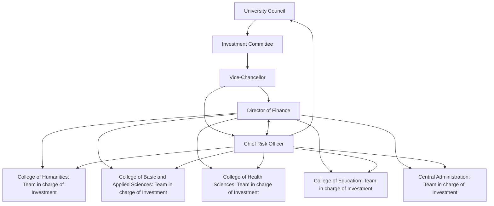

# INVESTMENT POLICY
### PART 1

## CASH ASSET INVESTMENT

Policy No. 939 Volume 58 Number 5

**DECEMBER 2020**

$11UNIVERSITY University of Ghana | Investment Policy Part I Cash Asset Investment
88 OF GHANA

University of Ghana | Investment Policy Part I Cash Asset Investment 

# CONTENTS PAGE

1.0 INTRODUCTION 01
2.0 INVESTMENT PHILOSOPHY 02
3.0 PURPOSE AND GOAL 02
5.0 GENERAL DESCRIPTION OF UNIVERSITY FUNDS 04
6.0 GOVERNANCE AND MANAGEMENT STRUCTURE OF INVESTABLE FUNDS 04
7.0 INVESTMENT OBJECTIVES 06
8.0 SCOPE OF INVESTMENTS AND GOVERNANCE 06
* 8.1 SHORT -TERM INVESTMENTS 06
9.0 PLACEMENT OF SHORT-TERM INVESTMENT 07
10.0 RISK TOLERANCE 11
11.0 RETURNS GUIDELINES AND BENCHMARKS 11
12.0 INVESTMENT BY GUSSS 11
13.0 QUALIFIED FINANCIAL INSTITUTIONS FOR INVESTMENTS 11
14.0 PROHIBITED SECURITIES AND TRANSACTIONS 12
15.0 ROLES, CONTROLS, ACCOUNTABILITY AND TRANSPARENCY 12
* 15.1 Role 12
* 15.2 Control 13
* 15.3 Accountability and Transparency 14
16.0 GUIDING PRINCIPLES 15
17.0 RESPONSIBLE INVESTMENT 16
18.0 DUTIES OF FUND MANAGERS 16
19.0 ETHICS AND CONFLICTS OF INTEREST 17
20.0 TAXES 18
21.0 REVISION CONTROL AND CHANGE 18
22.0 INTERPRETATION 19

Page | i

 University of Ghana | Investment Policy Part I Cash Asset Investment

University of Ghana | Investment Policy Part I | Cash Asset Investment 

# 1.0 INTRODUCTION

In accordance with the University of Ghana Financial Regulations and Governance Policy, 2020 (Policy No. 937, Volume 58, Number 4) (as amended), the primary responsibility of the Investment Committee is the development of the investment policy of the University. The Investment Committee is mandated to ensure that the University’s investments are managed in accordance with the policy and the applicable laws of Ghana (regulation 2.3). The Director of Finance shall, under the authority of the Vice-Chancellor, be responsible for the University’s investment activities which shall be carried out in accordance with the Policy established by the Investment Committee.

Specifically, Policy Number 1304, subsection 4 and 5 of the University of Ghana Financial Regulations and Governance Policy states that:

1. The Investment Committee is responsible for developing investment policies and guidelines for the University; and monitoring the University’s cash management system.

2. The Director of Finance, under the authority of the Vice-Chancellor shall be responsible for the University’s investment activities and shall implement and maintain the cash management system in accordance with the objectives set out under 7.0 of this Policy.

3. The Investment Committee shall develop and monitor the implementation of a cash management system that meets the following objectives:

    a. Provide the capacity to forecast operating cash requirements and provide an early warning system for potential problems.

    b. Assist the Treasury Office in maximising the rate of return on the investment of University cash balances by providing cash flow forecasts that establish the amount of cash needed to meet daily working capital requirements as well as the amount of cash that can be committed to long-term rather than short-term investments.

    c. Identify individual accounts and funds that contribute to negative cash flow situations and recommend corrective action steps.

Page | 01

 University of Ghana | Investment Policy Part I Cash Asset Investment

d. Establish and maintain appropriate corporate banking relationships to provide for the receipt and disbursement of all University funds.

e. Establish and maintain a bank line of credit to provide for unexpected cash needs.

This Investment Policy provides the framework within which cash investment activities of the University of Ghana are to be managed. The policy applies to cash and cash equivalent resources of the University and has been developed to serve as a guideline for the University community.

## 2.0 INVESTMENT PHILOSOPHY

The University’s investment philosophy is to exercise high level care and prudence in the investment of the University assets considering the long and short-term needs of the University as a public tertiary institution. While high levels of risk are to be avoided, the assumption of a low-level risk is acceptable and encouraged to allow for reasonable and satisfactory results consistent with the objectives and investment philosophy of the University.

The University of Ghana, as a public institution, operates under the Public Financial Management Act, 2016 (Act 921) and the Public Financial Management Regulations, 2019 (L.I. 2378). Section 49 of Act 921 and sections 140/141 of the L.I. 2378 stipulates that the Minister may authorise the Controller and Accountant-General to invest in an instrument other than government instrument and that the investment shall mature within the fiscal year. Investment is defined as an expenditure on the creation or acquisition of fixed assets, inventories, valuable physical stocks or securities (section 102 of Act 921).

It is against this background that this document among other things, seeks to provide some guidelines for investment activities to ensure that University funds are efficiently, effectively, equitably and ethically managed for the benefit of the University of Ghana.

## 3.0 PURPOSE AND GOAL

The primary responsibility of the University in investing and managing the University’s funds is to maximize the financial returns. This must be done taking cognizance of risk tolerance of the University. The University’s risk profile is to ensure that:

Page | 02

University of Ghana | Investment Policy Part I | Cash Asset Investment 

*“University of Ghana provides a comprehensive Risk Management Programme that enables risk management and internal controls to be established to mitigate risks that pose significant threat to the achievement of its objectives and financial health. The programme will maximise potential opportunities and minimise the adverse effects of risk on our internal and external stakeholders and protect the University of Ghana’s brand”.*

This Investment Policy therefore specifies the goals, objectives and governance arrangements for all short-term investments of the University, within this framework.

It specifically seeks to:

1. Outline the investment goals and objectives of the University, in line with the University’s investment philosophy and risk appetite.

2. Provide guidance in defining and assigning responsibilities for investment activities; and

3. Ensure that funds are managed in accordance with agreed standards and existing financial legislations in Ghana.

In achieving the foregoing, the following major requirements shall be given full consideration when investing University funds:

1. **Safety** - At the minimum, the value of the principal must be preserved in real terms.

2. **Balance** - Investments portfolio should be well balanced.

3. **Returns** - To maximize return on cash flow resources.

4. **Harmony with Public Interest** - All participants in the investment process shall comply with all relevant regulatory documents (e.g. the Public Financial Management Act, 2016, Act 921 and the Public Financial Management Regulations, 2019, L.I. 2378), and shall seek to act responsibly and shall avoid any transaction that might impair public funds and confidence in the University.

5. **Diversification** – Ensure that the portfolio mix is adjusted in the light of changing environmental circumstances and should be spread across available options.

Page | 03

University of Ghana | Investment Policy Part I Cash Asset Investment

# 4.0 SCOPE

This Investment Policy shall apply to all cash investments of the University. The policy shall cover short-term and for the purposes of this policy, investments of up to one (1) year shall be deemed to be short- term investments.

# 5.0 GENERAL DESCRIPTION OF UNIVERSITY FUNDS

The University sources of funds refer to the following:

1. Subventions from the Government of Ghana;
2. Monies that accrue to the University in the performance of its functions consisting of:
    a. fees paid by students duly registered by the University;
    b. fees, charges and dues in respect of services by or through the University;
    c. proceeds from the sale of publications of the University;
    d. grants, subscriptions, rents and royalties;
3. Interest from investments;
4. Endowments, donations and gifts; and
5. Monies from any other source approved by the Council.

The funds may be grouped under restricted and unrestricted funds. Restricted funds are earmarked funds for specific projects, mostly research project funds. Unrestricted funds are not earmarked for specific activities. Investable funds could come from both restricted and unrestricted funds.

# 6.0 GOVERNANCE AND MANAGEMENT STRUCTURE OF INVESTABLE FUNDS

In accordance with the University of Ghana Financial Regulations and Governance Policy, 2020 (regulation 2.1) as amended, the general governance and management of the University's investible funds is the responsibility of University Council. Accordingly, the Investment Committee is responsible for developing investment policy for the University and ensuring the University's investments are managed in accordance with the policy. All investment activities, be it short or long term, within the University will be in accordance with the investment policy established by the Committee.

Page | 04

University of Ghana | Investment Policy Part I | Cash Asset Investment

The Committee shall therefore be responsible for developing and ensuring compliance of the investment policy.

In the case of short-term investments which is the focus of this policy, the governance and management may be delegated to a sub-committee at Central Administration, the College, the School and other Units as outlined in this policy (see figure 1). The Director of Finance shall provide monthly reports to the Vice-Chancellor and quarterly reports to the Investment Committee. These reports shall be informed by monthly reports from the Investment Teams at the Colleges and Central Administration. Furthermore, all investment decisions must be taken considering the risk tolerance of the University, hence the involvement of the Chief Risk Officer of the University.

The Investment Committee shall review reports on all investments and submit recommendations to Council.

### Figure 1.0 Governance Structure for Short-Term Investments

Page | 05

University of Ghana | Investment Policy Part I Cash Asset Investment

# 7.0 INVESTMENT OBJECTIVES

The general aim of the policy statement is to ensure that the investment decisions of the University’s funds are made in a manner that seeks to achieve reasonable levels of return with the goal of maintaining financial sustainability. Moreover, the specific objectives are dependent on the duration of the investment. However, to achieve the general aim of this policy which focuses on short-term investments, the following specific objectives are needed:

1. To attain an adequate rate of return to generate reasonable amounts to support the University’s programmes.

2. To achieve sufficient returns on investments while keeping risks to a minimum level in order to support future programmes and developments of the University.

3. Maintain the real value of all invested fund; and

4. Provide an alternative income stream to the University.

# 8.0 SCOPE OF INVESTMENTS AND GOVERNANCE

Depending on the tenor of the investments,(short-term, medium-term, and long-term), the objectives, risk levels and governance arrangements may vary. Details can be seen in subsequent section of this policy.

## 8.1 SHORT -TERM INVESTMENTS

This investment may include fixed deposits. The under listed requirements shall be given full consideration when investing in the short term:

a. Liquidity - Ensure that a certain level of investment is maintained in cash and cash equivalents, to enable the University to meet its maturing obligations; and

b. Risk – Ensure that the university is exposed to a very low or no risk.

### 8.1.1 Objectives

The investment objectives shall include the following:

a. Maintain the real value of the funds over the short-term period by protecting them from short-term risks exposures; and

Page | 06

University of Ghana | Investment Policy Part I | Cash Asset Investment 

b. To achieve reasonable rates of return in order to meet the obligations charged to the fund at a later date.

## 8.1.2 Governance & Management

Governance and management of the short-term investment may be carried out by Central Administration, Office of Research Innovation & Development, Colleges, Institutes and Schools following approval by the appropriate sub-committee outlined below:

i. Colleges, Institutes, Schools:
- a. Provost
- b. Dean/Director
- c. Unit Accountant

ii. Central Administration:
- a. Vice-Chancellor
- b. Registrar
- c. Director of Finance

iii. Office of Research, Innovation and Development (ORID):
- a. The Pro Vice-Chancellor
- b. The ORID Administrator/Senior Assistant Registrar
- c. Project Accountant

## 9.0 PLACEMENT OF SHORT-TERM INVESTMENT

To expedite placement of short-term investments the following steps shall be followed to avoid undue delay that might affect expected returns. The purpose of the standard operating procedures is to prescribe processes to follow to undertake investments in financial assets. Though a public institution with low risk appetite, we benchmark our yield with Government of Ghana Treasury Bill rate in negotiating for competitive rates for our investments. The preferred investment houses are the commercial banks that have met the prevailing minimum capitalization threshold, which for the time being stands at Four Hundred Million Ghana Cedis (GH¢ 400m) and are in good financial health.

In line with the above governance structure, there shall be three levels in the hierarchy of the University’s investment administration:

Page | 07

University of Ghana | Investment Policy Part I Cash Asset Investment

A. Unit Level: Schools, Institutes, and Centres
B. Colleges
C. Central Administration

### A. Unit Level (Schools/Institutes/Centres)

1. The Accountant of the Unit shall bring to the attention of the Unit Head in writing any surplus funds that could be invested.

2. This shall be tabled before the management committee of the unit for discussion and approval.

3. The Head of the Unit shall write to the College Finance Officer (CFO) with the Provost in copy with monthly cash flow projections showing the surplus funds and the period it could be invested.

4. The CFO shall collate all the investment requests with recommended investment houses and forward it to the Provost for approval.

5. The Provost may refer it to the College Finance and Development Committee or its sub-committee for their comments.

6. The Provost shall forward the approved request to the Director of Finance. If the annual cumulative amount is less than or equal to GH¢200,000.00, then the Director of Finance shall in consultation with the Vice-Chancellor mandate the College Finance Officer to invest.

7. If the annual cumulative amount is more than GH¢200,000.00, the Director of Finance shall with the approval of the Vice-Chancellor authorize the investment.

8. A copy of the investment certificate shall be sent to the Director of Finance, Unit Head, Provost, and the Vice-Chancellor.

### B. College Level

1. The College Finance Officer shall write to the Provost indicating investible funds with reference to monthly cash flow projections. The memo/letter shall include suggested investment houses.

2. The Provost may refer it to the College Finance and Development Committee or its sub-committee for their comments.

3. The Provost shall forward the approved request to the Director of Finance. If the annual cumulative amount is less than or equal to GH¢200,000.00, then the Director of Finance shall in consultation with the Vice-Chancellor mandate the College Finance Officer to invest.

4. If the amount is more than GH¢200,000.00, the Director of Finance shall with the approval of the Vice-Chancellor authorize the investment.

Page | 08

University of Ghana | Investment Policy Part I | Cash Asset Investment 

5. A copy of the investment certificate shall be sent to the Director of Finance, Provost, and the Vice-Chancellor.

### C. Central Administration – Finance Directorate

1. The Director of Finance shall receive requests from other units, collate and write to the Vice-Chancellor indicating investible funds with reference to monthly cash flow projections, and shall include a list of recommended investment houses.

2. In case of research project funds or other restricted funds:

* i. UG shall invest any research project funds (and other restricted funds) in strict compliance with the agreements the University signs with the donor (or provider of those funds), and in accordance with the project cash flow projection.

* ii. Where there are investible funds over which UG has discretion, the Accountant shall write to the Pro Vice-Chancellor (RID) for approval backed by the project cash flow projection.

* iii. The Pro Vice-Chancellor shall bring to the attention of the Principal Investigator (PI) if it is project specific. The Pro Vice-Chancellor shall approve the investment, in consultation with the PI, recognising the best interest of the University and the project.

* iv. If it is from the general pool, then the Pro Vice-Chancellor may approve the investment based on the general cash flow projection without recourse to the PIs.

* v. The Pro Vice-Chancellor shall forward the approved investible funds to the Director of Finance for further processing in consultation with the Vice-Chancellor.

3. The Vice-Chancellor may present the request to Senior Management meeting for discussion and recommendation.

4. The Vice-Chancellor shall approve for investments to the tune of GH¢10,000,000.00 in any given time. If the amount exceeds GH¢10,000,000.00, the Vice-Chancellor shall approve the request in consultation with the Council or Investment Committee, subject to the ratification of the Council.

5. A copy of the investment certificate shall be sent to the Vice-Chancellor and the relevant Unit or ORID.

### 9.1. Timelines

The placing of an investment under these procedures (that is from the unit level right to the approval by the Provost or Vice-Chancellor) shall not exceed two (2) weeks.

Page | 09

 University of Ghana | Investment Policy Part I Cash Asset Investment

## 9.2 Rollover of Investments

1. In the event of a rollover of investments, the Accountant/College Finance Officer shall seek the prior written approval of the Head of the Unit/Provost.

2. The Accountant/College Finance Officer shall communicate to the Director of Finance with risk analysis for consideration. The notification should come at least two weeks to maturity date. For the avoidance of doubt the following offices shall give the approval for rollover:

* a. Unit level – Head of the Unit
* b. College level – Provost
* c. Research Funds (ORID) – Pro Vice-Chancellor (RID)
* d. Central Administration – Vice-Chancellor

A copy of the new investment certificate shall be sent to the Director of Finance, relevant Unit Heads, Provosts, and the Vice-Chancellor.

Rollover shall not be made beyond four consecutive periods and should be up to a maximum of two years.

## 9.3. Redemption and Liquidation

1. Before maturity date, an investment could be liquidated or redeemed with approval by the appropriate authority when there is a need for cash or other justifiable reason.

2. The Accountant or College Finance Officer shall communicate to the Unit Head or Provost (in the case of a College) the need to get the investment liquidated or redeemed.

3. The Unit Head or Provost may give approval for the liquidation or redemption in writing.

4. The liquidation or redemption shall be carried out after the Director of Finance has been informed in writing by the College Finance Officer or the designated officer and the written consent of the Vice-Chancellor obtained.

5. The Director of Finance shall seek approval from the Vice-Chancellor before any liquidation or redemption is done at the Centre.

Page | 10

University of Ghana | Investment Policy Part I | Cash Asset Investment 

### 9.4. Reporting

Monthly Investment Report shall be submitted to the Director of Finance by the 15th of the following month.

The Director of Finance shall compile all the reports and submit same to the Vice-Chancellor every month.

Adhoc report may be requested any time it is needed.

### 10.0 RISK TOLERANCE

In an attempt to achieve the objectives of this Investment Policy, the degree of risks assumed shall be consistent with the investment objectives of setting up the fund such that it will produce reasonable returns at a minimum risk. The Chief Risk Officer and the Legal Counsel may be consulted where necessary to minimize the University's exposure to risk.

### 11.0 RETURNS GUIDELINES AND BENCHMARKS

This should be greater than or equal to prevailing 91-day Treasury bill rate (plus/minus 1.5%).

### 12.0 INVESTMENT BY GUSSS

**12.1.** Where the investment relates to GUSSS funds, it shall be governed by the GUSSS Regulations, as shall have been approved and published under the authority of the Council, and this Investment Policy.

**12.2.** In the event of conflict between the GUSSS Regulations and the Investment Policy, the GUSSS Regulations shall prevail to the extent of any such inconsistencies.

**12.3.** The Management Committee of GUSSS shall manage the GUSSS funds in accordance with the rules and regulations of the GUSSS and may appoint a Fund Manager for that purpose, where they deem fit and in accordance with the GUSSS Regulations.

### 13.0 QUALIFIED FINANCIAL INSTITUTIONS FOR INVESTMENTS

These institutions refer to banks that have met the minimum capital requirement of the Bank of Ghana. The University shall consider other relevant factors prior to investing with a financial institution.

Page | 11

University of Ghana | Investment Policy Part I Cash Asset Investment

**13.1.** The University will not maintain funds in any financial institution that is not recognized by the appropriate authority such as the Bank of Ghana and the Securities and Exchange Commission. In addition, the Investment Committee will not maintain funds in any institution that is not willing or capable of posting required collateral for funds if required.

**13.2.** To qualify as a depository, a financial institution must furnish the University with copies of the latest two years’ Audited Financial Statements. While acting as a depository, a financial institution must continue to furnish the University with its Audited Financial Statements within 120 days after its financial year- end.

**13.3.** The amount of funds deposited in a bank shall not exceed 15% of the Net Worth of the bank.

# 14.0 PROHIBITED SECURITIES AND TRANSACTIONS

The funds of the University shall not be invested in highly risky securities or with firms whose operations are not in tandem with the core values of the University. The prohibited securities include but not limited to:

1. Securities of firms not listed on the stock exchange.
2. Government of Ghana Debt Instruments including Treasury bills.
3. Securities or Commercial Paper of Microfinance Institutions.
4. Commodity collectibles market:

    a. Companies primarily engaged in the business of gambling, tobacco, fossil fuels and pornography.
    b. Guaranteed investment contracts.
    c. Commodity trading business.

# 15.0 ROLES, CONTROLS, ACCOUNTABILITY AND TRANSPARENCY

## 15.1 Role

There shall be in existence the following Sub-Committees to ensure control, accountability and transparency of investments as follows:

Page | 12

University of Ghana | Investment Policy Part I Cash Asset Investment 

# A. Central Administration Investment Sub-Committee

* **i. Vice-Chancellor**: - Chairperson
* **ii. Registrar**: - Member
* **iii. Director of Finance**: - Member
* **iv. A member of the University with knowledge in investment matters appointed from outside Central Administration by the Vice-Chancellor**: - Member

# B. Office of Research, Innovation and Development (ORID)

* **i. The Pro Vice-Chancellor**: - Chairperson
* **ii. The ORID Administrator or Senior Assistant Registrar**: - Member
* **iii. Project Accountant**: - Member
* **iv. A member of the University with knowledge in investment matters appointed from outside ORID by the Vice-Chancellor**: - Member

# C. College Level Investment Sub-Committee

* **i. Provost**: - Chairperson
* **ii. College Secretary**: - Member
* **iii. College Finance Officer**: - Member
* **iv. A member of the University with knowledge in investment matters appointed from outside the College by the Vice-Chancellor**: - Member

# D. Unit Level Investment Sub-Committee

* **i. Provost**: - Chairperson
* **ii. Dean or Director**: - Member
* **iii. Unit Accountant**: - Member
* **iv. A member of the University with knowledge in investment matters appointed from outside the unit by the Vice-Chancellor**: - Member

Page | 13

University of Ghana | Investment Policy Part I Cash Asset Investment

## 15.2 Control

**15.2.1.** The sub-committees are responsible for ensuring that all free cash flows which would not be used soon are invested for a short-term. Depending on the need for the cash, the invested amount may be rolled-over with approval from the authorizing head of the sub-committee. Unit Accountants may propose qualified financial institutions and the instruments for the investments depending on the financial institutions which are in good standing.

**15.2.2.** For purposes of this Policy all funds (restricted and unrestricted)1 will require approval by the Unit Head, but approval by the relevant Sub-Committee is dependent on the range per semester given below. All amounts above the upper limits will require approval from the next higher Sub-Committee where applicable. The amount to be invested will be determined cumulatively to avoid investments on piece-meal basis. The following are, for the time being, investment thresholds per semester requiring approval:

<table>
  <thead>
    <tr>
        <th>Unit</th>
        <th>Cumulative Amount (GHS)</th>
    </tr>
  </thead>
  <tbody>
    <tr>
        <td>Vice-Chancellor in consultation with the Investment Committee</td>
        <td>Above 10,000,000</td>
    </tr>
    <tr>
        <td>Vice-Chancellor - Central Administration</td>
        <td>201,000 - 10,000,000</td>
    </tr>
    <tr>
        <td>Pro Vice-Chancellor, Provost, Unit Head - ORID/College/School/Institute/Centre</td>
        <td>50,000 - 200,000</td>
    </tr>
  </tbody>
</table>

**15.2.3.** For the avoidance of doubt, all decisions for any investment shall be approved and/or sanctioned by the Vice-Chancellor as the Principal Spending Officer of the University.

## 15.3 Accountability and Transparency

The Sub-Committees shall furnish the Director of Finance with monthly investment reports. The Director of Finance shall in-turn furnish the Vice-Chancellor with monthly reports and the Investment Committee with quarterly reports on investments.

1 All restricted funds, including those managed by ORID shall not be invested without approval

Page | 14

University of Ghana | Investment Policy Part I | Cash Asset Investment 

# 16.0 GUIDING PRINCIPLES

**16.1.** The following guiding principles shall guide the investments of the University funds:

1. Investment decisions shall be made in a manner that protects and maintains the principal amount.
2. Save restricted funds, the investment of University funds shall be subject to the borrowing needs of the University. Idle or excess funds, shall as identified by the Director of Finance be used to meet University wide borrowing needs on terms and conditions to be agreed between the Director of Finance and the Unit, subject to the approval of the Vice-Chancellor.
3. The investment portfolio shall be structured with the goal of attaining a maximum market rate of return by considering the associated investment risks and liquidity demands.
4. The Fund Managers, in the case of the GUSSS, or custodians of the University fund shall conduct investment activities responsibly as stewards of public trust by avoiding activities that may impair their independence and public confidence.
5. Thorough cost-benefit analysis shall be undertaken prior to the initiation of an investment decision or activity; and
6. In the case of GUSSS Investments, Fund Managers are required to conduct their activities in a manner that minimizes the occurrence of actual or potential conflicts of interests which might affect the management and implementation of investment decisions.
7. No one financial institution shall hold more than 20% of the University's investment assets.

**16.2.** The investing authority or officer shall consider the purposes of investment, as well as the purposes of the specific funds:

1. The investment of both the operational fund and the reserve fund will be diversified to limit the risk of loss resulting from concentration of assets in a specific type of investment. Investment shall be diversified across different issuers, different maturities, different sectors, unless the Investment Committee prudently determines that because of special circumstances, the purposes of the fund does not require diversification. The Investment Committee shall review the diversification strategy periodically, preferably annually.

Page | 15

University of Ghana | Investment Policy Part I Cash Asset Investment

2. Investment decisions concerning the University’s financial assets shall take into account the following factors, if necessary:

i. The expected total return from income and the capital appreciation.
ii. The general economic conditions.
iii. The expected tax consequences, if any, of investment decisions and strategies.
iv. The role each investment plays within the entire investment portfolio of the specific fund.
v. The possible effect of inflation on the investment.

# 17.0 RESPONSIBLE INVESTMENT

An investment is deemed responsible when it incorporates the relative importance of environmental, social and governance (ESG) issues in relation to the survival of the market. The ability of an investment portfolio to generate appropriate cash flows depends in part on how stable the market is economically and environmentally the governance structure of the market. The University is concerned and well committed to promoting environmental, social and governance ideas through research and education. Therefore, investment decisions must consider the following:

1. Integration of ESG factors into the analysis of investment options and decision making.
2. Emphasize on the disclosure of ESG related issues by the firms before investing university funds.
3. Conducting regular reviews of ESG factors in investment decisions.
4. Engage other institutional investors and industry practitioners on matters related to ESG.
5. Any investment that is unethical: harmful to the environment; harmful to the individual and society; socially undesirable.

# 18.0 DUTIES OF FUND MANAGERS

In the case of medium to long term investment of GUSSS Funds, the Fund Manager shall be responsible for managing the investment assets. Specifically, the duties of the Fund Manager shall include:

Page | 16

University of Ghana | Investment Policy Part I Cash Asset Investment

1. Maintenance of separate books of accounts.
2. Valuation of the investment assets of the fund.
3. Settlement of transactions of the investment manager.
4. Receipt of all revenues accruing to the fund.
5. Preparation of quarterly reports detailing the transactions, cash flows, carrying values of the various securities held and report on changes in the overall investment portfolio; and
6. Any other responsibilities specified by the Investment Committee.

# 19.0 ETHICS AND CONFLICTS OF INTEREST

A member of the committee who has an interest in a matter or a direct relationship or association with any firm or organisation under consideration by the committee shall disclose in writing the nature of that interest and shall be disqualified from participating in the deliberations of the committee in respect of that matter, firm or organisation unless the majority of the members of the committee deem it otherwise that such member’s participation shall not be prejudicial to the matter.

The following shall guide the committee in managing and/or mitigating potential conflicts of interest:

1. All Central Administration, Unit or College Committee members are to disclose any actual or potential conflict of interest that could reasonably challenge their ability to make a prudent and independent investment decision in the best interest of the University.
2. A committee member shall not participate in the decision to invest in the securities of an organization they are directly or indirectly related to.
3. Committee members are required to carry out their responsibilities with the optimum level of ethical standards in order to mitigate potential conflicts of interest.
4. In situations where actual or potential conflicts of interest have been identified and approval has been given to continue with the transactions, such related party investments shall be determined at their fair market values.
5. Investment Officer shall disclose to the relevant Committee any material financial interest in the financial institutions that conduct business with the University, and they shall further disclose any large financial or investment positions that could be related to the performance of the investment.

Page | 17

University of Ghana | Investment Policy Part I Cash Asset Investment

6. Officers and employees and their agents involved in the University’s investment process shall refrain from business activity that could conflict with the proper execution of the investment programme, or which could impair their ability to make impartial investment decisions.

7. Pursuant to the above, Investment Officer and employees of the University acting in accordance with this Policy and written procedures as have been or may be established and exercising due diligence shall be relieved of personal liability for an individual security’s risk or market changes.

## 20.0 TAXES

The nature of proposed investments (fixed deposit with banks) are generally tax exempt for individuals. For all institutions, there is a withholding tax. Also, income from an approved unit trust scheme and mutual fund are exempted from tax in the case of both individuals and institutions (*Income Tax (Amendment) (No. 2) Act, 2017*). Details of other exemptions can be seen in the tax laws of Ghana.

## 21.0 REVISION CONTROL AND CHANGE

It is the responsibility of the Investment Committee to ensure the modification of this policy as changes occur in the University’s operating environment, investment strategy, support requirements, anticipated volumes of transactions to be supported, Statutes and Regulations of the University, and the relevant laws of Ghana. The policy will be revised with modern financial practices in mind.

Page | 18

University of Ghana | Investment Policy Part I Cash Asset Investment

# 22.0 INTERPRETATION

<table>
  <tbody>
    <tr>
        <td>Custodian of University Funds</td>
        <td>shall mean the Director of Finance or any Officer of the University holding or managing University Funds for or on behalf of the University.</td>
    </tr>
    <tr>
        <td>Fund Managers</td>
        <td>shall mean Fund Managers appointed by the Management Committee of GUSSS</td>
    </tr>
    <tr>
        <td>Investments</td>
        <td>shall mean an expenditure on the creation or acquisition of fixed assets, inventories, valuable physical stocks or securities</td>
    </tr>
    <tr>
        <td>Investment Committee</td>
        <td>shall mean a Committee set up by Council of the University of Ghana to be responsible for developing policies, guidelines and monitoring the University's cash management system</td>
    </tr>
    <tr>
        <td>Cash Asset Investment Policy</td>
        <td>shall mean this Policy developed by the Investment Committee and approved by the University Council</td>
    </tr>
    <tr>
        <td>GUSSS Funds</td>
        <td>Contributions made by members of Ghana Universities Staff Superannuation Scheme</td>
    </tr>
    <tr>
        <td>GUSSS Investment</td>
        <td>shall mean Investment of GUSSS Funds as made by the Management Committee of GUSSS</td>
    </tr>
    <tr>
        <td>Management Committee of GUSSS</td>
        <td>shall mean the Management Committee set up by the Council of University of Ghana to operate and manage GUSSS</td>
    </tr>
    <tr>
        <td>GUSSS Regulations</td>
        <td>Shall mean the governing regulation of GUSSS as may be amended</td>
    </tr>
    <tr>
        <td>Short-Term Investment</td>
        <td>Shall mean an investment which would mature within the fiscal year</td>
    </tr>
    <tr>
        <td>Medium to long term Investment</td>
        <td>Shall mean an investment which would mature over one fiscal year</td>
    </tr>
    <tr>
        <td>University</td>
        <td>Shall mean the University of Ghana</td>
    </tr>
  </tbody>
</table>

Page | 19

University of Ghana | Investment Policy Part I Cash Asset Investment

Date of Publication: 14th April, 2021

Approved by the University Council in

December, 2020

Professor Yaw Twumasi
Chairman of Council,
University of Ghana

Professor Ebenezer Oduro Owusu
Vice-Chancellor,
University of Ghana

Page | 20

University of Ghana | Investment Policy Part I Cash Asset Investment

$11UNIVERSITY University of Ghana | Investment Policy Part I Cash Asset Investment
88 OF GHANA

University of Ghana | Investment Policy Part I Cash Asset Investment

© 2020 Public Affairs, University of Ghana

**Design & Print: University of Ghana Printing Press - 030 293 4987**