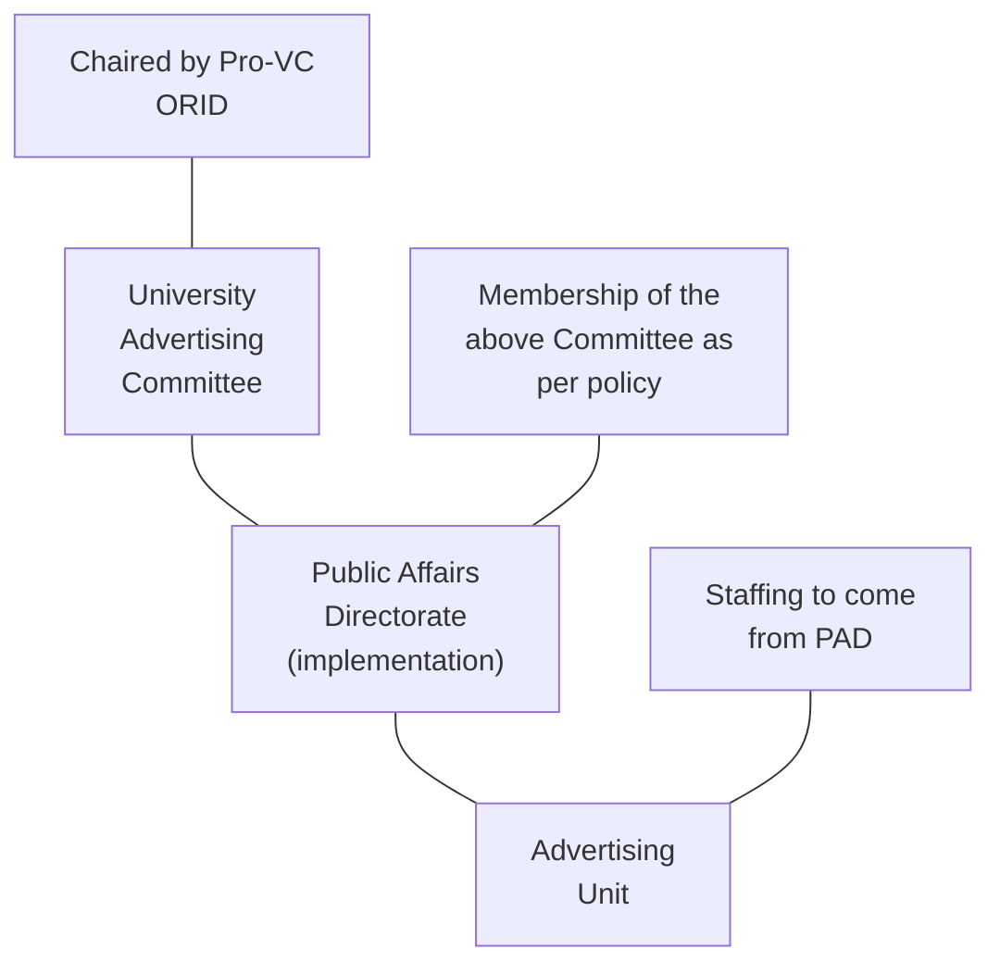

# UNIVERSITY OF GHANA SPECIAL REPORTER

## PUBLISHED BY AUTHORITY

NO. 804 FRIDAY, JUNE 15, 2012 VOL. 49 NO. 10

## POLICY REGULATING THE PLACEMENT OF ADVERTISEMENT

### NOVEMBER 2011

### CONTENTS

1. Principles 1
2. Definitions 2
3. Application of Funds 3
4. Classification of Locations 4
5. Content Guidelines 8
6. Procedure for Advertising 11
7. The Advertising Unit 20
8. The University Advertising Committee 22

*Policy Regulating the Placement of Advertisement at the University of Ghana* 1

# 1 Principles

The University has a mission to “*develop world-class human resources and capabilities to meet national development needs and global challenges through quality teaching, learning, research and knowledge dissemination.*” In order to further this mission, the campuses of the University must be maintained as serene environments that promote teaching and learning. It follows therefore that the University Campuses cannot be allowed to become free-for-all areas for all manner of commercial advertising.

Commercial activity cannot however be prohibited from the University’s premises. The Legon campus in particular which provides residence for both staff and students, must also simultaneously function as a conventional settlement with the provision of banking, retail, and other facilities. There is therefore the need to manage the presence of commercial entities within the campus to ensure that their activities (particularly as relates to marketing and advertising) do not detract from the academic environment that the University seeks to engender.

Events and activities organised by both staff and students create a requirement for the dissemination of information to the University community in the form of posters, banners, etc. This includes activities organised by student clubs and associations, Halls of Residence, and academic departments. In addition to this, the University currently has a policy of promoting entrepreneurship within the student body, and the marketing/advertising needs of students involved in small commercial ventures cannot therefore be ignored.

Finally, it must also be recognised that the alumni, faculty, staff, and students of the University of Ghana are attractive to vendors of all sorts as a market for their products. As a result, there will be strong pressure from vendors to market and advertise their products to members of the University community. Whilst this has the potential to create a nuisance, it is also a potential source of significant additional income to the University that cannot be ignored.

2 *Policy Regulating the Placement of Advertisement at the University of Ghana*

This policy therefore seeks to rationalise and manage these competing requirements by defining rules, regulations and procedure to govern the placement of all manner of signage and advertising on the premises of the University of Ghana. This policy will also cover advertising within official publications of the University, advertising on Radio Univers, and on the University website and intranet pages.

# 2 Definitions

For the purpose of this policy, the following definitions will apply

## 2.1 Advertisement

For the purpose of this policy, advertisement will be defined as including the following:

1. Billboards
2. Banners
3. Posters
4. Notices – excluding official notices from administrative/ academic units of the University
5. Magazine/Journal advertisement
6. Electronic Advertising on University Web pages
7. Advertisement on Radio Univers
8. Fliers
9. Mobile Advertising (i.e. audio announcements by means of a public address system)
10. Signage (whether on a building or mounted on supports) – again excluding official signage identifying University facilities.

All the above are covered and regulated by this policy, and may be further classified depending on their source and/or content.

## 2.2 Branding

Branding in the context of this policy is defined as the placement of a non-university company or organisation’s name, logo, flag, colours,

*Policy Regulating the Placement of Advertisement at the University of Ghana* 3

product pictures, product names, publicity material, or other image generally identified with the company/organisation on any publication, building or premises of the University of Ghana, for the purpose of advertising the company/organisation or one or more of its products.

For the avoidance of doubt, the creation of a specific identity or “brand” in terms of logo, colours, etc. by a department or unit of the University of Ghana is not covered by this policy. It is assumed that a separate policy will be defined to regulate issues relating to the brand and image of the University of Ghana and its departments and units.

## 2.3 Sponsorship

Sponsorship in the context of this policy refers to support in cash or “in-kind” provided by companies or organisations in exchange for some form of publicity or advertising (e.g. in the form of branding of an event). Sponsorship that does not include advertising (other than acknowledgement of the sponsor) is not covered by this policy.

# 3 Application of Funds

In principle, revenue obtained from fees charged for advertising should not be used to replace Government subvention, but should be used for purposes that would generally not be catered for with existing sources of funds. These would include:

1. Beautification of campus and creation and maintenance of green areas

2. Creation of recreational zones (seating, etc.)

3. Management of advertising Office

As is the practice with other Internally Generated Funds, a portion of funds generated will be channelled to the Financial Aid Office to support brilliant but needy students.

4 *Policy Regulating the Placement of Advertisement at the University of Ghana*

Unless otherwise specified within this document, fees collected by Academic Departments/Units, Administrative Units, Halls of Residence and Hostels located on University of Ghana land, will be managed by the unit that collects the fees in accordance with this policy.

# 4 Classification of Locations

## 4.1 *Prohibited Locations*

### 4.1.1 *General*

The following are classified as prohibited locations for the purpose of advertising
* Lecture Halls (i.e. inside the hall)
* Floors of buildings
* Pavements and Roads
* Lamp Posts
* Trees
* Directional Signboards and other signage
* Waste Bins
* Staff/Faculty Residential Areas

No advertising is permitted in prohibited areas.

### 4.1.2 *Posters*

Posters may only be posted on specific boards explicitly created for the purpose. No posters may be posted on any wall, fencing or lamp post at any location within the University of Ghana. Severe penalties (including monetary fines) will be enforced on violations of this regulation.

### 4.1.3 *Mobile advertising*

Mobile advertising as defined in Section 2.1 will not be permitted on the University Campus.

*Policy Regulating the Placement of Advertisement at the University of Ghana* 5

### 4.1.4 *Hiring of Lecture Halls for Events*

In the special case of lecture halls, when they are hired for events and programmes, permission may be sought for banners and other publicity materials to be placed within the lecture halls during the event, provided that all such materials are completely removed without trace immediately following the event. In any case, explicit and specific permission must be sought and obtained from the Head of Department prior to the placement of any signage or advertising during any such event. This requirement must be clearly indicated to the hirer at the time of booking and in any confirmation letter sent to the hirer.

Additional costs levied for placing of banners and other publicity materials during such events, should include the cost of removal of the same, and be in conformity with the costs defined by the University Advertising Committee.

## 4.2 **Restricted Locations**

### 4.2.1 *General*

The following areas are classified as restricted areas for the purpose of advertising:

* Academic Areas (Faculty and Department buildings)

* Main University Entrance

* Main University Avenue (including Mekki Abbas Circle)

No commercial advertising will be permitted in restricted locations.

The University Advertising Committee will explore possibilities of placing electronic advertising devices at vantage points with news of ongoing University activities in the University in conjunction with the PDMSD.

6 *Policy Regulating the Placement of Advertisement at the University of Ghana*

### 4.2.2 *Academic Areas*

Other than notices and small posters that will fit on notice boards, only University related advertising will be permitted in academic areas. Specifically, only Academic Units and Departments may place banners for celebrations and events in and around academic buildings.

When academic premises are hired for an event, special arrangements may be made for banners and posters to be placed within the academic area in question. The nature of the advertisement will however be subject to negotiation with the Head of the academic unit. Additional costs levied for placing of banners and other publicity materials during such events, should include a deposit for the cost of removal of the same, and be in conformity with the costs defined by the Advertising Committee.

### 4.2.3 *Main University Entrance*

For the purpose of this policy, the Main University Entrance is defined to include the University Entrance Building, and the area between the building and the main road, including the pond area, and the area around the flag posts.

No banners shall be allowed at the Main University Entrance, except those related to special University events such as University jubilees and other University celebrations. All such banners will be subject to strict guidelines to be defined by the Public Affairs Directorate (PAD).

Non-University events held on campus shall be advertised on suitably designed Notice Boards to be erected at appropriate locations at the main entrance. Similar notice boards will be erected at the visitor centre and at the other entrances of the University. The notice boards shall be maintained by the University (i.e. Nature and type of adverts will be controlled by the University and the adverts placed and removed by the University). A suitable charge shall be levied for the use of the notice boards. The notice boards shall

*Policy Regulating the Placement of Advertisement at the University of Ghana* 7

generally be of a shared nature (i.e. shall not be used to advertise a single event), and will only indicate the name of the event and its location on campus.

### 4.2.4 *Main University Avenue*

No adverts shall generally be permitted along the main University Avenue. No banners shall be allowed, except those related to special University events such as University jubilees and other University celebrations, subject to specific guidelines to be defined by the PAD.

### 4.3 Public Locations

The following areas are defined as public locations:

* Main Bus/Taxi terminals at University Entrance
* Central Car Park(s) at University Entrance
* University Land that is physically removed from the main campus

These are areas which are used equally by members of the University community and the general public. These areas will have the most flexibility in terms of advertising. Any advert from any source, that does not violate the general content guidelines is acceptable in such areas. Advertising in Public Locations will be controlled and managed by the Advertising Committee.

### 4.4 Controlled Locations

All other areas will fall into this category. These include:

* Hostels and Halls of Residence (including external walls but excluding Notice Boards)
* Sports Facilities on campus
* Dual purpose (academic/public) facilities (e.g. Efua Sutherland Drama Studio)

8 *Policy Regulating the Placement of Advertisement at the University of Ghana*

* On-Campus Commercial Areas (e.g. Banks, Markets, Bus Terminals)

* Catering facilities (both inside premises and on external walls and surroundings)

* Bus stops located outside restricted and prohibited areas

Regulations for advertisement in controlled locations will be similar to those of public areas, except that there would be some control over the size and type of advert permitted. Permission for placement of an advert would be subject to review by the Advertising Committee. This is to ensure that the proposed advertisement does not significantly detract from the nature of the University. Adverts visible from restricted or prohibited areas may not be permitted.

Adverts may not be permitted during specific periods in some sensitive areas (e.g. cafeteria area during congregations), and such time restrictions would be defined by the University Advertising Committee.

# 5 Content Guidelines

## 5.1 *General*

As a general rule adverts should only be allowed if they are legal and not offensive. In particular, adverts will be subject to vetting to ensure that they do not offend on the basis of gender, religion, disability, racial or ethnic stereotyping. In addition, the University of Ghana will take a proactive ethical stance and refuse to allow adverts that promote life-styles known to be hazardous, especially for young people. For this reason, adverts promoting undesirable sexual behaviour, and the use of tobacco and alcohol will not be permitted in any location on campus.

Specific guidelines on acceptable content for advertisement on campus will be maintained by the University Advertising Committee.

*Policy Regulating the Placement of Advertisement at the University of Ghana* 9

## 5.2 **Regulations on Accepting of Adverts**

### 5.2.1 *Identification of Advertiser*

The advertiser must provide full name, ID, and contact details before any advert is accepted. These details will be available on request by any person who seeks them subject to the discretion of the approving authority.

### 5.2.2 *Removal of Expired Adverts*

All adverts placed are accepted on the condition that they can be removed completely and without trace. Advertisers will be charged for the costs of placing and removing their advert, in addition to any other charges levied.

### 5.2.3 *Payment for Adverts*

All advertisements must be paid for in full (where applicable) before being posted or placed in position.

### 5.2.4 *Truth and Accuracy of Adverts*

i. No advert intending to deceive, mislead or defraud will be permitted

ii. No adverts making any unverifiable claims will be permitted

iii. Adverts must contain up to date information

Notwithstanding the above, the University of Ghana does not accept responsibility for the accuracy and truthfulness of any advert placed by an advertiser at any location within the University of Ghana.

### 5.2.5 *Conformity with University of Ghana Regulations*

All advertisement must be in conformance with "The Statutes of the University of Ghana" and all other regulations of the University,

10 *Policy Regulating the Placement of Advertisement at the University of Ghana*

including the “Regulations for Junior Members”. Advertising should be in accordance with University Policies that may be defined from time to time, including any environmental protection policies.

### 5.2.6 *Conformity with Laws of Ghana*

All adverts must be in conformance with the laws of Ghana.

### 5.2.7 *Conformity with and Sound Moral/Ethical Norms*

Advertisements must **not**

i. Invade the rights or privacy of any person

ii. Present stereotypical information.

iii. Present party-political information (except where a party congress is being organised on campus and students are on recess).

iv. Include information which is obscene, offensive, defamatory, racist or sexist or which would bring the University of Ghana into disrepute or place the University in a divisive moral or ethical position.

### 5.2.8 *Conformity with University of Ghana Identity and Purpose*

The University of Ghana will not accept any adverts that compromise or tarnish its image and/or identity. Specifically, to be accepted, adverts must

i. Not devalue the University of Ghana or devalue its image

ii. Not conflict with the purpose of the University as an institution of higher learning

*Policy Regulating the Placement of Advertisement at the University of Ghana* 11

iii. Not use the University of Ghana’s name, logo or any other articles of identification in connection with advertisement of any non-university product, service or event.

Adverts from University units must conform to any branding/corporate style guide requirements as may be defined by the Public Affairs Directorate

### 5.2.9 *Outdoor Advertising*

i. No outdoor advertising will be permitted in forms that may interfere with, or physically harm human or motor traffic.

ii. All outdoor advertising must be approved for placement by the Physical Development and Municipal Services Directorate (PDMSD)

iii. No outdoor advertising will be permitted that adversely interferes with nature.

# 6 **Procedure for Advertising**

## 6.1 ***Academic, Administrative and Residential Units***

### 6.1.1 *General*

The guidelines provided here cover Academic Departments and Units, Halls/Hostels, and Administrative Units of the University. These guidelines establish key principles for handling advertisement from different sources. Detailed procedures for approval and placement of adverts must be developed by the Responsible Authority as defined below.

### 6.1.2 *Responsible Authority*

i. In Academic Units, the Head of Unit/Department is responsible for ensuring that the requirements of the policy are complied with.

12 *Policy Regulating the Placement of Advertisement at the University of Ghana*

ii. In Administrative Units, the Head of Unit is responsible for ensuring that the requirements of the policy are complied with.

iii. In Halls of Residence, the Hall Master/Warden is responsible for ensuring that the requirements of the policy are complied with.

iv. In Hostels, the Hostel Manager is responsible for ensuring that the requirements of the policy are complied with.

### 6.1.3 *Adverts from University Units*

i. Academic, Administrative and Residential units do not require any permission to place their own adverts within their own premises.

ii. Academic, Administrative and Residential units must seek permission locally from other units for placement of adverts within the premises of other units/departments. This means that Administrative, Academic and Residential Units cannot place adverts directly on notice boards of other departments/units without getting specific approval.

iii. Halls/Hostels, Administrative and Academic units should not be charged for adverts placed in units other than their own.

### 6.1.4 *Adverts from student clubs or societies*

#### 6.1.4.1 Approval

i. Advertisement from student academic clubs or societies must be vetted and approved by the academic department in which they are hosted, following guidelines in this policy.

ii. Advertisement from JCRs and other Hall based student groups must be vetted and approved by the Senior Tutor, following

*Policy Regulating the Placement of Advertisement at the University of Ghana* 13

guidelines in this policy. The Senior Tutor may delegate the responsibility for vetting advertisement placed on JCR notice boards, to the JCR executive. The Senior Tutor however retains overall responsibility and authority over all such advertising.

iii. Advertisement from all other clubs or societies (including the SRC) must be vetted and approved by the office of the Dean of Students Affairs, following guidelines in this policy.

### 6.1.4.2 Placement and Removal

i. Once the advert is approved, it can be placed in the unit which vetted and approved it

ii. The approved advert can also be circulated to other units and departments.

iii. Adverts approved as described above can be placed without further vetting

iv. Departments/units are responsible for removal of expired adverts on their premises

v. No charges will apply to such adverts.

### 6.1.5 *Non-commercial Adverts from Staff/Senior Member*

i. Staff/Senior Member adverts of non-commercial form (e.g. Obituary, etc.) must be vetted and approved by the University unit at which the staff/Senior Member is employed as per guidelines.

ii. Once approved, the advert may be posted and circulated to other departments/units for placement without further vetting.

14 *Policy Regulating the Placement of Advertisement at the University of Ghana*

iii. No charges will apply to such adverts.

### 6.1.6 *Social/Community Advert*

i. Adverts in this category include religious programmes, notices from sister universities and other academic institutions, and non-university public seminars.

ii. Such adverts are permitted at the discretion of Unit, provided they comply with content guidelines defined in this policy. They must therefore be vetted prior to approval.

iii. It is recommended that a separate notice board be provided for such adverts, to indicate that the activity is not promoted by the University unit/department.

iv. The decision to charge is at discretion of unit/department, but any charge levied must be in accordance with fees approved by the University Advertising Committee.

v. Adverts that have expired must be removed by the department/unit in whose premises they are placed. Any charges levied must include the cost of removal of the advert.

vi. Any proceeds will be retained by Unit, and used to maintain notice boards, provide student recreational facilities and/or beautify surroundings of the premises.

vii. These funds cannot be used as a source of income for hostel/hall operators.

### 6.1.7 *Items/Service for Sale*

i. Specially provided "Marketplace" boards should be created for the purpose

*Policy Regulating the Placement of Advertisement at the University of Ghana* 15

ii. Only items of relevance to academics (e.g. IT equipment, books, photocopying services, etc) may be advertised “for sale” in academic areas.

iii. Adverts must be vetted by academic unit prior to posting to ensure conformance with content guidelines

iv. All adverts placed on these boards will incur a charge to be defined by the University Advertising Committee.

v. Adverts for Holiday Travel will not be permitted in academic areas.

vi. Adverts that have expired must be removed by the department/unit that authorised the placement. Any charges levied must include the cost of removal of the advert.

vii. Proceeds will be retained by Unit, and used to maintain notice boards, provide student recreational facilities and/or beautify surroundings of the premises.

viii. These funds cannot be used as a source of income for hostel/hall operators.

### 6.1.8 *Special Arrangements*

At the beginning of Semester and during student Election periods, there is an increased requirement for advertising and dissemination of information. At such times, it is likely that the notice boards provided may not be sufficient for the needs of the period.

During such times therefore, additional notice boards/bill boards of a temporary nature, may be placed in academic and residential areas to meet this increased need. The rules and procedures for approval of adverts will however remain unchanged.

16 *Policy Regulating the Placement of Advertisement at the University of Ghana*

## 6.2 ***General University/Other Locations***

### 6.2.1 *General*

i. All areas other than Academic and Administrative Areas and Halls/Hostels will be controlled by the University Advertising Committee. These areas primarily include Controlled and Public Areas as well as the University Main Avenue and Main Entrance.

ii. Advertising on the external walls (e.g. Boardings/Billboards) of all University Properties will also be controlled by the University Advertising Committee. Revenue sharing arrangements with University Units which host any approved large scale adverts will be specified.

iii. The Advertising Committee shall solely manage advertising in Public Areas and shall organise and actively solicit for suitable commercial advertising to take place in these areas. This will include arranging for the erection of suitable billboards, boardings, notice boards, etc., as well as the marketing of the advertising space provided. The actual tasks involved may be delegated or outsourced to external service providers (e.g. advertising agencies), but the advertising committee shall retain overall responsibility.

iv. All official University Signage and new outdoor advertisement locations or structures of a permanent or semi-permanent nature will have to be approved by a three person committee of the PDMSD. This committee would be made up of the Director of the PDMSD (as Chairman) the Deputy Director (Physical Development Works and Housing), and the University Architect. In case of unavailability of one of these, a replacement would be made by the Director provided that the membership would always include an architect.

*Policy Regulating the Placement of Advertisement at the University of Ghana* 17

v. No University tenant shall have the right to independently solicit and/or display adverts for financial return. Any tenant seeking to place such adverts within or without the premises so secured must seek permission from the University Advertising Committee1. The University will take a proportion of all revenues accrued by the tenant from such advertising.

### 6.2.2 *Sponsorships*

i. Sponsorships including those related to Hall/Faculty/ Departmental Week celebration bazaars will be negotiated with the help of the Advertising Unit. No Student Society, Faculty or Department shall enter into any sponsorship arrangement that includes branding or other form of advertising without the knowledge and approval of the Advertising Unit. Guidance on type and nature of arrangements acceptable to the University will be provided by the University Advertising Committee.

ii. The purpose of the involvement of the Advertising Unit in sponsorships linked with advertising will be to ensure that the University body organising the event gains the maximum possible benefit from the sponsorship, and that all forms of marketing and advertising that take place as part of any such event does not violate any other University advertising regulations.

iii. 5% of any revenue from all sponsorships that is not "in kind" will be paid to the Advertising Unit to cover overhead costs.

### 6.2.3 *Branding*

i. Branding of any premises within the University requires the approval of the University Advertising Committee. The full terms of any such arrangement would need to be disclosed

1. A suitable clause will need to be written into all tenancy agreements if one is not already present.

18 *Policy Regulating the Placement of Advertisement at the University of Ghana*

before such permission is granted. Permission will only be given where it can be demonstrated that such branding will not detract from the environment of an institution for teaching and learning.

ii. In the case of branding initiated by a University tenant (e.g. catering facilities and shops), the University will levy a fee to the tenant when permission is granted.

iii. Branding of academic facilities by commercial entities will not generally be permitted, as these are generally in restricted areas. However in some dual purpose areas, this may be considered. The nature and scope of such branding would have to be closely scrutinised and will need to be approved by the University Advertising Committee.

### 6.2.4 Signage

#### 6.2.4.1 University Signage

i. The PDMSD will define and manage the scheme for providing directions and signs to University units, halls and departments. The committee defined in Clause 6.2.1 (iv) above will define and periodically review the scheme (including size, colours lettering, and use and positioning of logos) for University Signage. This scheme will be defined to be consistent with any University Brand Definition provided by the Public Affairs Directorate (PAD).

ii. All signage for University units must be approved by the PDMSD. University units will therefore seek approval of proposed signage directly from the PDMSD.

#### 6.2.4.2 Signage of University Tenants

i. The PDMSD will define the scheme for signage for commercial entities (e.g. banks, shops, salons) that lease or rent properties on

*Policy Regulating the Placement of Advertisement at the University of Ghana* 19

campus. The size and shape of the signage allowed in and around the leased premises will be defined as part of lease arrangements, in conformity with the scheme specified by the PDMSD.

ii. Any additional signage (e.g. directional) will require explicit permission from the University Advertising Committee, and will incur additional costs.

iii. Movable signage (e.g. indicating sale of top-up units) shall be covered by this regulation, and will require explicit permission from the Advertising Unit, and incur additional costs when approved.

iv. Fines will be levied against all tenants who flout these regulations, and failure to pay the fines or persistent violation of the regulations could lead to termination of leases.

### 6.2.5 *New Outdoor Advertising Structure/Location*

i. Applications for creation of new outdoor advertising structures or locations must be submitted to the Advertising Unit for processing.

ii. The Advertising Unit will process the application as follows:
a. The Director of the PDMSD will be asked to constitute a committee (as specified in Clause 6.2.1 (iv) above), to determine the suitability of the location, size and appearance of the proposed advertising structure/ location.
b. In parallel with the above, a consultation document will be submitted to heads of any academic or residential units in close proximity to the proposed structure/location to receive their comments, feedback or possible objections.

20 *Policy Regulating the Placement of Advertisement at the University of Ghana*

c. The application, together with the responses from the PDMSD and the residential and academic units consulted would then be laid before the University Advertising Committee which would then approve or deny the application.

d. The whole process should be completed within 8 weeks of receipt of the application.

# 7 The Advertising Unit

## 7.1 General

An Advertising Unit will be set up under the Public Affairs Directorate to coordinate and manage all issues relating to advertising on University Property and within the University Campus.

This unit will be staffed as determined by the University Advertising Committee, but will have at least one full time staff.

*Policy Regulating the Placement of Advertisement at the University of Ghana* 21

## 7.2 *Functions of the Advertising Unit*

The Advertising Unit shall do the following:

Approve Advertising Applications

The University Advertising Committee retains the responsibility for approving applications for advertising in public and controlled areas. The committee may however delegate the approval of routine requests for advertising within these areas, and the Advertising Unit would therefore be responsible for approval of such advertising applications.

**Public and Controlled Areas**

i. Manage advertising in all areas within the University other than Academic and Administrative Areas and Halls/Hostels, under the direction of the University Advertising Committee. These areas are made primarily of Controlled and Public Areas as well as the University Main Avenue and Main Entrance.

ii. Manage advertising on the outside walls (e.g. Boardings/ Billboards) of all University Properties, under the direction of the University Advertising Committee.

iii. Manage advertising in areas defined as Public Areas in the University under the direction of the Advertising Committee.

iv. Actively solicit for suitable commercial advertising to take place in Public Areas. This will include arranging for the erection of suitable billboards, boardings, notice boards, etc., as well as the marketing of the advertising space provided. The actual tasks involved may be delegated or outsourced to external service providers (e.g. advertising agencies).

v. Organise and ensure removal of all advertising in public and controlled areas on expiry of the contract period.

22 *Policy Regulating the Placement of Advertisement at the University of Ghana*

### **Sponsorship**

vi. Assist in negotiation of sponsorships (i.e. sponsorships that include branding or advertising) including Hall/Faculty/Departmental Week celebration bazaars.

### **Branding**

vii. Process all applications for branding of premises within the University for consideration by the University Advertising Committee.

viii. Pursue opportunities for appropriate branding of facilities located within Public and Controlled areas (e.g. University Sports Facilities and the “Night Market”), to maximise revenue to the University.

### **Signage**

ix. Ensure that all university tenants conform to regulations on signage, and that all leases of premises contain suitable provisions in their lease agreements.

x. Collect fines levied by the Advertising Committee against any tenant who flouts regulations in the Advertising Policy.

# 8 The University Advertising Committee

## 8.1 Membership

The Pro-Vice-Chancellor, Research, Innovation & Development - Chairman

Head of Advertising Unit - Secretary

Director, PAD

Director, PDMSD

*Policy Regulating the Placement of Advertisement at the University of Ghana* 23

* Dean of Students Affairs
* Representative from SRC
* Representative from GRASSAG
* Chairman of Heads of Halls
* The University of Ghana Hostels General Manager
* One representative from each Faculty Board
* One representative from City Campus nominated by the Principal
* One representative from Residence Board (other than the Chairman)
* One representative from TEWU

## 8.2 *Responsibilities of the Committee*

### 8.2.1 *General*

The University Advertising Committee shall be responsible for the overall implementation of the University Advertising Policy. The committee shall also ensure that the University derives the maximum benefit from any form of advertising that takes place on campus, whilst ensuring that the serene environment that promotes teaching and learning is maintained on campus.

### 8.2.2 *Definition of Advertising Fees and Costs*

The University Advertising Committee shall define the schedule of costs and fees for advertising to include:

i. Costs for all forms of advertising, taking into account
a. Size, colour, content of adverts
b. Purpose (cost may differ whether it is an educational or commercial advert)
c. Time frame or duration for which advert is placed

ii. Costs of Non-compliance to include
a. Monetary Fines
b. Sanctions (e.g. banning of future advertising)

24 *Policy Regulating the Placement of Advertisement at the University of Ghana*

### 8.2.3 *Oversee operation of the Advertising Unit*

The University Advertising Committee will provide guidelines for operation of the Advertising Unit, including clearly defining operating procedures for approvals of advertising (i.e. which applications can be decided directly by the Advertising Unit). The committee will also define priorities for the Advertising Unit in securing advertising for Public Areas.

### 8.2.4 *Approve Advertising Applications*

Whilst the committee may delegate approval of routine applications to the Advertising Unit, the committee retains overall responsibility for advertising in public and controlled areas of the University. The committee will therefore assess and approve as appropriate, applications that are received by the Advertising Unit.

### 8.2.5 *Determine Purpose to which Funds Realised are Applied*

The committee shall propose/determine initiatives to which funds realised from advertising should be channelled, subject to the provisions of this policy.

2012, Public Affairs, University of Ghana